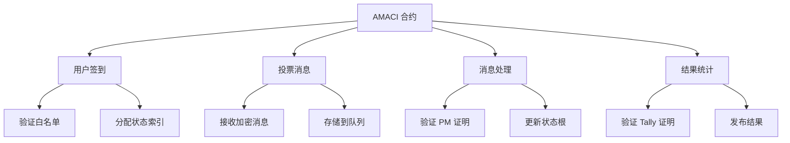
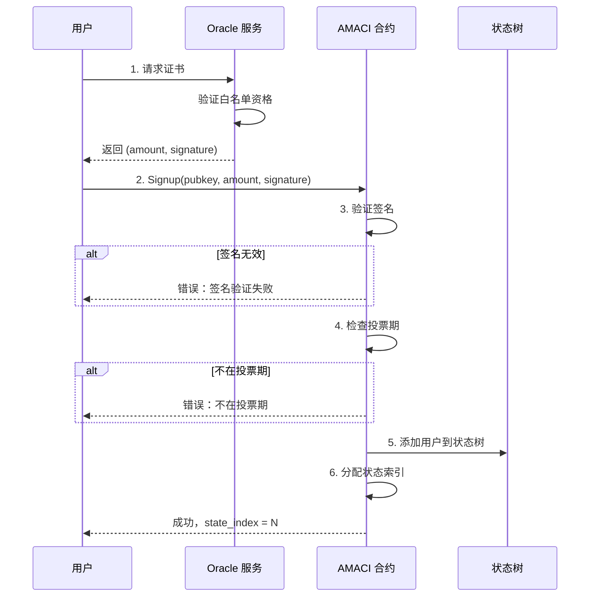
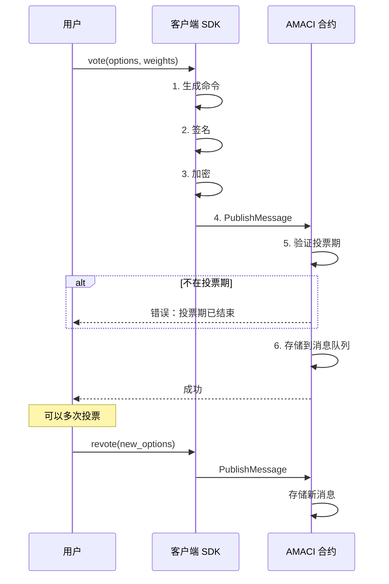
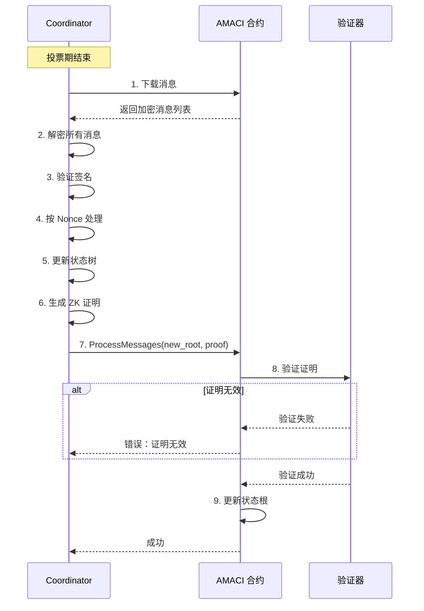
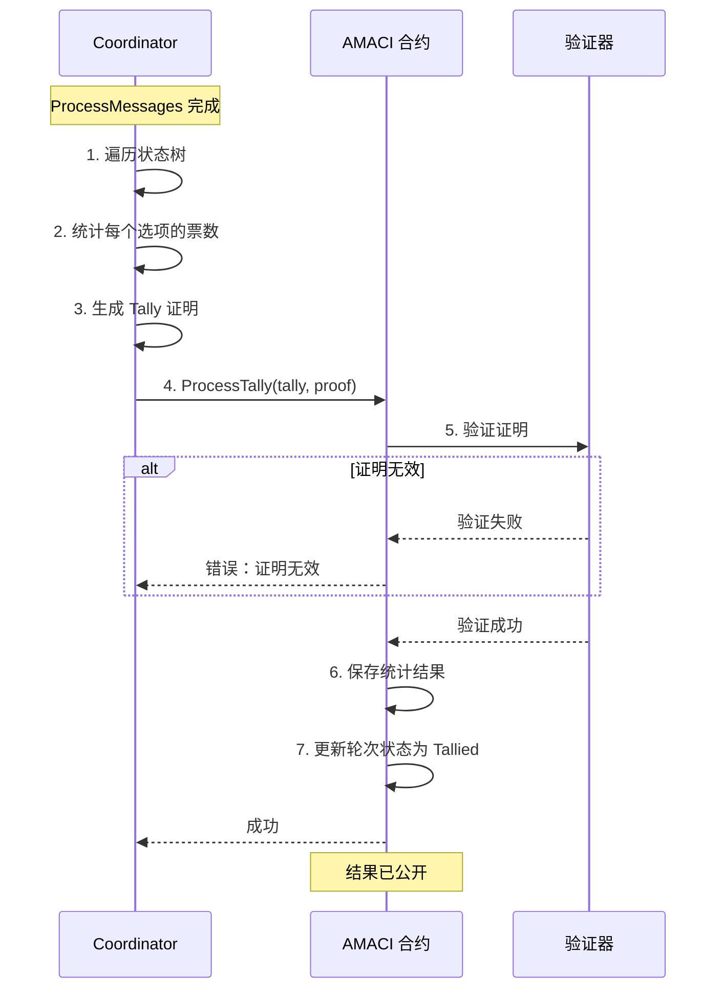
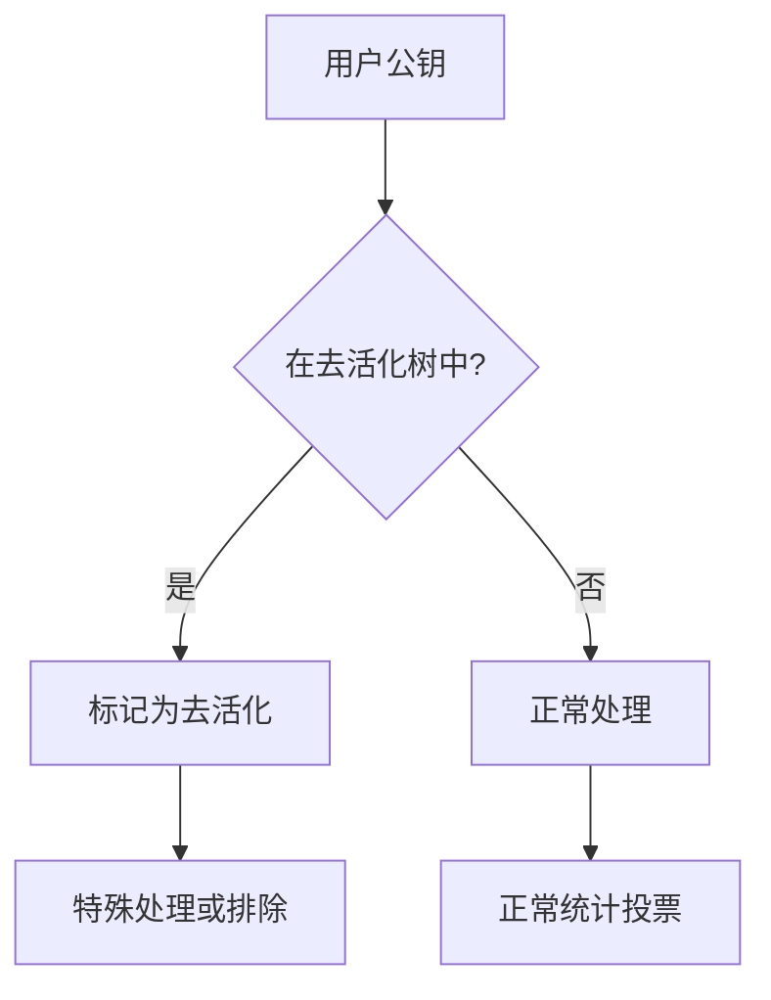
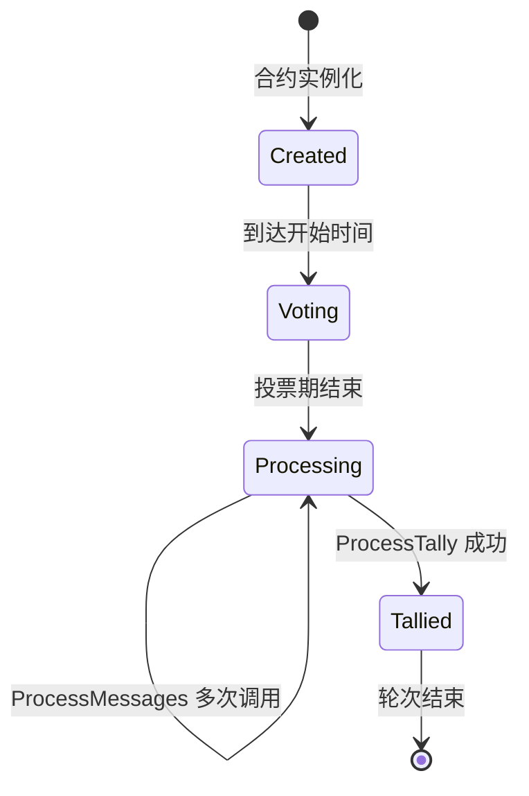

# AMACI 合约

AMACI（Anonymous MACI）合约是每个投票轮次的核心，处理用户签到、投票消息存储、证明验证和结果发布。

## 核心功能

AMACI 合约提供四个主要功能：



## 1. 用户签到（Signup）

用户需要先签到才能参与投票。

### Signup 消息

```rust
ExecuteMsg::Signup {
    pubkey: PubKey,                    // 用户公钥
    amount: Option<Uint128>,           // 投票权重（Oracle 模式）
    signature: Option<String>,         // Oracle 签名
    data: Option<SignupDataDora>,      // 额外数据
}
```

### 签到流程



### Oracle 证书

对于 Oracle 模式的白名单，用户需要先获取证书：

```typescript
// 1. 请求 Oracle 证书
const certificate = await client.maci.requestOracleCertificate({
  signer: wallet,
  ecosystem: 'cosmoshub',
  address: userAddress,
  contractAddress: amaciAddress,
});

// certificate 包含：
// {
//   amount: "100",  // 投票权重
//   signature: "0x..."  // Oracle 签名
// }
```

### 签名验证

AMACI 合约验证 Oracle 签名：

```rust
// 验证逻辑
fn verify_oracle_signature(
    pubkey: &PubKey,
    amount: Uint128,
    signature: &str,
    oracle_pubkey: &str
) -> Result<bool, ContractError> {
    // 构造消息
    let message = format!("{}{}{}", 
        pubkey.x, 
        pubkey.y, 
        amount
    );
    
    // 验证签名
    let is_valid = verify_signature(
        message,
        signature,
        oracle_pubkey
    );
    
    Ok(is_valid)
}
```

### Gas Station

AMACI 支持 Gas Station，让用户无需持有原生代币：

```typescript
// 检查 Gas Station 状态
const hasFeegrant = await client.maci.hasFeegrant({
  address: userAddress,
  contractAddress: amaciAddress,
});

if (hasFeegrant) {
  // 使用 Gas Station 签到
  await client.maci.signup({
    // ... 参数
    gasStation: true,
  });
}
```

### 状态初始化

签到成功后，用户在状态树中获得一个 Leaf：

```rust
// 初始状态 Leaf
StateLeaf {
    pubkey: user_pubkey,           // 用户公钥
    voice_credit_balance: amount,  // 投票权重
    vote_option_tree_root: empty_root,  // 空的投票树
    nonce: 0,                      // 初始 Nonce
}
```

## 2. 投票消息（PublishMessage）

用户提交加密的投票消息。

### PublishMessage 消息

```rust
ExecuteMsg::PublishMessage {
    message: MessageData,
}

pub struct MessageData {
    pub data: Vec<Uint256>,  // 10 个加密字段
}
```

### 消息格式

加密消息包含 10 个字段：

```typescript
interface EncryptedMessage {
  data: [
    bigint,  // [0] packaged (nonce + stateIdx + voIdx + newVotes + salt)
    bigint,  // [1] newPubKey.x
    bigint,  // [2] newPubKey.y
    bigint,  // [3] signature.R8.x
    bigint,  // [4] signature.R8.y
    bigint,  // [5] signature.S
    bigint,  // [6] encryption IV
    bigint,  // [7-9] 保留/填充
  ];
}
```

### 投票流程



### 投票示例

```typescript
// 投票
await client.maci.vote({
  signer: wallet,
  address: userAddress,
  contractAddress: amaciAddress,
  selectedOptions: [
    { idx: 0, vc: 5 },  // 给选项 0 投 5 票
    { idx: 1, vc: 3 },  // 给选项 1 投 3 票
  ],
  operatorCoordPubKey: [
    BigInt(coordinatorPubKeyX),
    BigInt(coordinatorPubKeyY)
  ],
  maciAccount: keypair,
  gasStation: true,
});
```

### 消息存储

消息按顺序存储在合约中：

```rust
// 消息队列
pub const MESSAGES: Item<Vec<Message>> = Item::new("messages");

// 添加消息
fn publish_message(
    deps: DepsMut,
    message: MessageData
) -> Result<Response, ContractError> {
    let mut messages = MESSAGES.load(deps.storage)?;
    
    messages.push(Message {
        msg_type: Uint256::from(1u128),  // 1 = 投票消息
        data: message.data,
    });
    
    MESSAGES.save(deps.storage, &messages)?;
    
    Ok(Response::new()
        .add_attribute("action", "publish_message")
        .add_attribute("message_id", messages.len().to_string()))
}
```

### 多次投票

用户可以多次调用 PublishMessage，后面的消息会覆盖前面的：

```typescript
// 第一次投票
await vote({ options: [{ idx: 0, vc: 5 }], nonce: 0 });

// 改变主意，重新投票
await vote({ options: [{ idx: 1, vc: 5 }], nonce: 1 });

// 再次改变主意
await vote({ options: [{ idx: 2, vc: 5 }], nonce: 2 });

// 处理时，只有最后一次投票（选项 2）有效
```

## 3. 消息处理（ProcessMessages）

Coordinator 提交零知识证明来处理消息。

### ProcessMessages 消息

```rust
ExecuteMsg::ProcessMessages {
    new_state_commitment: Uint256,     // 新状态根
    groth16_proof: Groth16ProofType,   // Groth16 证明
}
```

### 处理流程



### 证明验证

```rust
fn process_messages(
    deps: DepsMut,
    new_state_commitment: Uint256,
    proof: Groth16ProofType
) -> Result<Response, ContractError> {
    // 1. 检查状态
    let round_info = ROUND_INFO.load(deps.storage)?;
    if round_info.status != RoundStatus::Processing {
        return Err(ContractError::InvalidRoundStatus {});
    }
    
    // 2. 构造公开输入
    let public_inputs = vec![
        coordinator_pub_key_x,
        coordinator_pub_key_y,
        message_root,
        current_state_root,
        new_state_commitment,
        // ... 其他公开输入
    ];
    
    // 3. 验证 Groth16 证明
    let is_valid = verify_groth16_proof(
        proof,
        public_inputs,
        verification_key
    )?;
    
    if !is_valid {
        return Err(ContractError::ProofVerificationFailed {});
    }
    
    // 4. 更新状态根
    STATE_COMMITMENT.save(deps.storage, &new_state_commitment)?;
    
    Ok(Response::new()
        .add_attribute("action", "process_messages")
        .add_attribute("new_state_root", new_state_commitment.to_string()))
}
```

## 4. 结果统计（ProcessTally）

Coordinator 提交统计证明来发布结果。

### ProcessTally 消息

```rust
ExecuteMsg::ProcessTally {
    new_tally_commitment: Uint256,     // 统计结果承诺
    groth16_proof: Groth16ProofType,   // Groth16 证明
}
```

### 统计流程



### 结果发布

```rust
fn process_tally(
    deps: DepsMut,
    new_tally_commitment: Uint256,
    proof: Groth16ProofType
) -> Result<Response, ContractError> {
    // 1. 验证证明
    let is_valid = verify_groth16_proof(
        proof,
        public_inputs,
        tally_verification_key
    )?;
    
    if !is_valid {
        return Err(ContractError::ProofVerificationFailed {});
    }
    
    // 2. 保存统计结果
    TALLY_COMMITMENT.save(deps.storage, &new_tally_commitment)?;
    
    // 3. 更新状态
    let mut round_info = ROUND_INFO.load(deps.storage)?;
    round_info.status = RoundStatus::Tallied;
    ROUND_INFO.save(deps.storage, &round_info)?;
    
    Ok(Response::new()
        .add_attribute("action", "process_tally")
        .add_attribute("tally_commitment", new_tally_commitment.to_string()))
}
```

## 查询功能

### 轮次信息

```rust
QueryMsg::GetRoundInfo {}
```

返回：

```rust
pub struct RoundInfoResponse {
    pub round_info: RoundInfo,
    pub status: RoundStatus,
    pub coordinator_pubkey: PubKey,
    pub num_signups: u64,
    pub max_voters: Uint256,
    // ... 其他信息
}
```

### 消息查询

```rust
// 获取单条消息
QueryMsg::GetMessage { index: u64 }

// 获取所有消息
QueryMsg::GetMessages {}

// 获取消息数量
QueryMsg::GetNumMessages {}
```

### 状态查询

```rust
// 获取状态根
QueryMsg::GetStateRoot {}

// 获取统计结果
QueryMsg::GetTallyResult {}

// 获取签到数量
QueryMsg::GetNumSignups {}
```

## 匿名性增强

### 去活化检测

AMACI 支持去活化检测来增强匿名性：

```rust
// 初始化时配置
pre_deactivate_root: Uint256,  // 去活化 Merkle 根
pre_deactivate_coordinator: Option<PubKey>,  // 去活化协调者
```

### 工作原理



## 轮次状态

AMACI 合约有以下状态：

```rust
pub enum RoundStatus {
    Created = 0,      // 已创建
    Voting = 1,       // 投票中
    Processing = 2,   // 处理中
    Tallied = 3,      // 已统计
}
```

### 状态转换



## 安全特性

### 时间验证

```rust
fn ensure_voting_period(
    env: &Env,
    voting_time: &VotingTime
) -> Result<(), ContractError> {
    let current_time = env.block.time.seconds();
    
    if current_time < voting_time.start_time {
        return Err(ContractError::VotingNotStarted {});
    }
    
    if current_time > voting_time.end_time {
        return Err(ContractError::VotingEnded {});
    }
    
    Ok(())
}
```

### 权限控制

```rust
// 只有 Coordinator 可以处理消息
fn ensure_coordinator(
    sender: &Addr,
    coordinator: &Addr
) -> Result<(), ContractError> {
    if sender != coordinator {
        return Err(ContractError::Unauthorized {});
    }
    Ok(())
}
```

### 重入保护

```rust
// 使用状态锁防止重入
fn process_messages_with_lock(
    deps: DepsMut,
    // ... 参数
) -> Result<Response, ContractError> {
    // 检查锁
    let is_locked = PROCESSING_LOCK.may_load(deps.storage)?.unwrap_or(false);
    if is_locked {
        return Err(ContractError::AlreadyProcessing {});
    }
    
    // 设置锁
    PROCESSING_LOCK.save(deps.storage, &true)?;
    
    // 处理逻辑
    let result = process_messages_internal(deps, ...);
    
    // 释放锁
    PROCESSING_LOCK.save(deps.storage, &false)?;
    
    result
}
```

## 下一步

现在您已经了解了 AMACI 合约的功能，接下来可以：

- 🔄 [完整工作流程](/contracts/workflow) - 理解从创建到结果的全流程
- 💻 [SDK 使用指南](/sdk/voting-guide) - 使用 SDK 与 AMACI 交互
- 💡 [示例代码](/examples/basic-voting) - 查看完整的投票示例
