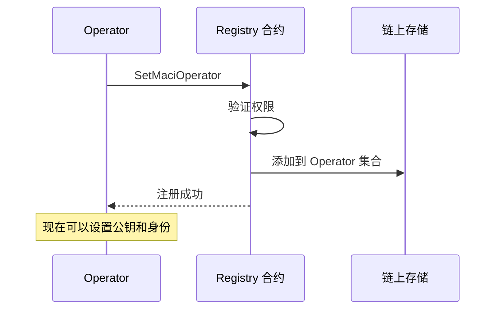
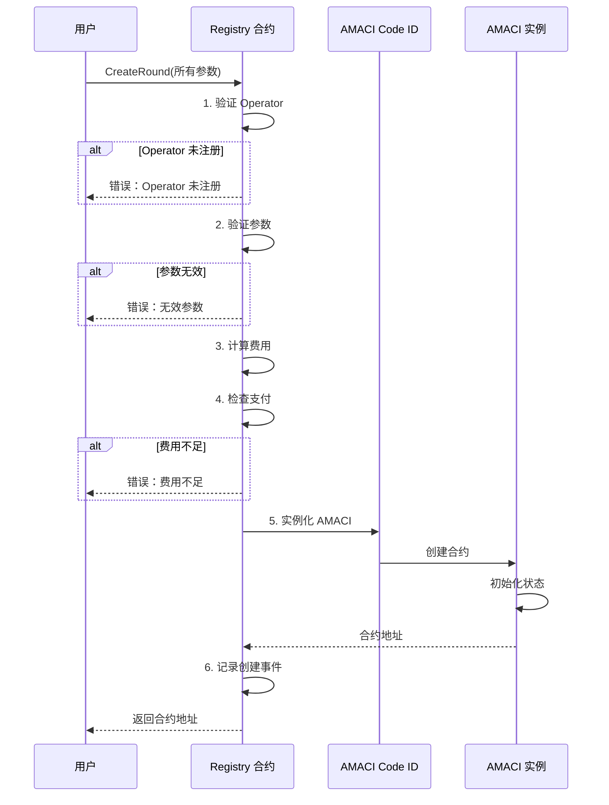

# Registry 合约

Registry 合约是 MACI 系统的注册中心，负责管理 Operator、创建投票轮次和配置系统参数。

## 核心功能

### 1. Operator 管理

Registry 维护一个 Operator 系统网络，用户只需要选择已注册的 Operator 即可创建投票轮次。

#### Operator 注册

```rust
// 注册成为 Operator
ExecuteMsg::SetMaciOperator {
    operator: Addr,
}
```

**注册流程：**



**示例代码：**

```typescript
// 使用 CosmJS 注册 Operator
const msg = {
  set_maci_operator: {
    operator: 'dora1operator...'
  }
};

const result = await client.execute(
  registryAddress,
  msg,
  'auto'
);
```

#### 设置 Operator 公钥

每个 Operator 需要设置自己的公钥用于投票加密：

```rust
ExecuteMsg::SetMaciOperatorPubkey {
    pubkey: PubKey,  // { x: String, y: String }
}
```

**公钥格式：**

```typescript
interface PubKey {
  x: string;  // Baby Jubjub 曲线点的 x 坐标（十六进制）
  y: string;  // Baby Jubjub 曲线点的 y 坐标（十六进制）
}

// 示例
const pubkey = {
  x: "0x1234567890abcdef...",
  y: "0xfedcba0987654321..."
};
```

#### 设置 Operator 身份信息

```rust
ExecuteMsg::SetMaciOperatorIdentity {
    identity: String,
}
```

这可以是 Operator 的名称、网站或其他标识信息：

```typescript
const msg = {
  set_maci_operator_identity: {
    identity: "DoraHacks Operator | https://dorahacks.io"
  }
};
```

#### 查询 Operator 信息

```rust
// 检查地址是否是 Operator
QueryMsg::IsMaciOperator { address }

// 获取 Operator 公钥
QueryMsg::GetMaciOperatorPubkey { address }

// 获取 Operator 身份信息
QueryMsg::GetMaciOperatorIdentity { address }
```

**示例：**

```typescript
// 检查是否是 Operator
const isOperator = await client.queryContractSmart(
  registryAddress,
  { is_maci_operator: { address: 'dora1...' } }
);

// 获取公钥
const pubkey = await client.queryContractSmart(
  registryAddress,
  { get_maci_operator_pubkey: { address: 'dora1...' } }
);

console.log('Operator 公钥:', pubkey);
```

### 2. Round 创建

Registry 的核心功能是一键创建投票轮次。

#### CreateRound 消息

```rust
ExecuteMsg::CreateRound {
    operator: Addr,                          // Operator 地址
    max_voter: Uint256,                      // 最大投票人数
    voice_credit_amount: Uint256,            // 每人投票权重
    vote_option_map: Vec<String>,            // 投票选项
    round_info: RoundInfo,                   // 轮次信息
    voting_time: VotingTime,                 // 投票时间
    whitelist: Option<WhitelistBase>,        // 白名单配置
    pre_deactivate_root: Uint256,            // 预去活化根
    circuit_type: Uint256,                   // 电路类型
    certification_system: Uint256,           // 认证系统
    oracle_whitelist_pubkey: Option<String>, // Oracle 公钥
    pre_deactivate_coordinator: Option<PubKey>, // 预去活化协调者
}
```

#### 参数详解

**基础参数：**

```rust
// Operator 地址
operator: Addr  // 必须是已注册的 Operator

// 最大投票人数
max_voter: Uint256  // 例如：Uint256::from(1000u128)

// 每人投票权重
voice_credit_amount: Uint256  // 例如：Uint256::from(100u128)

// 投票选项
vote_option_map: Vec<String>  // 例如：["选项 A", "选项 B", "选项 C"]
```

**轮次信息（RoundInfo）：**

```rust
pub struct RoundInfo {
    pub title: String,        // 投票标题
    pub description: String,  // 投票描述
    pub link: String,         // 相关链接
}
```

**投票时间（VotingTime）：**

```rust
pub struct VotingTime {
    pub start_time: u64,  // 开始时间（Unix 时间戳）
    pub end_time: u64,    // 结束时间（Unix 时间戳）
}
```

**白名单配置（WhitelistBase）：**

```rust
pub struct WhitelistBase {
    pub ecosystem: String,            // "cosmoshub" 或 "doravota"
    pub snapshot_height: String,      // 快照高度，"0" 表示实时
    pub voting_power_args: VotingPowerArgs,
}

pub struct VotingPowerArgs {
    pub mode: String,      // "slope" 或 "threshold"
    pub slope: String,     // Slope 模式的除数
    pub threshold: String, // Threshold 模式的阈值
}
```

**电路和认证：**

```rust
// 电路类型
circuit_type: Uint256
// 0 = 1P1V（一人一票）
// 1 = QV（二次方投票）

// 认证系统
certification_system: Uint256
// 0 = Oracle（Oracle 白名单）
// 1 = OnChain（链上白名单）
```

#### 创建流程



#### 完整示例

```typescript
import { MaciClient, MaciCircuitType } from '@dorafactory/maci-sdk';

const client = new MaciClient({ network: 'testnet' });

// 创建投票轮次
const round = await client.createOracleMaciRound({
  signer: wallet,
  
  // Operator 公钥
  operatorPubkey: '0e752c8f4c4c9f5c4e8a3d2c1b0a9e8d7c6b5a4f3e2d1c0b9a8e7d6c5b4a3f2e',
  
  // 投票时间
  startVoting: new Date('2024-01-01T00:00:00Z'),
  endVoting: new Date('2024-01-07T23:59:59Z'),
  
  // 轮次信息
  title: '社区提案投票',
  description: '投票选择下一步发展方向',
  link: 'https://forum.example.com/proposal-123',
  
  // 投票选项
  voteOptionMap: [
    '提案 A: 增加社区资金',
    '提案 B: 改进技术基础设施',
    '提案 C: 扩大市场推广',
    '提案 D: 教育和培训',
  ],
  
  // 投票类型
  circuitType: MaciCircuitType.QV,  // 二次方投票
  
  // 白名单配置
  whitelistEcosystem: 'cosmoshub',
  whitelistSnapshotHeight: '23342001',
  whitelistVotingPowerArgs: {
    mode: 'slope',
    slope: '1000000',  // 每 1 ATOM = 1 voice credit
    threshold: '1000000',
  },
});

console.log('投票轮次创建成功！');
console.log('AMACI 合约地址:', round.contractAddress);
```

### 3. Validator 管理

Registry 还管理 Validator 列表，用于系统验证。

#### 设置 Validator

```rust
ExecuteMsg::SetValidators {
    addresses: ValidatorSet,
}

pub struct ValidatorSet {
    pub validators: Vec<Addr>,
}
```

**示例：**

```typescript
const msg = {
  set_validators: {
    addresses: {
      validators: [
        'dora1validator1...',
        'dora1validator2...',
        'dora1validator3...',
      ]
    }
  }
};
```

#### 移除 Validator

```rust
ExecuteMsg::RemoveValidator {
    address: Addr,
}
```

#### 查询 Validator

```rust
// 检查是否是 Validator
QueryMsg::IsValidator { address }

// 获取所有 Validator
QueryMsg::GetValidators {}

// 获取 Validator 对应的 Operator
QueryMsg::GetValidatorOperator { address }
```

### 4. Circuit 配置

管理 ZK 电路的费用配置。

#### 更改费用配置

```rust
ExecuteMsg::ChangeChargeConfig {
    config: CircuitChargeConfig,
}

pub struct CircuitChargeConfig {
    pub fee_rate: Decimal,  // 费用比率
}
```

**示例：**

```typescript
// 设置费用为 10%
const msg = {
  change_charge_config: {
    config: {
      fee_rate: "0.1"
    }
  }
};
```

#### 查询费用配置

```rust
QueryMsg::GetCircuitChargeConfig {}
```

### 5. 系统管理

#### 更新 AMACI Code ID

当有新版本的 AMACI 合约时，更新 Code ID：

```rust
ExecuteMsg::UpdateAmaciCodeId {
    amaci_code_id: u64,
}
```

**示例：**

```typescript
const msg = {
  update_amaci_code_id: {
    amaci_code_id: 124  // 新的 Code ID
  }
};

// 之后创建的 AMACI 实例将使用新代码
```

#### 更改 Operator

更改 Registry 的主 Operator：

```rust
ExecuteMsg::ChangeOperator {
    address: Addr,
}
```

#### 查询管理员

```rust
QueryMsg::Admin {}  // 返回管理员地址
QueryMsg::Operator {}  // 返回主 Operator 地址
```

## 权限控制

### 权限矩阵

| 操作 | Admin | Operator | 任何人 |
|------|-------|----------|--------|
| SetMaciOperator | ❌ | ✅ | ❌ |
| SetMaciOperatorPubkey | ❌ | ✅ | ❌ |
| SetMaciOperatorIdentity | ❌ | ✅ | ❌ |
| CreateRound | ❌ | ❌ | ✅ |
| SetValidators | ✅ | ❌ | ❌ |
| RemoveValidator | ✅ | ❌ | ❌ |
| UpdateAmaciCodeId | ✅ | ❌ | ❌ |
| ChangeOperator | ✅ | ❌ | ❌ |
| ChangeChargeConfig | ✅ | ❌ | ❌ |
| Query（所有查询） | ✅ | ✅ | ✅ |

### 权限验证

```rust
// 验证 Operator 权限
fn ensure_operator(
    deps: &DepsMut,
    info: &MessageInfo
) -> Result<(), ContractError> {
    let operator = OPERATOR.load(deps.storage)?;
    if info.sender != operator {
        return Err(ContractError::Unauthorized {});
    }
    Ok(())
}

// 验证 Admin 权限
fn ensure_admin(
    deps: &DepsMut,
    info: &MessageInfo
) -> Result<(), ContractError> {
    let admin = ADMIN.load(deps.storage)?;
    if info.sender != admin.admin {
        return Err(ContractError::Unauthorized {});
    }
    Ok(())
}
```

## 事件和日志

Registry 会发出各种事件用于追踪：

### Operator 注册事件

```rust
Response::new()
    .add_attribute("action", "set_maci_operator")
    .add_attribute("operator", operator.to_string())
```

### Round 创建事件

```rust
Response::new()
    .add_attribute("action", "create_round")
    .add_attribute("operator", operator.to_string())
    .add_attribute("contract_address", amaci_address.to_string())
    .add_attribute("circuit_type", circuit_type.to_string())
```

## 费用计算

创建 Round 需要支付费用：

```rust
fn calculate_fee(
    config: &CircuitChargeConfig,
    max_voter: Uint256,
    // ... 其他参数
) -> Uint128 {
    // 基础费用
    let base_fee = Uint128::new(1000000);  // 1 DORA
    
    // 根据投票人数调整
    let voter_fee = max_voter.multiply_ratio(
        Uint128::new(1000),  // 每人 0.001 DORA
        Uint128::new(1)
    );
    
    // 应用费率
    let total = base_fee + voter_fee;
    let fee = total.multiply_ratio(
        config.fee_rate.numerator(),
        config.fee_rate.denominator()
    );
    
    fee
}
```

## 下一步

现在您已经了解了 Registry 合约的功能，接下来可以学习：

- 🗳️ [AMACI 合约](/contracts/amaci) - 了解投票合约的实现
- 🔄 [完整工作流程](/contracts/workflow) - 理解从创建到结果的全流程
- 💻 [SDK 使用指南](/sdk/create-round) - 使用 SDK 创建投票轮次
