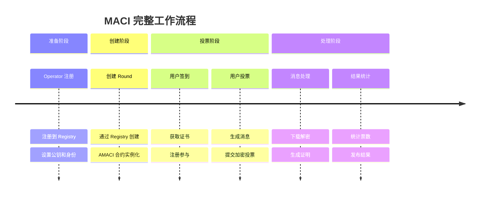
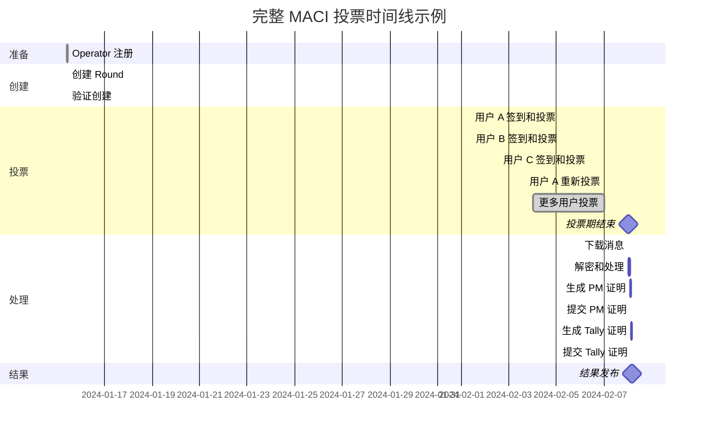

# 完整工作流程

本节通过一个完整的示例，展示从创建投票轮次到发布结果的整个流程。

## 流程总览



## 阶段 1: 准备阶段

### 1.1 Operator 注册

首先，Operator 需要在 Registry 合约中注册。

```typescript
// Operator 生成密钥对
const operatorKeypair = genKeypair();

// 注册 Operator
await registryContract.execute({
  set_maci_operator: {
    operator: operatorAddress
  }
});

// 设置公钥
await registryContract.execute({
  set_maci_operator_pubkey: {
    pubkey: {
      x: operatorKeypair.publicKey[0].toString(16),
      y: operatorKeypair.publicKey[1].toString(16)
    }
  }
});

// 设置身份信息
await registryContract.execute({
  set_maci_operator_identity: {
    identity: "DoraHacks Operator | https://dorahacks.io"
  }
});
```

### 1.2 验证 Operator 状态

```typescript
// 检查是否成功注册
const isOperator = await registryContract.query({
  is_maci_operator: { address: operatorAddress }
});

console.log('Operator 已注册:', isOperator);

// 查询公钥
const pubkey = await registryContract.query({
  get_maci_operator_pubkey: { address: operatorAddress }
});

console.log('Operator 公钥:', pubkey);
```

## 阶段 2: 创建投票轮次

### 2.1 准备参数

```typescript
const roundParams = {
  // Operator 公钥（用于加密）
  operatorPubkey: operatorKeypair.publicKey,
  
  // 投票时间
  startVoting: new Date('2024-02-01T00:00:00Z'),
  endVoting: new Date('2024-02-07T23:59:59Z'),
  
  // 轮次信息
  title: '社区资金分配投票',
  description: '投票决定如何分配 100,000 DORA 社区资金',
  link: 'https://forum.example.com/proposal',
  
  // 投票选项
  voteOptionMap: [
    '项目 A: DeFi 开发工具',
    '项目 B: 开发者教育计划',
    '项目 C: 市场推广活动',
    '项目 D: 社区基础设施',
  ],
  
  // 投票类型（二次方投票）
  circuitType: MaciCircuitType.QV,
  
  // 白名单配置
  whitelistEcosystem: 'cosmoshub',
  whitelistSnapshotHeight: '23342001',
  whitelistVotingPowerArgs: {
    mode: 'slope',
    slope: '1000000',  // 每 1 ATOM = 1 voice credit
    threshold: '0',
  },
};
```

### 2.2 创建 Round

```typescript
import { MaciClient } from '@dorafactory/maci-sdk';

const client = new MaciClient({ network: 'mainnet' });

const round = await client.createOracleMaciRound({
  signer: creatorWallet,
  ...roundParams
});

console.log('✅ Round 创建成功！');
console.log('AMACI 合约地址:', round.contractAddress);
console.log('交易哈希:', round.transactionHash);
```

### 2.3 验证创建

```typescript
// 查询 Round 信息
const roundInfo = await client.getRoundById(round.contractAddress);

console.log('Round 信息:', {
  title: roundInfo.title,
  status: roundInfo.status,
  startTime: roundInfo.startTime,
  endTime: roundInfo.endTime,
  numSignups: roundInfo.numSignups,
});
```

## 阶段 3: 投票阶段

### 3.1 用户 A 的完整投票流程

```typescript
// === 步骤 1: 生成 MACI 账户 ===
console.log('用户 A: 生成 MACI 账户...');
const userAKeypair = await client.circom.genKeypairFromSign(
  walletA,
  addressA
);

// === 步骤 2: 获取 Oracle 证书 ===
console.log('用户 A: 获取白名单证书...');
const certificateA = await client.maci.requestOracleCertificate({
  signer: walletA,
  ecosystem: 'cosmoshub',
  address: addressA,
  contractAddress: round.contractAddress,
});

console.log('用户 A: 证书获取成功，投票权重:', certificateA.amount);

// === 步骤 3: 等待 Gas Station ===
console.log('用户 A: 等待 Gas Station...');
let hasFeegrant = false;
while (!hasFeegrant) {
  hasFeegrant = await client.maci.hasFeegrant({
    address: addressA,
    contractAddress: round.contractAddress,
  });
  if (!hasFeegrant) {
    await new Promise(resolve => setTimeout(resolve, 2000));
  }
}
console.log('用户 A: Gas Station 已启用');

// === 步骤 4: 签到 ===
console.log('用户 A: 签到中...');
await client.maci.signup({
  signer: walletA,
  address: addressA,
  contractAddress: round.contractAddress,
  maciAccount: userAKeypair,
  oracleCertificate: {
    amount: certificateA.amount,
    signature: certificateA.signature,
  },
  gasStation: true,
});
console.log('用户 A: 签到成功');

// === 步骤 5: 投票 ===
console.log('用户 A: 投票中...');
await client.maci.vote({
  signer: walletA,
  address: addressA,
  contractAddress: round.contractAddress,
  selectedOptions: [
    { idx: 0, vc: 8 },  // 项目 A: 8 票（消耗 64 credits）
    { idx: 2, vc: 6 },  // 项目 C: 6 票（消耗 36 credits）
  ], // 总共消耗 100 voice credits
  operatorCoordPubKey: [
    BigInt(roundInfo.coordinatorPubkeyX),
    BigInt(roundInfo.coordinatorPubkeyY),
  ],
  maciAccount: userAKeypair,
  gasStation: true,
});
console.log('用户 A: 投票成功！');
```

### 3.2 用户 B 的投票流程

```typescript
// 用户 B 的流程与用户 A 相同
const userBKeypair = await client.circom.genKeypairFromSign(walletB, addressB);
const certificateB = await client.maci.requestOracleCertificate({...});

// ... 等待 Gas Station 和签到

await client.maci.vote({
  signer: walletB,
  address: addressB,
  contractAddress: round.contractAddress,
  selectedOptions: [
    { idx: 1, vc: 9 },  // 项目 B: 9 票（消耗 81 credits）
    { idx: 3, vc: 4 },  // 项目 D: 4 票（消耗 16 credits）
  ], // 总共消耗 97 voice credits
  operatorCoordPubKey: operatorPubkey,
  maciAccount: userBKeypair,
  gasStation: true,
});
console.log('用户 B: 投票成功！');
```

### 3.3 用户 A 改变主意

```typescript
// 用户 A 决定改变投票
console.log('用户 A: 重新投票...');

await client.maci.vote({
  signer: walletA,
  address: addressA,
  contractAddress: round.contractAddress,
  selectedOptions: [
    { idx: 1, vc: 10 },  // 改投项目 B: 10 票（消耗 100 credits）
  ],
  operatorCoordPubKey: operatorPubkey,
  maciAccount: userAKeypair,
  gasStation: true,
});

console.log('用户 A: 重新投票成功！');
// 注意：之前对项目 A 和 C 的投票已失效
```

### 3.4 投票期间的查询

```typescript
// 查询当前签到人数
const roundStatus = await client.getRoundById(round.contractAddress);
console.log('当前签到人数:', roundStatus.numSignups);

// 查询消息数量
const numMessages = await contract.query({
  get_num_messages: {}
});
console.log('消息总数:', numMessages);
```

## 阶段 4: 处理阶段

### 4.1 投票期结束

```typescript
// 等待投票期结束
const endTime = roundInfo.votingTime.endTime;
const now = Date.now() / 1000;

if (now < endTime) {
  const waitTime = (endTime - now) * 1000;
  console.log(`等待投票期结束 (${Math.ceil(waitTime / 1000 / 60)} 分钟)...`);
  await new Promise(resolve => setTimeout(resolve, waitTime));
}

console.log('投票期已结束，开始处理');
```

### 4.2 Operator 下载消息

```typescript
// Operator 下载所有消息
console.log('Operator: 下载消息...');
const messages = await contract.query({
  get_messages: {}
});

console.log(`Operator: 下载了 ${messages.length} 条消息`);
```

### 4.3 Operator 处理消息

```typescript
// 使用 Operator 工具处理消息
import { OperatorClient } from '@dorafactory/maci-operator';

const operator = new OperatorClient({
  privateKey: operatorKeypair.privateKey,
  contractAddress: round.contractAddress,
});

console.log('Operator: 解密和处理消息...');
const processResult = await operator.processMessages({
  messages,
  initialStateRoot: roundInfo.stateRoot,
});

console.log('Operator: 处理完成');
console.log('- 有效消息数:', processResult.validMessages);
console.log('- 无效消息数:', processResult.invalidMessages);
console.log('- 新状态根:', processResult.newStateRoot);
```

### 4.4 生成 ProcessMessages 证明

```typescript
console.log('Operator: 生成 ProcessMessages 证明...');
const pmProof = await operator.generateProcessMessagesProof({
  messages,
  stateTree: processResult.stateTree,
});

console.log('Operator: 证明生成完成');
```

### 4.5 提交 ProcessMessages 证明

```typescript
console.log('Operator: 提交 ProcessMessages 证明到链上...');
const pmTx = await contract.execute({
  process_messages: {
    new_state_commitment: processResult.newStateRoot,
    groth16_proof: pmProof,
  }
});

await pmTx.wait();
console.log('✅ ProcessMessages 证明验证通过');
```

### 4.6 统计投票结果

```typescript
console.log('Operator: 统计投票结果...');
const tallyResult = await operator.tallyVotes({
  stateTree: processResult.stateTree,
  numOptions: voteOptionMap.length,
});

console.log('投票结果:');
voteOptionMap.forEach((option, idx) => {
  console.log(`  ${option}: ${tallyResult[idx]} 票`);
});
```

### 4.7 生成 Tally 证明

```typescript
console.log('Operator: 生成 Tally 证明...');
const tallyProof = await operator.generateTallyProof({
  stateTree: processResult.stateTree,
  results: tallyResult,
});

console.log('Operator: Tally 证明生成完成');
```

### 4.8 提交 Tally 证明

```typescript
console.log('Operator: 提交 Tally 证明到链上...');
const tallyTx = await contract.execute({
  process_tally: {
    new_tally_commitment: tallyProof.commitment,
    groth16_proof: tallyProof.proof,
  }
});

await tallyTx.wait();
console.log('✅ Tally 证明验证通过');
console.log('✅ 投票结果已发布！');
```

## 阶段 5: 结果查询

### 5.1 查询最终结果

```typescript
// 任何人都可以查询结果
const finalRound = await client.getRoundById(round.contractAddress);

console.log('\n=== 最终投票结果 ===');
console.log('Round:', finalRound.title);
console.log('状态:', finalRound.status);  // 'Tallied'
console.log('参与人数:', finalRound.numSignups);
console.log('消息总数:', finalRound.numMessages);

console.log('\n投票结果:');
finalRound.results.forEach((votes, idx) => {
  console.log(`  ${voteOptionMap[idx]}: ${votes} 票`);
});

// 计算获胜选项
const maxVotes = Math.max(...finalRound.results);
const winnerIdx = finalRound.results.indexOf(maxVotes);
console.log(`\n🏆 获胜项目: ${voteOptionMap[winnerIdx]}`);
```

### 5.2 验证证明

```typescript
// 任何人都可以验证证明
const pmProofData = await contract.query({
  get_process_messages_proof: {}
});

const isValidPM = await verifyGroth16Proof(
  pmProofData.proof,
  pmProofData.publicInputs,
  pmVerificationKey
);

console.log('ProcessMessages 证明有效:', isValidPM);

const tallyProofData = await contract.query({
  get_tally_proof: {}
});

const isValidTally = await verifyGroth16Proof(
  tallyProofData.proof,
  tallyProofData.publicInputs,
  tallyVerificationKey
);

console.log('Tally 证明有效:', isValidTally);
```

## 完整时间线



## 完整代码示例

以下是一个完整的端到端示例脚本：

```typescript
import { MaciClient, MaciCircuitType } from '@dorafactory/maci-sdk';
import { DirectSecp256k1Wallet } from '@cosmjs/proto-signing';

async function completeVotingRound() {
  const client = new MaciClient({ network: 'testnet' });
  
  // === 阶段 1: 创建 Round ===
  console.log('\n=== 阶段 1: 创建投票轮次 ===');
  const round = await client.createOracleMaciRound({
    signer: creatorWallet,
    operatorPubkey: operatorPubkey,
    startVoting: new Date(),
    endVoting: new Date(Date.now() + 7 * 24 * 60 * 60 * 1000),
    title: '社区资金分配',
    description: '投票决定资金用途',
    link: 'https://forum.example.com',
    voteOptionMap: ['项目 A', '项目 B', '项目 C', '项目 D'],
    circuitType: MaciCircuitType.QV,
    whitelistEcosystem: 'cosmoshub',
    whitelistSnapshotHeight: '0',
    whitelistVotingPowerArgs: {
      mode: 'slope',
      slope: '1000000',
      threshold: '0',
    },
  });
  
  console.log('Round 创建成功:', round.contractAddress);
  
  // === 阶段 2: 用户投票 ===
  console.log('\n=== 阶段 2: 用户投票 ===');
  
  // 用户 A 投票
  await voteAsUser(client, walletA, addressA, round.contractAddress, [
    { idx: 0, vc: 8 },
    { idx: 2, vc: 6 },
  ]);
  
  // 用户 B 投票
  await voteAsUser(client, walletB, addressB, round.contractAddress, [
    { idx: 1, vc: 10 },
  ]);
  
  // === 阶段 3: 等待投票期结束 ===
  console.log('\n=== 阶段 3: 等待投票期结束 ===');
  // ... 等待逻辑
  
  // === 阶段 4: Operator 处理 ===
  console.log('\n=== 阶段 4: 处理和统计 ===');
  const operator = new OperatorClient({
    privateKey: operatorPrivateKey,
    contractAddress: round.contractAddress,
  });
  
  await operator.processAndTally();
  
  // === 阶段 5: 查询结果 ===
  console.log('\n=== 阶段 5: 查询结果 ===');
  const results = await client.getRoundById(round.contractAddress);
  console.log('最终结果:', results);
}

async function voteAsUser(
  client: MaciClient,
  wallet: any,
  address: string,
  contractAddress: string,
  options: { idx: number; vc: number }[]
) {
  // 生成账户
  const maciAccount = await client.circom.genKeypairFromSign(wallet, address);
  
  // 获取证书
  const certificate = await client.maci.requestOracleCertificate({
    signer: wallet,
    ecosystem: 'cosmoshub',
    address,
    contractAddress,
  });
  
  // 等待 Gas Station
  await waitForGasStation(client, address, contractAddress);
  
  // 签到
  await client.maci.signup({
    signer: wallet,
    address,
    contractAddress,
    maciAccount,
    oracleCertificate: certificate,
    gasStation: true,
  });
  
  // 投票
  await client.maci.vote({
    signer: wallet,
    address,
    contractAddress,
    selectedOptions: options,
    operatorCoordPubKey: operatorPubkey,
    maciAccount,
    gasStation: true,
  });
  
  console.log(`用户 ${address} 投票成功`);
}

// 运行
completeVotingRound().catch(console.error);
```

## 下一步

现在您已经理解了完整的工作流程，接下来可以：

- 💻 [SDK 使用指南](/sdk/installation) - 详细学习 SDK 的使用
- 💡 [示例代码](/examples/basic-voting) - 查看更多示例
- 🚀 [快速开始](/introduction/quick-start) - 快速上手 MACI
