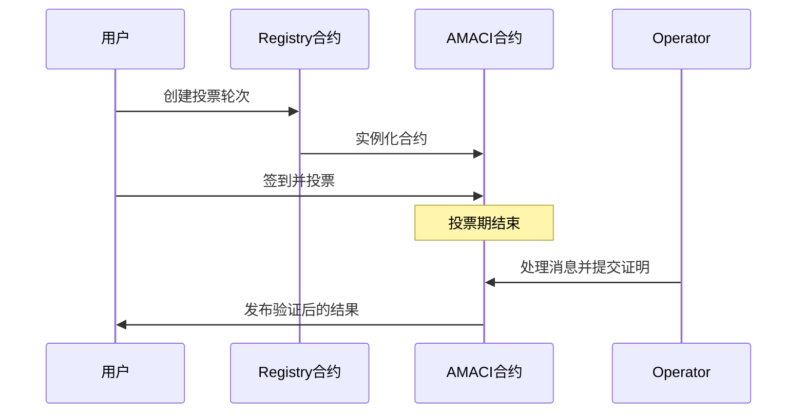

# MACI - 最小化抗串谋基础设施

欢迎来到 MACI（Minimal Anti-Collusion Infrastructure）文档！

MACI 是一套智能合约、密码学库和零知识电路的集合，通过链上验证提供抗串谋的投票系统。它使用创新的密码学机制来防止贿选和强制，同时确保投票隐私和结果的可验证性。

## 核心价值

- **🔒 隐私保护**：通过加密和零知识证明确保投票者隐私
- **🛡️ 抗串谋**：通过创新的密码学机制防止贿赂和强制
- **✅ 可验证性**：所有投票结果都可以通过零知识证明进行验证
- **⚡ 灵活投票**：支持一人一票（1P1V）、二次方投票（QV）等多种投票机制
- **🌐 跨链支持**：集成 Cosmos Hub 生态系统和 Dora Vota 生态系统

## 主要组成部分

### 智能合约

MACI 包含部署在基于 Cosmos 链上的 CosmWasm 智能合约：

- **Registry 合约**：管理 Operator、投票轮次和电路配置的注册中心
- **AMACI 合约**：支持匿名投票、去活化检测和隐私增强的投票合约实例
- **API 合约**：提供 SaaS 服务管理和部署功能

### SDK 和库

**TypeScript:**
- `@dorafactory/maci-sdk` - 完整的 MACI 客户端 SDK，用于投票、轮次管理、查询等
- `@dorafactory/maci-operator` - 专用的 MACI/AMACI Operator 系统

**Rust:**
- `baby-jubjub` - Baby Jubjub 椭圆曲线实现（兼容 EIP-2494）
- `eddsa-poseidon` - 使用 Poseidon 哈希的 EdDSA 签名方案
- `maci-crypto` - MACI 核心密码学原语库
- `maci-utils` - MACI 合约的共享工具函数

### 零知识电路

使用 Circom 编写的零知识电路，实现隐私保护的投票处理和统计：
- 支持 Groth16 和 PLONK 证明系统
- 优化的约束系统，适用于链上验证
- ProcessMessages、Tally、StateTransition 等核心电路

## 应用场景

- **DAO 治理**：社区决策和提案投票
- **二次方投票**：公共物品资金分配
- **链上选举**：透明且防串谋的选举系统
- **代币投票**：基于代币权重的投票机制

## 工作原理

MACI 系统包含三个关键角色：

1. **投票者（Voter）**：生成加密的投票消息并提交到链上
2. **协调者（Operator/Coordinator）**：处理加密消息并生成零知识证明
3. **智能合约**：存储消息、验证证明并发布结果

## 文档结构

本文档按以下方式组织，帮助您快速找到所需信息：

### 入门指南

如果您是第一次接触 MACI，建议从这里开始：

- [**MACI 是什么**](/docs/introduction/what-is-maci) - 了解 MACI 的概念、目标和应用场景
- [**核心特性**](/docs/introduction/key-features) - 深入了解 MACI 的主要功能和优势
- [**快速开始**](/docs/introduction/quick-start) - 5 分钟创建您的第一个投票轮次

### 协议详解

深入理解 MACI 协议的工作原理：

- [**协议概览**](/docs/protocol/overview) - MACI 协议的整体架构
- [**核心概念**](/docs/protocol/core-concepts) - 投票者、协调者、状态树等关键概念
- [**消息流程**](/docs/protocol/message-flow) - 投票消息的生成、处理和验证流程
- [**密码学机制**](/docs/protocol/cryptography) - EdDSA、Poseidon 哈希、零知识证明
- [**隐私保护机制**](/docs/protocol/privacy-protection) - 如何防止串谋和确保隐私

### 合约设计

了解 MACI 智能合约的架构和实现：

- [**架构设计**](/docs/contracts/architecture) - 合约系统的整体架构
- [**Registry 合约**](/docs/contracts/registry) - Operator、轮次和电路配置的注册中心
- [**AMACI 合约**](/docs/contracts/amaci) - 匿名投票合约的实现细节
- [**工作流程**](/docs/contracts/workflow) - 从创建轮次到发布结果的完整流程

### SDK 使用指南

开始使用 MACI SDK 构建您的应用：

- [**安装**](/docs/sdk/installation) - 安装 SDK 和配置开发环境
- [**客户端设置**](/docs/sdk/client-setup) - 初始化 MACI 客户端
- [**创建轮次**](/docs/sdk/create-round) - 创建和配置投票轮次
- [**投票指南**](/docs/sdk/voting-guide) - 签到、投票和消息提交
- [**查询 API**](/docs/sdk/query-api) - 查询轮次状态和投票结果
- [**高级功能**](/docs/sdk/advanced) - 自定义配置和高级用法

### 示例代码

通过实际示例学习 MACI：

- [**基础投票**](/docs/examples/basic-voting) - 完整的一人一票（1P1V）投票示例
- [**Oracle 轮次**](/docs/examples/oracle-round) - 使用 Oracle 的投票示例

### 资源

- [**导航指南**](/docs/navigation) - 如何配置文档导航
- [**使用技巧**](/docs/tips) - 使用 Nextra 的技巧和最佳实践

## 技术资源

深入了解 MACI 的技术细节：

- [Minimal anti-collusion infrastructure](https://ethresear.ch/t/minimal-anti-collusion-infrastructure/5413)
- [MACI anonymization - using rerandomizable encryption](https://ethresear.ch/t/maci-anonymization-using-rerandomizable-encryption/7054)
- [MACI anonymization based on 2-of-2 MPC](https://research.dorahacks.io/2023/03/30/mpc-maci-anonymization/)

## 推荐学习路径

根据您的需求，我们建议以下学习路径：

### 🎯 对于应用开发者

1. 阅读 [MACI 是什么](/docs/introduction/what-is-maci) 了解基本概念
2. 跟随 [快速开始](/docs/introduction/quick-start) 运行第一个示例
3. 学习 [SDK 使用指南](/docs/sdk/installation) 开始集成
4. 参考 [基础投票示例](/docs/examples/basic-voting) 实现您的投票应用

### 🔬 对于协议研究者

1. 阅读 [协议概览](/docs/protocol/overview) 理解整体架构
2. 深入学习 [核心概念](/docs/protocol/core-concepts) 和 [密码学机制](/docs/protocol/cryptography)
3. 了解 [隐私保护机制](/docs/protocol/privacy-protection) 的实现原理
4. 研究 [合约架构设计](/docs/contracts/architecture)

### ⚙️ 对于合约开发者

1. 了解 [协议概览](/docs/protocol/overview) 和 [核心概念](/docs/protocol/core-concepts)
2. 学习 [合约架构设计](/docs/contracts/architecture)
3. 深入研究 [Registry 合约](/docs/contracts/registry) 和 [AMACI 合约](/docs/contracts/amaci)
4. 理解完整的 [工作流程](/docs/contracts/workflow)

### 🚀 对于 Operator

1. 阅读 [协议概览](/docs/protocol/overview) 了解 Operator 的角色
2. 学习 [消息流程](/docs/protocol/message-flow) 理解消息处理过程
3. 了解 [工作流程](/docs/contracts/workflow) 中 Operator 的职责
4. 参考 SDK 中的 Operator 相关功能

## 获取帮助

如果您在使用过程中遇到问题：

- 查看 [GitHub Issues](https://github.com/DoraFactory/maci/issues) 寻找已知问题和解决方案
- 在 [GitHub](https://github.com/DoraFactory/maci) 上提交新的 Issue
- 访问 [Dora Factory](https://dorafactory.org) 了解更多信息

## 贡献文档

MACI 是一个开源项目，我们欢迎社区贡献：

- 文档源码位于 [GitHub 仓库](https://github.com/DoraFactory/maci/tree/main/docs)
- 发现错误或有改进建议？请提交 Pull Request
- 查看 [导航指南](/docs/navigation) 了解如何编辑文档结构
