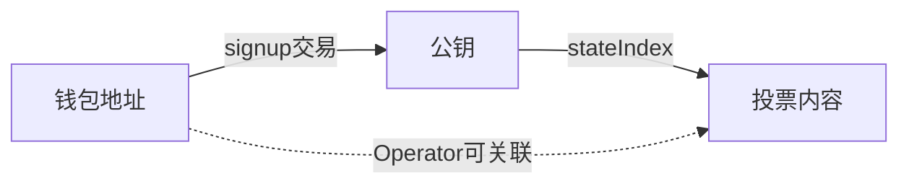
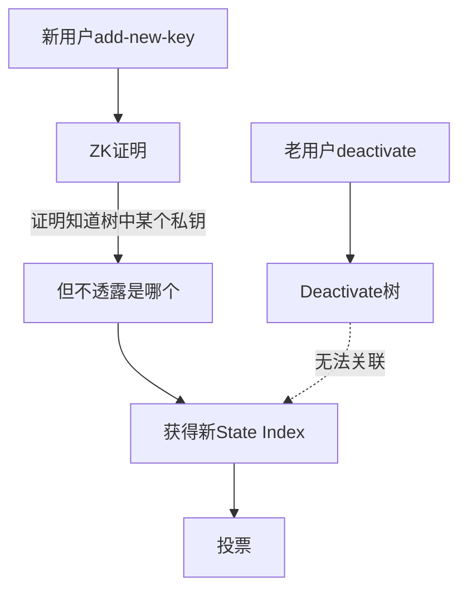
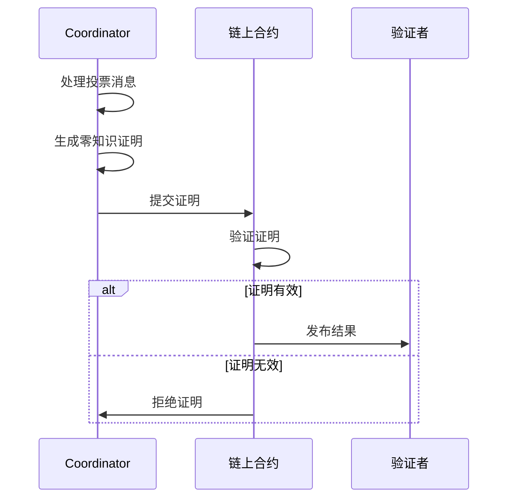
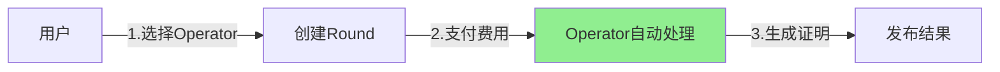
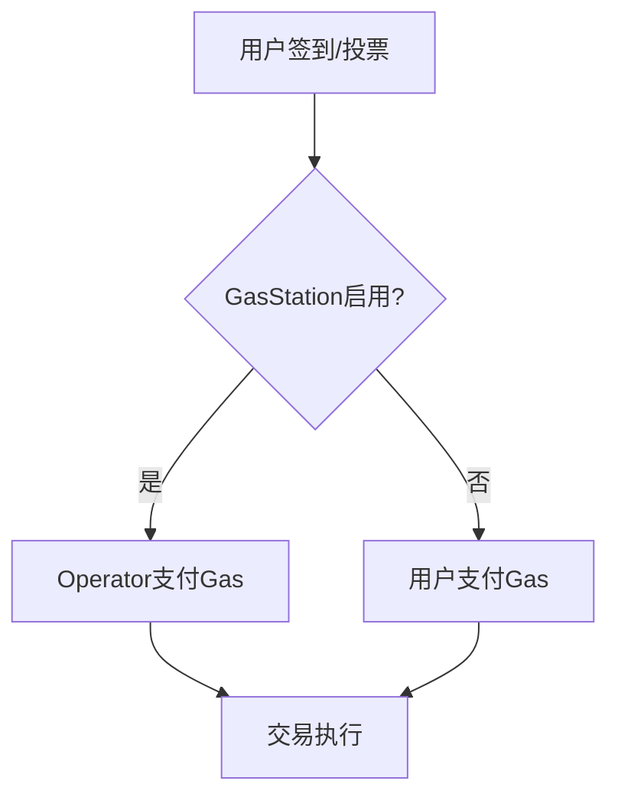

# 核心特性

AMACI 提供了一系列创新的功能，使其成为一个强大的抗串谋和隐私保护投票系统。本节详细介绍 AMACI 的核心特性。

## 🔒 身份解耦（AMACI 核心创新）

### 问题：身份关联

在基本 MACI 中，Operator 可以通过 signup 交易关联投票者身份：



### AMACI 的解决方案

**Add-new-key 机制：**

通过零知识证明创建新身份，断开与原钱包地址的关联：



**效果：**
- Operator 知道 State Index 5 投了票
- 但不知道对应哪个钱包地址
- 无法进行针对性的贿赂或报复

### 三种注册方式

AMACI 提供灵活的注册选择：

**1. Signup（标准模式）**
- 适合不关心隐私的场景
- 最快捷方便
- 隐私级别：⭐⭐

**2. Add-new-key（动态匿名）**
- 需要等待 operator 处理 deactivate 消息
- 完全匿名，使用零知识证明
- 隐私级别：⭐⭐⭐⭐⭐

**3. Pre-add-new-key（即时匿名）**
- 使用预配置的 deactivate root
- 立即可用，无需等待
- 隐私级别：⭐⭐⭐⭐⭐

## 🔐 多层隐私保护

### 第一层：投票内容加密

使用端到端加密保护投票内容：

- **加密算法**：Poseidon 哈希 + ECDH 密钥交换
- **加密对象**：所有投票消息在链上都是加密的
- **解密权限**：只有 Operator 能够解密投票内容

### 第二层：身份匿名化

通过 add-new-key 机制实现身份匿名：

- 使用 ZK 证明断开身份关联
- Operator 无法追踪到原始钱包地址
- 防止针对性攻击

### 第三层：零知识证明约束

确保 Operator 正确处理：

- 不能伪造投票
- 不能修改投票
- 不能隐藏投票
- 必须按规则处理

## 🛡️ 抗串谋机制

### 1. 密钥更改机制（继承自 MACI）

允许投票者随时更改密钥，使之前的投票失效：

**防止普通贿选：**

```typescript
// 步骤 1: 接受贿赂，用旧密钥投票
await vote({ option: 'A', keypair: oldKeypair })

// 步骤 2: 秘密更改密钥并重新投票
await changeKey({ newKeypair })
await vote({ option: 'B', keypair: newKeypair })

// 结果：只有选项 B 有效，贿赂者无法验证
```

### 2. 身份匿名化（AMACI 新增）

防止 Operator 进行针对性攻击：

**MACI 的问题：**
```
Operator 可以看到：
- 钱包 dora1abc... 对应 State Index 5
- State Index 5 投给了选项 A
- 结论：可以针对 dora1abc... 进行贿赂/报复
```

**AMACI 的保护：**
```
Operator 只能看到：
- State Index 5 投给了选项 A
- 但不知道对应哪个钱包地址
- 无法进行针对性攻击
```

### 3. 双重匿名保护

AMACI 提供两层匿名性：

**对公众：**
- 投票内容加密，外部观察者无法看到

**对 Operator：**
- 使用 add-new-key 后，Operator 也无法确定身份
- 即使 Operator 想作恶，也找不到攻击目标

### 可重复投票

投票者可以多次投票，后面的投票会覆盖前面的：

- 防止强制投票
- 纠正错误
- 改变主意

### 无法证明投票

由于密钥可以更改且身份可以匿名化：

- 无法向第三方证明最终投票
- 即使提供交易哈希也可能已更改
- 使贿选和强制投票不可行

## ✅ 可验证性

### 零知识证明

MACI 使用零知识证明来确保投票处理的正确性：

**证明类型：**

1. **ProcessMessages 证明**：证明所有投票消息被正确处理
2. **Tally 证明**：证明投票结果被正确统计

**验证过程：**



### 公开可验证

任何人都可以验证投票结果的正确性：

- **链上证明**：所有证明都存储在链上
- **公开验证**：任何人都可以下载并验证证明
- **确定性结果**：给定相同的输入，总是产生相同的输出

### Coordinator 约束

虽然 Coordinator 可以看到投票内容，但受到零知识证明的约束：

- **不能伪造投票**：必须处理链上的真实消息
- **不能修改投票**：任何修改都会导致证明验证失败
- **不能隐藏投票**：必须处理所有消息

## ⚡ 灵活投票机制

### 多种投票模式

MACI 支持多种投票模式：

#### 1. 一人一票（1P1V）

每个投票者有相同的投票权重：

```typescript
// 每个投票者有 100 点投票权
// 直接分配给选项
selectedOptions: [
  { idx: 0, vc: 50 },  // 给选项 0 投 50 票
  { idx: 1, vc: 30 },  // 给选项 1 投 30 票
  { idx: 2, vc: 20 },  // 给选项 2 投 20 票
]
// 总共使用 100 点投票权
```

#### 2. 二次方投票（QV）

投票权重的平方作为成本：

```typescript
// 每个投票者有 100 点投票权（voice credits）
// 投票权重的平方作为成本
selectedOptions: [
  { idx: 0, vc: 8 },  // 消耗 64 点投票权（8²）
  { idx: 1, vc: 5 },  // 消耗 25 点投票权（5²）
  { idx: 2, vc: 3 },  // 消耗 9 点投票权（3²）
]
// 总共消耗 98 点投票权
```

#### 3. 自定义权重

支持基于代币持有量的自定义权重分配：

- **Slope 模式**：投票权 = 代币数量 / slope
- **Threshold 模式**：达到阈值即可获得固定投票权

### 白名单支持

MACI 支持多种白名单机制：

#### Token 白名单

基于代币持有量：

```typescript
whitelist: {
  ecosystem: 'cosmoshub',  // 或 'doravota'
  snapshotHeight: '23342001',  // 快照区块高度
  votingPowerArgs: {
    mode: 'slope',
    slope: '1000000',  // 每 1 ATOM 获得 1 点投票权
  }
}
```

#### Oracle 白名单

使用 Oracle 签名验证：

- Oracle 服务器验证用户资格
- 签发证书（包含投票权重）
- 用户使用证书注册

### 投票选项灵活性

- **动态选项数量**：支持任意数量的投票选项
- **选项元数据**：可以为每个选项添加描述
- **多选投票**：可以同时投给多个选项

## 🌐 跨链支持

### Cosmos 生态集成

MACI 深度集成 Cosmos 生态系统：

**支持的链：**
- Cosmos Hub
- Dora Vota
- 其他兼容的 Cosmos 链

**跨链功能：**
- 跨链白名单查询
- 跨链代币权重计算
- IBC 消息传递（未来）

### 快照投票

支持基于历史快照的投票：

- **快照高度**：指定特定区块高度
- **历史权重**：使用历史代币持有量
- **防止操纵**：投票前无法通过转移代币来改变权重

### 实时权重

也支持实时权重计算：

- **动态查询**：注册时实时查询代币余额
- **灵活性**：适合不需要快照的场景
- **Gas 优化**：减少存储成本

## ⚡ 专业 Operator 网络

### 许可制 Operator 系统

AMACI 采用专业的 Operator 网络，为用户提供一站式服务：

**用户体验：**



**优势：**
- 用户无需运行 Operator 软件
- 无需维护服务器或生成证明
- 专业团队保证处理及时性
- 只需选择 Operator 并支付费用

### Operator 列表

**主网 Operator 网络：**
- 查看列表：https://vota.dorafactory.org/operators
- 包含成功率、历史记录等信息
- 由 Dora Factory 官方维护

### Gas Station 支持

集成 Gas Station 降低用户成本：



**优势：**
- 用户无需持有原生代币即可参与
- 降低参与门槛
- 提升用户体验

### 批量处理优化

Operator 支持高效批量处理：

- **批量解密**：一次处理多条消息
- **批量验证**：一次验证多个签名
- **批量证明**：一次生成覆盖多条消息的证明

## 🏗️ 系统架构优势

### Registry 模式

使用 Registry 合约统一管理：

- **Operator 管理**：注册和管理多个 Operator
- **一键创建**：简化 Round 创建流程
- **标准化**：统一的合约接口和配置

### 模块化设计

- **独立组件**：合约、SDK、Operator 系统独立开发
- **可扩展性**：易于添加新功能
- **可维护性**：清晰的代码结构

### 多语言支持

- **Rust**：合约和密码学库
- **TypeScript**：SDK 和前端工具
- **Circom**：零知识电路

## 📊 灵活的投票机制

### 多种投票模式

支持不同的投票场景：

#### 1P1V（一人一票）
```typescript
// 每个人有相同权重
selectedOptions: [
  { idx: 0, vc: 50 },  // 直接消耗 50 credits
  { idx: 1, vc: 30 },
]
```

#### QV（二次方投票）
```typescript
// 权重的平方作为成本
selectedOptions: [
  { idx: 0, vc: 8 },   // 消耗 64 credits (8²)
  { idx: 1, vc: 6 },   // 消耗 36 credits (6²)
]
```

### 白名单和权重配置

**白名单列表模式：**
- 指定 dora 地址列表
- 只有白名单地址可以 signup
- 固定或动态投票权重分配

**Pre-add-new-key 模式：**
- 平台预生成密钥对分发给用户
- 用户用任意地址发送交易
- 完全匿名，灵活性高

### 实时查询

SDK 提供丰富的查询功能：

```typescript
// 查询轮次信息
const round = await client.getRoundInfo({ contractAddress })

// 查询 Operator 列表
const operators = await client.indexer.getOperators('first', 10)

// 查询投票状态
const proof = await client.indexer.getProofByContractAddress(contractAddress)
```

## 安全特性

### 密码学安全

- **经过审计**：密码学原语经过安全审计
- **标准兼容**：兼容 EIP-2494 和其他标准
- **测试覆盖**：全面的测试用例

### 智能合约安全

- **代码审计**：合约代码经过专业审计
- **形式化验证**：关键逻辑经过形式化验证
- **漏洞赏金**：持续的安全奖励计划

### 运行时安全

- **输入验证**：严格的输入验证
- **溢出保护**：防止数值溢出
- **访问控制**：细粒度的权限管理

## 下一步

了解了 AMACI 的核心特性后，您可以：

- 🚀 [快速开始](/docs/introduction/quick-start) - 动手体验 AMACI
- 🔬 [AMACI 协议详解](/docs/protocol/overview) - 深入了解技术实现
- 🔐 [隐私保护机制](/docs/protocol/privacy-protection) - 了解身份解耦原理
- 💻 [SDK 使用](/docs/sdk/installation) - 开始集成 AMACI
