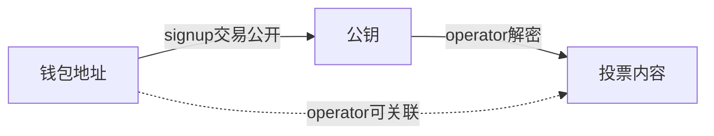
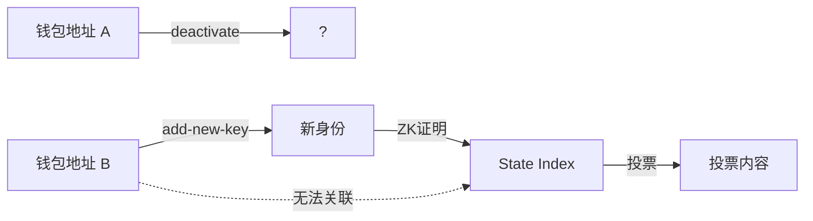
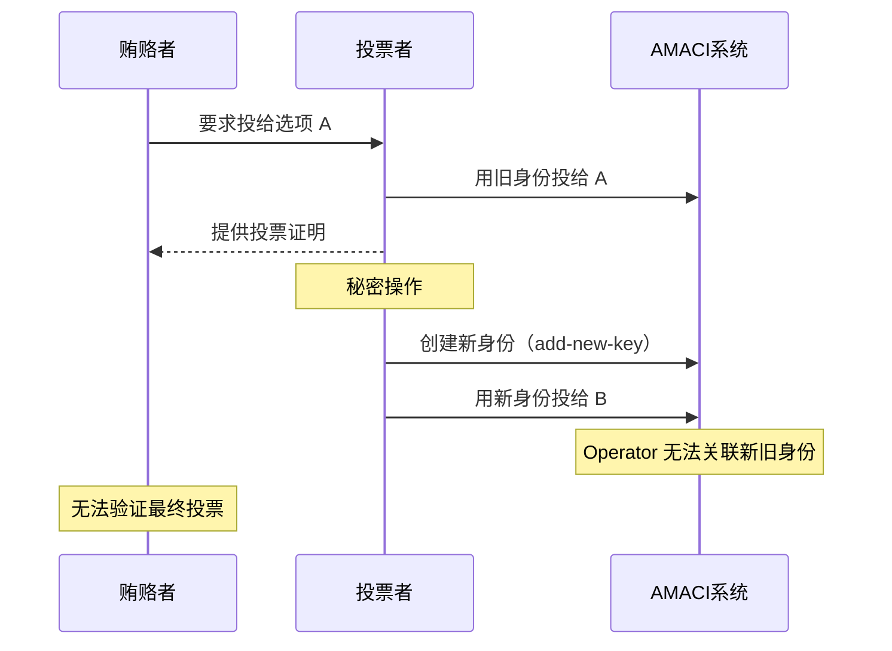
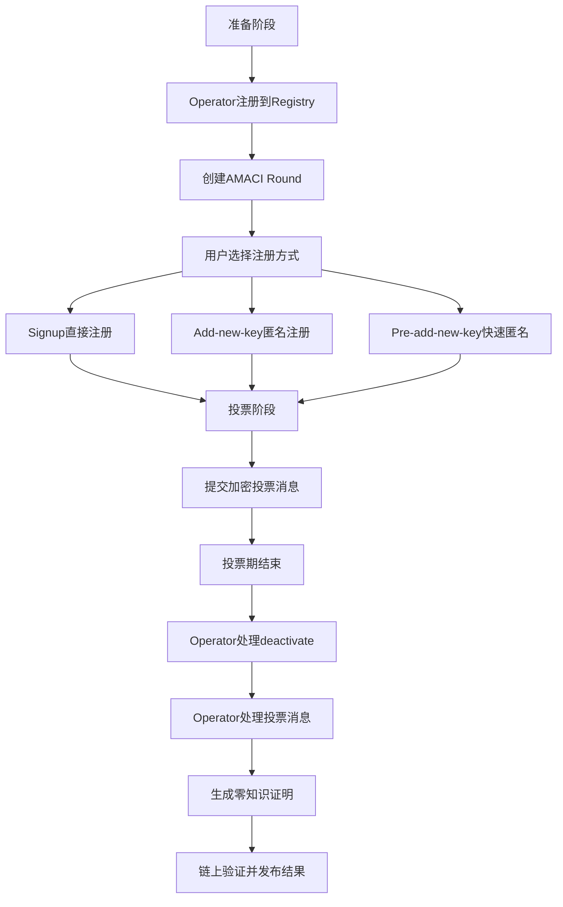
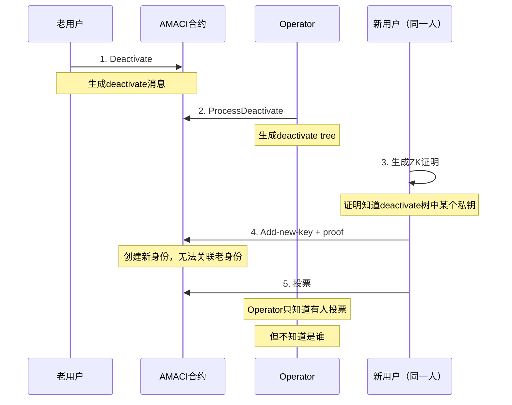

# MACI 投票系统

MACI（Minimal Anti-Collusion Infrastructure，最小化抗串谋基础设施）是一个基于密码学的链上投票系统，旨在解决传统电子投票中的串谋、贿选和隐私泄露问题。

**当前主要使用的版本是 AMACI（Anonymous MACI）**，它在原始 MACI 基础上增加了更强的匿名性保护。

## 版本对比

### MACI（第一版本）

MACI 是我们开发的基础版本，提供了：

- 端到端加密的投票内容
- 通过密钥更改机制防止贿选
- 零知识证明保证处理正确性

**局限性：**
- Operator 可以通过 signup 交易关联投票者身份和投票内容
- 链上交易（钱包地址 → 公钥）是公开的
- Operator 能确定"谁投给了谁"

### AMACI（当前版本）⭐

**AMACI（Anonymous MACI）是当前主要使用的版本**，在 MACI 基础上增加了身份匿名化：

**核心改进：**
- **身份解耦**：通过 add-new-key 和 pre-add-new-key 机制，使用零知识证明断开身份关联
- **增强隐私**：Operator 知道"有人投了票"但不知道"具体是谁"
- **灵活注册**：三种注册方式（signup / add-new-key / pre-add-new-key）满足不同隐私需求
- **Process Deactivate**：专门的 deactivate 消息处理流程

**匿名性对比：**

| 场景 | MACI | AMACI |
|------|------|-------|
| Operator 看到的 | 钱包地址 + 投票内容 | 只有投票内容，不知道是谁 |
| 身份追踪 | ✅ 可通过 signup 追踪 | ❌ 无法追踪（使用 ZK 证明） |
| 针对性攻击 | ⚠️ Operator 可针对特定用户 | ✅ Operator 无法确定目标 |

## 技术栈

AMACI 是一套完整的技术栈，包括：

- **智能合约**：部署在 Cosmos 链上的投票逻辑（Rust/CosmWasm）
- **密码学库**：实现加密、签名和密钥管理
- **零知识电路**：生成和验证投票处理的证明（Circom）
- **客户端 SDK**：方便开发者集成功能（TypeScript）
- **Operator 网络**：专业的消息处理服务（许可制）

## 核心设计目标

AMACI 的设计目标是创建一个：

1. **强隐私保护**的投票系统 - 投票内容加密 + 身份匿名化
2. **抗串谋**的投票机制 - 防止贿选和强制投票
3. **可验证**的投票结果 - 任何人都可以验证结果的正确性
4. **用户友好**的体验 - 专业 Operator 网络，用户无需自己运行节点

## AMACI 解决的核心问题

### 1. 身份隐私问题（AMACI 核心优势）

**MACI 的局限：**

在 MACI 中，虽然投票内容是加密的，但 Operator 可以通过链上 signup 交易关联身份：

**AMACI 的解决方案：**

AMACI 通过 **add-new-key** 和 **pre-add-new-key** 机制使用零知识证明断开身份关联：

**效果：**
- Operator 知道 State Index 5 投了票
- 但不知道这是哪个用户的钱包地址
- 无法进行针对性的贿赂或报复

### 2. 贿选问题

**传统投票系统的问题：**

在传统的链上投票中，所有投票都是公开的，贿赂者可以要求被贿赂者提供投票证明。

**AMACI 的双重保护：**

1. **密钥更改机制**（继承自 MACI）
   - 投票者可以先接受贿赂，用旧密钥投票
   - 然后更改密钥，用新密钥重新投票
   - 贿赂者无法验证最终投票是否有效

2. **身份匿名化**（AMACI 新增）
   - 使用 add-new-key 创建新身份投票
   - 即使 Operator 也不知道是谁
   - 贿赂者根本找不到贿赂目标

### 3. 隐私泄露问题

**传统投票系统的问题：**

链上投票通常是完全公开的，任何人都可以看到谁投了什么票，这会导致社交压力、报复风险和隐私侵犯。

**AMACI 的多层保护：**

1. **投票内容加密**：使用 Operator 公钥加密，只有 Operator 能解密
2. **身份匿名化**：通过 add-new-key 断开钱包地址与投票的关联
3. **零知识证明**：Operator 无法篡改投票，必须正确处理
4. **聚合结果**：只公布总体结果，不公开个人投票

### 4. Operator 串谋问题（AMACI 特别防护）

**新问题：** 如果 Operator 本身想进行贿赂或报复怎么办？

**AMACI 的保护：**

在 MACI 中，Operator 可以确定具体是谁投的票，可能进行针对性攻击。

在 AMACI 中，即使是 Operator 也无法确定：
- State Index 对应的钱包地址
- 新身份是从哪个老身份创建的
- 投票者的真实身份

这使得即使 Operator 想作恶，也无法找到攻击目标。

## 与传统投票系统的对比

| 特性 | 传统链上投票 | MACI（第一版） | AMACI（当前版）⭐ |
|------|-------------|--------------|----------------|
| 投票内容隐私 | ❌ 完全公开 | ✅ 端到端加密 | ✅ 端到端加密 |
| 身份隐私 | ❌ 地址公开 | ⚠️ Operator 可关联 | ✅ 完全匿名（ZK 证明）|
| 抗贿选 | ❌ 可提供证明 | ✅ 密钥更改 | ✅✅ 密钥更改 + 身份匿名 |
| 防 Operator 串谋 | N/A | ⚠️ Operator 知道身份 | ✅ Operator 无法确定身份 |
| 结果可验证 | ✅ 链上可见 | ✅ 零知识证明 | ✅ 零知识证明 |
| 用户体验 | 简单 | 需要额外步骤 | 可选简单或匿名模式 |

## AMACI 工作原理

### 三种注册方式

AMACI 提供三种注册方式，满足不同的隐私需求：

**方式 1: Signup（标准注册）**
- 最简单快捷
- 适合不关心 Operator 知道身份的场景
- 隐私级别：⭐⭐

**方式 2: Add-new-key（动态换 key）**
- 需要等待 deactivate 消息处理
- 使用零知识证明创建新身份
- 隐私级别：⭐⭐⭐⭐⭐

**方式 3: Pre-add-new-key（预配置换 key）**
- 使用预先配置的 deactivate root
- 立即可用，无需等待
- 隐私级别：⭐⭐⭐⭐⭐

### 工作流程

### AMACI 独特流程

**Process Deactivate（AMACI 特有）：**

在处理投票消息前，Operator 先处理 deactivate 消息：

1. 用户提交 deactivate 消息（想要创建新身份）
2. Operator 收集并处理这些消息
3. 生成 deactivate tree 和 commitment
4. 后续用户可以使用 add-new-key 基于这个 tree 创建新身份

**身份解耦机制：**

## 专业 Operator 网络

AMACI 采用许可制的专业 Operator 网络，为用户提供一站式服务：

### 用户友好体验

**用户不需要：**
- ❌ 自己运行 Operator 软件
- ❌ 维护服务器和生成证明
- ❌ 了解复杂的 ZK 电路

**用户只需要：**
- ✅ 选择一个 Operator
- ✅ 创建投票轮次
- ✅ 支付合理的服务费用
- ✅ Operator 自动处理所有后续工作

### Operator 网络特点

**许可制管理：**
- 由 Dora Factory 官方维护 Operator 列表
- 只有验证过的专业节点可以成为 Operator
- 保证服务质量和及时性

**查看 Operator 列表：**
- 主网：https://vota.dorafactory.org/operators
- 可查看每个 Operator 的成功率、运行记录

**奖罚机制：**
- 成功处理获得费用和声誉
- 延迟或失败会受到惩罚
- 保证 Operator 的可靠性

## AMACI 的优势

### 1. 更强的隐私保护

**投票内容隐私：**
- 端到端加密，只有 Operator 能解密

**身份隐私（AMACI 独有）：**
- 通过 add-new-key 断开身份关联
- 即使 Operator 也无法确定投票者身份
- 防止针对性的贿赂和报复

### 2. 强抗串谋性

- 密钥更改机制防止贿选
- 身份匿名化防止 Operator 串谋
- 可重复投票防止强制
- 无法提供有效的投票证明

### 3. 可验证性

- 零知识证明确保处理正确性
- 任何人都可以验证证明
- Operator 无法篡改投票

### 4. 灵活性

- 支持多种投票模式（1P1V、QV）
- 三种注册方式（简单/匿名/快速匿名）
- 可配置的投票参数
- 支持白名单和权重分配

### 5. 易用性

- 专业 Operator 网络自动处理
- 用户无需技术背景
- TypeScript SDK 方便集成
- 完整的文档和示例

## 使用场景

MACI 适用于需要高度隐私保护和抗串谋的投票场景：

### DAO 治理

- 社区提案投票
- 协议参数调整
- 资金分配决策

### 二次方融资

- 公共物品资金分配
- 社区项目支持
- Gitcoin Grants 类型的资助

### 选举系统

- 组织内部选举
- 社区代表选举
- 委员会成员选举

### 代币持有者投票

- 基于代币权重的投票
- 跨链投票支持
- 快照投票

## 关键设计权衡

虽然 AMACI 提供了强大的隐私和抗串谋保护，但也有一些设计权衡：

### 依赖 Operator

**优势：**
- 专业 Operator 网络保证服务质量
- 用户无需运行复杂的 Operator 软件
- 许可制确保可靠性

**权衡：**
- Operator 可以看到投票内容（但不知道是谁）
- Operator 可能拒绝处理（活性依赖）
- 通过零知识证明约束 Operator 行为

### 隐私级别选择

AMACI 允许用户根据需求选择隐私级别：

**Signup（低隐私，高便利）：**
- 最快捷，适合不关心隐私的场景
- Operator 知道身份

**Add-new-key（高隐私，需等待）：**
- 完全匿名，需等待 deactivate 处理
- Operator 不知道身份

**Pre-add-new-key（高隐私，即时）：**
- 完全匿名且快速
- 需要 Round 预配置

### Gas 成本

- 零知识证明验证需要链上计算
- 比传统投票系统消耗更多 Gas
- 通过 Gas Station 降低用户负担
- 创建 Round 时支付 Operator 费用

### 处理时间

- 结果不是实时的
- 需要等待投票期结束
- Operator 处理需要一定时间（通常几小时内完成）

## 下一步

现在您已经了解了 AMACI 投票系统，接下来可以：

- 📋 [探索核心特性](/docs/introduction/key-features) - 深入了解 AMACI 的各项功能
- 🚀 [快速开始](/docs/introduction/quick-start) - 动手创建第一个投票
- 🔬 [协议详解](/docs/protocol/overview) - 学习 AMACI 的技术细节
- 🔐 [AMACI 隐私机制](/docs/protocol/privacy-protection) - 了解身份解耦原理
