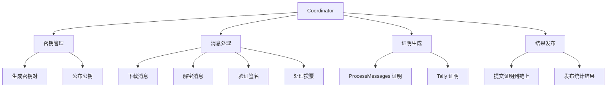
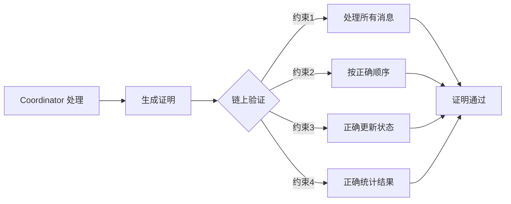
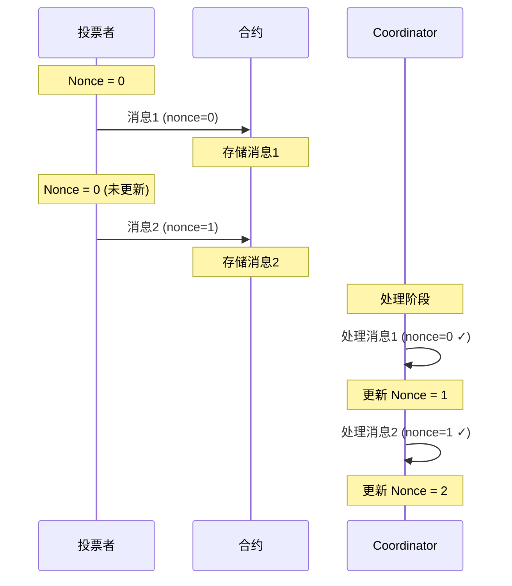
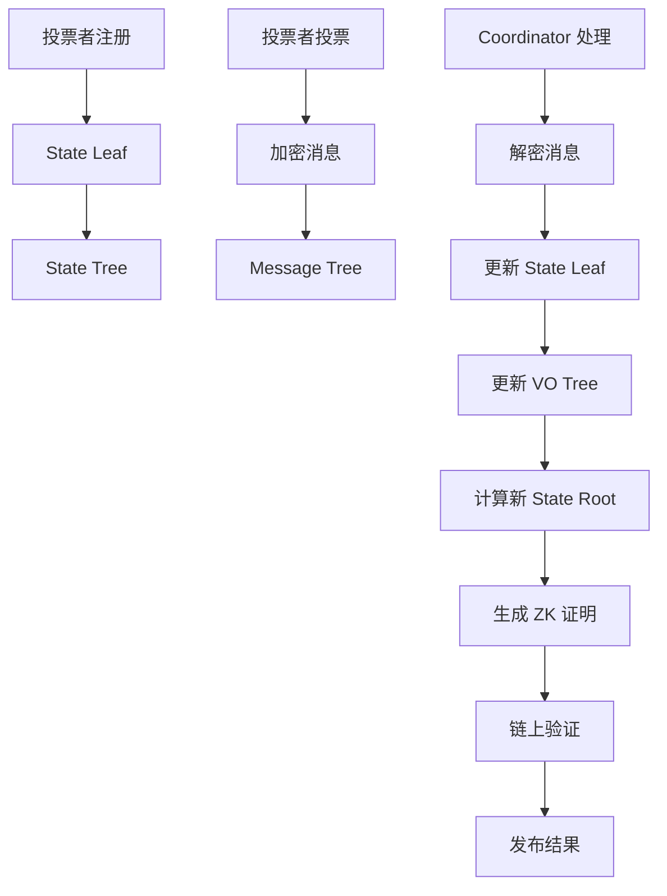

# 核心概念

本节深入介绍 AMACI 系统的核心概念，包括三种注册方式、参与角色、状态管理和数据结构。

## AMACI 三种注册方式（核心机制）

AMACI 的核心创新是提供三种注册方式，让用户根据隐私需求灵活选择。

### 注册方式对比

| 特性 | Signup | Add-new-key | Pre-add-new-key |
|------|--------|-------------|-----------------|
| 速度 | ⚡⚡⚡ 最快 | ⏱️ 需等待 deactivate | ⚡⚡ 即时 |
| 匿名性 | ⭐⭐ 低 | ⭐⭐⭐⭐⭐ 高 | ⭐⭐⭐⭐⭐ 高 |
| Operator可追踪 | ✅ 可以 | ❌ 不可以 | ❌ 不可以 |
| 需要ZK证明 | ❌ 否 | ✅ 是 | ✅ 是 |
| 前置条件 | 无 | 需要deactivate消息 | 需要pre-deactivate root |
| 适用场景 | 不关心隐私 | 需要完全匿名 | 需要快速匿名 |

### 1. Signup（标准注册）

**工作原理：**

最简单的注册方式，用户直接提交公钥到合约。

**代码示例：**

```typescript
// 1. 生成 MACI 密钥对
// 使用 dora 地址衍生 EdDSA-Poseidon 密钥对
const maciKeypair = await client.genKeypairFromSign({
  signer: wallet,
  address
});

// 2. Signup（仅白名单地址可用）
await client.signup({
  signer: wallet,
  address,
  contractAddress,
  maciKeypair,
  gasStation: true
});
```

**白名单验证：**

合约会验证发送者地址是否在白名单中：
```rust
// 合约检查
if !whitelist.contains(&sender) {
    return Err(ContractError::NotInWhitelist {});
}
```

**合约处理：**

```rust
// 1. 验证地址在白名单中
// 2. 创建 State Leaf
StateLeaf {
    pub_key: user_pubkey,           // 用户公钥（从dora地址衍生）
    voice_credit_balance: amount,   // 固定或动态投票权重
    vote_option_tree_root: empty,   // 空投票树
    nonce: 0,                       // 初始nonce
    d1: [0, 0],                     // 未使用
    d2: [0, 0],                     // 未使用
}
```

**投票权重分配：**

白名单模式可以有两种权重分配方式：
- **固定权重**：所有白名单用户获得相同投票权重（如 100）
- **动态权重**：基于代币持有量或其他链上数据计算权重

**链上可见信息：**

```typescript
// 任何人（包括Operator）都可以看到：
{
  txHash: "0xabc...",
  sender: "dora1abc...",        // 钱包地址
  pubkey: { x: "...", y: "..." }, // MACI公钥
  stateIndex: 5                  // 分配的索引
}
```

**隐私级别：⭐⭐**

Operator 可以通过链上交易关联：
- `钱包地址 dora1abc... → 公钥 0x123... → State Index 5`
- 然后通过解密知道：`State Index 5 投给了选项 A`
- 结论：`钱包 dora1abc... 投给了选项 A`

---

### 2. Add-new-key（动态换 key）

**工作原理：**

使用零知识证明创建新身份，断开与原钱包地址的关联。

**核心机制：**

证明"我知道 deactivate 树中某个条目对应的私钥"，但不透露具体是哪个。

**完整流程：**

**步骤 1: 老用户 Deactivate**

```typescript
// 老用户提交 deactivate 消息
await client.deactivate({
  signer: oldWallet,
  address: oldAddress,
  contractAddress,
  maciKeypair: oldKeypair,
  gasStation: true
});

// 这会生成一个特殊的投票消息：
// - voIdx = 0
// - newVotes = 0  
// - newPubKey = [0, 0]（表示最后一条消息）
```

**步骤 2: Operator 处理 Deactivate**

```typescript
// Operator 收集所有 deactivate 消息
// 生成 deactivate tree

await operator.processDeactivateMessages({
  inputSize: 10,
  subStateTreeLength: 1024,
  wasmFile,
  zkeyFile
});

// 生成的 deactivate tree leaf:
// [c1[0], c1[1], c2[0], c2[1], sharedKeyHash]
//
// 其中：
// - c1, c2 是加密的"是否deactivate"标志
// - sharedKeyHash = hash(ecdh(oldPrivKey, coordPubKey))
//   Operator用这个来识别是哪个用户deactivate了
//   但在add-new-key中，这个不会被公开
```

**步骤 3: 新用户获取 Deactivate 数据**

```typescript
// 查询链上的 deactivate 数据
const deactivates = await client.indexer.fetchAllDeactivateLogs(contractAddress);

// 返回的是 deactivate tree 的所有 leaf
// 格式：[[c1[0], c1[1], c2[0], c2[1], hash], ...]
```

**步骤 4: 新用户生成 ZK 证明**

```typescript
// 使用 VoterClient 或 OperatorClient
import { VoterClient } from '@dorafactory/maci-sdk';

const voterClient = new VoterClient({
  network: 'testnet',
  secretKey: oldPrivateKeyHex  // 老用户的私钥
});

// 生成 add-new-key payload
const payload = await voterClient.buildAddNewKeyPayload({
  stateTreeDepth: 10,
  operatorPubkey: operatorPubkey,
  deactivates: deactivates,
  wasmFile,  // addNewKey circuit wasm
  zkeyFile   // addNewKey circuit zkey
});

// payload 包含：
// - proof: ZK证明
// - d: [d1[0], d1[1], d2[0], d2[1]]（重新随机化的值）
// - nullifier: 防止重复使用
```

**步骤 5: 提交 Add-new-key**

```typescript
// 使用新钱包提交
const newKeypair = genKeypair();

await client.addNewKey({
  signer: newWallet,         // 新钱包！
  contractAddress,
  d: payload.d,
  proof: payload.proof,
  nullifier: payload.nullifier,
  newMaciKeypair: newKeypair,  // 新的MACI密钥对
  fee: 'auto'
});
```

**ZK 证明内容：**

```
公开输入（Operator可见）：
- deactivateRoot: deactivate树的根
- coordPubKeyHash: Operator公钥的哈希
- nullifier: 防重放
- d1[0], d1[1], d2[0], d2[1]: 重新随机化的值

私有输入（不公开）：
- oldPrivateKey: 老用户的私钥
- deactivateIndex: 是deactivate树中的第几个（关键！）
- deactivateLeaf: 对应的leaf值
- c1, c2: 原始加密值
- randomVal: 重新随机化用的随机数
- deactivateLeafPathElements: Merkle证明路径

证明声称：
"我知道deactivate树中某个条目对应的私钥，
 并且我正确地重新随机化生成了d1, d2，
 但我不告诉你是第几个条目"
```

**合约处理：**

```rust
// 1. 验证 nullifier 未使用
// 2. 验证 ZK 证明
// 3. 创建新 State Leaf
StateLeaf {
    pub_key: new_pubkey,      // 全新的公钥
    voice_credit_balance: 100,
    vote_option_tree_root: empty,
    nonce: 0,
    d1: [d[0], d[1]],        // 从proof中来
    d2: [d[2], d[3]],        // 从proof中来
}
// 4. 分配新 State Index
```

**隐私级别：⭐⭐⭐⭐⭐**

Operator 能看到：
- 有人使用 add-new-key 创建了新身份
- 新身份是 deactivate 树中某个用户
- 新身份的 State Index 是 X

Operator 无法确定：
- 是 deactivate 树中的第几个用户
- 对应哪个钱包地址
- 与哪个老身份关联

**匿名集大小：**
- 如果 deactivate 树有 100 个条目
- 新用户的匿名集大小 = 100
- Operator 只能确定"是这100人之一"

---

### 3. Pre-add-new-key（预生成模式）⭐ 推荐

**工作原理：**

平台预先为用户生成 EdDSA-Poseidon 密钥对并分发，用户在本地生成证明和新密钥对，用任意 dora 地址发送交易。

**核心优势：**
- ✅ **立即可用**：无需等待 deactivate 处理
- ✅ **完全匿名**：用户可以用任意地址发送交易
- ✅ **用户控制**：在本地生成证明和新密钥
- ✅ **平台友好**：适合批量为用户准备
- ✅ **灵活性高**：不需要先有老账户

**与其他方式的对比：**

| 特性 | Signup | Add-new-key | Pre-add-new-key |
|------|--------|-------------|-----------------|
| 需要白名单 | ✅ 是 | ❌ 否 | ❌ 否 |
| 需要老账户 | ❌ 否 | ✅ 是 | ❌ 否 |
| 等待时间 | 立即 | 需等待 ProcessDeactivate | 立即 |
| 发送地址 | 必须白名单地址 | 新钱包 | 任意钱包 |
| 隐私级别 | ⭐⭐ | ⭐⭐⭐⭐⭐ | ⭐⭐⭐⭐⭐ |
| 适用场景 | 简单投票 | 已有用户换身份 | ⭐ 新用户匿名 |

**完整流程：**

**步骤 1: 平台预生成密钥对**

```typescript
// 平台提前为用户生成 EdDSA-Poseidon 密钥对
import { genKeypair } from 'maci-crypto';

const userPreKeys = [];
for (let i = 0; i < 1000; i++) {
  const keypair = genKeypair();
  userPreKeys.push({
    id: `user_${i}`,
    privateKey: keypair.privateKey.toString(16),
    publicKey: [
      keypair.publicKey[0].toString(16),
      keypair.publicKey[1].toString(16)
    ]
  });
}

// 平台生成 pre-deactivate tree
const preDeactivateTree = buildPreDeactivateTree(userPreKeys, platformCoordKeypair);

console.log(`预生成 ${userPreKeys.length} 个密钥对`);
console.log(`Pre-deactivate root: ${preDeactivateTree.root}`);
```

**步骤 2: 创建 Round 时配置**

```typescript
// Round 创建时配置 pre-deactivate root
await client.createMaciRound({
  signer: creatorWallet,
  operatorPubkey: operatorPubkey,
  
  startVoting: new Date(),
  endVoting: new Date(Date.now() + 7 * 24 * 60 * 60 * 1000),
  
  title: '社区投票',
  voteOptionMap: ['选项 A', '选项 B', '选项 C'],
  
  // 配置 pre-deactivate
  preDeactivateRoot: preDeactivateTree.root,
  preDeactivateCoordinator: {
    x: platformCoordKeypair.publicKey[0].toString(16),
    y: platformCoordKeypair.publicKey[1].toString(16)
  },
  
  circuitType: MaciCircuitType.QV
});
```

**步骤 3: 平台分发密钥给用户**

平台通过安全渠道将密钥对分发给用户：

```typescript
// API 返回给用户
{
  "privateKey": "0x1234567890abcdef...",
  "publicKey": {
    "x": "0xabcdef...",
    "y": "0x123456..."
  },
  "preDeactivateData": {
    "leaves": [ /* deactivate tree 的所有 leaf */ ],
    "coordinatorPubkey": { "x": "...", "y": "..." }
  }
}
```

**步骤 4: 用户在本地生成证明**

```typescript
// 用户在本地（浏览器或本地机器）
import { VoterClient, genKeypair } from '@dorafactory/maci-sdk';

// 使用平台分发的私钥
const voterClient = new VoterClient({
  network: 'mainnet',
  secretKey: receivedPrivateKey  // 平台分发的私钥
});

// ⭐ 用户生成自己的新密钥对（完全由用户控制）
const myNewKeypair = genKeypair();  // 没有人知道这个密钥

console.log('✅ 新密钥已在本地生成，只有我知道');

// 生成 pre-add-new-key payload
const payload = await voterClient.buildPreAddNewKeyPayload({
  stateTreeDepth: 10,
  coordinatorPubkey: preDeactivateData.coordinatorPubkey,
  deactivates: preDeactivateData.leaves,
  wasmFile,  // circuit wasm
  zkeyFile   // circuit zkey
});

console.log('✅ ZK 证明在本地生成完成');
```

**步骤 5: 用户用任意地址发送交易**

```typescript
// ⭐ 用户可以用任何 dora 地址发送此交易
// 可以是新钱包，可以是旧钱包，完全自由

await client.rawPreAddNewKey({
  signer: anyWallet,  // 任意钱包！
  contractAddress,
  d: payload.d,
  proof: payload.proof,
  nullifier: payload.nullifier,
  newPubkey: {
    x: myNewKeypair.publicKey[0].toString(16),
    y: myNewKeypair.publicKey[1].toString(16)
  },
  gasStation: true
});

console.log('✅ 匿名注册成功');
console.log('✅ Operator 不知道是谁');
console.log('✅ 平台不知道新密钥');
```

**步骤 6: 投票**

```typescript
// 用户用自己的新密钥对投票
const roundInfo = await client.getRoundInfo({ contractAddress });

await client.vote({
  signer: anyWallet,  // 同样可以用任意钱包
  address: anyAddress,
  contractAddress,
  selectedOptions: [
    { idx: 0, vc: 10 }
  ],
  operatorCoordPubKey: [
    BigInt(roundInfo.coordinatorPubkeyX),
    BigInt(roundInfo.coordinatorPubkeyY)
  ],
  maciKeypair: myNewKeypair,  // 只有用户知道
  gasStation: true
});

console.log('✅ 投票完成，完全匿名');
```

**隐私分析：**

```
平台知道：
✅ 预生成的密钥对（已分发）
✅ Pre-deactivate tree
❌ 用户的新密钥对（用户本地生成）
❌ 用户用哪个地址发送交易
❌ 用户的投票内容

Operator 知道：
✅ 有人用 pre-add-new-key 注册了
✅ 是 pre-deactivate tree 中的某一个
❌ 具体是第几个用户
❌ 发送交易的地址是谁
❌ 用户的真实身份

用户隐私保护：
✅ 匿名集 = pre-deactivate tree 大小
✅ 即使平台和 Operator 串谋也无法确定
✅ 新密钥完全由用户控制
✅ 可用任意地址发送，无法追踪
```

**优势总结：**

1. **无需等待**：立即可用，不需要等 deactivate 处理
2. **完全匿名**：可用任意地址发送，无法追踪
3. **用户控制**：新密钥完全由用户本地生成和控制
4. **平台友好**：适合平台批量为用户准备
5. **安全性高**：即使平台知道预生成密钥，也不知道新密钥
6. **灵活性强**：不需要先有账户，不需要在白名单中

**适用场景：**
- ⭐⭐⭐ **推荐用于新用户**：首次参与投票
- ⭐⭐⭐ **平台运营**：平台可以批量准备
- ⭐⭐⭐ **空投/活动**：为参与者预先分配
- ⭐⭐⭐ **隐私投票**：用户不想暴露身份
- ⭐⭐⭐ **大规模应用**：可以预先为大量用户准备

**隐私级别：⭐⭐⭐⭐⭐**
- 完全匿名，Operator 无法确定身份
- 平台也无法跟踪用户的新密钥和投票
- 用户可以用任意地址，增加额外匿名层

---

## 三个关键角色

AMACI 系统由三个关键角色组成，每个角色在系统中扮演不同的职责。

### 1. 投票者（Voter）

投票者是参与投票的用户，拥有自己的密钥对并提交加密的投票消息。

#### 密钥对

每个投票者都有一个 EdDSA 密钥对：

```typescript
// 密钥对结构
interface Keypair {
  privateKey: bigint;     // 私钥（保密）
  publicKey: [bigint, bigint];  // 公钥（Baby Jubjub 曲线上的点）
}

// 生成密钥对
const keypair = genKeypair();
```

**公钥（Public Key）：**
- Baby Jubjub 曲线上的一个点 (x, y)
- 公开给系统，用于验证签名
- 存储在状态树中

**私钥（Private Key）：**
- 一个大整数
- 必须保密，用于签名消息
- 可以更改（生成新密钥对）

#### 投票者的操作

**注册方式选择：**

```typescript
// 方式 1: Signup（快速，低隐私）
const maciKeypair = await client.genKeypairFromSign({
  signer: wallet,
  address
});

const certificate = await client.requestOracleCertificate({
  signer: wallet,
  ecosystem: 'cosmoshub',
  address,
  contractAddress
});

await client.signup({
  signer: wallet,
  address,
  contractAddress,
  maciKeypair,
  oracleCertificate: certificate,
  gasStation: true
});
```

```typescript
// 方式 2: Add-new-key（高隐私，需等待）
// 见上面的详细流程

// 方式 3: Pre-add-new-key（高隐私，即时）
// 见上面的详细流程
```

**投票（Vote）：**

```typescript
// 所有注册方式后的投票流程相同
const roundInfo = await client.getRoundInfo({ contractAddress });

await client.vote({
  signer: wallet,
  address,
  contractAddress,
  selectedOptions: [
    { idx: 0, vc: 5 },
    { idx: 1, vc: 3 },
  ],
  operatorCoordPubKey: [
    BigInt(roundInfo.coordinatorPubkeyX),
    BigInt(roundInfo.coordinatorPubkeyY)
  ],
  maciKeypair,
  gasStation: true
});
```

**Deactivate（为他人创建匿名机会）：**

```typescript
// 如果想帮助他人获得匿名身份
await client.deactivate({
  signer: wallet,
  address,
  contractAddress,
  maciKeypair,
  gasStation: true
});

// 这会让你的身份进入 deactivate 树
// 其他人可以使用 add-new-key 基于这个树创建新身份
```

### 2. Coordinator（协调者/Operator）

Coordinator 负责处理加密消息、生成证明并发布结果。

#### Coordinator 的职责



#### Coordinator 密钥对

Coordinator 也有自己的 EdDSA 密钥对：

```typescript
// Coordinator 密钥对
interface CoordinatorKeypair {
  privateKey: bigint;            // 用于解密投票消息
  publicKey: [bigint, bigint];   // 公开，用于投票者加密
}
```

**公钥用途：**
- 投票者使用 Coordinator 公钥加密投票消息
- 公布在投票轮次信息中

**私钥用途：**
- Coordinator 使用私钥解密投票消息
- 严格保密，不能泄露

#### 处理流程

**1. 下载消息**

```typescript
// 从链上查询所有投票消息
const messages = await contract.getMessages();

// 消息结构
interface Message {
  msgType: bigint;      // 消息类型
  data: bigint[];       // 加密的消息数据（10个字段）
}
```

**2. 解密消息**

```typescript
// 使用 ECDH 共享密钥解密
const sharedKey = genEcdhSharedKey(
  coordinatorPrivKey,
  voterPubKey
);

const command = decrypt(message.data, sharedKey);

// 解密后的命令结构
interface Command {
  nonce: bigint;          // 消息序号
  stateIndex: bigint;     // 投票者状态索引
  voteOptionIndex: bigint; // 投票选项索引
  newVoteWeight: bigint;   // 新的投票权重
  newPubKey: [bigint, bigint]; // 新公钥（可能不变）
  salt: bigint;           // 随机盐值
  signature: Signature;   // EdDSA 签名
}
```

**3. 验证和处理**

```typescript
// 验证签名
const isValid = verifySignature(
  command,
  command.signature,
  voterPubKey
);

if (isValid && command.nonce === currentNonce) {
  // 更新状态树
  updateStateTree(command);
  
  // 更新投票选项树
  updateVoteOptionTree(command);
}
```

#### 零知识证明约束

Coordinator 虽然可以看到投票内容，但受到零知识证明的约束：



**约束包括：**
- 必须处理所有链上消息
- 必须按 Nonce 顺序处理
- 必须正确验证签名
- 必须正确更新状态树
- 必须正确统计投票结果
- 不能伪造或修改投票

### 3. 智能合约

智能合约充当可信的中介，存储数据并验证证明。

#### 合约的职责

**存储管理：**
- 存储投票者公钥
- 存储加密的投票消息
- 存储状态树根
- 存储投票结果

**验证功能：**
- 验证投票者签名
- 验证白名单资格
- 验证零知识证明
- 验证投票规则

**状态管理：**
- 管理投票轮次状态（Created → Voting → Processing → Tallied）
- 管理投票者状态
- 管理消息队列

#### 合约状态

```rust
// 轮次状态
pub enum RoundStatus {
    Created,      // 已创建，等待开始
    Voting,       // 投票进行中
    Processing,   // 正在处理消息
    Tallied,      // 已统计完成
}

// 合约存储的数据
pub struct MaciState {
    coordinator_pubkey: PubKey,           // Coordinator 公钥
    state_tree_root: Uint256,             // 状态树根
    message_tree_root: Uint256,           // 消息树根
    num_signups: u64,                     // 注册人数
    messages: Vec<Message>,               // 消息队列
    status: RoundStatus,                  // 轮次状态
    results: Option<Vec<Uint256>>,        // 投票结果
}
```

## 状态管理

MACI 使用 Merkle Tree 来高效管理大量数据。

### 状态树（State Tree）

AMACI 的状态树比 MACI 更复杂，包含匿名化字段。

#### AMACI State Leaf 结构

每个投票者在状态树中占据一个 Leaf：

```typescript
interface AmaciStateLeaf {
  pubKey: [bigint, bigint];    // 投票者公钥
  voiceCreditBalance: bigint;  // 剩余投票权重
  voteOptionTreeRoot: bigint;  // 投票选项树根
  nonce: bigint;               // 当前 Nonce
  d1: [bigint, bigint];        // 用于add-new-key的匿名化数据
  d2: [bigint, bigint];        // 用于add-new-key的匿名化数据
}
```

**字段说明：**

- **pubKey**：投票者的当前公钥
- **voiceCreditBalance**：剩余的投票权重
  - 1P1V 模式：直接扣除投票权重
  - QV 模式：扣除投票权重的平方
- **voteOptionTreeRoot**：该投票者投票选项树的 Merkle 根
- **nonce**：下一条有效消息的序号
- **d1, d2**：重新随机化的值，用于 add-new-key 的 ZK 证明

**d1, d2 的作用：**

```typescript
// 在 signup 时
d1 = [0, 0]  // 未使用
d2 = [0, 0]  // 未使用

// 在 add-new-key 时
d1 = [rerandomized_c1_x, rerandomized_c1_y]
d2 = [rerandomized_c2_x, rerandomized_c2_y]

// d1, d2 包含了：
// 1. 加密的去活化标志
// 2. 重新随机化后的值
// 3. 用于后续的 add-new-key 验证
```

**MACI vs AMACI State Leaf：**

```rust
// MACI State Leaf (5个字段)
hash = poseidon([pubKey[0], pubKey[1], balance, voTreeRoot, nonce])

// AMACI State Leaf (10个字段)
hash = poseidon([
  poseidon([pubKey[0], pubKey[1], balance, voTreeRoot, nonce]),
  poseidon([d1[0], d1[1], d2[0], d2[1], 0])
])
```

#### 状态树结构

```
              State Tree Root
              /             \
            /                 \
          /                     \
    [State 0]              [State 1]
    User A                 User B
    
    pubKey: [x0, y0]       pubKey: [x1, y1]
    balance: 100           balance: 75
    voTree: root0          voTree: root1
    nonce: 2               nonce: 1
```

**特点：**
- 使用 N-ary Merkle Tree（如 5-ary）
- 树的深度取决于最大投票者数量
- 每次处理消息后更新对应的 Leaf
- 树根存储在链上合约中

#### 状态更新示例

```typescript
// 初始状态
const initialLeaf = {
  pubKey: [x, y],
  voiceCreditBalance: 100,
  voteOptionTreeRoot: emptyRoot,
  nonce: 0,
};

// 处理投票消息后
const updatedLeaf = {
  pubKey: [x, y],              // 公钥不变
  voiceCreditBalance: 91,      // 100 - 9 (3²)
  voteOptionTreeRoot: newRoot, // 更新后的投票树根
  nonce: 1,                    // nonce +1
};

// 计算新的 Leaf 哈希
const newLeafHash = hash(updatedLeaf);

// 更新状态树
updateStateTree(stateIndex, newLeafHash);
```

### 投票选项树（Vote Option Tree）

每个投票者有一个投票选项树，记录对各选项的投票。

#### 投票选项树结构

```
              VO Tree Root
              /          \
            /              \
          /                  \
    [Option 0]          [Option 1]
    weight: 5           weight: 3
    
        |                   |
    [Option 2]          [Option 3]
    weight: 0           weight: 2
```

**特点：**
- Leaf 数量 = 投票选项数量
- 每个 Leaf 存储对该选项的投票权重
- 投票时只更新相关的 Leaf
- 树根存储在 State Leaf 中

#### 投票更新示例

```typescript
// 初始投票（所有选项权重为 0）
const initialVotes = [0, 0, 0, 0, 0];

// 第一次投票：给选项 0 投 5 票，选项 2 投 3 票
const vote1 = [
  { idx: 0, weight: 5 },
  { idx: 2, weight: 3 },
];
// 结果：[5, 0, 3, 0, 0]

// 第二次投票：修改投票，给选项 1 投 4 票
const vote2 = [
  { idx: 0, weight: 5 },  // 保持
  { idx: 1, weight: 4 },  // 新增
  { idx: 2, weight: 0 },  // 取消
];
// 结果：[5, 4, 0, 0, 0]
```

### 消息树（Message Tree）

所有投票消息按提交顺序组成消息树。

#### 消息树结构

```
              Message Tree Root
              /               \
            /                   \
          /                       \
    [Message 0]              [Message 1]
    (User A, t=100)          (User B, t=101)
    
    msgType: 1               msgType: 1
    data: [encrypted]        data: [encrypted]
```

**特点：**
- 按时间顺序添加消息
- 不可修改或删除
- 树根用于证明所有消息被处理
- 存储在链上合约中

#### 消息结构

```typescript
interface Message {
  msgType: bigint;      // 消息类型（1=投票，2=密钥更改）
  data: bigint[];       // 加密数据（10个字段）
}

// data 包含加密的 Command：
// [0]: packaged (nonce + stateIdx + voIdx + newVotes + salt)
// [1]: newPubKey.x
// [2]: newPubKey.y
// [3]: signature.R8.x
// [4]: signature.R8.y
// [5]: signature.S
// [6-9]: 加密 IV 和其他数据
```

## Nonce 机制

Nonce 是 MACI 中的关键机制，确保消息按正确顺序处理。

### Nonce 工作原理



### Nonce 验证规则

```typescript
// 处理消息时验证 Nonce
function processMessage(command: Command, currentState: StateLeaf): boolean {
  // 规则 1: Nonce 必须等于当前 Nonce
  if (command.nonce !== currentState.nonce) {
    return false; // 拒绝消息
  }
  
  // 规则 2: 验证签名
  if (!verifySignature(command, currentState.pubKey)) {
    return false; // 拒绝消息
  }
  
  // 规则 3: 检查余额
  const cost = calculateCost(command.newVoteWeight);
  if (cost > currentState.voiceCreditBalance) {
    return false; // 余额不足
  }
  
  // 接受消息并更新 Nonce
  currentState.nonce += 1;
  return true;
}
```

### Nonce 与重新投票

```typescript
// 场景：用户想要重新投票

// 第一次投票（Nonce = 0）
await vote({ nonce: 0, option: 0, weight: 5 });
// 链上 Nonce 仍然是 0（还未处理）

// 第二次投票（Nonce = 1）
await vote({ nonce: 1, option: 1, weight: 5 });
// 链上 Nonce 仍然是 0

// Coordinator 处理：
// - 处理消息1：nonce=0 ✓，更新状态，新 nonce=1
// - 处理消息2：nonce=1 ✓，更新状态，新 nonce=2
// 两次投票都有效，第二次覆盖第一次
```

### Nonce 与密钥更改

```typescript
// 场景：用户更改密钥使之前的投票失效

// 使用密钥 K1 投票（Nonce = 0）
await vote({ 
  keypair: K1,
  nonce: 0, 
  option: 0, 
  weight: 5 
});

// 更改密钥（Nonce = 1）
await changeKey({ 
  keypair: K1,
  nonce: 1, 
  newKeypair: K2 
});

// 使用密钥 K2 重新投票（Nonce = 2）
await vote({ 
  keypair: K2,
  nonce: 2, 
  option: 1, 
  weight: 5 
});

// Coordinator 处理：
// - 消息1：nonce=0, signed by K1 ✓
// - 消息2：nonce=1, signed by K1 ✓，更新公钥为 K2
// - 消息3：nonce=2, signed by K2 ✓
// 最终只有选项 1 的投票有效
```

## 消息类型

MACI 支持不同类型的消息。

### 1. 投票消息（Vote Message）

```typescript
interface VoteCommand {
  msgType: 1;
  nonce: bigint;
  stateIndex: bigint;
  voteOptionIndex: bigint;  // 投票的选项
  newVoteWeight: bigint;    // 新的投票权重
  newPubKey: [bigint, bigint];  // 通常与当前公钥相同
  salt: bigint;
}
```

### 2. 密钥更改消息（Key Change Message）

```typescript
interface KeyChangeCommand {
  msgType: 2;
  nonce: bigint;
  stateIndex: bigint;
  voteOptionIndex: 0;       // 不使用
  newVoteWeight: 0;         // 不使用
  newPubKey: [bigint, bigint];  // 新的公钥
  salt: bigint;
}
```

## 数据流

完整的数据流示意图：



## 下一步

现在您已经理解了 MACI 的核心概念，接下来可以学习：

- 🔐 [密码学机制](/docs/protocol/cryptography) - 了解加密和签名的实现细节
- 📨 [消息流程](/docs/protocol/message-flow) - 深入理解消息的生成和处理
- 🛡️ [隐私保护](/docs/protocol/privacy-protection) - 探索隐私保护的各种机制
