# 密码学机制

MACI 使用多种密码学原语来实现隐私保护和安全性。本节介绍这些密码学机制的工作原理。

## 密码学组件概览

MACI 的密码学栈：

```mermaid
graph TD
    A[Baby Jubjub 曲线] --> B[EdDSA 签名]
    A --> C[ECDH 密钥交换]
    D[Poseidon 哈希] --> E[消息加密]
    D --> F[Merkle Tree]
    B --> G[消息认证]
    C --> E
    E --> H[投票隐私]
    F --> I[状态管理]
    G --> J[防伪造]
```



## Baby Jubjub 椭圆曲线

Baby Jubjub 是一个专为零知识证明优化的椭圆曲线。

### 曲线参数

Baby Jubjub 曲线定义为：

```
ax² + y² = 1 + dx²y²

其中：
a = 168700
d = 168696
p = 21888242871839275222246405745257275088548364400416034343698204186575808495617
```

### 特点

- **ZK 友好**：在 ZK 电路中计算高效
- **安全性高**：基于成熟的密码学假设
- **兼容性好**：与 Ethereum 的 BN254 曲线兼容
- **EIP-2494 标准**：遵循 Ethereum 改进提案

### 点操作

```typescript
// 点表示
type Point = [bigint, bigint];  // (x, y)

// 点加法
function pointAdd(P: Point, Q: Point): Point {
  // 实现曲线上的点加法
  // 在 ZK 电路中高效
}

// 标量乘法
function scalarMult(k: bigint, P: Point): Point {
  // k * P
  // 用于生成公钥和 ECDH
}
```

### 公钥生成

```typescript
// 从私钥生成公钥
function genPublicKey(privateKey: bigint): Point {
  const basePoint = getBasePoint();  // Baby Jubjub 基点
  return scalarMult(privateKey, basePoint);
}

// 示例
const privateKey = BigInt("12345678901234567890");
const publicKey = genPublicKey(privateKey);
// publicKey = [x, y] 曲线上的点
```

## EdDSA 签名

EdDSA（Edwards-curve Digital Signature Algorithm）是 MACI 使用的数字签名方案。

### 签名结构

```typescript
interface Signature {
  R8: Point;      // 签名的 R 点（曲线上的点）
  S: bigint;      // 签名的 S 值（标量）
}
```

### 签名过程

```mermaid
sequenceDiagram
    participant Signer as 签名者
    participant Hash as Poseidon 哈希
    participant Curve as Baby Jubjub 曲线
    Signer->>Hash: 1. 计算消息哈希 M
    Signer->>Hash: 2. 生成随机数 r
    Signer->>Curve: 3. 计算 R8 = r * BasePoint
    Signer->>Hash: 4. 计算 h = Hash(R8, PubKey, M)
    Signer->>Signer: 5. 计算 S = r + h * privKey
    Signer->>Signer: 6. 返回签名 (R8, S)
```



### 签名实现

```typescript
function sign(privateKey: bigint, message: bigint): Signature {
  // 1. 生成公钥
  const publicKey = genPublicKey(privateKey);
  
  // 2. 生成随机数 r（从私钥派生）
  const r = deriveR(privateKey, message);
  
  // 3. 计算 R8 = r * BasePoint
  const R8 = scalarMult(r, getBasePoint());
  
  // 4. 计算哈希 h = Poseidon(R8.x, R8.y, PubKey.x, PubKey.y, message)
  const h = poseidon([
    R8[0], R8[1],
    publicKey[0], publicKey[1],
    message
  ]);
  
  // 5. 计算 S = r + h * privateKey (mod order)
  const S = (r + h * privateKey) % CURVE_ORDER;
  
  return { R8, S };
}
```

### 验证过程

```typescript
function verifySignature(
  message: bigint,
  signature: Signature,
  publicKey: Point
): boolean {
  // 1. 计算 h = Poseidon(R8.x, R8.y, PubKey.x, PubKey.y, message)
  const h = poseidon([
    signature.R8[0], signature.R8[1],
    publicKey[0], publicKey[1],
    message
  ]);
  
  // 2. 验证 S * BasePoint == R8 + h * PubKey
  const lhs = scalarMult(signature.S, getBasePoint());
  const rhs = pointAdd(
    signature.R8,
    scalarMult(h, publicKey)
  );
  
  return lhs[0] === rhs[0] && lhs[1] === rhs[1];
}
```

### 签名示例

```typescript
// 创建密钥对
const keypair = genKeypair();

// 要签名的消息
const message = BigInt("0x123456789abcdef");

// 生成签名
const signature = sign(keypair.privateKey, message);

console.log("R8:", signature.R8);
console.log("S:", signature.S);

// 验证签名
const isValid = verifySignature(
  message,
  signature,
  keypair.publicKey
);
console.log("签名有效:", isValid);  // true
```

## Poseidon 哈希

Poseidon 是一个专为零知识证明优化的哈希函数。

### 特点

- **ZK 友好**：在 ZK 电路中约束数量少
- **高效**：比 SHA-256 在 ZK 中快数百倍
- **安全性**：基于 Sponge 构造
- **灵活性**：支持可变输入长度

### 哈希函数

```typescript
// Poseidon 哈希函数
function poseidon(inputs: bigint[]): bigint {
  // 使用 Poseidon 置换函数
  // 返回单个哈希值
}

// 示例
const hash = poseidon([
  BigInt(1),
  BigInt(2),
  BigInt(3)
]);
console.log("哈希:", hash);
```

### 在 MACI 中的应用

**1. 消息哈希**

```typescript
// 计算命令的哈希用于签名
function hashCommand(command: Command): bigint {
  return poseidon([
    command.nonce,
    command.stateIndex,
    command.voteOptionIndex,
    command.newVoteWeight,
    command.newPubKey[0],
    command.newPubKey[1],
    command.salt
  ]);
}
```

**2. Merkle Tree**

```typescript
// 计算 Merkle Tree 节点哈希
function hashLeaf(leaf: StateLeaf): bigint {
  return poseidon([
    leaf.pubKey[0],
    leaf.pubKey[1],
    leaf.voiceCreditBalance,
    leaf.voteOptionTreeRoot,
    leaf.nonce
  ]);
}

function hashNode(left: bigint, right: bigint): bigint {
  return poseidon([left, right]);
}
```

**3. 加密**

```typescript
// Poseidon 加密（基于 Sponge 构造）
function poseidonEncrypt(
  plaintext: bigint[],
  key: bigint,
  nonce: bigint
): bigint[] {
  // 使用 Poseidon 作为流密码
  // 生成密钥流并异或明文
}
```

## ECDH 密钥交换

ECDH（Elliptic Curve Diffie-Hellman）用于生成共享密钥。

### 工作原理

```mermaid
sequenceDiagram
    participant Alice as 投票者 Alice
    participant Bob as Coordinator Bob
    Note over Alice: 私钥 a, 公钥 A = a*G
    Note over Bob: 私钥 b, 公钥 B = b*G
    Alice->>Bob: 发送公钥 A
    Bob->>Alice: 发送公钥 B
    Note over Alice: 计算 S = a*B
    Note over Bob: 计算 S = b*A
    Note over Alice,Bob: 共享密钥 S 相同！<br/>因为 a*B = a*(b*G) = (a*b)*G = b*(a*G) = b*A
```



### 共享密钥生成

```typescript
// 生成 ECDH 共享密钥
function genEcdhSharedKey(
  privateKey: bigint,
  publicKey: Point
): bigint {
  // 计算 sharedPoint = privateKey * publicKey
  const sharedPoint = scalarMult(privateKey, publicKey);
  
  // 使用 x 坐标作为共享密钥
  return sharedPoint[0];
}

// 示例：投票者和 Coordinator 生成相同的共享密钥

// 投票者侧
const voterPrivKey = BigInt("111");
const voterPubKey = genPublicKey(voterPrivKey);

// Coordinator 侧
const coordPrivKey = BigInt("222");
const coordPubKey = genPublicKey(coordPrivKey);

// 投票者计算共享密钥
const sharedKey1 = genEcdhSharedKey(voterPrivKey, coordPubKey);

// Coordinator 计算共享密钥
const sharedKey2 = genEcdhSharedKey(coordPrivKey, voterPubKey);

console.log(sharedKey1 === sharedKey2);  // true
```

### 密钥派生

从共享密钥派生加密密钥：

```typescript
function deriveEncryptionKey(sharedKey: bigint, nonce: bigint): bigint[] {
  // 使用 Poseidon 派生多个子密钥
  const keys = [];
  for (let i = 0; i < 10; i++) {
    keys.push(poseidon([sharedKey, nonce, BigInt(i)]));
  }
  return keys;
}
```

## 消息加密

MACI 使用基于 ECDH 和 Poseidon 的加密方案。

### 加密过程

```mermaid
graph TD
    A[明文 Command] --> B[ECDH 共享密钥]
    B --> C[派生加密密钥]
    C --> D[Poseidon 加密]
    D --> E[密文]
    F[投票者私钥] --> B
    G[Coordinator 公钥] --> B
    H[随机 Nonce] --> C
```



### 加密实现

```typescript
function encryptCommand(
  command: Command,
  voterPrivateKey: bigint,
  coordinatorPublicKey: Point
): bigint[] {
  // 1. 生成 ECDH 共享密钥
  const sharedKey = genEcdhSharedKey(voterPrivateKey, coordinatorPublicKey);
  
  // 2. 生成随机 nonce
  const nonce = genRandomNonce();
  
  // 3. 派生加密密钥
  const encKeys = deriveEncryptionKey(sharedKey, nonce);
  
  // 4. 打包命令字段
  const plaintext = [
    packCommandFields(command),  // 将多个字段打包成一个
    command.newPubKey[0],
    command.newPubKey[1],
    command.signature.R8[0],
    command.signature.R8[1],
    command.signature.S
  ];
  
  // 5. 加密
  const ciphertext = poseidonEncrypt(plaintext, encKeys);
  
  return ciphertext;
}
```

### 解密过程

```typescript
function decryptMessage(
  ciphertext: bigint[],
  coordinatorPrivateKey: bigint,
  voterPublicKey: Point
): Command {
  // 1. 生成 ECDH 共享密钥（与加密时相同）
  const sharedKey = genEcdhSharedKey(coordinatorPrivateKey, voterPublicKey);
  
  // 2. 提取 nonce（包含在密文中）
  const nonce = extractNonce(ciphertext);
  
  // 3. 派生加密密钥（与加密时相同）
  const encKeys = deriveEncryptionKey(sharedKey, nonce);
  
  // 4. 解密
  const plaintext = poseidonDecrypt(ciphertext, encKeys);
  
  // 5. 解包命令
  const command = unpackCommand(plaintext);
  
  return command;
}
```

### 消息打包

为了提高效率，多个字段被打包成一个大整数：

```typescript
function packCommandFields(command: Command): bigint {
  // 将多个小字段打包成一个大整数
  // nonce (8 bits) | stateIdx (24 bits) | voIdx (8 bits) | 
  // newVotes (24 bits) | salt (remaining bits)
  
  let packed = BigInt(0);
  packed |= (command.nonce & 0xFF);
  packed |= (command.stateIndex & 0xFFFFFF) << 8;
  packed |= (command.voteOptionIndex & 0xFF) << 32;
  packed |= (command.newVoteWeight & 0xFFFFFF) << 40;
  packed |= command.salt << 64;
  
  return packed;
}

function unpackCommandFields(packed: bigint): {
  nonce: bigint;
  stateIndex: bigint;
  voteOptionIndex: bigint;
  newVoteWeight: bigint;
  salt: bigint;
} {
  return {
    nonce: packed & BigInt(0xFF),
    stateIndex: (packed >> BigInt(8)) & BigInt(0xFFFFFF),
    voteOptionIndex: (packed >> BigInt(32)) & BigInt(0xFF),
    newVoteWeight: (packed >> BigInt(40)) & BigInt(0xFFFFFF),
    salt: packed >> BigInt(64)
  };
}
```

## 完整的投票消息流程

将所有密码学组件整合在一起：

```typescript
// 投票者端：创建和加密投票消息
async function createVoteMessage(
  voterKeypair: Keypair,
  coordinatorPubKey: Point,
  voteOptions: { idx: number; weight: number }[]
): Promise<Message> {
  // 1. 创建命令
  const command: Command = {
    nonce: getCurrentNonce(),
    stateIndex: getStateIndex(),
    voteOptionIndex: voteOptions[0].idx,
    newVoteWeight: voteOptions[0].weight,
    newPubKey: voterKeypair.publicKey,
    salt: genRandomSalt()
  };
  
  // 2. 计算命令哈希
  const commandHash = hashCommand(command);
  
  // 3. 签名
  const signature = sign(voterKeypair.privateKey, commandHash);
  command.signature = signature;
  
  // 4. 加密
  const encryptedData = encryptCommand(
    command,
    voterKeypair.privateKey,
    coordinatorPubKey
  );
  
  // 5. 构造消息
  return {
    msgType: BigInt(1),  // 投票消息
    data: encryptedData
  };
}

// Coordinator 端：解密和验证消息
async function processMessage(
  message: Message,
  coordinatorPrivKey: bigint
): Promise<Command | null> {
  // 1. 从消息中提取投票者公钥（需要从状态树查询）
  const voterPubKey = getVoterPublicKey(message);
  
  // 2. 解密
  const command = decryptMessage(
    message.data,
    coordinatorPrivKey,
    voterPubKey
  );
  
  // 3. 验证签名
  const commandHash = hashCommand(command);
  const isValid = verifySignature(commandHash, command.signature, voterPubKey);
  
  if (!isValid) {
    console.log("签名验证失败");
    return null;
  }
  
  // 4. 验证 Nonce
  const currentNonce = getCurrentNonce(command.stateIndex);
  if (command.nonce !== currentNonce) {
    console.log("Nonce 不匹配");
    return null;
  }
  
  // 5. 返回有效命令
  return command;
}
```

## 安全性分析

### 签名安全性

- **防伪造**：EdDSA 签名基于离散对数问题，计算上不可伪造
- **防重放**：Nonce 机制防止重放攻击
- **完整性**：任何消息修改都会导致签名验证失败

### 加密安全性

- **机密性**：只有持有 Coordinator 私钥的人能解密
- **前向安全性**：每条消息使用不同的 nonce
- **侧信道抵抗**：Poseidon 在 ZK 电路中实现，避免时序攻击

### ZK 友好性

所有密码学原语都在 ZK 电路中高效：

```
操作              约束数量（近似）
---------------------------------
Poseidon 哈希     ~150 constraints
EdDSA 验证        ~2500 constraints
ECDH             ~2500 constraints
点加法            ~8 constraints
```

## 下一步

完成后，您可以了解了 MACI 的密码学机制，接下来可以学习：

- 📨 [消息流程](/docs/protocol/message-flow) - 了解消息如何在系统中流动
- [隐私保护](/docs/protocol/privacy-protection) - 探索隐私保护的实现细节
- 🏗️ [合约设计](/docs/contracts/architecture) - 了解合约如何使用这些密码学原语
