# AMACI 协议概览

AMACI（Anonymous MACI）是一个基于零知识证明的匿名抗串谋投票协议。它在原始 MACI 基础上增加了**身份匿名化**功能，使得即使是 Operator 也无法确定投票者的真实身份。

## AMACI vs MACI

### 技术演进

**MACI（第一版本）：**
- 提供基础的隐私保护（投票内容加密）
- 抗串谋机制（密钥更改）
- Operator 可以关联投票者身份

**AMACI（当前版本）：**
- 继承 MACI 的所有功能
- **新增身份匿名化**（add-new-key / pre-add-new-key）
- **新增 Process Deactivate** 流程
- Operator 无法确定投票者身份

### 核心区别

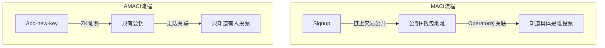

## AMACI 工作原理

AMACI 的核心思想是：**链上加密 + 身份匿名 + 链下处理 + 零知识证明验证**。

### 链上阶段：加密和匿名

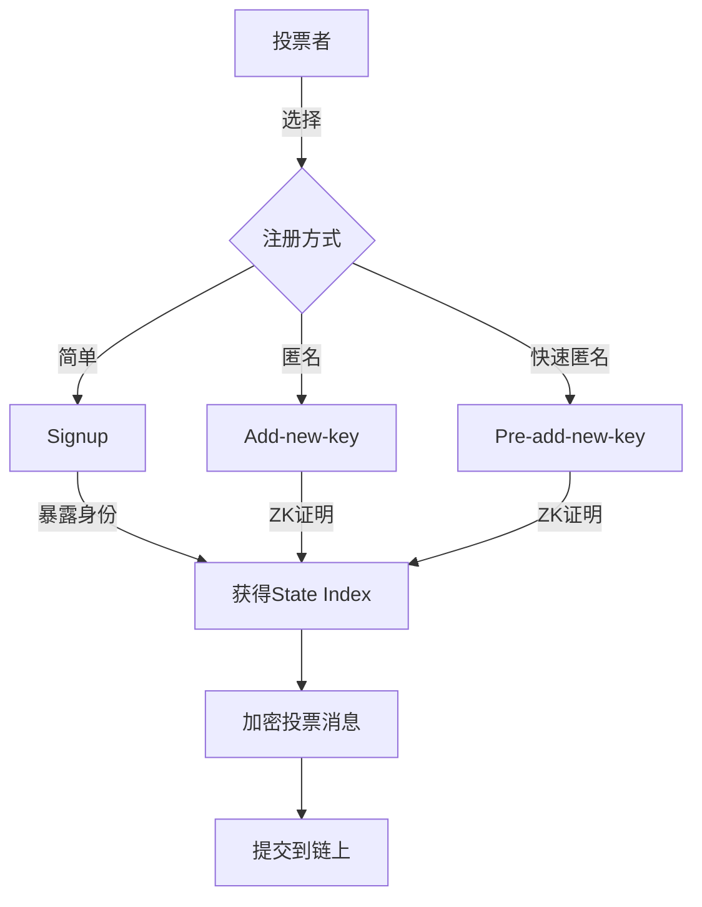

**特点：**
- 投票内容使用 Operator 公钥加密
- 身份通过 ZK 证明匿名化（可选）
- 消息存储在区块链上不可篡改
- 任何人都可以验证消息完整性

### 链下阶段：处理和证明

Operator 在链下处理消息并生成证明：

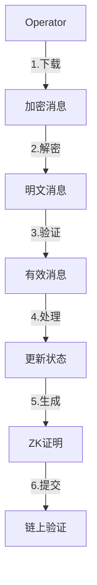

**特点：**
- Operator 能看到投票内容
- 但无法确定具体是谁（使用 add-new-key 时）
- 零知识证明确保处理正确性
- 无法篡改或隐藏投票

## AMACI 生命周期

一个完整的 AMACI 投票轮次包含以下阶段：

### 1. 准备阶段

**目标：** 设置投票环境和 Operator

**操作：**
- Operator 注册到 Registry（许可制，由 Dora Factory 管理）
- Operator 生成密钥对并公布公钥
- 可选：配置 pre-deactivate root（用于 pre-add-new-key）

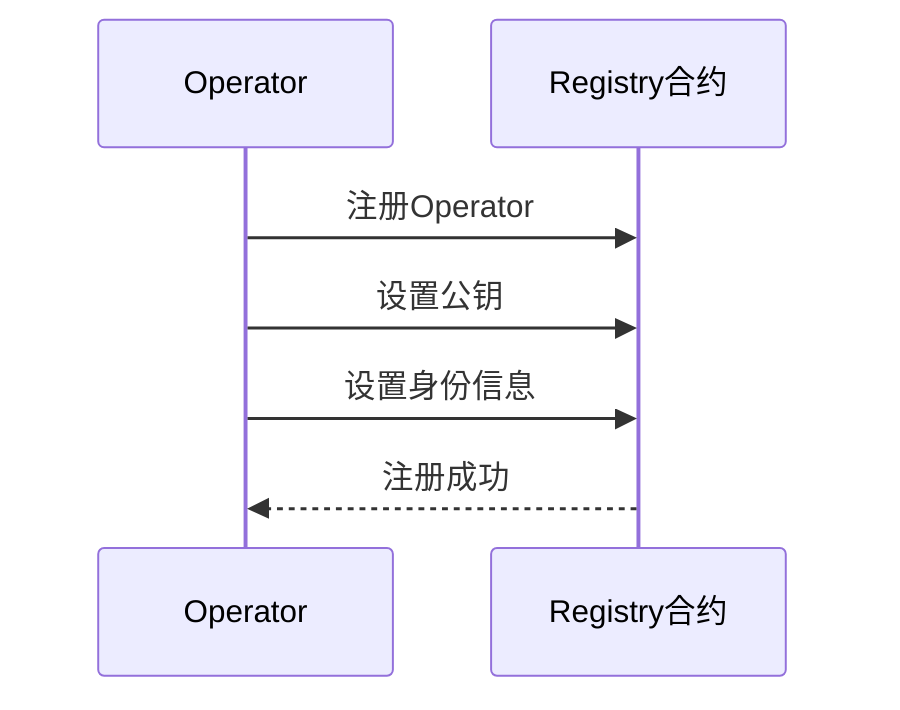

### 2. 创建阶段

**目标：** 用户创建投票轮次

**操作：**
- 用户选择一个已注册的 Operator
- 配置投票参数（选项、时间、白名单等）
- 通过 Registry 一键创建 AMACI 合约实例
- 支付 Operator 服务费用

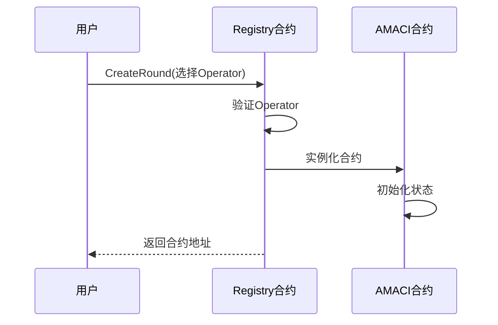

### 3. 注册阶段

**目标：** 投票者选择注册方式

AMACI 提供三种注册方式，用户可根据隐私需求选择：

**方式 1: Signup（标准，快速）**

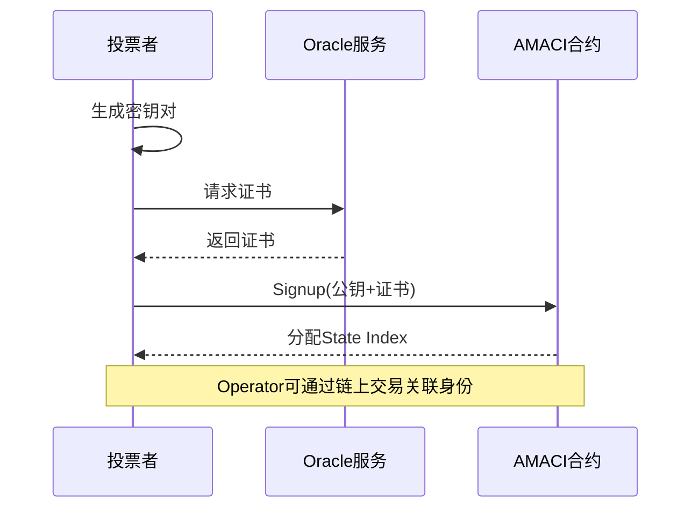

**方式 2: Add-new-key（匿名，需等待）**

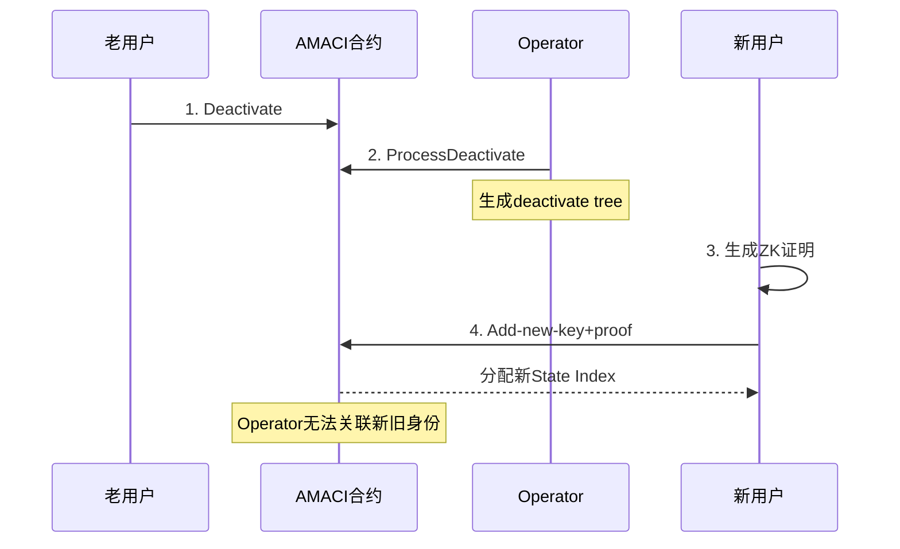

**方式 3: Pre-add-new-key（匿名，即时）**

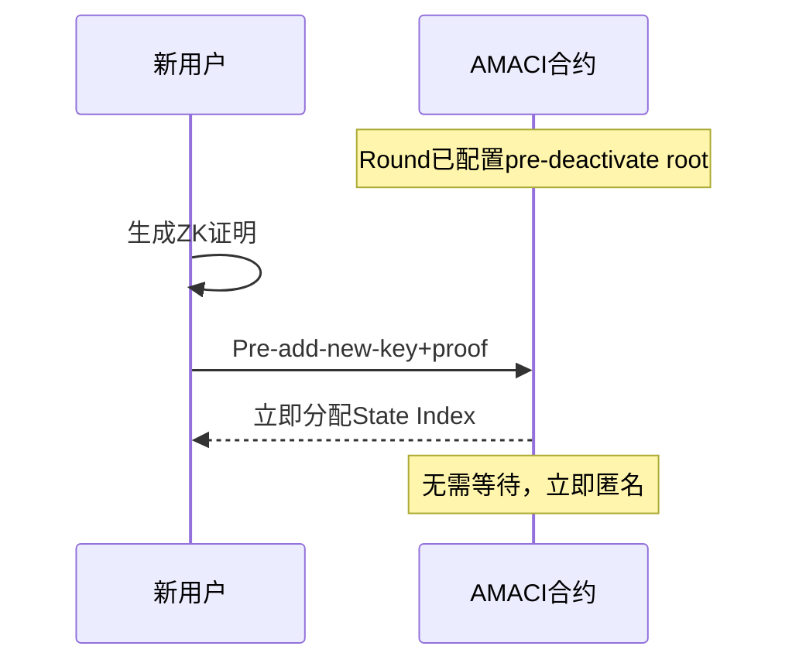

### 4. 投票阶段

**目标：** 投票者提交加密的投票消息

**操作：**
- 投票者创建投票消息（选项 + 权重）
- 使用 Operator 公钥加密消息
- 使用自己的私钥签名
- 提交加密消息到链上
- 可以多次投票覆盖之前的投票

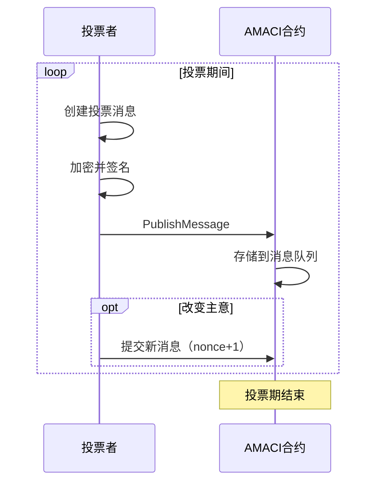

**匿名性：**
- 使用 signup：Operator 知道是谁投的
- 使用 add-new-key：Operator 只知道有人投票，不知道是谁

### 5. 处理阶段（AMACI 特色）

AMACI 的处理分为两步：**Process Deactivate**（可选）→ **Process Messages**

#### 步骤 5.1: Process Deactivate（AMACI 独有）

**目标：** 生成 deactivate tree，为 add-new-key 做准备

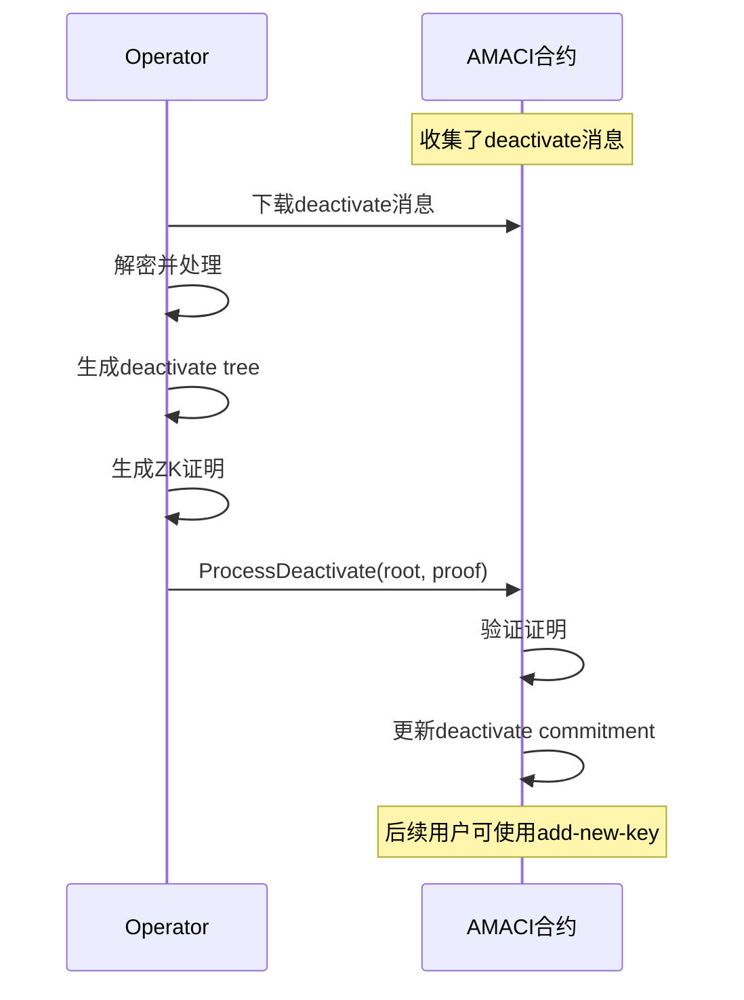

**重要性：**
- 只有处理了 deactivate，才能使用 add-new-key
- 为身份匿名化提供基础
- Operator 生成的 deactivate tree 是匿名集

#### 步骤 5.2: Process Messages

**目标：** 处理投票消息并生成证明

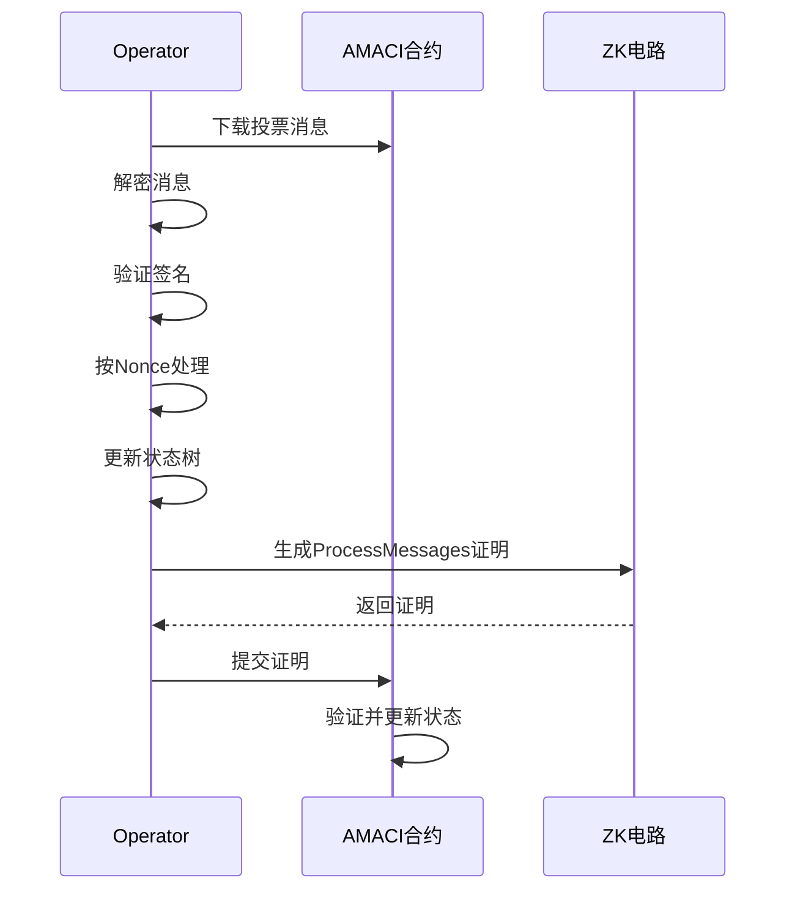

**AMACI 的特殊性：**
- State Leaf 包含 d1, d2 字段（用于 add-new-key）
- 需要维护 active state tree 和 deactivate tree
- 电路更复杂，但隐私性更强

#### 步骤 5.3: Process Tally

**目标：** 统计结果并生成证明

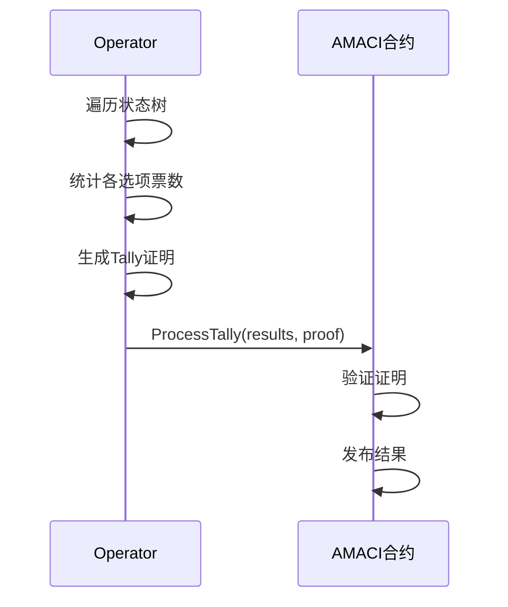

### 6. 验证和结果阶段

**目标：** 链上验证证明并公布结果

**自动化处理：**
- AMACI 合约自动验证 Operator 提交的证明
- 验证通过后更新状态根
- 发布最终投票结果
- 任何人都可以验证证明有效性

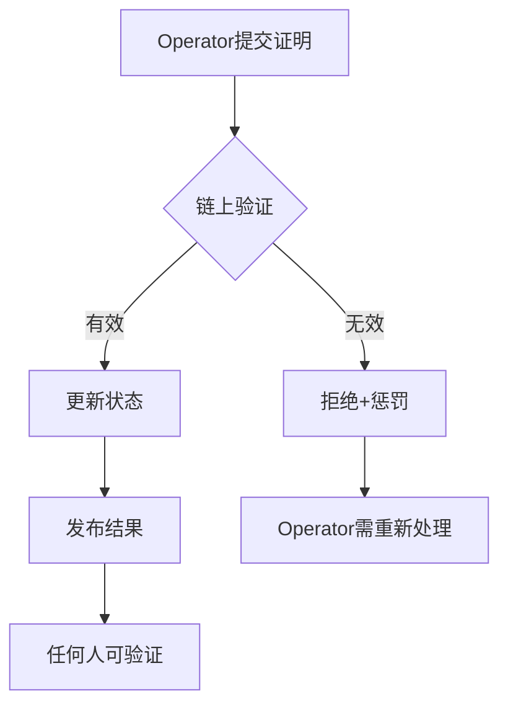

**用户视角：**
- 用户只需等待
- Operator 自动完成所有处理
- 收到结果通知（如果配置）
- 可查询验证结果

## 参与角色

AMACI 系统中有三个关键角色：

### 投票者（Voter）

**职责：**
- 生成和管理密钥对
- 选择注册方式（signup / add-new-key / pre-add-new-key）
- 提交加密投票消息
- 可选：deactivate 为他人创建匿名身份

**能力：**
- 查看自己的公钥和状态索引
- 多次投票修改选择
- 使用 add-new-key 创建匿名身份
- 验证投票是否被包含

**隐私选择：**
- 使用 signup：快速但 Operator 知道身份
- 使用 add-new-key：完全匿名但需要等待
- 使用 pre-add-new-key：完全匿名且即时

### Operator（协调者）

**职责：**
- 注册到 Registry 成为 Operator
- 生成密钥对并公布公钥
- 下载和解密投票消息
- 处理 deactivate 消息（AMACI 独有）
- 处理投票消息并更新状态树
- 生成零知识证明
- 提交证明到链上

**能力：**
- 可以解密所有投票消息内容
- 可以看到每个 State Index 的投票

**无法做到（AMACI 保护）：**
- ❌ 无法确定 State Index 对应哪个钱包地址（使用 add-new-key 时）
- ❌ 无法关联 add-new-key 的新旧身份
- ❌ 无法进行针对性的贿赂或报复

**限制（ZK 证明约束）：**
- 不能伪造投票消息
- 不能修改投票内容
- 不能忽略或隐藏投票
- 不能改变处理顺序（必须按 Nonce）
- 必须正确统计结果

**专业网络：**
- 许可制，由 Dora Factory 管理
- 查看列表：https://vota.dorafactory.org/operators
- 有奖罚机制保证服务质量
- 用户只需选择 Operator，无需自己运行

### 智能合约

**职责：**
- 存储加密的投票消息
- 管理投票者状态
- 验证零知识证明
- 发布投票结果

**能力：**
- 验证投票者的签名
- 验证白名单资格
- 验证零知识证明
- 强制执行投票规则

**限制：**
- 不能解密投票消息
- 不能直接统计投票结果
- 依赖 Coordinator 提交证明

## AMACI 状态管理

AMACI 使用多个 Merkle Tree 来管理投票者状态：

### 状态树（State Tree）

AMACI 的状态树比 MACI 更复杂，包含额外的匿名化字段：

```
                   Root
                  /    \
                /        \
              /            \
         [Leaf 0]       [Leaf 1]
         (User A)       (User B)
         
AMACI State Leaf 包含：
- 公钥（Public Key）
- 余额（Voice Credits Balance）
- 投票树根（Vote Option Tree Root）
- Nonce（消息序号）
- d1[2]（用于 add-new-key 的匿名化数据）
- d2[2]（用于 add-new-key 的匿名化数据）
```

**AMACI vs MACI State Leaf：**

| 字段 | MACI | AMACI |
|------|------|-------|
| pubKey | ✅ | ✅ |
| voiceCreditBalance | ✅ | ✅ |
| voteOptionTreeRoot | ✅ | ✅ |
| nonce | ✅ | ✅ |
| d1[2] | ❌ | ✅（add-new-key用） |
| d2[2] | ❌ | ✅（add-new-key用） |

**d1, d2 的作用：**
- 用于 rerandomization（重新随机化）
- 使得 add-new-key 可以证明身份但不透露具体是谁
- 包含加密的去活化标志

### Deactivate Tree（AMACI 独有）

用于 add-new-key 机制的匿名集：

```
            Deactivate Root
              /          \
            /              \
      [Deactivate 0]  [Deactivate 1]
      [c1,c2,hash]    [c1,c2,hash]
```

**结构：**
- 每个 deactivate 消息对应一个 leaf
- Leaf = [c1[0], c1[1], c2[0], c2[1], sharedKeyHash]
- c1, c2 是加密的去活化标志
- sharedKeyHash = hash(ecdh(userPrivKey, coordPubKey))

**匿名性：**
- 树中有 N 个条目
- Add-new-key 用户是这 N 个用户之一
- Operator 无法确定具体是哪一个
- 匿名集大小 = N

### Active State Tree（AMACI 独有）

跟踪哪些用户已经去活化：

```
            Active State Root
              /          \
            /              \
         [0 = active]  [5 = deactivated]
```

**作用：**
- 记录每个 State Index 的去活化状态
- 在 Process Deactivate 时更新
- 防止已去活化用户继续投票

### 投票选项树（Vote Option Tree）

每个投票者有一个投票选项树，记录对每个选项的投票：

```
       VO Root
        /    \
      /        \
   [Option 0] [Option 1]
   (5 votes)  (3 votes)
```

**特点：**
- 记录每个选项的投票权重
- 更新投票时只修改相关选项
- 树根存储在状态树的 Leaf 中

### 消息树（Message Tree）

所有投票消息组成一个 Merkle Tree：

```
                Message Root
                  /      \
                /          \
         [Message 0]    [Message 1]
         (User A Vote)  (User B Vote)
```

**特点：**
- 按提交顺序组织消息
- 消息树根用于验证所有消息被处理
- 保证消息的完整性和顺序

## 关键机制

### Nonce 机制

Nonce 是每个投票者的消息序号：

- 初始 Nonce = 0
- 每处理一条有效消息，Nonce +1
- 只有 Nonce 正确的消息才会被处理
- Nonce 确保消息按正确顺序处理

**示例：**

```
用户 A 提交了 3 条消息：
- 消息 1: nonce=0 (处理, 新 nonce=1)
- 消息 2: nonce=1 (处理, 新 nonce=2)
- 消息 3: nonce=1 (无效, nonce 已过期)
```

### 密钥更改机制

投票者可以更改密钥来使之前的投票失效：

1. 投票者用旧密钥 K1 投票
2. 投票者提交消息更改密钥为 K2
3. 状态 Leaf 中的公钥更新为 K2
4. 后续消息必须用 K2 签名
5. 用 K1 签名的消息变为无效

**防止贿选：**
- 贿赂者要求用 K1 投票给选项 A
- 投票者提供用 K1 投的票的证明
- 投票者秘密更改密钥为 K2
- 投票者用 K2 重新投给选项 B
- 最终只有选项 B 的投票有效

### 消息加密

投票消息使用 ECDH 和 Poseidon 加密：

1. **ECDH 密钥交换**：
   - 投票者私钥 × Coordinator 公钥 = 共享密钥
   - Coordinator 私钥 × 投票者公钥 = 相同共享密钥

2. **Poseidon 加密**：
   - 使用共享密钥派生加密密钥
   - 使用 Poseidon 加密消息字段

3. **EdDSA 签名**：
   - 对消息哈希签名
   - 证明消息来自投票者

## 安全保证

MACI 提供以下安全保证：

### 隐私保证

✅ **投票内容隐私**：只有 Coordinator 能看到投票内容  
✅ **投票者匿名性**：可以使用 AMACI 增强匿名性  
✅ **不可关联性**：密钥更改打破投票关联  

### 完整性保证

✅ **不可伪造**：所有消息必须有有效的 EdDSA 签名  
✅ **不可篡改**：消息存储在区块链上  
✅ **正确处理**：零知识证明确保 Coordinator 正确处理  

### 抗串谋保证

✅ **防止贿选**：密钥更改使投票证明无效  
✅ **防止强制**：可以重新投票  
✅ **无法证明投票**：投票者无法向第三方证明最终投票  

## 下一步

现在您已经了解了 AMACI 协议的整体架构，接下来可以深入学习：

- 🔑 [核心概念](/docs/protocol/core-concepts) - 详细了解三种注册方式和状态管理
- 🔐 [隐私保护](/docs/protocol/privacy-protection) - 理解 AMACI 的身份解耦机制
- 📨 [消息流程](/docs/protocol/message-flow) - 理解消息的生成和处理
- 🏗️ [合约架构](/docs/contracts/architecture) - 了解合约设计和 Operator 网络
