# AMACI 隐私保护机制

AMACI 通过多层密码学机制和创新的身份解耦设计来保护投票隐私和防止串谋。本节详细介绍 AMACI 的隐私保护机制，特别是其核心创新：**身份匿名化**。

## 隐私威胁模型

### 传统链上投票的问题

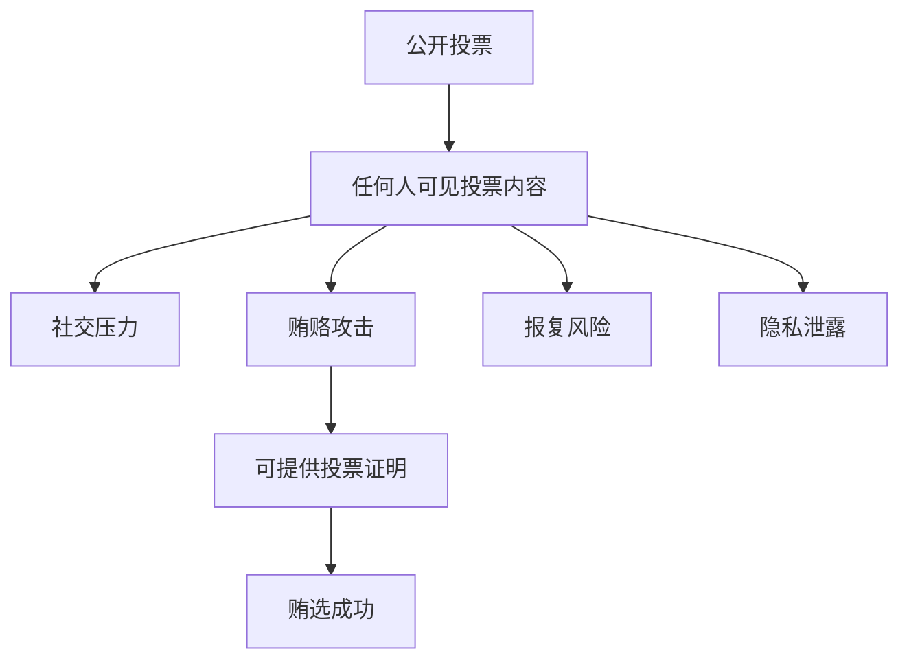

**具体威胁：**

1. **投票内容公开**：所有人都能看到谁投给了谁
2. **可证明投票**：投票者可以向第三方证明自己的投票
3. **强制投票**：攻击者可以强制投票者投特定选项
4. **贿选交易**：投票者可以出售投票权
5. **社交压力**：投票可能受到同伴压力影响
6. **Operator 串谋**（新威胁）：即使投票加密，Operator 也可能通过身份关联进行针对性攻击

### MACI 的局限

MACI 虽然提供了投票内容加密，但仍有身份隐私问题：

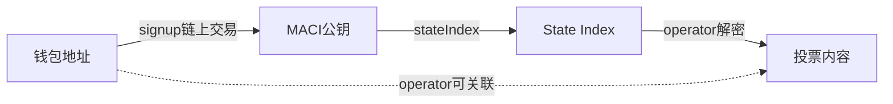

**Operator 可以做到：**
- 通过 signup 交易记录：`dora1abc... → pubkey 0x123...`
- 通过合约查询：`pubkey 0x123... → State Index 5`
- 通过解密消息：`State Index 5 → 投给选项 A`
- **结论：** `钱包 dora1abc... 投给了选项 A`
- **风险：** Operator 可以进行针对性的贿赂或报复

## AMACI 的隐私保护层次

AMACI 提供多层隐私保护，最核心的是**身份匿名化**：

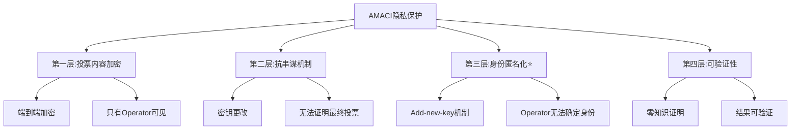

## 第一层：加密保护

### 端到端加密

投票消息从投票者到 Coordinator 是端到端加密的：

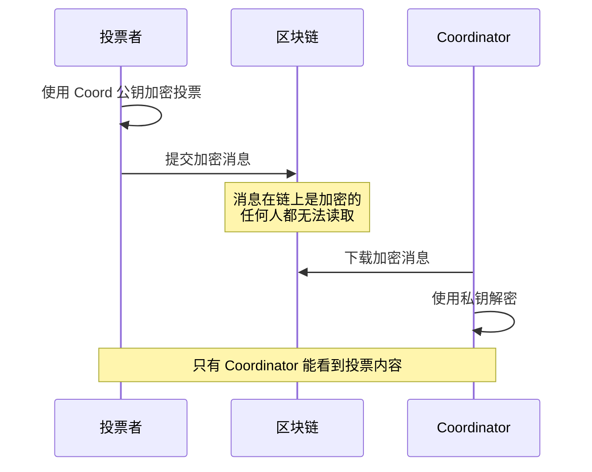

**实现细节：**

```typescript
// 投票者端加密
function encryptVote(
  vote: Vote,
  voterPrivateKey: bigint,
  coordinatorPublicKey: Point
): EncryptedMessage {
  // 1. ECDH 密钥交换
  const sharedSecret = ecdh(voterPrivateKey, coordinatorPublicKey);
  
  // 2. 使用 Poseidon 加密
  const encrypted = poseidonEncrypt(vote, sharedSecret);
  
  return encrypted;
}

// Coordinator 端解密
function decryptVote(
  encrypted: EncryptedMessage,
  coordinatorPrivateKey: bigint,
  voterPublicKey: Point
): Vote {
  // 1. ECDH 密钥交换（生成相同的共享密钥）
  const sharedSecret = ecdh(coordinatorPrivateKey, voterPublicKey);
  
  // 2. 使用 Poseidon 解密
  const vote = poseidonDecrypt(encrypted, sharedSecret);
  
  return vote;
}
```

### 投票内容隐私

加密确保了以下隐私保护：

**✓ 投票选项隐私**
- 投票给哪个选项保持加密
- 链上观察者无法得知

**✓ 投票权重隐私**
- 投了多少票保持加密
- 只有 Coordinator 知道

**✓ 投票历史隐私**
- 更改投票的历史保持加密
- 无法关联多次投票

### 加密的局限性

需要注意的是，加密只能保护投票内容不被**除 Coordinator 外的人**看到：

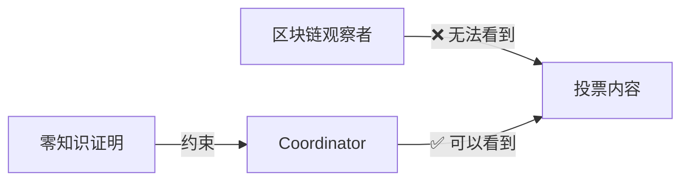

**信任假设：**
- Coordinator 可以看到所有投票内容
- Coordinator 不会泄露个人投票信息
- Coordinator 受零知识证明约束，不能篡改投票

## 第二层：抗串谋机制

### 密钥更改机制

MACI 的核心抗串谋功能是允许投票者随时更改密钥：

#### 工作原理

```typescript
// 初始状态
const state = {
  pubKey: oldPubKey,
  nonce: 0
};

// 用户用旧密钥投票
submitVote({
  keypair: oldKeypair,
  nonce: 0,
  option: 'A'
});
// 状态: nonce = 1

// 用户更改密钥
submitKeyChange({
  keypair: oldKeypair,
  nonce: 1,
  newPubKey: newPubKey
});
// 状态: pubKey = newPubKey, nonce = 2

// 用新密钥重新投票
submitVote({
  keypair: newKeypair,
  nonce: 2,
  option: 'B'
});
// 状态: nonce = 3

// 处理时，只有最后用 newKeypair 签名的投票有效
```

#### 防止贿选

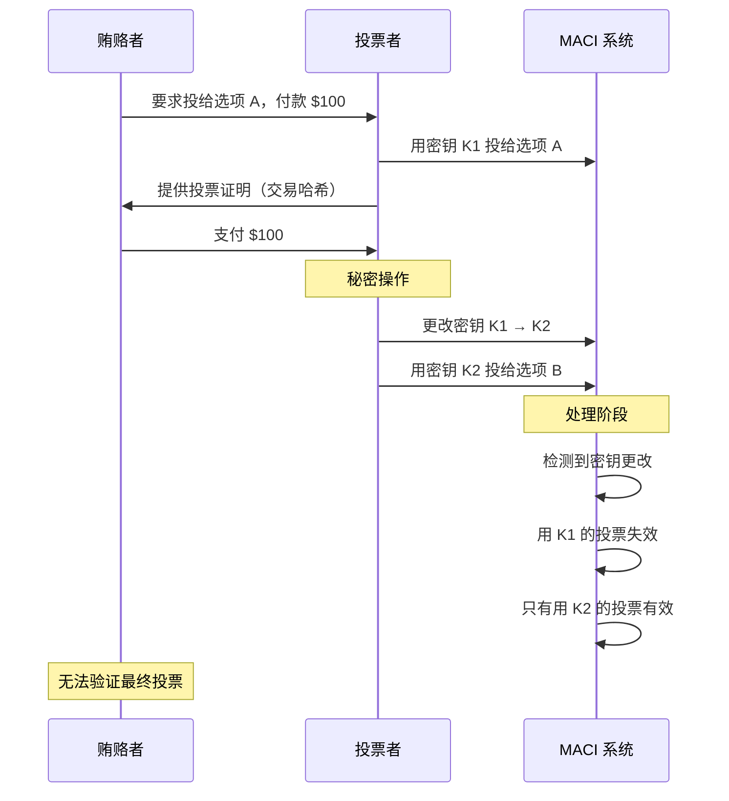

#### 防止强制投票

类似地，如果有人强制投票者投特定选项：

```typescript
// 在强制下投票
await vote({ 
  option: 'A',  // 强制者要求的选项
  keypair: keypair1 
});

// 之后安全地更改投票
await changeKey({ 
  oldKeypair: keypair1,
  newKeypair: keypair2 
});

await vote({ 
  option: 'B',  // 真正想投的选项
  keypair: keypair2 
});

// 强制者无法知道最终投票是否有效
```

### 无法证明投票

由于密钥可以更改，投票者**无法向第三方证明**其最终投票：

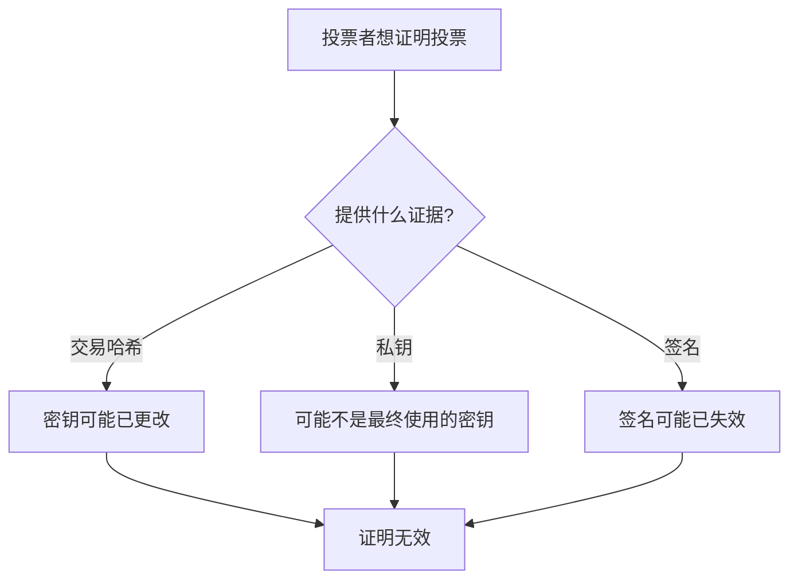

**示例对话：**

```
贿赂者: "证明你投给了选项 A"
投票者: "这是交易哈希: 0x123..."
贿赂者: "如何证明你没有之后更改密钥？"
投票者: "..." (无法证明)

贿赂者: "给我看你的私钥"
投票者: "这是私钥: 0xabc..."
贿赂者: "如何证明这是最终使用的私钥？"
投票者: "..." (无法证明，可能已生成新私钥)
```

### 可重复投票

投票者可以多次投票，后面的投票覆盖前面的：

```typescript
// 第一次投票
await vote({ option: 0, weight: 5, nonce: 0 });

// 改变主意
await vote({ option: 1, weight: 5, nonce: 1 });

// 再次改变主意
await vote({ option: 2, weight: 5, nonce: 2 });

// 处理时，只有最后一次投票（选项 2）有效
```

这提供了额外的抗串谋保护：
- 在压力下投票后可以重新投票
- 可以纠正错误
- 可以改变主意

## 第三层：身份匿名化（AMACI 核心创新）⭐

这是 AMACI 相对于 MACI 最重要的改进。

### 问题：Operator 身份关联

在 MACI 中，虽然投票内容对公众加密，但 Operator 可以关联身份：

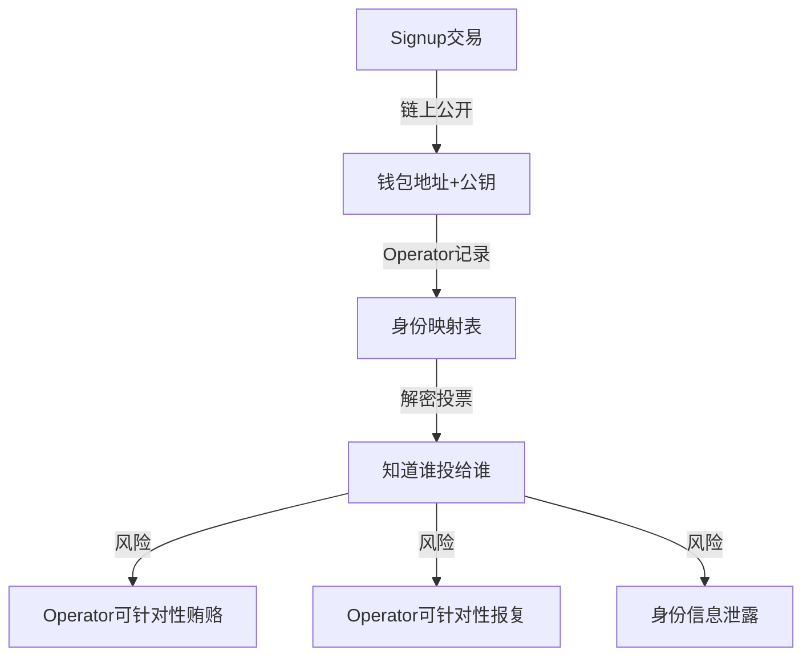

**实例：**

```typescript
// MACI 中 Operator 可以看到：
{
  signup_tx: {
    sender: "dora1abc...",
    pubkey: "0x123..."
  },
  state_mapping: {
    "0x123...": 5  // State Index
  },
  votes: {
    5: { option: "A", weight: 10 }  // 解密后
  }
}

// 结论：dora1abc... 投给了选项 A，10票
// Operator 可以针对性联系 dora1abc...
```

### AMACI 解决方案：Add-new-key

**核心机制：** 使用零知识证明断开身份关联

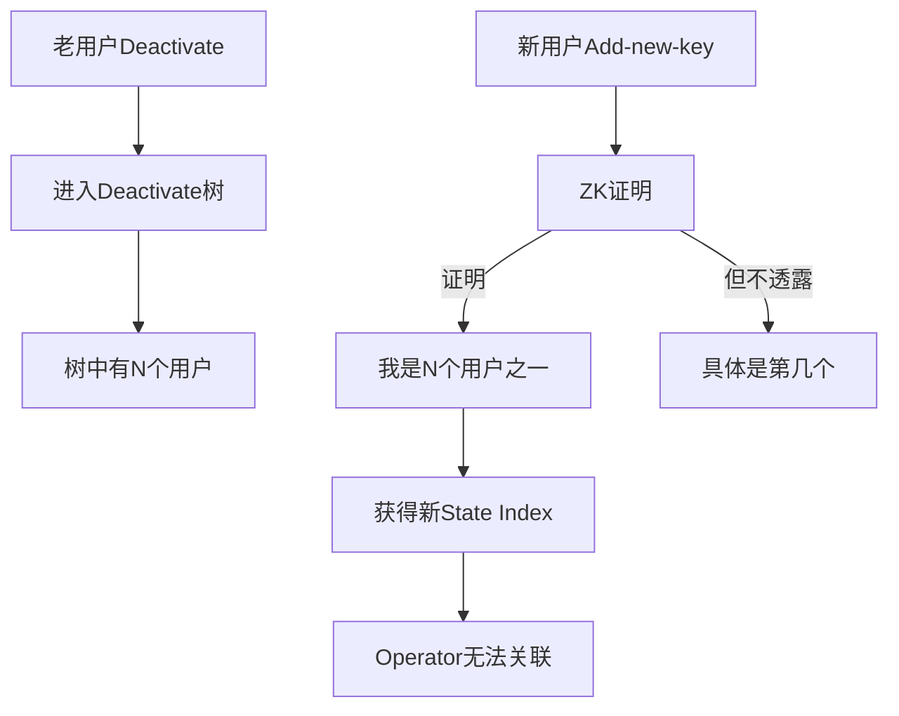

**工作流程：**

**步骤 1: 建立匿名集**

```typescript
// 多个用户deactivate，建立匿名集
await user1.deactivate({ contractAddress });
await user2.deactivate({ contractAddress });
// ... 更多用户
await userN.deactivate({ contractAddress });

// Operator处理deactivate消息
await operator.processDeactivate({...});

// 生成 deactivate tree，包含 N 个条目
```

**步骤 2: 使用匿名身份**

```typescript
// 任意一个已deactivate的用户（比如user5）
// 可以用新钱包创建新身份

// 生成ZK证明
const proof = await user5.buildAddNewKeyPayload({
  operatorPubkey,
  deactivates: deactivateTreeData,  // N个条目
  wasmFile,
  zkeyFile
});

// 使用新钱包提交
await client.addNewKey({
  signer: newWallet,  // 全新的钱包！
  contractAddress,
  proof: proof.proof,
  d: proof.d,
  nullifier: proof.nullifier,
  newMaciKeypair: newKeypair
});
```

**ZK 证明的关键：**

```
公开输入（Operator看得到）：
  - deactivateRoot: 树的根
  - nullifier: 防重放标识
  - d1, d2: 重新随机化的值

私有输入（不公开）：
  - oldPrivateKey: 老用户的私钥
  - deactivateIndex: 是第几个用户 <-- 关键！不公开
  - merkleProof: 证明在树中的路径

证明内容：
  "我知道deactivate树中某个条目对应的私钥，
   并且正确计算了d1, d2，
   但我不告诉你是第几个条目"
```

### Operator 视角分析

**MACI 中（可关联）：**

```
Operator的完整信息链：
1. 链上signup交易：
   sender = dora1abc...
   pubkey = 0x123...
   
2. 合约查询：
   pubkey 0x123... → State Index 5
   
3. 解密投票消息：
   State Index 5 → 投给选项A，权重10

完整链条：
dora1abc... → 0x123... → State Index 5 → 投了选项A
                 ↑                           ↑
            可以关联                    可以解密看到

风险：Operator可以联系dora1abc...进行贿赂/报复
```

**AMACI 中（无法关联）：**

```
Operator的有限信息：
1. 链上add-new-key交易：
   sender = dora1xyz...      // 可能是新钱包
   proof = ZK证明            // 不透露老身份
   nullifier = ...
   d = [d1, d2]
   newPubkey = 0x456...
   
2. 合约查询：
   pubkey 0x456... → State Index 8
   
3. 解密投票消息：
   State Index 8 → 投给选项A，权重10
   
4. ZK证明信息：
   新用户是deactivate树中N个用户之一
   但不知道是第几个

断裂的链条：
dora1xyz... → ??? → State Index 8 → 投了选项A
                ↑
        无法关联原始身份
        
如果deactivate树有100个用户：
Operator只知道："是这100人之一"
Operator不知道："具体是谁"

匿名集大小 = 100
风险降低：Operator无法确定攻击目标
```

### 身份解耦的数学原理

**Rerandomization（重新随机化）：**

AMACI 使用 ElGamal 加密的 rerandomization 特性：

```typescript
// 老用户的加密去活化标志
const encrypted = {
  c1: oldC1,  // 加密点1
  c2: oldC2   // 加密点2
};

// 重新随机化
const randomVal = genRandomScalar();
const d1 = c1 + randomVal * operatorPubKey;
const d2 = c2 + randomVal * basePoint;

// d1, d2 看起来与 c1, c2 完全不同
// 但解密结果相同
// 并且可以用ZK证明：d1, d2 是从 c1, c2 rerandomize来的
```

**为什么无法关联：**

```
Operator看到的d1, d2在数学上：
- 与原始的c1, c2不同（加了随机数）
- 无法直接反推是哪个原始条目
- 即使枚举所有可能，也无法确定
- 除非解 ECDH 离散对数问题（计算上不可行）
```

## 第四层：可验证隐私

### 零知识证明的作用

零知识证明确保 Coordinator 正确处理投票，同时不泄露个人投票：

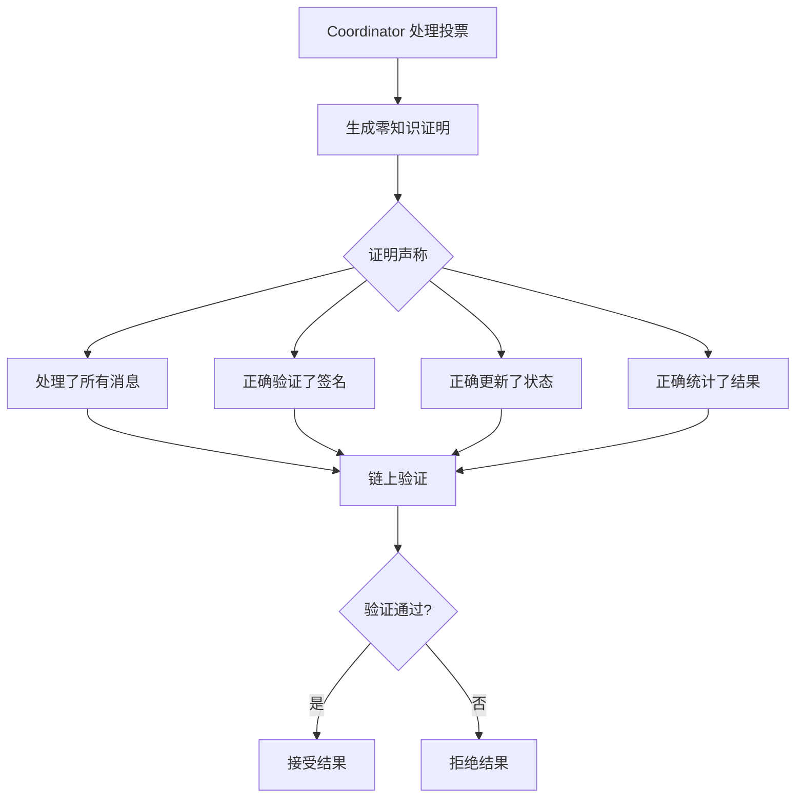

### 隐私与可验证性的平衡

```typescript
// 零知识证明公开的信息
const publicInputs = {
  coordinatorPubKey: [...],    // Coordinator 的公钥
  messageRoot: "0x...",        // 消息 Merkle 根
  oldStateRoot: "0x...",       // 处理前的状态根
  newStateRoot: "0x...",       // 处理后的状态根
  tallyResults: [10, 25, 15],  // 聚合的投票结果
};

// 零知识证明隐藏的信息
const privateInputs = {
  coordinatorPrivKey: "...",   // Coordinator 私钥
  individualVotes: [...],      // 每个人的投票
  signatures: [...],           // 所有签名
  decryptedMessages: [...],    // 解密后的消息
};

// 证明声称：
// "我知道 privateInputs，使得当使用它们处理时，
//  可以从 oldStateRoot 得到 newStateRoot，
//  并且最终结果是 tallyResults"
```

### 可公开验证

任何人都可以验证零知识证明：

```typescript
// 链上验证函数
function verifyProof(
  proof: Proof,
  publicInputs: PublicInputs
): boolean {
  // 使用验证密钥验证证明
  return groth16Verify(
    proof,
    publicInputs,
    verificationKey
  );
}

// 任何人都可以调用
const isValid = await contract.verifyProcessMessagesProof(proof);
console.log("证明有效:", isValid);
```

## 隐私保护的权衡

### 信任假设

MACI 的隐私保护依赖于以下信任假设：

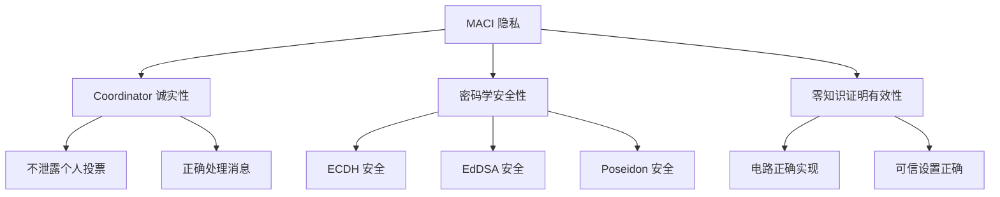

**关键信任点：**

1. **Coordinator 可见性**：Coordinator 能看到所有投票内容
2. **活性依赖**：Coordinator 可能拒绝处理消息
3. **密码学假设**：依赖 ECDH、EdDSA 等的安全性

### 与完全隐私的对比

| 特性 | MACI | 完全隐私系统 | 传统投票 |
|------|------|-------------|---------|
| 投票内容隐私 | ✅ 对公众隐私 | ✅ 对所有人 | ❌ 完全公开 |
| Coordinator 可见 | ⚠️ 可见 | ✅ 不可见 | N/A |
| 抗串谋 | ✅ 是 | ⚠️ 可能不够 | ❌ 否 |
| 结果可验证 | ✅ 是 | ✅ 是 | ✅ 是 |
| 效率 | ✅ 高 | ⚠️ 低 | ✅ 高 |

MACI 做出了务实的权衡：
- **牺牲**：Coordinator 可以看到投票（但受约束）
- **获得**：强抗串谋性和实用性

### 未来改进方向

可以通过以下方式减少对 Coordinator 的信任：

**1. 多方计算（MPC）**

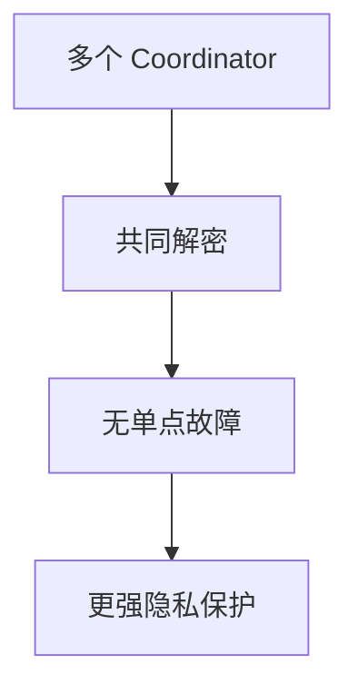

**2. 阈值加密**

```typescript
// 需要 t-of-n 个 Coordinator 才能解密
const encryptedVote = thresholdEncrypt(
  vote,
  coordinatorPubKeys,  // n 个公钥
  threshold  // t
);

// 至少 t 个 Coordinator 合作才能解密
```

**3. 可验证延迟函数（VDF）**

- 在投票期间无法解密
- 投票结束后自动可解密
- 减少实时串谋风险

## AMACI 实际应用场景

### 场景 1: 防止 Operator 贿赂

**攻击模型：** Operator 想通过贿赂影响投票结果

**MACI 中：**
```
Operator 知道：
- dora1abc... 是 State Index 5
- State Index 5 投给了选项 A

Operator 可以：
- 直接联系 dora1abc...
- 提供金钱换取改投选项 B
- 或者威胁如果不改投就报复
```

**AMACI 中（使用 add-new-key）：**
```
Operator 知道：
- State Index 8 投给了选项 A
- State Index 8 是通过 add-new-key 创建的
- 是 deactivate 树中 100 个用户之一

Operator 无法：
- 确定是哪个用户
- 无法联系具体的人
- 无法进行针对性贿赂
```

### 场景 2: 防止链上追踪

**攻击模型：** 第三方通过链上数据分析投票模式

**MACI 中：**
```
链上可见：
Time T1: dora1abc... → signup transaction
Time T2: dora1abc... → vote transaction
Time T3: dora1abc... → vote transaction again

分析结果：
- 可以确定 dora1abc... 的投票行为模式
- 可以进行链上跟踪
```

**AMACI 中（使用 add-new-key）：**
```
链上可见：
Time T1: dora1xyz... → add-new-key transaction (ZK proof)
Time T2: dora1xyz... → vote transaction

分析结果：
- dora1xyz... 可能是全新的钱包
- add-new-key 使用 ZK 证明，无法关联原始身份
- 即使 Operator 也无法追踪
```

### 场景 3: 高价值投票

**场景：** DAO 资金分配投票，金额巨大

**风险：**
- 利益相关方可能贿赂 Operator
- Operator 可能泄露投票者身份
- 针对大额投票者进行攻击

**AMACI 保护：**
```
所有大额投票者使用 add-new-key：
- Operator 知道有多笔大额投票
- 但不知道具体是谁投的
- 无法将信息出售给利益相关方
- 无法进行针对性攻击

即使 Operator 想作恶：
- 无法确定攻击目标
- 信息对外出售也没有价值（不知道是谁）
```

## 隐私级别选择指南

### 何时使用 Signup

**适合场景：**
- 公开的、非争议性的投票
- 社区内部决策（成员互相信任）
- 对速度要求高，不关心隐私

**优势：**
- 最快捷，一步完成
- 无需等待或额外操作

**风险：**
- Operator 知道你的身份和投票

### 何时使用 Add-new-key

**适合场景：**
- 高度敏感的投票
- 大额资金分配
- 可能引起争议的决策
- 担心 Operator 串谋

**优势：**
- 完全匿名，Operator 无法追踪
- 可以使用全新钱包

**需要：**
- 等待 operator 处理 deactivate
- 需要另一个已 deactivate 的身份
- 需要生成 ZK 证明

### 何时使用 Pre-add-new-key

**适合场景：**
- Round 创建时已配置 pre-deactivate root
- 需要匿名且要求快速
- 预先知道需要匿名投票

**优势：**
- 完全匿名
- 立即可用，无需等待

**需要：**
- Round 必须预先配置
- 需要获取预配置的 deactivate 数据

## 实际隐私保护建议

### 对于投票者

**根据场景选择注册方式：**

```typescript
// 低风险投票：快速 signup
await client.signup({...});

// 高风险投票：使用 add-new-key
// 1. 先用老账户 deactivate
await oldAccount.deactivate({...});
// 2. 等待处理
// 3. 用新账户 add-new-key
await newAccount.addNewKey({...});

// 预配置的高隐私投票：pre-add-new-key
await newAccount.rawPreAddNewKey({...});
```

**✓ 使用专用钱包（高隐私场景）**
```typescript
// add-new-key 时使用全新钱包
// 与主钱包完全隔离
const newWallet = await DirectSecp256k1Wallet.generate();
```

**✓ 不要在链上关联身份**
```typescript
// 避免从主钱包转账到投票钱包
// 避免在同一时间进行相关操作
```

### 对于 Operator

**✓ 不泄露投票者信息**
```typescript
// 只公布聚合结果
// 不讨论个人投票
// 不保留投票者身份记录
```

**✓ 遵循零知识证明约束**
```typescript
// 诚实处理所有消息
// 不篡改投票
// 及时处理 deactivate 和投票消息
```

## 隐私保护级别总结

### AMACI 隐私层次

```
级别 1: 投票内容加密（继承自MACI）
  → 公众无法看到投票内容

级别 2: 密钥更改机制（继承自MACI）
  → 无法证明最终投票

级别 3: 身份匿名化（AMACI核心创新）⭐
  → Operator 无法确定投票者身份

级别 4: 零知识证明（增强）
  → 可验证的隐私保护 + 身份解耦
```

### 威胁防护对比

| 威胁类型 | MACI | AMACI | 说明 |
|---------|------|-------|------|
| 公众窥探投票 | ✅ | ✅ | 加密保护 |
| 普通贿选 | ✅ | ✅ | 密钥更改 |
| 强制投票 | ✅ | ✅ | 可重复投票 |
| Operator关联身份 | ⚠️ | ✅✅ | add-new-key断开 |
| Operator针对性攻击 | ❌ | ✅ | 无法确定目标 |
| Operator泄露身份 | ⚠️ | ✅ | 不知道身份 |
| 链上追踪分析 | ⚠️ | ✅ | ZK证明隐藏 |

### 匿名集大小

**Add-new-key 的匿名性取决于 deactivate 树大小：**

```
Deactivate 树大小 = 10 人
→ Operator 知道是"10人之一"
→ 匿名集较小

Deactivate 树大小 = 100 人
→ Operator 知道是"100人之一"
→ 匿名集中等

Deactivate 树大小 = 1000 人
→ Operator 知道是"1000人之一"
→ 匿名集很大，实际上无法追踪
```

**建议：**
- 高价值投票：鼓励更多人 deactivate，扩大匿名集
- 可以创建"匿名池"：专门用于提供 deactivate 的账户集

## 下一步

现在您已经了解了 AMACI 的隐私保护机制，接下来可以：

- 🔑 [核心概念](/docs/protocol/core-concepts) - 详细了解三种注册方式的实现
- 🏗️ [合约设计](/docs/contracts/architecture) - 了解合约如何实现这些机制
- 💻 [SDK 使用](/docs/sdk/voting-guide) - 使用 SDK 创建隐私保护的投票
- 💡 [示例代码](/docs/examples/basic-voting) - 查看完整的投票示例
