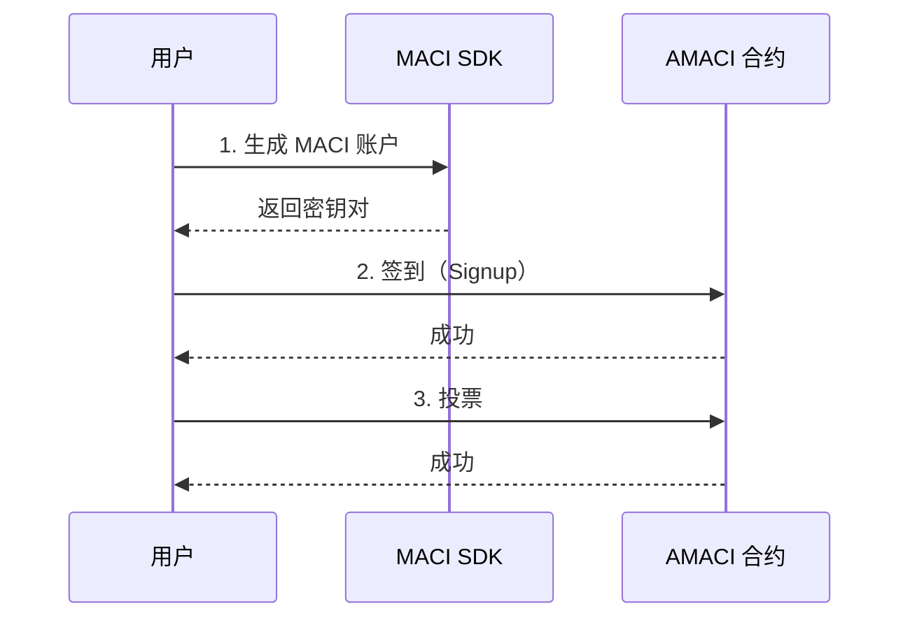
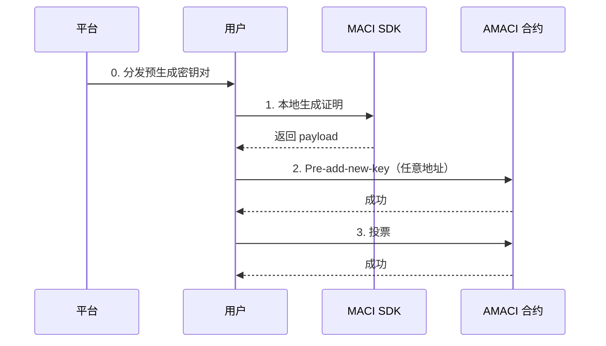

# 投票操作指南

完整的投票流程分为两种方式：白名单模式（3步）和 Pre-add-new-key 匿名模式（4步）。

---

## 方式 1: 白名单模式投票

适用于已在白名单中的用户。

### 完整流程



### 步骤 1: 生成 MACI 账户

```typescript
import { MaciClient } from '@dorafactory/maci-sdk';

const client = new MaciClient({ network: 'testnet' });

// 从 dora 地址衍生 EdDSA-Poseidon 密钥对
const maciKeypair = await client.genKeypairFromSign({
  signer: wallet,
  address
});

console.log('✅ MACI 账户生成成功');
```

### 步骤 2: 签到（仅白名单地址可用）

```typescript
await client.signup({
  signer: wallet,
  address: userAddress,
  contractAddress: amaciContractAddress,
  maciKeypair: maciKeypair,
  gasStation: true  // 使用 Gas Station
});

console.log('✅ 签到成功（地址必须在白名单中）');
```

### 步骤 3: 投票

```typescript
// 获取 Coordinator 公钥
const roundInfo = await client.getRoundInfo({ contractAddress });

const coordinatorPubKey = [
  BigInt(roundInfo.coordinatorPubkeyX),
  BigInt(roundInfo.coordinatorPubkeyY)
];

// 提交投票
await client.vote({
  signer: wallet,
  address: userAddress,
  contractAddress: amaciContractAddress,
  selectedOptions: [
    { idx: 0, vc: 5 },  // 给选项 0 投 5 票
    { idx: 1, vc: 3 },  // 给选项 1 投 3 票
  ],
  operatorCoordPubKey: coordinatorPubKey,
  maciKeypair: maciKeypair,
  gasStation: true
});

console.log('✅ 投票成功');
```

---

## 方式 2: Pre-add-new-key 匿名模式

适用于获得平台分发密钥对的用户，提供最高隐私级别。

### 完整流程



### 步骤 0: 获取平台分发的密钥对

平台通过安全渠道分发：

```json
{
  "privateKey": "0x1234567890abcdef...",
  "publicKey": {
    "x": "0xabcdef...",
    "y": "0x123456..."
  },
  "preDeactivateData": {
    "leaves": [ /* deactivate tree 数据 */ ],
    "coordinatorPubkey": { "x": "...", "y": "..." }
  }
}
```

### 步骤 1: 本地生成证明和新密钥

```typescript
import { VoterClient, genKeypair } from '@dorafactory/maci-sdk';

// 使用平台分发的私钥
const voterClient = new VoterClient({
  network: 'mainnet',
  secretKey: receivedPrivateKey  // 平台分发的
});

// ⭐ 用户生成自己的新密钥对（完全由用户控制）
const myNewKeypair = genKeypair();

console.log('✅ 新密钥已在本地生成，只有我知道');

// 生成 pre-add-new-key payload
const payload = await voterClient.buildPreAddNewKeyPayload({
  stateTreeDepth: 10,
  coordinatorPubkey: preDeactivateData.coordinatorPubkey,
  deactivates: preDeactivateData.leaves,
  wasmFile: '/path/to/addNewKey.wasm',
  zkeyFile: '/path/to/addNewKey.zkey'
});

console.log('✅ ZK 证明在本地生成完成');
```

### 步骤 2: 发送 Pre-add-new-key 交易

```typescript
// ⭐ 可以用任意 dora 地址发送此交易
await client.rawPreAddNewKey({
  signer: anyWallet,  // 任意钱包！
  contractAddress,
  d: payload.d,
  proof: payload.proof,
  nullifier: payload.nullifier,
  newPubkey: {
    x: myNewKeypair.publicKey[0].toString(16),
    y: myNewKeypair.publicKey[1].toString(16)
  },
  gasStation: true
});

console.log('✅ 匿名注册成功');
console.log('✅ Operator 不知道是谁');
```

### 步骤 3: 投票

```typescript
// 用新密钥对投票
const roundInfo = await client.getRoundInfo({ contractAddress });

await client.vote({
  signer: anyWallet,  // 可以用任意钱包
  address: anyAddress,
  contractAddress,
  selectedOptions: [
    { idx: 0, vc: 8 },
    { idx: 1, vc: 6 }
  ],
  operatorCoordPubKey: [
    BigInt(roundInfo.coordinatorPubkeyX),
    BigInt(roundInfo.coordinatorPubkeyY)
  ],
  maciKeypair: myNewKeypair,  // 只有用户知道
  gasStation: true
});

console.log('✅ 投票完成，完全匿名');
```

---

## Gas Station 处理

### 检查 Gas Station 状态

```typescript
async function waitForGasStation(
  client: MaciClient,
  address: string,
  contractAddress: string
): Promise<boolean> {
  let hasFeegrant = false;
  let attempts = 0;
  const maxAttempts = 30;  // 最多等待 1 分钟

  while (!hasFeegrant && attempts < maxAttempts) {
    hasFeegrant = await client.hasFeegrant({
      address,
      contractAddress
    });

    if (!hasFeegrant) {
      console.log(`等待 Gas Station (${attempts + 1}/${maxAttempts})...`);
      await new Promise(resolve => setTimeout(resolve, 2000));
      attempts++;
    }
  }

  return hasFeegrant;
}

// 使用
const hasGasStation = await waitForGasStation(client, address, contractAddress);

if (hasGasStation) {
  console.log('✅ Gas Station 已启用');
} else {
  console.log('⚠️  Gas Station 未启用，将使用自己的 Gas');
}
```

---

## 投票规则

### 1P1V 模式

voice credit 直接作为票数：

```typescript
// 假设用户有 100 voice credits
selectedOptions: [
  { idx: 0, vc: 50 },  // 50 票
  { idx: 1, vc: 30 },  // 30 票
  { idx: 2, vc: 20 },  // 20 票
]
// 总消耗 = 50 + 30 + 20 = 100 voice credits
```

### QV 模式

voice credit 的平方作为消耗：

```typescript
// 假设用户有 100 voice credits
selectedOptions: [
  { idx: 0, vc: 8 },  // 8 票，消耗 64 credits (8²)
  { idx: 1, vc: 6 },  // 6 票，消耗 36 credits (6²)
]
// 总消耗 = 64 + 36 = 100 voice credits
```

---

## 重新投票

用户可以多次投票，后面的投票会覆盖前面的：

```typescript
// 第一次投票
await client.vote({
  selectedOptions: [{ idx: 0, vc: 5 }],
  // ... 其他参数
});

console.log('第一次投票完成');

// 改变主意，重新投票
await client.vote({
  selectedOptions: [{ idx: 1, vc: 5 }],  // 改投选项 1
  // ... 其他参数
});

console.log('重新投票完成');
// 最终只有第二次投票（选项 1）有效
```

---

## 完整示例函数

### 白名单模式完整流程

```typescript
async function whitelistVoting(
  client: MaciClient,
  wallet: any,
  address: string,
  contractAddress: string,
  voteOptions: { idx: number; vc: number }[]
) {
  try {
    // 步骤 1: 生成账户
    console.log('1/3 生成 MACI 账户...');
    const maciKeypair = await client.genKeypairFromSign({ 
      signer: wallet, 
      address 
    });
    
    // 步骤 2: 签到
    console.log('2/3 签到中（需要在白名单中）...');
    await client.signup({
      signer: wallet,
      address,
      contractAddress,
      maciKeypair,
      gasStation: true
    });
    
    // 步骤 3: 投票
    console.log('3/3 投票中...');
    const roundInfo = await client.getRoundInfo({ contractAddress });
    
    await client.vote({
      signer: wallet,
      address,
      contractAddress,
      selectedOptions: voteOptions,
      operatorCoordPubKey: [
        BigInt(roundInfo.coordinatorPubkeyX),
        BigInt(roundInfo.coordinatorPubkeyY)
      ],
      maciKeypair,
      gasStation: true
    });
    
    console.log('✅ 投票流程完成！');
    return true;
  } catch (error) {
    console.error('❌ 投票失败:', error);
    return false;
  }
}
```

### Pre-add-new-key 匿名模式完整流程

```typescript
async function anonymousVoting(
  client: MaciClient,
  receivedPrivateKey: string,
  preDeactivateData: any,
  anyWallet: any,
  anyAddress: string,
  contractAddress: string,
  voteOptions: { idx: number; vc: number }[]
) {
  try {
    // 步骤 1: 本地生成证明
    console.log('1/3 本地生成 ZK 证明...');
    
    const voterClient = new VoterClient({
      network: 'mainnet',
      secretKey: receivedPrivateKey
    });
    
    const myNewKeypair = genKeypair();
    
    const payload = await voterClient.buildPreAddNewKeyPayload({
      stateTreeDepth: 10,
      coordinatorPubkey: preDeactivateData.coordinatorPubkey,
      deactivates: preDeactivateData.leaves,
      wasmFile,
      zkeyFile
    });
    
    console.log('✅ 证明生成完成');
    
    // 步骤 2: Pre-add-new-key
    console.log('2/3 匿名注册中（用任意地址）...');
    await client.rawPreAddNewKey({
      signer: anyWallet,
      contractAddress,
      d: payload.d,
      proof: payload.proof,
      nullifier: payload.nullifier,
      newPubkey: {
        x: myNewKeypair.publicKey[0].toString(16),
        y: myNewKeypair.publicKey[1].toString(16)
      },
      gasStation: true
    });
    
    console.log('✅ 匿名注册成功');
    
    // 步骤 3: 投票
    console.log('3/3 投票中...');
    const roundInfo = await client.getRoundInfo({ contractAddress });
    
    await client.vote({
      signer: anyWallet,
      address: anyAddress,
      contractAddress,
      selectedOptions: voteOptions,
      operatorCoordPubKey: [
        BigInt(roundInfo.coordinatorPubkeyX),
        BigInt(roundInfo.coordinatorPubkeyY)
      ],
      maciKeypair: myNewKeypair,
      gasStation: true
    });
    
    console.log('✅ 匿名投票流程完成！');
    return true;
  } catch (error) {
    console.error('❌ 投票失败:', error);
    return false;
  }
}
```

---

## 常见问题

### Q: 如何计算我能投多少票？

**A:** 取决于投票模式和您的 voice credits：

```typescript
// 1P1V 模式
const maxVotes = voiceCredits;  // 100 credits = 100 票

// QV 模式  
const maxVotes = Math.floor(Math.sqrt(voiceCredits));  // 100 credits = 10 票
```

### Q: 白名单模式和匿名模式如何选择？

**A:** 根据隐私需求：

- **白名单模式**：简单快速，但 Operator 知道你的身份
- **匿名模式**：完全匿名，Operator 不知道具体是谁，推荐用于隐私投票

### Q: 投票失败了怎么办？

**A:** 检查以下几点：

1. 是否在投票期内
2. 白名单模式：地址是否在白名单中
3. 匿名模式：是否有平台分发的密钥
4. voice credits 是否足够
5. Gas Station 是否已启用（如果使用）

### Q: 可以同时投给多个选项吗？

**A:** 可以！在 `selectedOptions` 数组中添加多个选项：

```typescript
selectedOptions: [
  { idx: 0, vc: 5 },
  { idx: 1, vc: 3 },
  { idx: 2, vc: 2 }
]
```

### Q: 如何撤销投票？

**A:** 重新投票并将所有权重设为 0，或投给其他选项。

---

## 隐私级别对比

| 模式 | Operator 知道身份 | 链上追踪难度 | 隐私级别 | 适用场景 |
|------|----------------|------------|---------|---------|
| 白名单 Signup | ✅ 是 | 容易 | ⭐⭐ | 简单投票 |
| Pre-add-new-key | ❌ 否 | 极难 | ⭐⭐⭐⭐⭐ | 匿名投票 |

---

## 下一步

完成投票后，您可以：

- 🔍 [查询 API](/docs/sdk/query-api) - 查询投票信息和结果
- 💡 [查看示例](/docs/examples/basic-voting) - 完整的投票示例
- 🚀 [了解高级功能](/docs/sdk/advanced) - 探索更多功能
