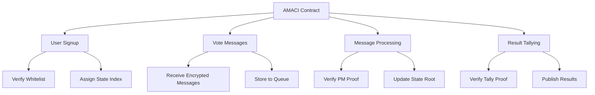
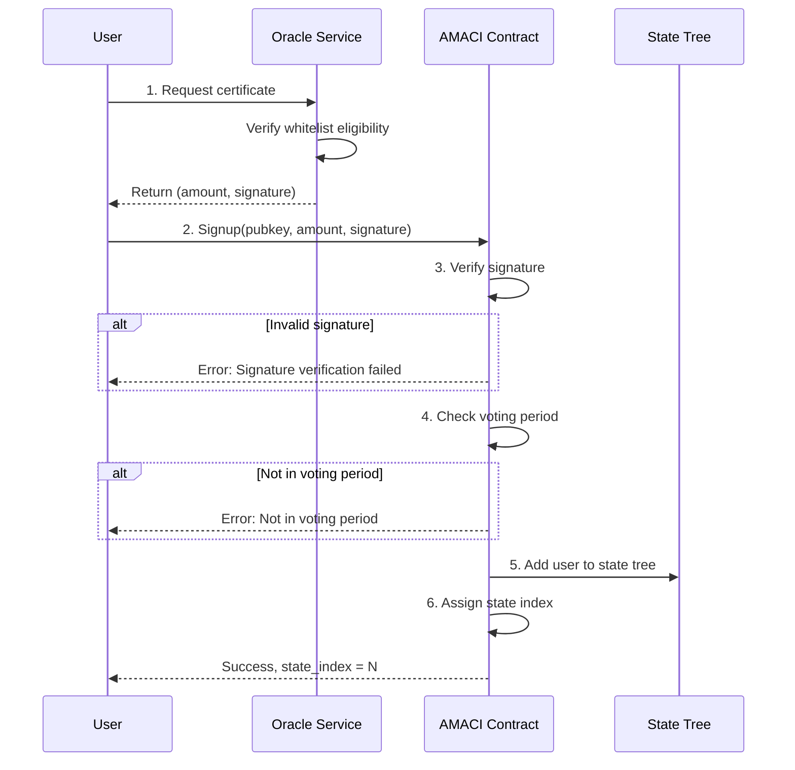
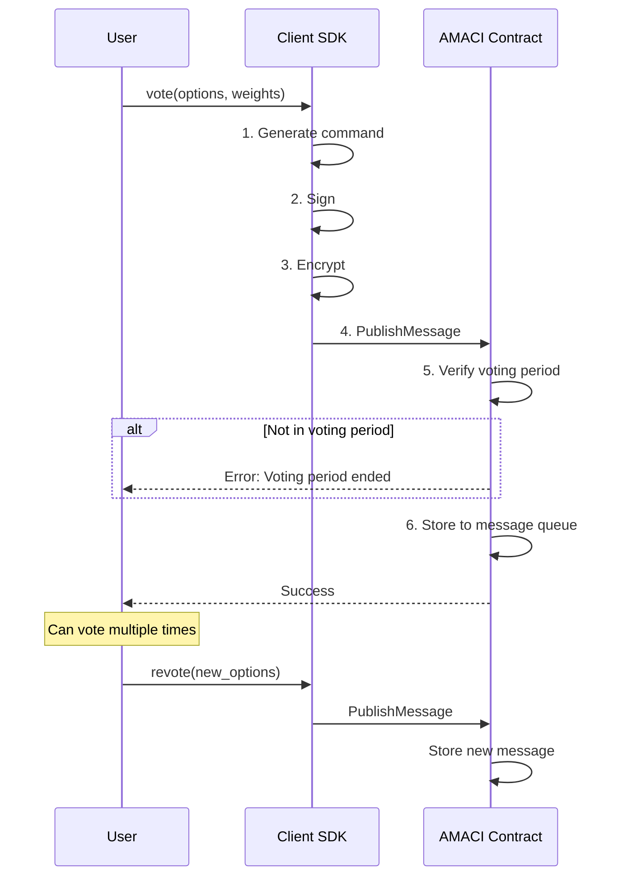
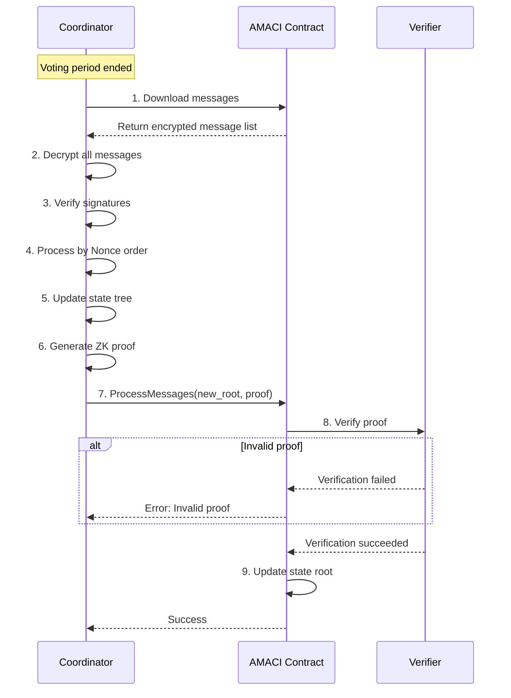
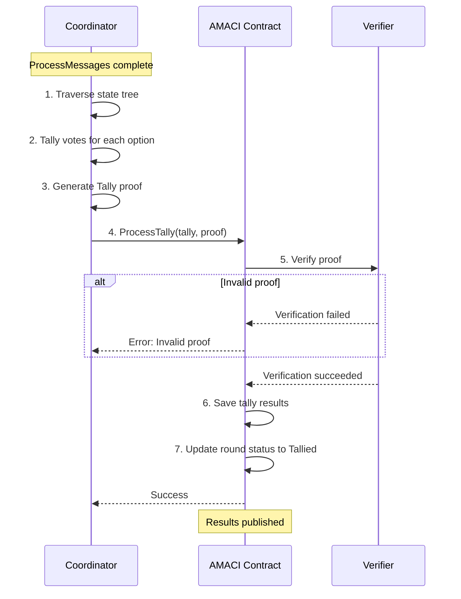
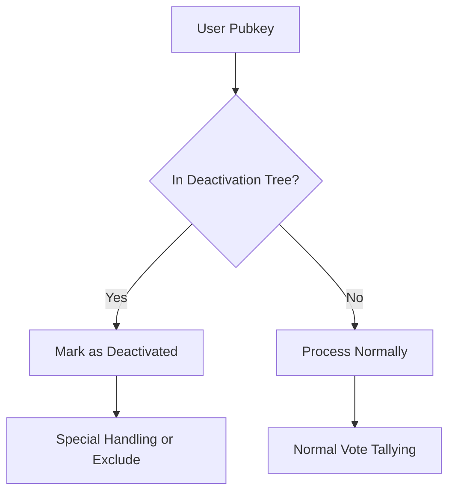
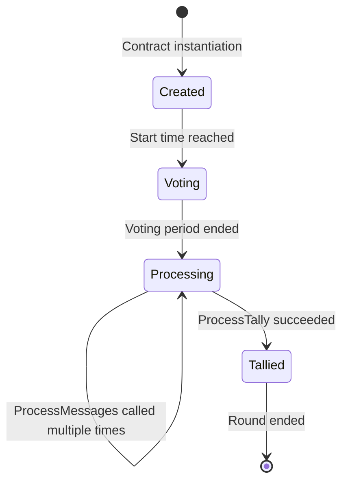

# AMACI Contract

AMACI (Anonymous MACI) contract is the core of each voting round, handling user signup, vote message storage, proof verification, and result publication.

## Core Functions

The AMACI contract provides four main functions:



## User Registration Methods

AMACI supports three registration methods, allowing users to choose based on privacy needs.

## 1. Signup (Standard Registration)

The simplest and fastest registration method, suitable for scenarios where you don't mind the Operator knowing your identity.

### Signup Message

```rust
ExecuteMsg::Signup {
    pubkey: PubKey,                    // User public key
    amount: Option<Uint128>,           // Voting weight (Oracle mode)
    signature: Option<String>,         // Oracle signature
    data: Option<SignupDataDora>,      // Additional data
}
```

### Signup Flow



### Signup Code Example

```typescript
// 1. Generate MACI keypair
// Derive EdDSA-Poseidon keypair from dora address
const maciKeypair = await client.genKeypairFromSign({
  signer: wallet,
  address
});

// 2. Signup (whitelist addresses only)
await client.signup({
  signer: wallet,
  address: userAddress,
  contractAddress: amaciAddress,
  maciKeypair,
  gasStation: true
});
```

**Whitelist Verification:**

The contract verifies if the sender address is in the whitelist:
- Configure whitelist address list when creating Round
- Only whitelist addresses can signup
- Voting weight can be fixed or calculated based on on-chain data

**Two Whitelist Modes:**

1. **Fixed Weight Mode**: All whitelist users get same voting weight
2. **Dynamic Weight Mode**: Weight calculated based on token holdings or other on-chain data

```typescript
// Configure whitelist when creating Round
await client.createMaciRound({
  // ...
  whitelist: [
    'dora1abc...',
    'dora1def...',
    'dora1ghi...'
  ],
  voiceCreditsPerUser: 100  // Fixed weight mode
});
```

### Signature Verification

AMACI contract verifies Oracle signature:

```rust
// Verification logic
fn verify_oracle_signature(
    pubkey: &PubKey,
    amount: Uint128,
    signature: &str,
    oracle_pubkey: &str
) -> Result<bool, ContractError> {
    // Construct message
    let message = format!("{}{}{}", 
        pubkey.x, 
        pubkey.y, 
        amount
    );
    
    // Verify signature
    let is_valid = verify_signature(
        message,
        signature,
        oracle_pubkey
    );
    
    Ok(is_valid)
}
```

### Signup Privacy Level

**Privacy Level:** Low

**Operator Can See:**
- Wallet address (through on-chain signup transaction)
- MACI public key
- State Index
- Vote content (after decryption)

**Risks:**
- Operator can fully correlate: wallet address → pubkey → State Index → vote content
- Potential for targeted bribery or retaliation

**Suitable For:**
- Don't mind Operator knowing identity
- Quick and simple voting
- Trusted Operator

---

## 2. Add-new-key (Dynamic Key Change)

Uses zero-knowledge proofs to create anonymous identity that Operator cannot link to original user.

### Add-new-key Message

```rust
ExecuteMsg::AddNewKey {
    pubkey: PubKey,              // New user public key
    nullifier: Uint256,          // Anti-replay identifier
    d: [Uint256; 4],            // [d1[0], d1[1], d2[0], d2[1]]
    groth16_proof: Groth16ProofType,  // ZK proof
}
```

### Complete Flow

**Old User Deactivate**

```typescript
// Old user submits deactivate message
await client.deactivate({
  signer: oldWallet,
  address: oldAddress,
  contractAddress,
  maciKeypair: oldKeypair,
  gasStation: true
});

// This generates a special vote message:
// - voIdx = 0
// - newVotes = 0
// - newPubKey = [0, 0] (indicates last message)
```

**Operator Processes Deactivate**

```typescript
// Operator processes all deactivate messages
// Generates deactivate tree

// Each deactivate leaf contains:
// [c1[0], c1[1], c2[0], c2[1], sharedKeyHash]

// Operator submits ProcessDeactivate
await contract.execute({
  process_deactivate: {
    size: deactivateMessages.length,
    new_deactivate_commitment: deactivateCommitment,
    new_deactivate_root: deactivateRoot,
    groth16_proof: processDeactivateProof
  }
});
```

**New User Generates ZK Proof**

```typescript
// Use VoterClient to generate payload
import { VoterClient } from '@dorafactory/maci-sdk';

const voterClient = new VoterClient({
  network: 'testnet',
  secretKey: oldPrivateKeyHex  // Old user's private key
});

// Get deactivate data
const deactivates = await client.fetchAllDeactivateLogs(contractAddress);

// Generate add-new-key payload
const payload = await voterClient.buildAddNewKeyPayload({
  stateTreeDepth: 10,
  operatorPubkey: operatorPubkey,
  deactivates: deactivates,
  wasmFile,  // addNewKey.wasm
  zkeyFile   // addNewKey.zkey
});

// payload contains:
// {
//   proof: { a, b, c },          // Groth16 proof
//   d: [d1_0, d1_1, d2_0, d2_1], // Re-randomized values
//   nullifier: "0x..."            // Anti-replay
// }
```

**Submit Add-new-key**

```typescript
// Submit with new wallet (important!)
const newKeypair = genKeypair();

await client.addNewKey({
  signer: newWallet,      // New wallet
  contractAddress,
  d: payload.d,
  proof: payload.proof,
  nullifier: payload.nullifier,
  newMaciKeypair: newKeypair,  // New MACI keypair
  fee: 'auto'
});
```

### Contract Verification Flow

```rust
pub fn execute_add_new_key(
    deps: DepsMut,
    env: Env,
    pubkey: PubKey,
    nullifier: Uint256,
    d: [Uint256; 4],
    groth16_proof: Groth16ProofType,
) -> Result<Response, ContractError> {
    // 1. Check voting period
    check_voting_time(env, voting_time)?;
    
    // 2. Check if nullifier already used
    if NULLIFIERS.has(deps.storage, nullifier.to_be_bytes()) {
        return Err(ContractError::NewKeyExist {});
    }
    NULLIFIERS.save(deps.storage, nullifier.to_be_bytes(), &true)?;
    
    // 3. Build public inputs
    let input = [
        DNODES.load(...)?,        // deactivate root
        COORDINATORHASH.load(...)?,  // operator pubkey hash
        nullifier,
        d[0], d[1], d[2], d[3]
    ];
    let input_hash = hash_256(input) % SNARK_SCALAR_FIELD;
    
    // 4. Verify ZK proof
    let is_valid = groth16_verify(&proof, &[input_hash])?;
    if !is_valid {
        return Err(ContractError::InvalidProof {
            step: "AddNewKey".to_string()
        });
    }
    
    // 5. Create new State Leaf (includes d1, d2)
    let state_leaf = StateLeaf {
        pub_key: pubkey,
        voice_credit_balance: voice_credit_amount,
        vote_option_tree_root: Uint256::zero(),
        nonce: Uint256::zero(),
    }.hash_new_key_state_leaf(d);
    
    // 6. Assign State Index
    let state_index = num_sign_ups;
    state_enqueue(&mut deps, state_leaf)?;
    num_sign_ups += 1;
    
    // 7. Save mapping (pubkey → state index)
    SIGNUPED.save(deps.storage, &pubkey_bytes, &state_index)?;
    
    Ok(Response::new()
        .add_attribute("action", "add_new_key")
        .add_attribute("state_idx", state_index.to_string()))
}
```

### ZK Circuit Description

Add-new-key uses a specialized ZK circuit to verify user identity:

```circom
template AddNewKey(stateTreeDepth) {
    // Public inputs
    signal input deactivateRoot;      // Deactivate tree root
    signal input coordPubKey[2];      // Operator public key
    signal input nullifier;           // Anti-replay
    signal input d1[2];               // Re-randomized values
    signal input d2[2];
    
    // Private inputs (critical! not public)
    signal input oldPrivateKey;       // Old user private key
    signal input deactivateIndex;     // Position in tree
    signal input deactivateLeaf;      // Leaf value
    signal input c1[2];               // Original encrypted values
    signal input c2[2];
    signal input randomVal;           // Random value for randomization
    signal input deactivateLeafPathElements[...];  // Merkle path
    
    // Verification steps:
    // 1. Verify nullifier = hash(oldPrivateKey, constant)
    // 2. Calculate sharedKeyHash = hash(ecdh(oldPrivKey, coordPubKey))
    // 3. Verify deactivateLeaf = hash(c1, c2, sharedKeyHash)
    // 4. Verify leaf is in deactivateRoot tree (using deactivateIndex and path)
    // 5. Verify d1, d2 = rerandomize(c1, c2, randomVal, coordPubKey)
}
```

### Add-new-key Privacy Level

**Privacy Level:** Highest

**Operator Can Only See:**
- New wallet address (possibly brand new)
- New MACI public key
- nullifier (just a hash)
- d1, d2 (re-randomized values)
- ZK proof (verified valid)

**Operator Cannot Determine:**
- Which position in deactivate tree the new user is
- Which wallet address corresponds to
- Which old identity is associated with
- What oldPrivateKey is

**Anonymity Set:**
- Anonymity set size = number of entries in deactivate tree
- Example: 100 deactivates → Operator knows "one of 100 people"

---

## 3. Pre-add-new-key (Pre-configured Key Change)

Uses pre-configured deactivate root to create anonymous identity immediately.

### Pre-add-new-key Message

```rust
ExecuteMsg::PreAddNewKey {
    pubkey: PubKey,              // New user public key
    nullifier: Uint256,          // Anti-replay identifier
    d: [Uint256; 4],            // [d1[0], d1[1], d2[0], d2[1]]
    groth16_proof: Groth16ProofType,  // ZK proof
}
```

### Differences from Add-new-key

| Feature | Add-new-key | Pre-add-new-key |
|---------|-------------|-----------------|
| Deactivate Source | Dynamically generated during voting | Pre-configured at Round creation |
| Coordinator | Current Operator | Pre-configured Coordinator |
| Wait Time | Need to wait for ProcessDeactivate | Available immediately |
| Flexibility | High (real-time) | Medium (requires pre-configuration) |

### Contract Verification Differences

```rust
// add-new-key uses dynamically generated root
input[0] = DNODES.load(deps.storage, ...)?;  // Dynamic
input[1] = COORDINATORHASH.load(deps.storage)?;  // Current operator

// pre-add-new-key uses pre-configured root
input[0] = PRE_DEACTIVATE_ROOT.load(deps.storage)?;  // Pre-configured
input[1] = PRE_DEACTIVATE_COORDINATOR_HASH.load(...)?;  // May be different
```

### Use Cases

**Suitable For:**
- Round creation already knows anonymous voting needed
- Pre-prepared set of deactivate data
- Want users to anonymously participate immediately

**Round Configuration Example:**

```typescript
// Configure when creating Round
await client.createOracleMaciRound({
  // ... other parameters
  
  // Configure pre-deactivate
  preDeactivateRoot: preDeactivateData.root,
  preDeactivateCoordinator: {
    x: preCoordPubkey[0],
    y: preCoordPubkey[1]
  }
});
```

### Pre-add-new-key Privacy Level

**Privacy Level:** Highest

Same privacy protection as add-new-key, but without waiting.

---

## 4. Process Deactivate (AMACI-specific)

Operator processes deactivate messages to generate deactivate tree for add-new-key.

### Process Deactivate Message

```rust
ExecuteMsg::ProcessDeactivate {
    size: u64,                          // Number of messages processed
    new_deactivate_commitment: Uint256, // New deactivate commitment
    new_deactivate_root: Uint256,       // New deactivate tree root
    groth16_proof: Groth16ProofType,    // ZK proof
}
```

### Workflow

**1. Collect Deactivate Messages**

```typescript
// User submits deactivate
await client.deactivate({
  signer: wallet,
  contractAddress,
  maciKeypair,
  gasStation: true
});

// Generated as special vote message:
// {
//   nonce: current_nonce,
//   stateIdx: user_state_idx,
//   voIdx: 0,          // Special marker
//   newVotes: 0,       // Special marker
//   newPubKey: [0, 0], // Indicates last message
//   signature: ...
// }
```

**2. Operator Processes Deactivate**

```typescript
// Operator decrypts deactivate messages
const deactivateCommands = deactivateMessages.map(msg => {
  const sharedKey = ecdh(operatorPrivKey, msg.encPubKey);
  const command = poseidonDecrypt(msg.data, sharedKey);
  return command;
});

// Generate deactivate tree
const deactivateLeaves = [];
for (const cmd of deactivateCommands) {
  const stateIdx = cmd.stateIdx;
  const userPubKey = stateTree.getLeaf(stateIdx).pubKey;
  
  // Generate encrypted deactivation flag
  const sharedKey = ecdh(operatorPrivKey, userPubKey);
  const sharedKeyHash = poseidon(sharedKey);
  
  const randomVal = deterministicRandom(operatorPrivKey, stateIdx);
  const { c1, c2 } = encryptDeactivateFlag(
    true,  // Mark as deactivated
    operatorPubKey,
    randomVal
  );
  
  // Build leaf
  const leaf = [c1[0], c1[1], c2[0], c2[1], sharedKeyHash];
  deactivateLeaves.push(leaf);
}

// Build Merkle tree
const deactivateTree = new Tree(5, stateTreeDepth + 2, 0n);
deactivateTree.initLeaves(deactivateLeaves.map(l => poseidon(l)));

const deactivateRoot = deactivateTree.root;
```

**3. Generate and Submit Proof**

```typescript
// Generate ProcessDeactivate proof
const { proof } = await groth16.fullProve(
  processDeactivateInput,
  wasmFile,
  zkeyFile
);

// Submit to contract
await contract.execute({
  process_deactivate: {
    size: deactivateMessages.length,
    new_deactivate_commitment: deactivateCommitment,
    new_deactivate_root: deactivateRoot,
    groth16_proof: proof
  }
});
```

### Process Deactivate Circuit

```circom
template ProcessDeactivateMessages(stateTreeDepth, batchSize) {
    // Public inputs
    signal input newDeactivateRoot;
    signal input coordPubKey[2];
    signal input batchStartHash;
    signal input batchEndHash;
    signal input currentDeactivateCommitment;
    signal input newDeactivateCommitment;
    
    // Private inputs
    signal input coordPrivKey;               // Operator private key
    signal input msgs[batchSize][7];         // Encrypted messages
    signal input encPubKeys[batchSize][2];   // Encryption public keys
    signal input currentStateLeaves[batchSize][10];  // Current state
    signal input c1[batchSize][2];           // Generated encrypted values
    signal input c2[batchSize][2];
    
    // Verification steps:
    // 1. Decrypt all deactivate messages
    // 2. Verify each message signature
    // 3. Generate deactivate entry (c1, c2, hash) for each user
    // 4. Build new deactivate tree
    // 5. Verify newDeactivateRoot is correct
}
```

### Contract Verification

```rust
pub fn execute_process_deactivate(
    deps: DepsMut,
    size: u64,
    new_deactivate_commitment: Uint256,
    new_deactivate_root: Uint256,
    groth16_proof: Groth16ProofType,
) -> Result<Response, ContractError> {
    // 1. Check state
    // 2. Build public inputs
    let input = [
        new_deactivate_root,
        coord_pubkey_hash,
        batch_start_hash,
        batch_end_hash,
        current_deactivate_commitment,
        new_deactivate_commitment,
        current_state_root
    ];
    
    // 3. Verify ZK proof
    let is_valid = groth16_verify(&proof, &[input_hash])?;
    if !is_valid {
        return Err(ContractError::InvalidProof {
            step: "ProcessDeactivate".to_string()
        });
    }
    
    // 4. Update deactivate root
    DNODES.save(deps.storage, key, &new_deactivate_root)?;
    CURRENT_DEACTIVATE_COMMITMENT.save(..., &new_deactivate_commitment)?;
    
    // 5. Update processing count
    PROCESSED_DMSG_COUNT.save(deps.storage, &new_count)?;
    
    Ok(Response::new())
}
```

### Purpose of Process Deactivate

**Provides Anonymity Set for Add-new-key:**

```
Without ProcessDeactivate:
→ Cannot use add-new-key
→ Can only use signup (low privacy)

With ProcessDeactivate:
→ Generates deactivate tree
→ Users can use add-new-key
→ Anonymity set size = number of deactivate messages
```

**Timing:**
- Can be processed any time during voting period
- Usually processed after enough deactivate messages accumulate
- Recommendation: At least 50-100 deactivates before processing (larger anonymity set)

---

## Voting Messages (PublishMessage)

After registration (regardless of method), users can submit encrypted voting messages.

### PublishMessage Message

```rust
ExecuteMsg::PublishMessage {
    message: MessageData,
}

pub struct MessageData {
    pub data: Vec<Uint256>,  // 10 encrypted fields
}
```

### Message Format

Encrypted messages contain 10 fields:

```typescript
interface EncryptedMessage {
  data: [
    bigint,  // [0] packaged (nonce + stateIdx + voIdx + newVotes + salt)
    bigint,  // [1] newPubKey.x
    bigint,  // [2] newPubKey.y
    bigint,  // [3] signature.R8.x
    bigint,  // [4] signature.R8.y
    bigint,  // [5] signature.S
    bigint,  // [6] encryption IV
    bigint,  // [7-9] reserved/padding
  ];
}
```

### Voting Flow



### Voting Example

```typescript
// Get Operator public key
const roundInfo = await client.getRoundInfo({ contractAddress: amaciAddress });

// Vote
await client.vote({
  signer: wallet,
  address: userAddress,
  contractAddress: amaciAddress,
  selectedOptions: [
    { idx: 0, vc: 5 },  // 5 votes for option 0
    { idx: 1, vc: 3 },  // 3 votes for option 1
  ],
  operatorCoordPubKey: [
    BigInt(roundInfo.coordinatorPubkeyX),
    BigInt(roundInfo.coordinatorPubkeyY)
  ],
  maciKeypair: keypair,
  gasStation: true
});
```

### Message Storage

Messages are stored in contract in order:

```rust
// Message queue
pub const MESSAGES: Item<Vec<Message>> = Item::new("messages");

// Add message
fn publish_message(
    deps: DepsMut,
    message: MessageData
) -> Result<Response, ContractError> {
    let mut messages = MESSAGES.load(deps.storage)?;
    
    messages.push(Message {
        msg_type: Uint256::from(1u128),  // 1 = voting message
        data: message.data,
    });
    
    MESSAGES.save(deps.storage, &messages)?;
    
    Ok(Response::new()
        .add_attribute("action", "publish_message")
        .add_attribute("message_id", messages.len().to_string()))
}
```

### Multiple Votes

Users can call PublishMessage multiple times, later messages override earlier ones:

```typescript
// First vote
await vote({ options: [{ idx: 0, vc: 5 }], nonce: 0 });

// Change mind, revote
await vote({ options: [{ idx: 1, vc: 5 }], nonce: 1 });

// Change mind again
await vote({ options: [{ idx: 2, vc: 5 }], nonce: 2 });

// During processing, only last vote (option 2) is valid
```

---

## Message Processing (ProcessMessages)

Operator submits zero-knowledge proofs to process voting messages.

### ProcessMessages Message

```rust
ExecuteMsg::ProcessMessages {
    new_state_commitment: Uint256,     // New state root
    groth16_proof: Groth16ProofType,   // Groth16 proof
}
```

### Processing Flow



### Proof Verification

```rust
fn process_messages(
    deps: DepsMut,
    new_state_commitment: Uint256,
    proof: Groth16ProofType
) -> Result<Response, ContractError> {
    // 1. Check state
    let round_info = ROUND_INFO.load(deps.storage)?;
    if round_info.status != RoundStatus::Processing {
        return Err(ContractError::InvalidRoundStatus {});
    }
    
    // 2. Construct public inputs
    let public_inputs = vec![
        coordinator_pub_key_x,
        coordinator_pub_key_y,
        message_root,
        current_state_root,
        new_state_commitment,
        // ... other public inputs
    ];
    
    // 3. Verify Groth16 proof
    let is_valid = verify_groth16_proof(
        proof,
        public_inputs,
        verification_key
    )?;
    
    if !is_valid {
        return Err(ContractError::ProofVerificationFailed {});
    }
    
    // 4. Update state root
    STATE_COMMITMENT.save(deps.storage, &new_state_commitment)?;
    
    Ok(Response::new()
        .add_attribute("action", "process_messages")
        .add_attribute("new_state_root", new_state_commitment.to_string()))
}
```

---

## Result Tallying (ProcessTally)

Operator submits tally proof to publish results.

### ProcessTally Message

```rust
ExecuteMsg::ProcessTally {
    new_tally_commitment: Uint256,     // Tally result commitment
    groth16_proof: Groth16ProofType,   // Groth16 proof
}
```

### Tallying Flow



### Result Publication

```rust
fn process_tally(
    deps: DepsMut,
    new_tally_commitment: Uint256,
    proof: Groth16ProofType
) -> Result<Response, ContractError> {
    // 1. Verify proof
    let is_valid = verify_groth16_proof(
        proof,
        public_inputs,
        tally_verification_key
    )?;
    
    if !is_valid {
        return Err(ContractError::ProofVerificationFailed {});
    }
    
    // 2. Save tally results
    TALLY_COMMITMENT.save(deps.storage, &new_tally_commitment)?;
    
    // 3. Update status
    let mut round_info = ROUND_INFO.load(deps.storage)?;
    round_info.status = RoundStatus::Tallied;
    ROUND_INFO.save(deps.storage, &round_info)?;
    
    Ok(Response::new()
        .add_attribute("action", "process_tally")
        .add_attribute("tally_commitment", new_tally_commitment.to_string()))
}
```

## Query Functions

### Round Information

```rust
QueryMsg::GetRoundInfo {}
```

Returns:

```rust
pub struct RoundInfoResponse {
    pub round_info: RoundInfo,
    pub status: RoundStatus,
    pub coordinator_pubkey: PubKey,
    pub num_signups: u64,
    pub max_voters: Uint256,
    // ... other info
}
```

### Message Queries

```rust
// Get single message
QueryMsg::GetMessage { index: u64 }

// Get all messages
QueryMsg::GetMessages {}

// Get message count
QueryMsg::GetNumMessages {}
```

### State Queries

```rust
// Get state root
QueryMsg::GetStateRoot {}

// Get tally result
QueryMsg::GetTallyResult {}

// Get signup count
QueryMsg::GetNumSignups {}
```

## Anonymity Enhancement

### Deactivation Detection

AMACI supports deactivation detection to enhance anonymity:

```rust
// Configure during initialization
pre_deactivate_root: Uint256,  // Deactivation Merkle root
pre_deactivate_coordinator: Option<PubKey>,  // Deactivation coordinator
```

### How It Works



## Round Status

AMACI contract has the following states:

```rust
pub enum RoundStatus {
    Created = 0,      // Created
    Voting = 1,       // Voting
    Processing = 2,   // Processing
    Tallied = 3,      // Tallied
}
```

### State Transitions



## Security Features

### Time Verification

```rust
fn ensure_voting_period(
    env: &Env,
    voting_time: &VotingTime
) -> Result<(), ContractError> {
    let current_time = env.block.time.seconds();
    
    if current_time < voting_time.start_time {
        return Err(ContractError::VotingNotStarted {});
    }
    
    if current_time > voting_time.end_time {
        return Err(ContractError::VotingEnded {});
    }
    
    Ok(())
}
```

### Access Control

```rust
// Only Coordinator can process messages
fn ensure_coordinator(
    sender: &Addr,
    coordinator: &Addr
) -> Result<(), ContractError> {
    if sender != coordinator {
        return Err(ContractError::Unauthorized {});
    }
    Ok(())
}
```

### Reentrancy Protection

```rust
// Use state lock to prevent reentrancy
fn process_messages_with_lock(
    deps: DepsMut,
    // ... parameters
) -> Result<Response, ContractError> {
    // Check lock
    let is_locked = PROCESSING_LOCK.may_load(deps.storage)?.unwrap_or(false);
    if is_locked {
        return Err(ContractError::AlreadyProcessing {});
    }
    
    // Set lock
    PROCESSING_LOCK.save(deps.storage, &true)?;
    
    // Processing logic
    let result = process_messages_internal(deps, ...);
    
    // Release lock
    PROCESSING_LOCK.save(deps.storage, &false)?;
    
    result
}
```

## Registration Method Selection Recommendations

Choose the appropriate registration method based on your privacy needs:

### Low Privacy Scenarios

**Use Signup:**
- Internal community voting
- Non-sensitive decisions
- Trusted Operator

### High Privacy Scenarios

**Use Add-new-key:**
- Large fund allocation
- Sensitive topic voting
- Potentially controversial decisions
- Don't fully trust Operator

**Use Pre-add-new-key:**
- Need quick anonymity
- Round already pre-configured
- Emergency voting scenarios

### Mixed Usage

In the same Round, different users can use different registration methods:

```typescript
// User A: Use signup (fast)
await userA.signup({...});

// User B: Use add-new-key (anonymous)
await userB.addNewKey({...});

// User C: Use pre-add-new-key (fast and anonymous)
await userC.rawPreAddNewKey({...});

// All can vote normally
await userA.vote({...});
await userB.vote({...});
await userC.vote({...});
```

## Next Steps

After understanding all AMACI contract registration methods, you can:

- [Complete Workflow](/docs/contracts/workflow) - Understand full process from creation to results
- [SDK Usage Guide](/docs/sdk/voting-guide) - Use SDK to interact with AMACI
- [Example Code](/docs/examples/basic-voting) - View complete voting examples
