# Architecture Overview

MACI's contract system adopts a modular design, using the Registry contract to uniformly manage multiple AMACI voting contract instances. This section introduces the overall architecture and design philosophy.

## System Architecture

### Architecture Diagram

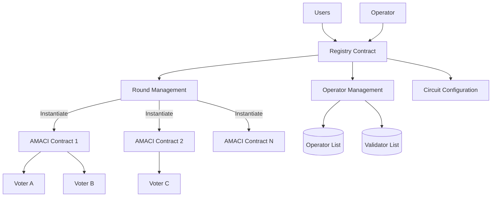

### Component Description

**Registry Contract (Registration Hub)**
- Manages Operator registration and configuration
- Manages Validator list
- Creates and configures AMACI contract instances
- Configures ZK circuit parameters
- Manages fee configuration

**AMACI Contract (Voting Instance)**
- Handles user signup
- Receives and stores encrypted voting messages
- Verifies zero-knowledge proofs
- Publishes voting results
- Each voting round corresponds to an independent AMACI contract instance

## Design Philosophy

### 1. Separation of Concerns

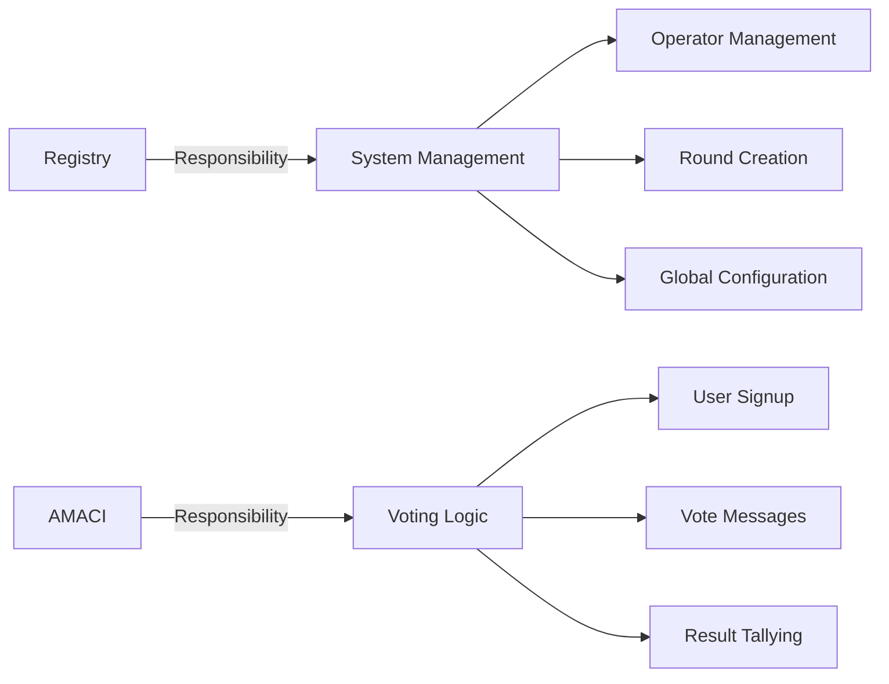

**Registry Focuses On:**
- Who can run an Operator
- How to create voting rounds
- System-level parameter configuration

**AMACI Focuses On:**
- How users participate in voting
- How messages are stored and processed
- How results are verified and published

### 2. One-Click Creation

Users don't need to manually deploy AMACI contracts:

```rust
// Users only need to call one Registry function
ExecuteMsg::CreateRound {
    operator,
    max_voter,
    voice_credit_amount,
    vote_option_map,
    // ... other parameters
}

// Registry automatically:
// 1. Verifies Operator registration
// 2. Instantiates AMACI contract
// 3. Configures initial parameters
// 4. Returns contract address
```

### 3. Standardized Interface

All AMACI contract instances share the same interface:

```rust
// Unified message types
pub enum ExecuteMsg {
    Signup { ... },
    PublishMessage { ... },
    ProcessMessages { ... },
    ProcessTally { ... },
}

// Unified query interface
pub enum QueryMsg {
    GetRoundInfo {},
    GetNumSignups {},
    GetMessage { index },
}
```

### 4. Flexible Configuration

Supports multiple configuration options:

```rust
// Voting type
pub enum CircuitType {
    IP1V = 0,  // One person one vote
    QV = 1,    // Quadratic voting
}

// Whitelist configuration
// Whitelist addresses are configured when creating Round, only whitelisted addresses can participate
```

## Contract Relationships

### Creation Flow

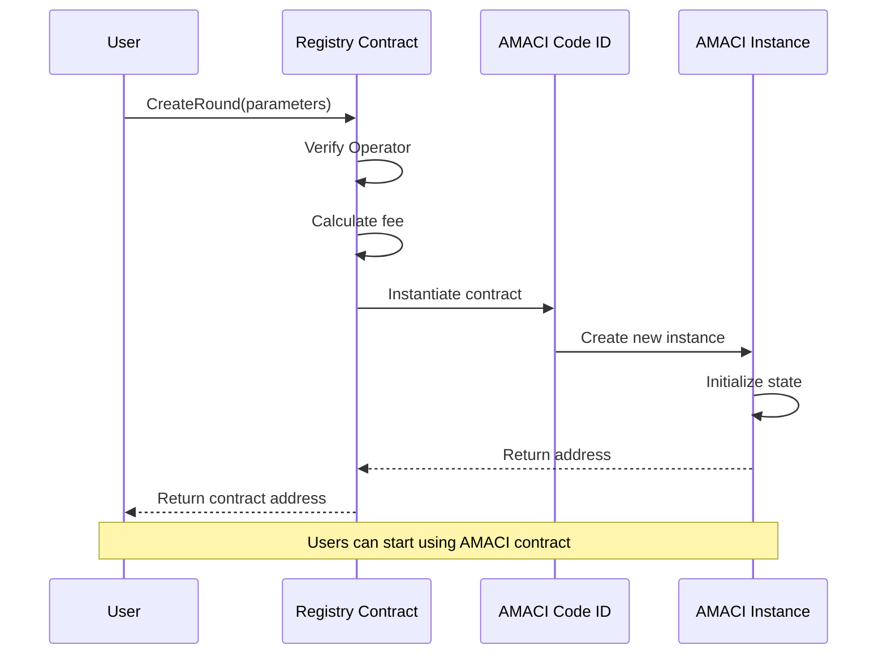

### Interaction Pattern

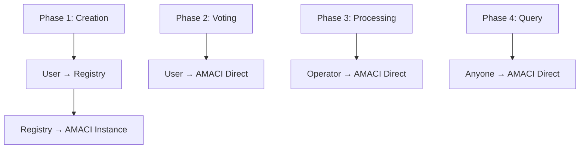

**Note:**
- Registry only participates during creation
- After creation, users interact directly with AMACI contract
- Registry does not participate in the voting process

## Voting Lifecycle

### Round State Machine

Each voting round in AMACI contracts follows strict state transition rules:

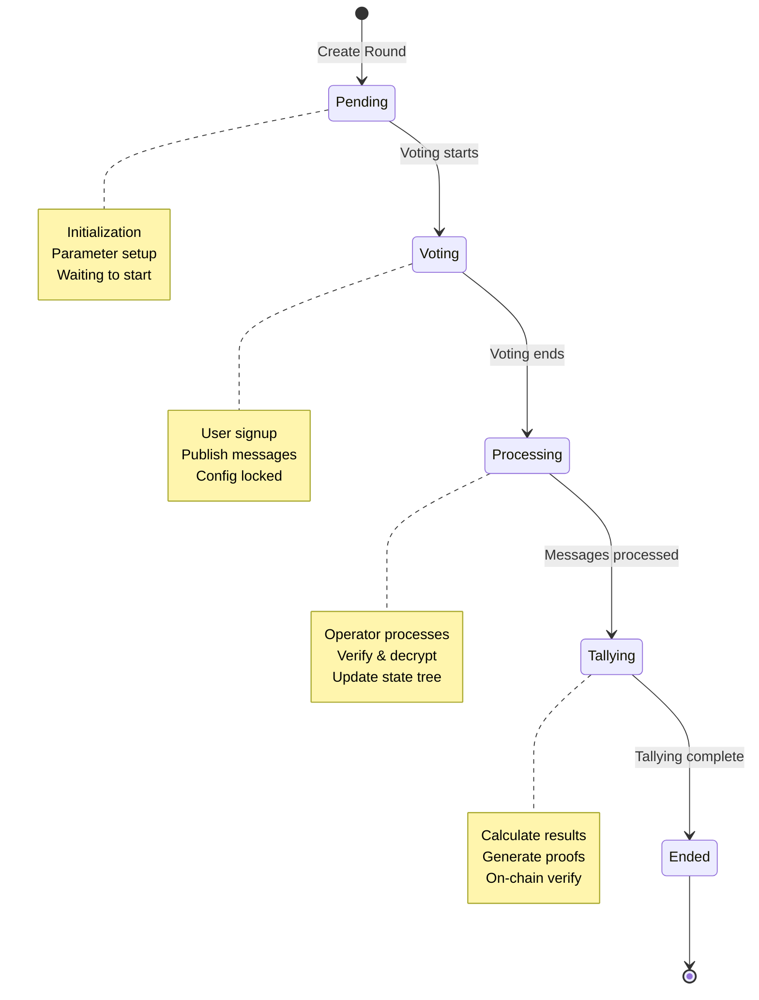

### State Transition Conditions

Each state transition has clear trigger conditions and validation rules:

```rust
// 1. Pending → Voting
// Condition: current_time >= voting_start_time
pub fn check_voting_start(voting_time: &VotingTime, current_time: u64) -> bool {
    current_time >= voting_time.start_time
}

// 2. Voting → Processing
// Condition: current_time >= voting_end_time
pub fn check_voting_end(voting_time: &VotingTime, current_time: u64) -> bool {
    current_time >= voting_time.end_time
}

// 3. Processing → Tallying
// Condition: all message batches processed
pub fn check_all_messages_processed(
    num_messages: u64,
    num_processed: u64,
) -> bool {
    num_messages == num_processed
}

// 4. Tallying → Ended
// Condition: tally proof verified
pub fn check_tally_completed(tally_result: &TallyResult) -> bool {
    tally_result.is_verified
}
```

## Data Flow

### Complete Data Flow Diagram

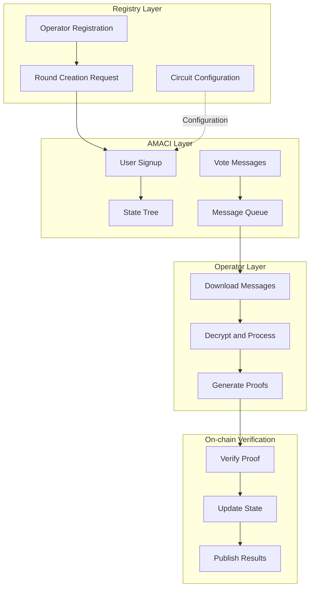

### Message Processing Deep Dive

AMACI's core is the on-chain/off-chain collaborative message processing mechanism:

#### 1. On-chain Storage

```rust
// Users publish encrypted voting messages on-chain
pub struct Message {
    // Encrypted vote data
    data: [Uint256; 7],
    // Encryption key (encrypted with Coordinator public key)
    enc_pub_key: PubKey,
}

// Only encrypted data stored on-chain, protecting privacy
messages.push(Message {
    data: encrypted_vote_data,
    enc_pub_key: ephemeral_public_key,
});
```

#### 2. Off-chain Processing

Operator executes the following steps locally:

```
1. Download all encrypted messages
   messages = query_all_messages(amaci_contract)

2. Decrypt messages with private key
   for msg in messages:
       decrypted = decrypt(msg, coordinator_private_key)
       
3. Validate message validity
   - Check signature
   - Verify sender eligibility
   - Check vote option legality
   
4. Update state tree
   - Update user state based on decrypted messages
   - Calculate new state tree root
   
5. Generate zero-knowledge proof
   - Prove correctness of state transition
   - Without revealing specific vote content
```

#### 3. On-chain Verification

```rust
// Operator submits processing results and proof
pub fn process_messages(
    deps: DepsMut,
    info: MessageInfo,
    // New state tree root
    new_state_root: Uint256,
    // Zero-knowledge proof
    groth16_proof: Groth16ProofType,
) -> Result<Response, ContractError> {
    // Verify caller is Operator
    ensure_operator(&deps, &info.sender)?;
    
    // Verify zero-knowledge proof
    let public_inputs = prepare_public_inputs(
        old_state_root,
        new_state_root,
        message_batch,
    );
    
    verify_groth16_proof(
        deps.api,
        &groth16_proof,
        &public_inputs,
    )?;
    
    // Verification passed, update state
    STATE_ROOT.save(deps.storage, &new_state_root)?;
    
    Ok(Response::new()
        .add_attribute("action", "process_messages")
        .add_attribute("new_state_root", new_state_root.to_string()))
}
```

### Zero-Knowledge Proof System

MACI uses Groth16 zero-knowledge proofs to ensure computational correctness:

#### Proof Contents

```
Public Inputs:
- Old State Root
- New State Root
- Message Batch Hash
- Coordinator Public Key Hash

Private Witness:
- Plaintext of all voting messages
- User states
- Merkle paths of state tree
- Coordinator private key
```

#### Proof Verification Flow

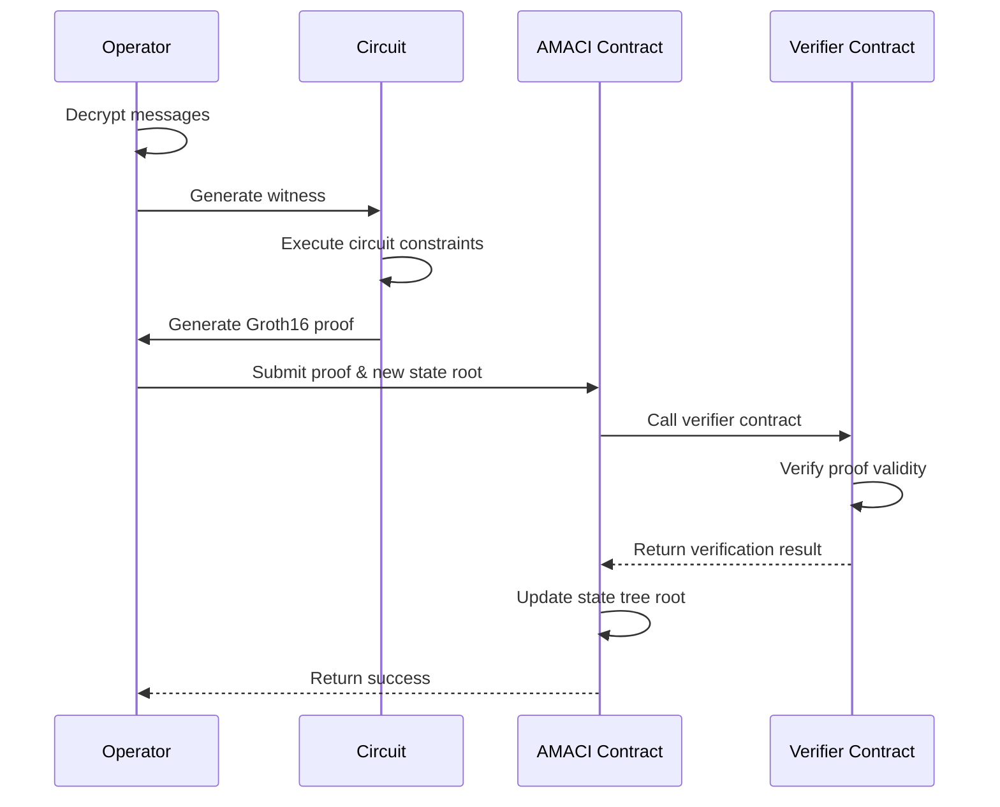

#### Circuit Constraints

The circuit ensures the following constraints:

```
1. Message Decryption Correctness
   - ECDH decryption uses correct private key
   - Plaintext message format is valid

2. State Tree Update Correctness
   - Each message correctly updates corresponding user state
   - New state root correctly calculated from Merkle tree

3. Voting Rules Compliance
   - Users don't overspend voice credits
   - Vote options within allowed range
   - Quadratic voting rules correctly applied

4. Signature Verification
   - Each message signature is valid
   - Signer matches claimed identity
```

## State Management

### Registry State

```rust
// State stored in Registry
pub struct RegistryState {
    // Administrators
    admin: Addr,
    operator: Addr,
    
    // AMACI Contract Code ID
    amaci_code_id: u64,
    
    // Operator set
    operator_set: Map<Addr, bool>,
    operator_pubkey: Map<Addr, PubKey>,
    operator_identity: Map<Addr, String>,
    
    // Validator set
    validator_list: Vec<Addr>,
    validator_operator: Map<Addr, Addr>,
    
    // Fee configuration
    circuit_charge_config: CircuitChargeConfig,
}
```

### AMACI State

```rust
// State stored in AMACI contract
pub struct AMACIState {
    // Round information
    round_info: RoundInfo,
    voting_time: VotingTime,
    
    // Coordinator public key
    coordinator_pub_key: PubKey,
    
    // User data
    num_sign_ups: u64,
    voice_credit_amount: Uint256,
    
    // Message queue
    messages: Vec<Message>,
    
    // State tree
    state_tree_depth: u8,
    state_tree_root: Uint256,
    
    // Voting configuration
    max_vote_options: Uint256,
    vote_option_map: Vec<String>,
    
    // Circuit configuration
    circuit_type: Uint256,
    certification_system: Uint256,
    
    // Whitelist
    whitelist: Option<WhitelistBase>,
}
```

### State Tree Mechanism

AMACI uses Merkle trees to manage user states, enabling efficient state verification:

#### Tree Structure

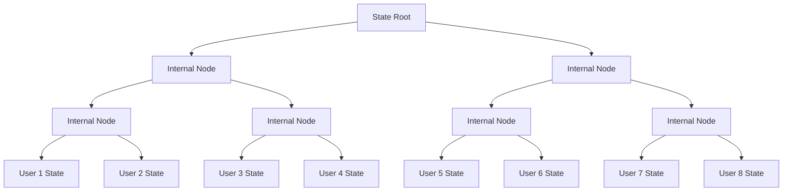

#### User State Leaf Node

```rust
// Each user's data in the state tree
pub struct UserState {
    // User public key
    pub_key: PubKey,
    // Remaining voice credits
    voice_credit_balance: Uint256,
    // User index
    user_index: u64,
    // Vote option tree root
    vote_option_tree_root: Uint256,
}

// Leaf node hash calculation
leaf_hash = hash(
    pub_key.x,
    pub_key.y,
    voice_credit_balance,
    vote_option_tree_root,
)
```

#### State Update Flow

How the state tree updates when users publish voting messages:

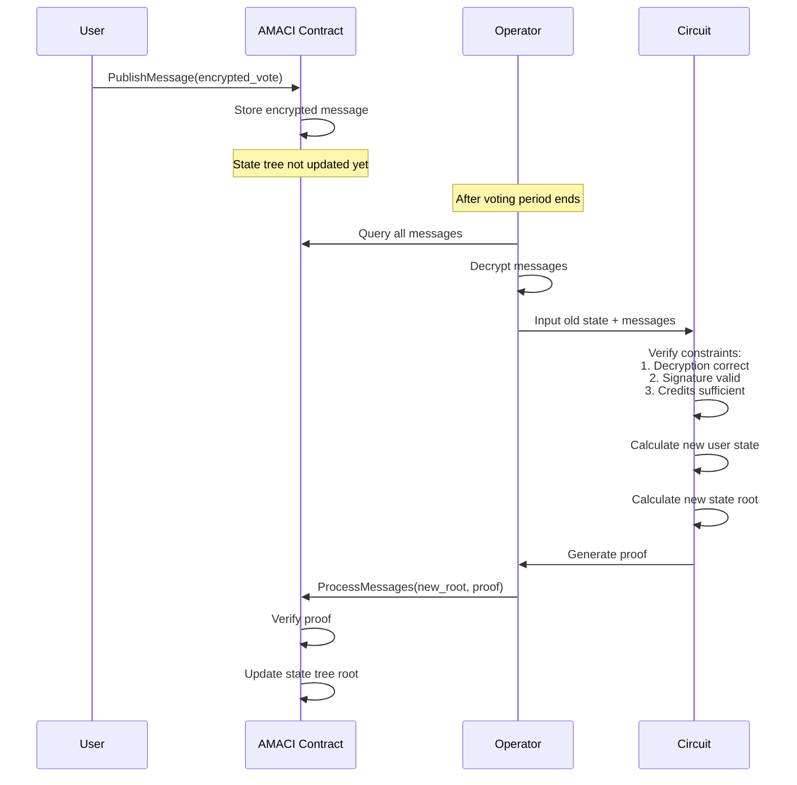

#### State Consistency Guarantee

```rust
// Only state tree root stored on-chain for storage efficiency
pub struct StateTreeInfo {
    // Current state tree root
    current_root: Uint256,
    // Tree depth (determines max users = 2^depth)
    depth: u8,
    // Number of processed messages
    num_processed_messages: u64,
}

// Verify correctness of state update
pub fn verify_state_transition(
    old_root: Uint256,
    new_root: Uint256,
    messages: &[Message],
    proof: &Groth16ProofType,
) -> Result<bool, ContractError> {
    // Prepare public inputs
    let public_inputs = vec![
        old_root,
        new_root,
        hash_messages(messages),
        coordinator_pubkey_hash,
    ];
    
    // Verify using Groth16
    verify_groth16_proof(proof, &public_inputs)
}
```

## Permission Management

### Registry Permissions

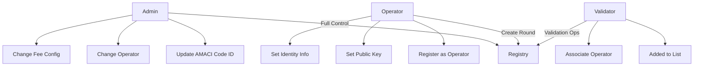

### AMACI Permissions

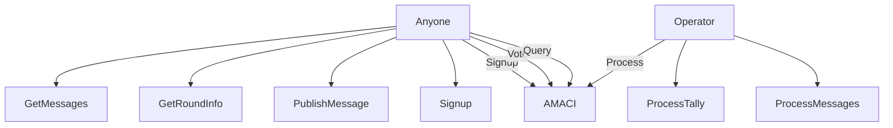

## Security Design

### 1. Contract Validation

```rust
// Validation when Registry creates AMACI
fn create_round(
    deps: DepsMut,
    info: MessageInfo,
    operator: Addr,
    // ... other parameters
) -> Result<Response, ContractError> {
    // Validation 1: Operator must be registered
    if !is_maci_operator(deps.storage, &operator)? {
        return Err(ContractError::OperatorNotRegistered {});
    }
    
    // Validation 2: Parameter validity
    if max_voter == Uint256::zero() {
        return Err(ContractError::InvalidMaxVoter {});
    }
    
    // Validation 3: Fee check
    let required_fee = calculate_fee(&circuit_charge_config);
    if info.funds.amount < required_fee {
        return Err(ContractError::InsufficientFee {});
    }
    
    // Pass validation, create contract
    instantiate_amaci_contract(deps, operator, ...)
}
```

### 2. State Isolation

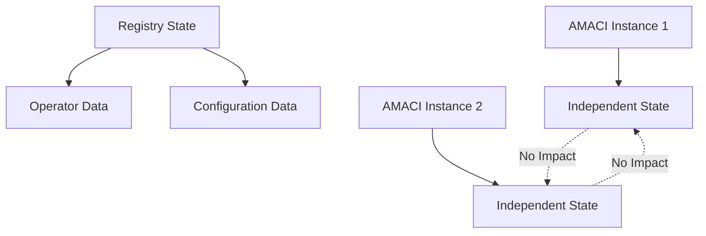

**Features:**
- Each AMACI instance has independent state
- Issues in one instance don't affect others
- Registry only stores global configuration

### 3. Upgrade Mechanism

```rust
// Registry supports updating AMACI Code ID
ExecuteMsg::UpdateAmaciCodeId {
    amaci_code_id: u64,
}

// Newly created AMACI instances use new Code ID
// Existing instances remain unaffected
```

### 4. Error Handling Mechanism

MACI contracts implement comprehensive error handling to ensure system robustness:

#### Registry Contract Errors

```rust
pub enum RegistryError {
    // Permission-related errors
    Unauthorized {},
    OperatorNotRegistered {},
    
    // Parameter validation errors
    InvalidMaxVoter {},
    InvalidVotingTime {},
    InvalidCircuitType {},
    
    // Resource errors
    InsufficientFee { required: Uint128, provided: Uint128 },
    CodeIdNotFound {},
    
    // State errors
    OperatorAlreadyRegistered {},
    ValidatorAlreadyExists {},
}

// Error handling example
pub fn create_round(
    deps: DepsMut,
    info: MessageInfo,
    params: CreateRoundParams,
) -> Result<Response, RegistryError> {
    // Validate time parameters
    if params.voting_start >= params.voting_end {
        return Err(RegistryError::InvalidVotingTime {});
    }
    
    // Validate fee
    let required_fee = calculate_circuit_fee(&params);
    let provided_fee = info.funds.get(0).map(|c| c.amount).unwrap_or_default();
    
    if provided_fee < required_fee {
        return Err(RegistryError::InsufficientFee {
            required: required_fee,
            provided: provided_fee,
        });
    }
    
    // Continue processing...
}
```

#### AMACI Contract Errors

```rust
pub enum AMACIError {
    // State errors
    InvalidPeriod { expected: String, current: String },
    VotingNotStarted {},
    VotingEnded {},
    AlreadyProcessed {},
    
    // User operation errors
    AlreadySignedUp {},
    NotSignedUp {},
    InsufficientVoiceCredits {},
    InvalidVoteOption {},
    
    // Proof verification errors
    InvalidProof {},
    ProofVerificationFailed { reason: String },
    StateRootMismatch {},
    
    // Permission errors
    NotCoordinator {},
    NotWhitelisted {},
}

// State check example
pub fn publish_message(
    deps: DepsMut,
    env: Env,
    info: MessageInfo,
    message: Message,
) -> Result<Response, AMACIError> {
    let state = STATE.load(deps.storage)?;
    
    // Check voting period
    let current_time = env.block.time.seconds();
    if current_time < state.voting_time.start_time {
        return Err(AMACIError::VotingNotStarted {});
    }
    if current_time >= state.voting_time.end_time {
        return Err(AMACIError::VotingEnded {});
    }
    
    // Check whitelist
    if let Some(whitelist) = &state.whitelist {
        if !whitelist.is_whitelisted(&info.sender) {
            return Err(AMACIError::NotWhitelisted {});
        }
    }
    
    // Store message
    MESSAGES.push(deps.storage, &message)?;
    Ok(Response::new())
}
```

#### Proof Verification Error Handling

```rust
pub fn process_messages(
    deps: DepsMut,
    info: MessageInfo,
    new_state_root: Uint256,
    proof: Groth16ProofType,
) -> Result<Response, AMACIError> {
    // Verify Operator identity
    ensure_coordinator(&deps, &info.sender)?;
    
    let state = STATE.load(deps.storage)?;
    
    // Prepare public inputs
    let public_inputs = vec![
        state.state_tree_root,  // Old state root
        new_state_root,          // New state root
        get_message_batch_hash(deps.storage)?,
    ];
    
    // Verify zero-knowledge proof
    match verify_groth16_proof(deps.api, &proof, &public_inputs) {
        Ok(true) => {
            // Verification passed, update state
            STATE.update(deps.storage, |mut s| -> StdResult<_> {
                s.state_tree_root = new_state_root;
                s.num_processed_messages += proof.batch_size;
                Ok(s)
            })?;
            
            Ok(Response::new()
                .add_attribute("action", "process_messages")
                .add_attribute("new_root", new_state_root.to_string()))
        }
        Ok(false) => {
            Err(AMACIError::InvalidProof {})
        }
        Err(e) => {
            Err(AMACIError::ProofVerificationFailed {
                reason: e.to_string(),
            })
        }
    }
}
```

### 5. Security Boundaries

The system implements multiple layers of security boundaries to prevent various attacks:

#### Time Boundaries

```rust
// Strict time window control
pub struct VotingTime {
    // Voting start time (Unix timestamp)
    start_time: u64,
    // Voting end time
    end_time: u64,
}

// Messages can only be published during voting period
if !(start_time <= current_time && current_time < end_time) {
    return Err(AMACIError::InvalidPeriod {});
}

// Messages can only be processed after voting period ends
if current_time < end_time {
    return Err(AMACIError::VotingNotEnded {});
}
```

#### Quantity Boundaries

```rust
// Limit number of participants (determined by state tree depth)
pub fn signup(
    deps: DepsMut,
    info: MessageInfo,
) -> Result<Response, AMACIError> {
    let state = STATE.load(deps.storage)?;
    let max_users = 2u64.pow(state.state_tree_depth as u32);
    
    if state.num_sign_ups >= max_users {
        return Err(AMACIError::MaxSignupsReached {});
    }
    
    // Continue processing...
}

// Limit vote option count
if vote_option_index >= state.max_vote_options {
    return Err(AMACIError::InvalidVoteOption {});
}

// Limit message batch size (prevent gas exhaustion)
const MAX_BATCH_SIZE: usize = 100;
if messages.len() > MAX_BATCH_SIZE {
    return Err(AMACIError::BatchTooLarge {});
}
```

#### Encryption Boundaries

```rust
// All voting messages must be encrypted
pub struct Message {
    // Encrypted data in 7 fields
    // [nonce, pub_key_x, pub_key_y, vote_option, vote_weight, ...]
    data: [Uint256; 7],
    // Ephemeral public key (ECDH encryption)
    enc_pub_key: PubKey,
}

// Only Coordinator can decrypt
// No plaintext voting data ever stored on-chain
// Ensures voting privacy and censorship resistance
```

#### Permission Boundaries

```rust
// Registry contract permission hierarchy
pub enum Permission {
    Admin,      // Can update Code ID, fee config
    Operator,   // Can create Round, set public key
    Validator,  // Can verify operations
    User,       // Can use system
}

// AMACI contract permission hierarchy
pub fn check_permission(
    action: &str,
    caller: &Addr,
    state: &AMACIState,
) -> Result<(), AMACIError> {
    match action {
        "process_messages" | "process_tally" => {
            if caller != &state.coordinator {
                return Err(AMACIError::NotCoordinator {});
            }
        }
        "signup" | "publish_message" => {
            if let Some(whitelist) = &state.whitelist {
                if !whitelist.contains(caller) {
                    return Err(AMACIError::NotWhitelisted {});
                }
            }
        }
        _ => {}
    }
    Ok(())
}
```

## Advantages

### 1. Simplified Deployment

**Traditional Way:**
```
User → Compile contract → Upload code → Instantiate contract → Configure parameters
```

**Registry Way:**
```
User → Call CreateRound → Done
```

### 2. Unified Management

- All Operators registered in one place
- Unified fee configuration
- Unified Code ID management

### 3. Security

- Registry verifies Operator qualifications
- Standardized contract creation process
- Reduces human error

### 4. Upgradability

- New instances use new code after Code ID update
- Old instances continue running unaffected
- Smooth upgrade path

## Next Steps

After understanding the overall architecture, you can dive deeper into:

- [Registry Contract](/docs/contracts/registry) - Learn Registry functionality in detail
- [AMACI Contract](/docs/contracts/amaci) - Learn AMACI's voting logic
- [Complete Workflow](/docs/contracts/workflow) - Understand the full process from creation to results
