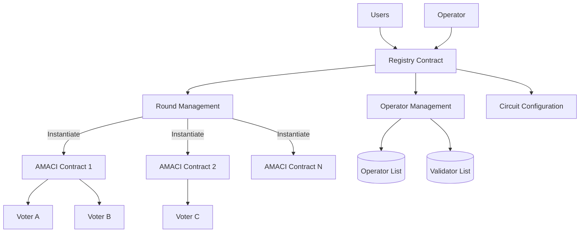
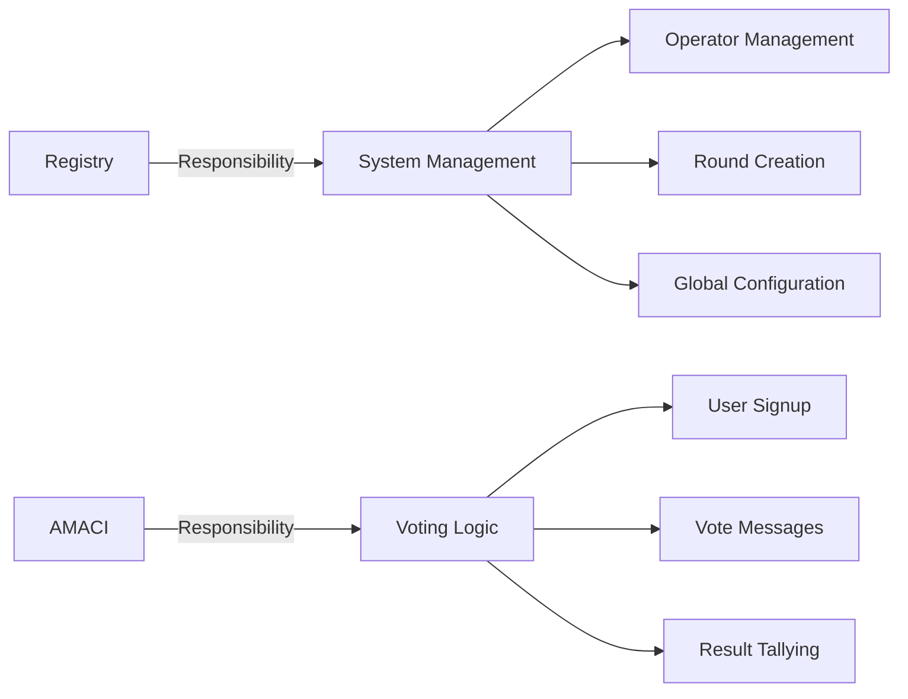
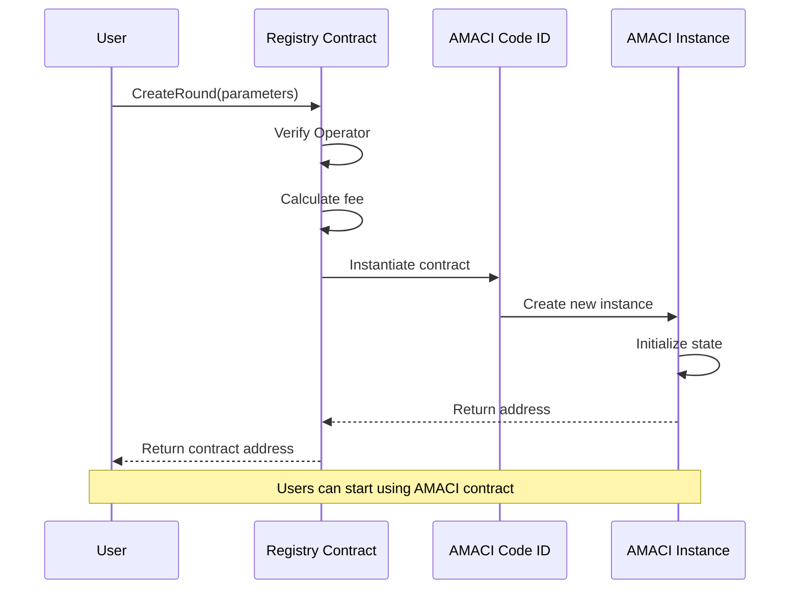
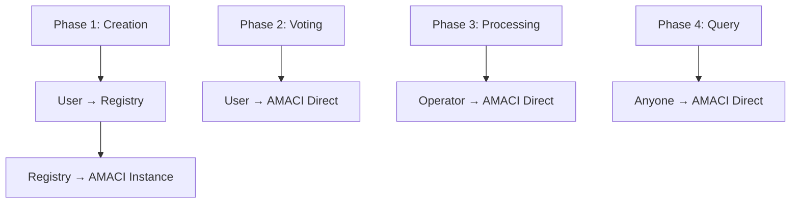
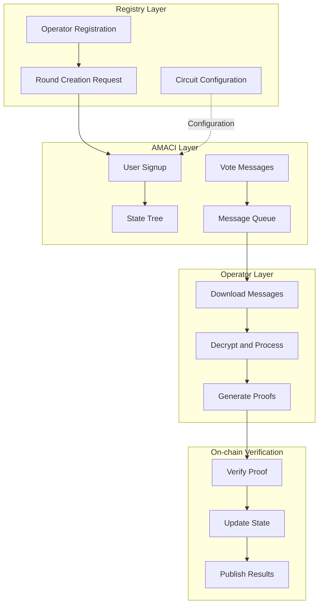
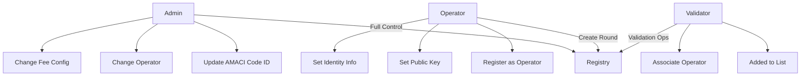
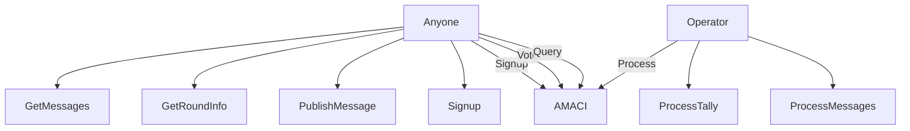
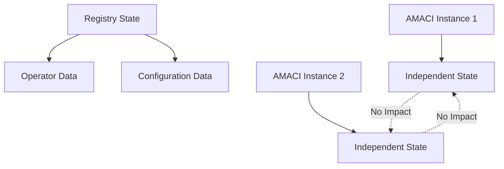

# Architecture Overview

MACI's contract system adopts a modular design, using the Registry contract to uniformly manage multiple AMACI voting contract instances. This section introduces the overall architecture and design philosophy.

## System Architecture

### Architecture Diagram



### Component Description

**Registry Contract (Registration Hub)**
- Manages Operator registration and configuration
- Manages Validator list
- Creates and configures AMACI contract instances
- Configures ZK circuit parameters
- Manages fee configuration

**AMACI Contract (Voting Instance)**
- Handles user signup
- Receives and stores encrypted voting messages
- Verifies zero-knowledge proofs
- Publishes voting results
- Each voting round corresponds to an independent AMACI contract instance

## Design Philosophy

### 1. Separation of Concerns



**Registry Focuses On:**
- Who can run an Operator
- How to create voting rounds
- System-level parameter configuration

**AMACI Focuses On:**
- How users participate in voting
- How messages are stored and processed
- How results are verified and published

### 2. One-Click Creation

Users don't need to manually deploy AMACI contracts:

```rust
// Users only need to call one Registry function
ExecuteMsg::CreateRound {
    operator,
    max_voter,
    voice_credit_amount,
    vote_option_map,
    // ... other parameters
}

// Registry automatically:
// 1. Verifies Operator registration
// 2. Instantiates AMACI contract
// 3. Configures initial parameters
// 4. Returns contract address
```

### 3. Standardized Interface

All AMACI contract instances share the same interface:

```rust
// Unified message types
pub enum ExecuteMsg {
    Signup { ... },
    PublishMessage { ... },
    ProcessMessages { ... },
    ProcessTally { ... },
}

// Unified query interface
pub enum QueryMsg {
    GetRoundInfo {},
    GetNumSignups {},
    GetMessage { index },
}
```

### 4. Flexible Configuration

Supports multiple configuration options:

```rust
// Voting type
pub enum CircuitType {
    IP1V = 0,  // One person one vote
    QV = 1,    // Quadratic voting
}

// Certification system
pub enum CertificationSystem {
    Oracle = 0,     // Oracle whitelist
    OnChain = 1,    // On-chain whitelist
}

// Whitelist configuration
pub struct WhitelistBase {
    ecosystem: String,        // cosmoshub / doravota
    snapshot_height: String,  // Snapshot height
    voting_power_args: VotingPowerArgs,
}
```

## Contract Relationships

### Creation Flow



### Interaction Pattern



**Note:**
- Registry only participates during creation
- After creation, users interact directly with AMACI contract
- Registry does not participate in the voting process

## Data Flow

### Complete Data Flow Diagram



## State Management

### Registry State

```rust
// State stored in Registry
pub struct RegistryState {
    // Administrators
    admin: Addr,
    operator: Addr,
    
    // AMACI Contract Code ID
    amaci_code_id: u64,
    
    // Operator set
    operator_set: Map<Addr, bool>,
    operator_pubkey: Map<Addr, PubKey>,
    operator_identity: Map<Addr, String>,
    
    // Validator set
    validator_list: Vec<Addr>,
    validator_operator: Map<Addr, Addr>,
    
    // Fee configuration
    circuit_charge_config: CircuitChargeConfig,
}
```

### AMACI State

```rust
// State stored in AMACI contract
pub struct AMACIState {
    // Round information
    round_info: RoundInfo,
    voting_time: VotingTime,
    
    // Coordinator public key
    coordinator_pub_key: PubKey,
    
    // User data
    num_sign_ups: u64,
    voice_credit_amount: Uint256,
    
    // Message queue
    messages: Vec<Message>,
    
    // State tree
    state_tree_depth: u8,
    state_tree_root: Uint256,
    
    // Voting configuration
    max_vote_options: Uint256,
    vote_option_map: Vec<String>,
    
    // Circuit configuration
    circuit_type: Uint256,
    certification_system: Uint256,
    
    // Whitelist
    whitelist: Option<WhitelistBase>,
}
```

## Permission Management

### Registry Permissions



### AMACI Permissions



## Security Design

### 1. Contract Validation

```rust
// Validation when Registry creates AMACI
fn create_round(
    deps: DepsMut,
    info: MessageInfo,
    operator: Addr,
    // ... other parameters
) -> Result<Response, ContractError> {
    // Validation 1: Operator must be registered
    if !is_maci_operator(deps.storage, &operator)? {
        return Err(ContractError::OperatorNotRegistered {});
    }
    
    // Validation 2: Parameter validity
    if max_voter == Uint256::zero() {
        return Err(ContractError::InvalidMaxVoter {});
    }
    
    // Validation 3: Fee check
    let required_fee = calculate_fee(&circuit_charge_config);
    if info.funds.amount < required_fee {
        return Err(ContractError::InsufficientFee {});
    }
    
    // Pass validation, create contract
    instantiate_amaci_contract(deps, operator, ...)
}
```

### 2. State Isolation



**Features:**
- Each AMACI instance has independent state
- Issues in one instance don't affect others
- Registry only stores global configuration

### 3. Upgrade Mechanism

```rust
// Registry supports updating AMACI Code ID
ExecuteMsg::UpdateAmaciCodeId {
    amaci_code_id: u64,
}

// Newly created AMACI instances use new Code ID
// Existing instances remain unaffected
```

## Deployment Process

### Deploy AMACI Contract Code

```bash
# Compile AMACI contract
cd contracts/amaci
cargo wasm

# Optimize wasm
docker run --rm -v "$(pwd)":/code \
  cosmwasm/rust-optimizer:0.12.11

# Upload to chain
dorad tx wasm store artifacts/amaci.wasm \
  --from deployer \
  --gas auto

# Get Code ID (e.g.: 123)
```

### Deploy Registry Contract

```bash
# Instantiate Registry
dorad tx wasm instantiate 123 \
  '{
    "admin": "dora1...",
    "operator": "dora1...",
    "amaci_code_id": 123
  }' \
  --from deployer \
  --label "MACI Registry" \
  --gas auto

# Get Registry address (e.g.: dora1registry...)
```

### Register Operator

```bash
# Operator registration
dorad tx wasm execute dora1registry... \
  '{
    "set_maci_operator": {
      "operator": "dora1operator..."
    }
  }' \
  --from operator \
  --gas auto

# Set Operator public key
dorad tx wasm execute dora1registry... \
  '{
    "set_maci_operator_pubkey": {
      "pubkey": {
        "x": "0x...",
        "y": "0x..."
      }
    }
  }' \
  --from operator \
  --gas auto
```

### Create Voting Round

Now users can create AMACI instances through Registry:

```typescript
// Using SDK
const round = await client.createOracleMaciRound({
  signer: wallet,
  operatorPubkey: '0x...',
  // ... other parameters
});

console.log('AMACI contract address:', round.contractAddress);
```

## Advantages

### 1. Simplified Deployment

**Traditional Way:**
```
User → Compile contract → Upload code → Instantiate contract → Configure parameters
```

**Registry Way:**
```
User → Call CreateRound → Done
```

### 2. Unified Management

- All Operators registered in one place
- Unified fee configuration
- Unified Code ID management

### 3. Security

- Registry verifies Operator qualifications
- Standardized contract creation process
- Reduces human error

### 4. Upgradability

- New instances use new code after Code ID update
- Old instances continue running unaffected
- Smooth upgrade path

## Next Steps

After understanding the overall architecture, you can dive deeper into:

- [Registry Contract](/docs/contracts/registry) - Learn Registry functionality in detail
- [AMACI Contract](/docs/contracts/amaci) - Learn AMACI's voting logic
- [Complete Workflow](/docs/contracts/workflow) - Understand the full process from creation to results
