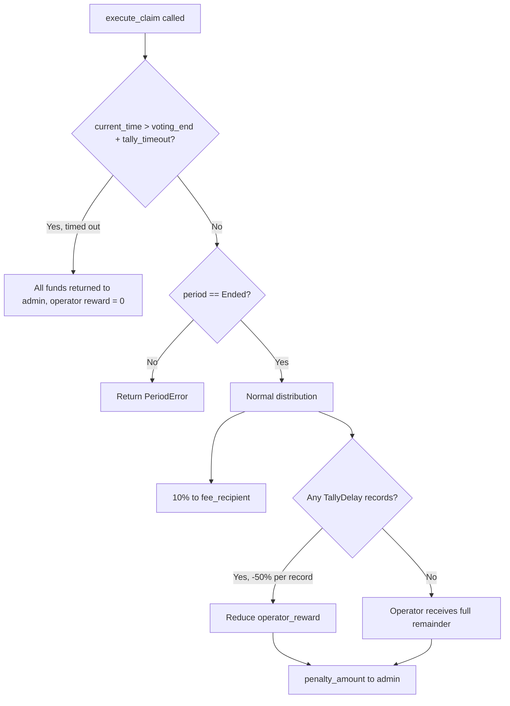

# Delay Structure

The MACI protocol uses a dynamic delay mechanism to give Operators reasonable processing time, while penalizing overdue behavior. Delay limits are computed dynamically based on circuit tier and actual vote message count, rather than using a fixed value.

---

## Core Formula

```
delay_allowed = (BASE_DELAY + msg_count × PER_VOTE_DELAY) × 3
tally_timeout = delay_allowed + 2 days
```

| Variable | Meaning |
|----------|---------|
| `BASE_DELAY` | Circuit-specific base processing time (seconds), derived from benchmarks |
| `msg_count` | Actual number of vote messages published (`msg_chain_length`) |
| `PER_VOTE_DELAY` | Per-vote processing time (flat 1 second/vote) |
| `×3` | Adaptation multiplier, gives Operator extra buffer |
| `+2 days` | Hard timeout added on top of `delay_allowed` |

---

## Parameters

### Base Delay (per circuit tier)

| Circuit | Max Voters | Benchmark Time | Base Delay |
|---------|-----------|---------------|-----------|
| **2-1-1-5** | ≤ 25 | ~0.48 min (0.2267 + 0.2516 min) | **60s** |
| **4-2-2-25** | ≤ 625 | ~2.88 min (2.5346 + 0.3404 min) | **180s** |
| **6-3-3-125** | ≤ 15,625 | ~22.26 min (21.9313 + 0.3308 min) | **1380s** |
| **9-4-3-125** | ≤ 1,953,125 | *(benchmark in progress)* | **14400s (TODO)** |

### Per-Vote Delay (unified)

| Parameter | Value | Rationale |
|-----------|-------|-----------|
| `PER_VOTE_DELAY` | **1 second/vote** | Based on 4-2-2-25 (0.2531s) and 6-3-3-125 (0.2289s); conservative round-up of the higher value |

---

## Example Calculations

### 2-1-1-5, 10 votes

```
delay_allowed = (60 + 10 × 1) × 3 = 210s = 3.5 min
tally_timeout = 210 + 172800 = 173010s ≈ 2 days 3.5 min
```

### 4-2-2-25, 500 votes

```
delay_allowed = (180 + 500 × 1) × 3 = 2040s = 34 min
tally_timeout = 2040 + 172800 = 174840s ≈ 2 days 34 min
```

### 6-3-3-125, 10000 votes

```
delay_allowed = (1380 + 10000 × 1) × 3 = 34140s ≈ 9.5 hours
tally_timeout = 34140 + 172800 = 206940s ≈ 2.4 days
```

---

## Delay Checkpoints

### Tally Delay

Evaluated when `stop_tallying_period` is called:

```
Triggered when: current_time - voting_end_time > delay_allowed
```

When triggered, a `TallyDelay` record is written on-chain and the following event attributes are emitted (consumed by the indexer):

| Attribute | Description |
|-----------|-------------|
| `delay_timestamp` | Voting end time (delay start point) |
| `delay_duration` | Actual elapsed time (seconds) |
| `delay_reason` | Timeout description string |
| `delay_type` | `"tally_delay"` |

### Deactivate Delay

Evaluated when `process_deactivate_message` is called (fixed 10-minute window; not affected by this change).

---

## Timeout Penalty (execute_claim)

When `claim` is called:



| Scenario | Operator receives | Admin receives |
|---------|------------------|---------------|
| No delay, completed on time | 90% of contract balance | 10% (fee_recipient) |
| 1 TallyDelay record | 45% (-50% penalty) | 55% |
| Exceeded tally_timeout | 0% | 100% |

---

## Relationship to Fee Structure

`delay_allowed` and `tally_timeout` are both computed dynamically from the **actual `msg_chain_length`** (votes published). This is independent of the Base Fee which is charged upfront based on `max_voter`:

| Dimension | Fee | Delay limit |
|-----------|-----|-------------|
| Basis | max_voter (maximum scale) | msg_chain_length (actual messages) |
| Timing | Charged once at round creation | Computed dynamically when tallying ends |
| Circuit differentiation | Base Fee varies by circuit | Base Delay varies by circuit |
| Unified component | Vote Fee = 0.06 DORA/vote (flat) | Per-Vote Delay = 1s/vote (flat) |
