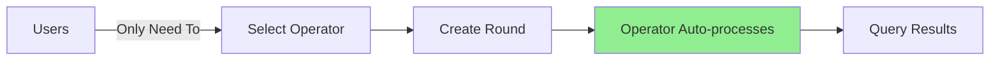
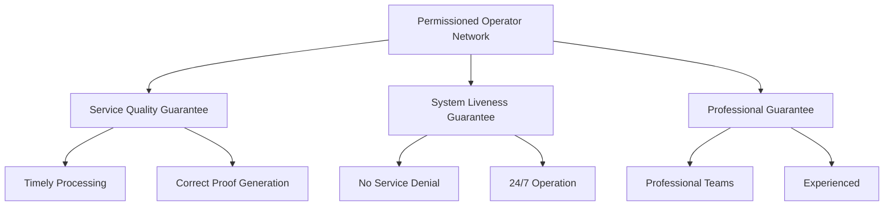
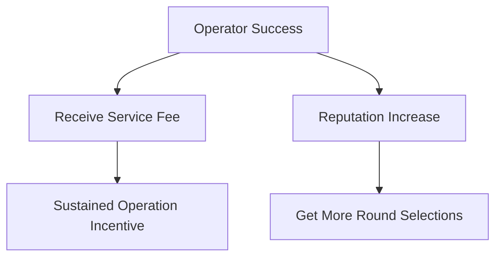
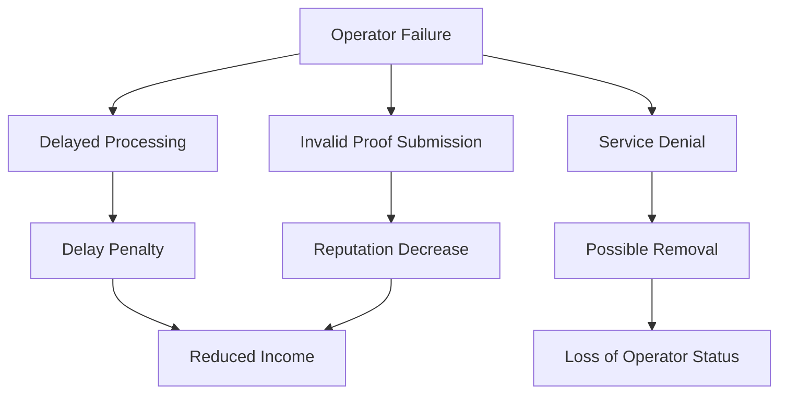
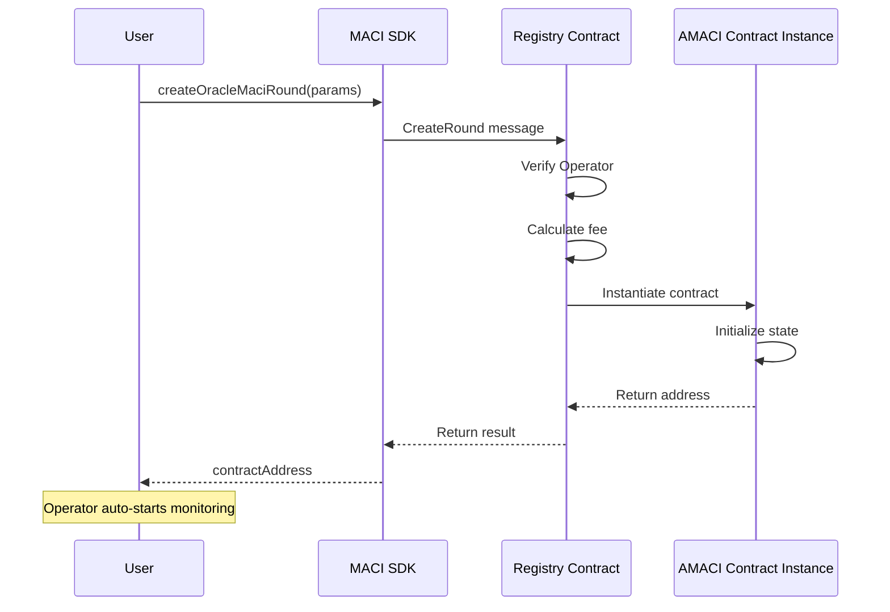
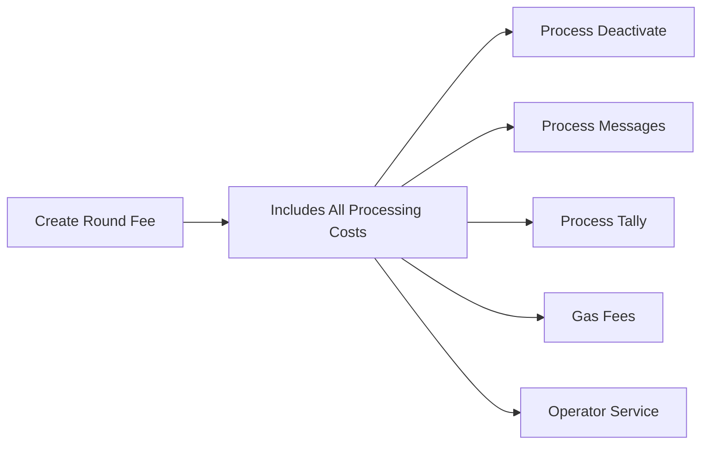
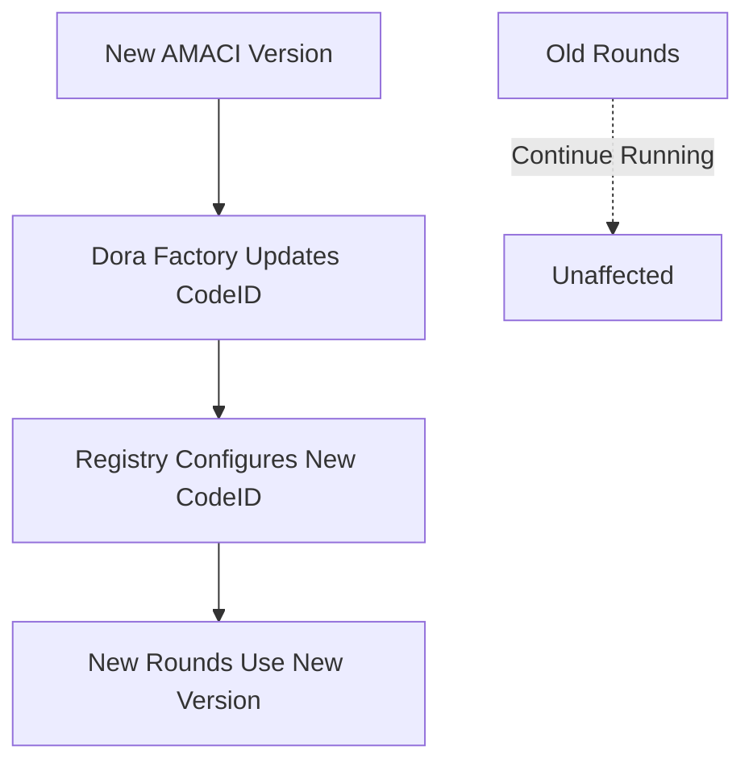

# Registry Contract

The Registry contract is the registration hub of the AMACI system, **maintained and managed by Dora Factory**. Users can create voting rounds with one click through Registry without worrying about underlying deployment details.

## Professional Operator Network

### What is an Operator

Operators (also called Coordinators) are professional voting processing service providers responsible for:

**Core Responsibilities:**
- **Process Voting Messages**: Download and decrypt all encrypted voting messages
- **Verify Signatures**: Validate each message
- **Maintain State Tree**: Update voter states and voting results
- **Generate Zero-Knowledge Proofs**: Prove processing correctness
- **Publish Results**: Submit proofs and results on-chain

**What This Means for Users:**



Users **Don't Need To**:
- Run Operator software themselves
- Learn complex ZK circuits
- Maintain servers
- Monitor processing progress

Users **Only Need To**:
- Select an Operator from the list
- Create Round and pay service fee
- Wait for Operator to auto-process
- Query final results

### Permissioned Operator Network

**Current Status:**

AMACI uses a **Permissioned** Operator network:

- **Management**: Operator list maintained by Dora Factory officially
- **Access Control**: Only verified professional nodes can become Operators
- **Purpose**: Ensure service quality, reliability, and timeliness

**Mainnet Operator List:**

🔗 https://vota.dorafactory.org/operators

**Why Permissioned?**



1. **Liveness Guarantee**: Ensures Operators process promptly without denial of service
2. **Quality Guarantee**: Professional team operations reduce errors
3. **Reliability**: Verified nodes with verifiable history
4. **Accountability**: Reward and penalty mechanisms constrain behavior

### How to Choose an Operator

**Method 1: Query via SDK**

```typescript
import { MaciClient } from '@dorafactory/maci-sdk';

const client = new MaciClient({ network: 'mainnet' });

// Get Operator list
const operators = await client.indexer.getOperators('first', 50);

// View each Operator's information
operators.forEach(op => {
  console.log(`
    Name: ${op.identity || 'Unnamed'}
    Address: ${op.address}
    Pubkey: ${op.pubkey}
    Status: ${op.isActive ? 'Active' : 'Inactive'}
  `);
});

// Get specific Operator details
const operator = await client.indexer.getOperatorByAddress('dora1operator...');
console.log('Operator info:', operator);
```

**Method 2: Visit Web Interface**

Visit https://vota.dorafactory.org/operators to view:
- Operator names and identities
- Historical operation records
- Successfully processed Round count
- Currently running Rounds
- Service status

**Selection Criteria:**

| Factor | Description | How to Check |
|--------|-------------|--------------|
| Success Rate | Historical processing success rate | Operator list page |
| Response Time | Average processing time | View historical Rounds |
| Activity | Currently running Round count | Operating column |
| Reputation | Community feedback | Community discussions |
| Stability | Long-term operation record | Past (success/total) |

**Query Operator Performance:**

```typescript
// Query Operator miss rate
const performance = await client.indexer.queryMissRate(
  operatorAddress,
  30  // Last 30 days
);

console.log('Success rate:', performance.successRate);
console.log('Miss count:', performance.missCount);

// Query Operator's Rounds
const rounds = await client.indexer.getRoundsByOperator(
  operatorAddress,
  'first',
  20
);

console.log(`This Operator ran ${rounds.length} Rounds`);
```

### Operator Reward and Penalty Mechanism

**Reward Mechanism:**



- **Service Fee Income**: Earn fees for each successfully processed Round
- **Reputation Rewards**: Timely and accurate processing increases reputation
- **Priority Selection**: High reputation Operators are more likely to be chosen
- **Long-term Income**: Stable operation yields sustained revenue

**Penalty Mechanism:**



- **Delay Penalty**: Overtime processing results in fee deduction
- **Reputation Decrease**: Failures or errors lower reputation
- **User Loss**: Low reputation leads users to avoid selection
- **Possible Removal**: Repeated failures may result in removal from Operator list

**Monitoring and Transparency:**

All Operator performance is publicly queryable:

```typescript
// Query Operator historical performance
const missRate = await client.indexer.queryMissRate(
  operatorAddress,
  30  // Last 30 days
);

console.log('Successful processing:', missRate.successCount);
console.log('Failures:', missRate.missCount);
console.log('Success rate:', missRate.successRate);

// Query all Rounds processed by Operator
const rounds = await client.indexer.getRoundsByOperator(
  operatorAddress,
  'first',
  100
);

console.log('Total Rounds:', rounds.length);
console.log('Most recent:', rounds[0].title);
```

---

## Creating Voting Rounds (User Perspective)

### One-Click Creation Flow

Users create AMACI Rounds through Registry with a highly automated process:



### SDK Creation Example

```typescript
import { MaciClient, MaciCircuitType } from '@dorafactory/maci-sdk';

const client = new MaciClient({ network: 'mainnet' });

// Method 1: Whitelist mode
const roundWithWhitelist = await client.createMaciRound({
  signer: wallet,
  
  // 1. Select Operator
  operatorPubkey: '0e752c8f4c4c9f5c...',
  
  // 2. Configure voting time
  startVoting: new Date('2024-03-01T00:00:00Z'),
  endVoting: new Date('2024-03-07T23:59:59Z'),
  
  // 3. Set Round information
  title: 'Community Proposal Vote',
  description: 'Vote on next development direction',
  link: 'https://forum.example.com/proposal',
  
  // 4. Configure voting options
  voteOptionMap: [
    'Proposal A: Increase Community Funding',
    'Proposal B: Improve Technical Infrastructure',
    'Proposal C: Expand Marketing'
  ],
  
  // 5. Select voting type
  circuitType: MaciCircuitType.QV,
  
  // 6. Configure whitelist
  whitelist: [
    'dora1abc...',
    'dora1def...',
    'dora1ghi...'
    // ... more whitelist addresses
  ],
  voiceCreditsPerUser: 100  // 100 voting credits per person
});

// Method 2: Pre-add-new-key pre-generated mode
const roundWithPreKeys = await client.createMaciRound({
  signer: wallet,
  operatorPubkey: '0e752c8f4c4c9f5c...',
  
  // ... same parameters as above
  
  // Configure pre-deactivate (platform pre-generated)
  preDeactivateRoot: preGeneratedRoot,
  preDeactivateCoordinator: {
    x: platformCoordPubkey[0],
    y: platformCoordPubkey[1]
  }
});

console.log('Round created successfully!');
console.log('Contract address:', round.contractAddress);
console.log('Transaction hash:', round.transactionHash);
console.log('');
console.log('Next steps:');
console.log('1. Whitelisted users can signup to register');
console.log('   Or users can use pre-add-new-key for anonymous registration');
console.log('2. Operator automatically monitors this Round');
console.log('3. Operator auto-processes after voting period ends');
console.log('4. Query results after processing completes');
```

### Selecting from Operator List

**Query and Select Operator:**

```typescript
// 1. Get all active Operators
const operators = await client.indexer.getOperators('first', 50);

// 2. Filter active Operators
const activeOperators = operators.filter(op => op.isActive);

console.log(`Found ${activeOperators.length} active Operators`);

// 3. View each Operator's details
for (const op of activeOperators) {
  console.log(`\n${op.identity || op.address}`);
  console.log(`- Address: ${op.address}`);
  console.log(`- Pubkey: ${op.pubkey.slice(0, 20)}...`);
  
  // Query historical performance
  const rounds = await client.indexer.getRoundsByOperator(
    op.address,
    'first',
    100
  );
  console.log(`- Processed Rounds: ${rounds.length}`);
  
  // Query success rate
  const perf = await client.indexer.queryMissRate(op.address, 30);
  console.log(`- 30-day success rate: ${perf.successRate}%`);
}

// 4. Select an Operator
const selectedOperator = activeOperators[0];
console.log(`\n✓ Selected Operator: ${selectedOperator.identity}`);

// 5. Create Round using this Operator (whitelist mode)
const round = await client.createMaciRound({
  signer: wallet,
  operatorPubkey: selectedOperator.pubkey,
  // ...
  whitelist: ['dora1...', 'dora1...'],
  voiceCreditsPerUser: 100
});
```

---

## Operator Service Fees

### Fee Structure

Creating a Round requires paying Operator service fees:

```rust
// Fee calculation formula (example)
total_fee = base_fee + (max_voter × per_voter_fee) × circuit_complexity_factor

Specific amount depends on:
- Maximum voter count (max_voter)
- Number of voting options
- Circuit type (1P1V / QV)
- Registry configured fee rates
```

**Fee Description:**



**One-Time Payment:**
- Pay all fees when creating Round
- Covers entire Round processing costs
- Users don't pay extra for subsequent voting (uses Gas Station)
- Operator bears all processing and gas costs

### Fee Query

```typescript
// Query fee for creating Round
const fee = await client.queryAMaciChargeFee({
  maxVoter: 1000,
  maxOption: 10
});

console.log('Create Round fee:', fee);
console.log('Includes:');
console.log('- Operator service fee');
console.log('- Entire Round processing costs');
console.log('- User Gas Station subsidy');
```

### Fee Payment

```typescript
// SDK automatically handles fee payment
const round = await client.createMaciRound({
  signer: wallet,  // Wallet pays required fee
  // ... other parameters
  whitelist: whitelistAddresses,
  voiceCreditsPerUser: 100
});

// Users only need to ensure wallet has sufficient balance
// Registry automatically:
// 1. Calculates required fee
// 2. Deducts from transaction
// 3. Transfers to Operator
```

---

## User Workflow

### Complete User Experience

```typescript
// ========== Select Operator ==========
const operators = await client.indexer.getOperators('first', 10);
const selectedOp = operators[0];  // Select best performing

console.log('Selected Operator:', selectedOp.identity);

// ========== Create Round ==========
const round = await client.createMaciRound({
  signer: wallet,
  operatorPubkey: selectedOp.pubkey,
  startVoting: new Date(),
  endVoting: new Date(Date.now() + 7 * 24 * 60 * 60 * 1000),
  title: 'Community Vote',
  voteOptionMap: ['Option A', 'Option B', 'Option C'],
  circuitType: MaciCircuitType.QV,
  
  // Whitelist mode
  whitelist: [
    'dora1user1...',
    'dora1user2...',
    'dora1user3...'
  ],
  voiceCreditsPerUser: 100
});

console.log('Round created successfully');
console.log('Contract address:', round.contractAddress);

// ========== Users Participate in Voting ==========
// Users can start registering and voting
// (Operator auto-monitors)

// ========== Wait for Results ==========
// After voting period ends, Operator auto-processes
// No user action required

// Periodically query status
const checkStatus = setInterval(async () => {
  const info = await client.getRoundInfo({ contractAddress: round.contractAddress });
  console.log('Current status:', info.status);
  
  if (info.status === 'Tallied') {
    console.log('Voting completed!');
    console.log('Results:', info.results);
    clearInterval(checkStatus);
  }
}, 60000);  // Query every minute
```

### User Experience Advantages

**Traditional Way vs Registry Way:**

| Operation | Traditional Way | Registry Way |
|-----------|----------------|--------------|
| Learning Curve | Need to understand contract deployment | Just call one function |
| Technical Barrier | Need to know CosmWasm | Use SDK |
| Time Cost | Hours (deploy + configure) | Minutes |
| Operator Configuration | Need to run yourself | Select existing one |
| Ongoing Maintenance | Need to monitor and process | Operator auto-processes |
| Failure Risk | High configuration error risk | Registry validates, low risk |

---

## Registry System Description

### Registry's Role

Registry contract serves as the system's "entry point" and "management hub":

**For Users:**
- Provides one-click Round creation interface
- Simplifies deployment process
- Auto-validates and configures

**For Operators:**
- Provides registration and management interface
- Records Operator info and public keys
- Assigns Rounds to Operators

**For the System:**
- Centrally manages AMACI Code ID
- Configures fees and parameters
- Maintains Operator network

### Registry Maintenance

**Who Maintains:**

Registry contract is maintained and managed by **Dora Factory officially**.

**Users Don't Need to Worry About:**
- How to deploy Registry
- How to update Code ID
- How to manage Operator list
- How to configure system parameters

**Users Only Need to:**
- Use SDK to create Rounds
- Select appropriate Operator
- Pay service fees

### System Upgrades

When new AMACI contract versions are available:



- Dora Factory handles updates
- New Rounds created automatically use new version
- Existing Rounds continue running unaffected
- Smooth upgrades without user action

## FAQ

### Q: Can I become an Operator?

**A:** Operators use a permissioned system, contact Dora Factory to apply. Requirements:
- Professional operations team
- Stable server resources
- Ability to generate ZK proofs
- Good operational track record

### Q: How do I know if an Operator is reliable?

**A:** You can check Operator historical records:
```typescript
// Query success rate
const perf = await client.indexer.queryMissRate(operatorAddress, 30);

// Query processed Rounds
const rounds = await client.indexer.getRoundsByOperator(
  operatorAddress,
  'first',
  100
);
```

### Q: What if an Operator doesn't process?

**A:** Operator network has guarantee mechanisms:
- Delay penalty mechanisms
- Reputation decreases
- Users won't select them next time
- Repeated failures result in removal

### Q: How are fees determined?

**A:** Fees depend on:
- Voter count (max_voter)
- Circuit complexity
- Registry configured fee rates
- Can query via `queryAMaciChargeFee`

### Q: Will Registry be upgraded?

**A:** Registry is maintained by Dora Factory:
- Periodically upgraded to support new features
- Upgrades are transparent to users
- Already created Rounds remain unaffected

## Next Steps

After understanding Registry and the Operator network, you can:

- [AMACI Contract](/docs/contracts/amaci) - Learn about voting contracts and three registration methods
- [Complete Workflow](/docs/contracts/workflow) - Understand the full process from creation to results
- [SDK Usage Guide](/docs/sdk/create-round) - Use SDK to create voting rounds
- [Quick Start](/docs/introduction/quick-start) - Create your first vote
