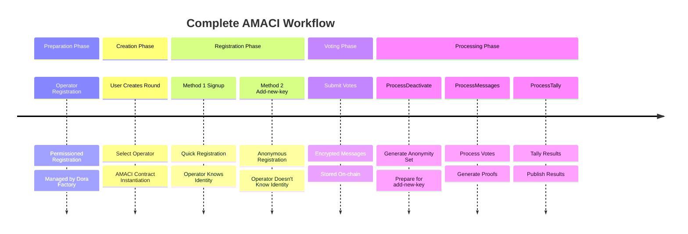
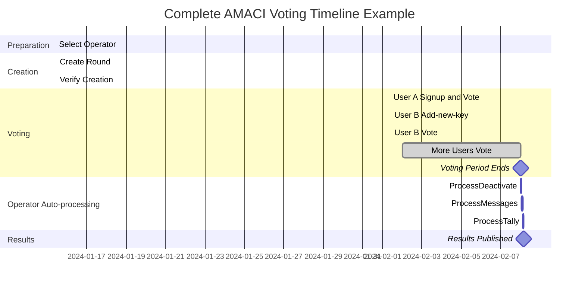

# Complete AMACI Workflow

This section demonstrates the entire AMACI process from creating a voting round to publishing results through a complete example, including how to use add-new-key for anonymous voting.

## Workflow Overview



## Phase 1: Preparation

### Operator Network

The Operator network is officially maintained by Dora Factory using a permissioned system.

**User Perspective:**
- No need to worry about how Operators register
- Select directly from existing list
- View at: https://vota.dorafactory.org/operators

**Query Available Operators:**

```typescript
import { MaciClient } from '@dorafactory/maci-sdk';

const client = new MaciClient({ network: 'mainnet' });

// Get all Operators
const operators = await client.indexer.getOperators('first', 50);

console.log(`Total ${operators.length} Operators`);

// Select a well-performing Operator
const bestOperator = operators
  .filter(op => op.isActive)
  .sort((a, b) => b.successRate - a.successRate)[0];

console.log('Selected Operator:', bestOperator.identity);
console.log('Pubkey:', bestOperator.pubkey);
```

## Phase 2: Create Voting Round

### 2.1 Prepare Parameters

```typescript
const roundParams = {
  // Operator public key (for encryption)
  operatorPubkey: operatorKeypair.publicKey,
  
  // Voting time
  startVoting: new Date('2024-02-01T00:00:00Z'),
  endVoting: new Date('2024-02-07T23:59:59Z'),
  
  // Round information
  title: 'Community Fund Allocation Vote',
  description: 'Vote on how to allocate 100,000 DORA community funds',
  link: 'https://forum.example.com/proposal',
  
  // Voting options
  voteOptionMap: [
    'Project A: DeFi Development Tools',
    'Project B: Developer Education Program',
    'Project C: Marketing Campaign',
    'Project D: Community Infrastructure',
  ],
  
  // Voting type (Quadratic Voting)
  circuitType: MaciCircuitType.QV,
  
  // Whitelist configuration
  whitelistEcosystem: 'cosmoshub',
  whitelistSnapshotHeight: '23342001',
  whitelistVotingPowerArgs: {
    mode: 'slope',
    slope: '1000000',  // 1 ATOM = 1 voice credit
    threshold: '0',
  },
};
```

### 2.2 Create Round

```typescript
import { MaciClient, MaciCircuitType } from '@dorafactory/maci-sdk';

const client = new MaciClient({ network: 'mainnet' });

const round = await client.createOracleMaciRound({
  signer: creatorWallet,
  operatorPubkey: bestOperator.pubkey,  // Use selected Operator
  
  startVoting: new Date('2024-03-01T00:00:00Z'),
  endVoting: new Date('2024-03-07T23:59:59Z'),
  
  title: 'Community Fund Allocation Vote',
  description: 'Vote on community fund allocation',
  link: 'https://forum.example.com/proposal',
  
  voteOptionMap: [
    'Project A: DeFi Development Tools',
    'Project B: Developer Education',
    'Project C: Marketing',
    'Project D: Community Infrastructure'
  ],
  
  circuitType: MaciCircuitType.QV,
  
  whitelistEcosystem: 'cosmoshub',
  whitelistSnapshotHeight: '0',
  whitelistVotingPowerArgs: {
    mode: 'slope',
    slope: '1000000',
    threshold: '1000000'
  }
});

console.log('Round created successfully!');
console.log('AMACI contract address:', round.contractAddress);
console.log('Transaction hash:', round.transactionHash);
console.log('Operator will auto-monitor this Round');
```

### 2.3 Verify Creation

```typescript
// Query Round information
const roundInfo = await client.getRoundInfo({ contractAddress: round.contractAddress });

console.log('Round info:', {
  title: roundInfo.title,
  status: roundInfo.status,
  coordinatorPubkey: roundInfo.coordinatorPubkey,
  numSignups: roundInfo.numSignups
});
```

## Phase 3: User Registration and Voting

### 3.1 User A: Using Signup (Fast Mode)

```typescript
console.log('=== User A: Using Signup (Fast but Operator knows identity) ===\n');

// Generate MACI account
const userAKeypair = await client.genKeypairFromSign({
  signer: walletA,
  address: addressA
});

// Wait for Gas Station
let hasFeegrant = false;
while (!hasFeegrant) {
  hasFeegrant = await client.hasFeegrant({
    address: addressA,
    contractAddress: round.contractAddress
  });
  if (!hasFeegrant) {
    await new Promise(resolve => setTimeout(resolve, 2000));
  }
}

// Signup (whitelist addresses only)
await client.signup({
  signer: walletA,
  address: addressA,
  contractAddress: round.contractAddress,
  maciKeypair: userAKeypair,
  gasStation: true
});

console.log('User A signup successful');
console.log('⚠️  Note: User A\'s address must be in whitelist');

// Vote
const roundInfo = await client.getRoundInfo({ contractAddress: round.contractAddress });

await client.vote({
  signer: walletA,
  address: addressA,
  contractAddress: round.contractAddress,
  selectedOptions: [
    { idx: 0, vc: 8 },  // Project A: 8 votes (costs 64 credits)
    { idx: 2, vc: 6 }   // Project C: 6 votes (costs 36 credits)
  ],
  operatorCoordPubKey: [
    BigInt(roundInfo.coordinatorPubkeyX),
    BigInt(roundInfo.coordinatorPubkeyY)
  ],
  maciKeypair: userAKeypair,
  gasStation: true
});

console.log('User A voted successfully');
console.log('⚠️  Note: Operator can know User A\'s identity through on-chain transactions');
```

### 3.2 User B: Using Add-new-key (Anonymous Mode)

```typescript
console.log('\n=== User B: Using Add-new-key (Fully Anonymous) ===\n');

// Prerequisite: User B already has an old account and has deactivated
// Or wait for others to deactivate

// Wait for Operator to process deactivate
console.log('Waiting for Operator to process deactivate messages...');
// (This is done automatically by Operator)

// Get deactivate data
const deactivates = await client.fetchAllDeactivateLogs(round.contractAddress);
console.log(`Deactivate data retrieved, anonymity set size: ${deactivates.length}`);

// Generate add-new-key payload
import { VoterClient } from '@dorafactory/maci-sdk';

const voterClient = new VoterClient({
  network: 'mainnet',
  secretKey: oldUserPrivateKey  // Old user's private key
});

const addKeyPayload = await voterClient.buildAddNewKeyPayload({
  stateTreeDepth: 10,
  operatorPubkey: roundInfo.coordinatorPubkey,
  deactivates,
  wasmFile,  // Need addNewKey circuit
  zkeyFile
});

console.log('ZK proof generated successfully');

// Submit add-new-key with new wallet
const newKeypair = genKeypair();

await client.addNewKey({
  signer: newWalletB,  // Brand new wallet!
  contractAddress: round.contractAddress,
  d: addKeyPayload.d,
  proof: addKeyPayload.proof,
  nullifier: addKeyPayload.nullifier,
  newMaciKeypair: newKeypair,
  fee: 'auto'
});

console.log('User B anonymously registered successfully');
console.log('Operator cannot determine User B\'s real identity');

// Vote
await client.vote({
  signer: newWalletB,
  address: newAddressB,
  contractAddress: round.contractAddress,
  selectedOptions: [
    { idx: 1, vc: 9 },  // Project B: 9 votes
    { idx: 3, vc: 4 }   // Project D: 4 votes
  ],
  operatorCoordPubKey: [
    BigInt(roundInfo.coordinatorPubkeyX),
    BigInt(roundInfo.coordinatorPubkeyY)
  ],
  maciKeypair: newKeypair,
  gasStation: true
});

console.log('User B voted successfully (fully anonymous)');
```

### 3.3 Query During Voting Period

```typescript
// Query current status
const currentInfo = await client.getRoundInfo({ contractAddress: round.contractAddress });

console.log('Round current status:');
console.log('- Signups:', currentInfo.numSignups);
console.log('- Status:', currentInfo.status);

// Query message count
// (Need to query contract directly or through indexer)
```

## Phase 4: Operator Auto-processing (No User Action Required)

After voting period ends, Operator automatically completes all processing work.

### 4.1 Process Deactivate (If Any)

If users submitted deactivate messages, Operator processes them first:

```typescript
console.log('=== Operator Auto-processing Workflow ===\n');

// Download deactivate messages
const deactivateMessages = await contract.query({
  get_deactivate_messages: {}
});

if (deactivateMessages.length > 0) {
  console.log(`Found ${deactivateMessages.length} deactivate messages`);
  
  // Process and generate deactivate tree
  // (Operator uses professional tools to auto-complete)
  
  // Submit ProcessDeactivate proof
  console.log('ProcessDeactivate completed');
  console.log(`Generated anonymity set, size: ${deactivateMessages.length}`);
}
```

### 4.2 Process Messages

```typescript
// Operator processes voting messages
console.log('\nOperator: Processing voting messages...');

// 1. Download all voting messages
// 2. Decrypt with Operator private key
// 3. Verify signatures and validity
// 4. Process in nonce order
// 5. Update state tree
// 6. Generate ProcessMessages ZK proof
// 7. Submit on-chain for verification

// (All done automatically by Operator, no user action needed)

console.log('ProcessMessages completed');
```

### 4.3 Process Tally

```typescript
// Operator tallies results
console.log('\nOperator: Tallying vote results...');

// 1. Traverse final state tree
// 2. Tally votes for each option
// 3. Generate ProcessTally ZK proof
// 4. Submit on-chain
// 5. Publish results

console.log('ProcessTally completed');
console.log('Voting results published!');
```

### Operator Processing Time

**Typical Processing Time:**

```
Voting Scale   Process Deactivate   Process Messages   Process Tally   Total
100 people     5-10 minutes         30-60 minutes      10-20 minutes   ~1.5 hours
500 people     10-20 minutes        1-2 hours          20-40 minutes   ~3 hours
1000 people    20-30 minutes        2-4 hours          30-60 minutes   ~5 hours
```

**User Experience:**
- Users don't need to wait, can leave
- Operator auto-processes in background
- Can set up notifications (if supported)
- Just query status periodically

## Phase 5: Query and Verify Results

### 5.1 Query Final Results

```typescript
// Anyone can query results
const finalRound = await client.getRoundInfo({ contractAddress: round.contractAddress });

console.log('\n=== Final Voting Results ===');
console.log('Round:', finalRound.title);
console.log('Status:', finalRound.status);  // 'Tallied'
console.log('Participants:', finalRound.numSignups);

console.log('\nVoting results:');
finalRound.results?.forEach((votes, idx) => {
  console.log(`  ${finalRound.voteOptionMap[idx]}: ${votes} votes`);
});

// Calculate winning option
const maxVotes = Math.max(...(finalRound.results || []));
const winnerIdx = finalRound.results?.indexOf(maxVotes);
console.log(`\nWinning project: ${finalRound.voteOptionMap[winnerIdx]}`);
```

### 5.2 Privacy Analysis

**User A (Using Signup):**
```
Public Info:
- Wallet address: dora1aaa...
- Signup transaction hash: 0xabc...
- State Index: Queryable

Operator Knows:
- dora1aaa... voted
- Which option voted for
- How many votes

Privacy Level: Low
```

**User B (Using Add-new-key):**
```
Public Info:
- New wallet address: dora1xyz... (possibly new)
- Add-new-key transaction hash: 0xdef...
- State Index: Newly assigned

Operator Knows:
- Someone voted
- Which option voted for
- How many votes

Operator Doesn't Know:
- Which user in deactivate tree
- Which wallet address corresponds
- Real identity

Privacy Level: High
```

## Complete Timeline



## Complete Code Example

Here's a complete end-to-end example script:

```typescript
import { MaciClient, MaciCircuitType } from '@dorafactory/maci-sdk';
import { DirectSecp256k1Wallet } from '@cosmjs/proto-signing';

async function completeVotingRound() {
  const client = new MaciClient({ network: 'testnet' });
  
  // === Phase 1: Create Round ===
  console.log('\n=== Phase 1: Create Voting Round ===');
  const round = await client.createOracleMaciRound({
    signer: creatorWallet,
    operatorPubkey: operatorPubkey,
    startVoting: new Date(),
    endVoting: new Date(Date.now() + 7 * 24 * 60 * 60 * 1000),
    title: 'Community Fund Allocation',
    description: 'Vote on fund usage',
    link: 'https://forum.example.com',
    voteOptionMap: ['Project A', 'Project B', 'Project C', 'Project D'],
    circuitType: MaciCircuitType.QV,
    whitelistEcosystem: 'cosmoshub',
    whitelistSnapshotHeight: '0',
    whitelistVotingPowerArgs: {
      mode: 'slope',
      slope: '1000000',
      threshold: '0',
    },
  });
  
  console.log('Round created:', round.contractAddress);
  
  // === Phase 2: Users Vote ===
  console.log('\n=== Phase 2: User Voting ===');
  
  // User A votes
  await voteAsUser(client, walletA, addressA, round.contractAddress, [
    { idx: 0, vc: 8 },
    { idx: 2, vc: 6 },
  ]);
  
  // User B votes
  await voteAsUser(client, walletB, addressB, round.contractAddress, [
    { idx: 1, vc: 10 },
  ]);
  
  // === Phase 3: Wait for Voting Period to End ===
  console.log('\n=== Phase 3: Wait for Voting Period to End ===');
  // ... waiting logic
  
  // === Phase 4: Operator Processing ===
  console.log('\n=== Phase 4: Processing and Tallying ===');
  const operator = new OperatorClient({
    privateKey: operatorPrivateKey,
    contractAddress: round.contractAddress,
  });
  
  await operator.processAndTally();
  
  // === Phase 5: Query Results ===
  console.log('\n=== Phase 5: Query Results ===');
  const results = await client.getRoundById(round.contractAddress);
  console.log('Final results:', results);
}

// Helper function: Vote with Signup
async function voteWithSignup(
  client: MaciClient,
  wallet: any,
  address: string,
  contractAddress: string,
  options: { idx: number; vc: number }[]
) {
  // Generate account
  const maciKeypair = await client.genKeypairFromSign({
    signer: wallet,
    address
  });
  
  // Get certificate
  const certificate = await client.requestOracleCertificate({
    signer: wallet,
    ecosystem: 'cosmoshub',
    address,
    contractAddress
  });
  
  // Wait for Gas Station
  await waitForGasStation(client, address, contractAddress);
  
  // Signup
  await client.signup({
    signer: wallet,
    address,
    contractAddress,
    maciKeypair,
    oracleCertificate: certificate,
    gasStation: true
  });
  
  // Vote
  const roundInfo = await client.getRoundInfo({ contractAddress });
  
  await client.vote({
    signer: wallet,
    address,
    contractAddress,
    selectedOptions: options,
    operatorCoordPubKey: [
      BigInt(roundInfo.coordinatorPubkeyX),
      BigInt(roundInfo.coordinatorPubkeyY)
    ],
    maciKeypair,
    gasStation: true
  });
  
  console.log(`User ${address} voted successfully (Signup mode)`);
}

// Helper function: Vote with Add-new-key
async function voteWithAddNewKey(
  client: MaciClient,
  oldPrivateKey: string,
  newWallet: any,
  newAddress: string,
  contractAddress: string,
  options: { idx: number; vc: number }[]
) {
  // Get deactivate data
  const deactivates = await client.fetchAllDeactivateLogs(contractAddress);
  
  // Generate add-new-key payload
  const voterClient = new VoterClient({
    network: client.network,
    secretKey: oldPrivateKey
  });
  
  const roundInfo = await client.getRoundInfo({ contractAddress });
  
  const payload = await voterClient.buildAddNewKeyPayload({
    stateTreeDepth: 10,
    operatorPubkey: roundInfo.coordinatorPubkey,
    deactivates,
    wasmFile,
    zkeyFile
  });
  
  // Add-new-key
  const newKeypair = genKeypair();
  
  await client.addNewKey({
    signer: newWallet,
    contractAddress,
    d: payload.d,
    proof: payload.proof,
    nullifier: payload.nullifier,
    newMaciKeypair: newKeypair,
    fee: 'auto'
  });
  
  // Vote
  await client.vote({
    signer: newWallet,
    address: newAddress,
    contractAddress,
    selectedOptions: options,
    operatorCoordPubKey: [
      BigInt(roundInfo.coordinatorPubkeyX),
      BigInt(roundInfo.coordinatorPubkeyY)
    ],
    maciKeypair: newKeypair,
    gasStation: true
  });
  
  console.log(`User ${newAddress} voted successfully (Anonymous mode)`);
}

// Run
completeVotingRound().catch(console.error);
```

## Workflow Summary

### What Users Need to Do

1. **Creation Phase:** Select Operator, configure parameters, create Round
2. **Voting Phase:** Choose registration method (signup / add-new-key), vote
3. **Waiting Phase:** Wait for Operator to process (no action required)
4. **Query Phase:** Query results

### What Operator Auto-completes

1. **Monitoring:** Auto-monitor Round status
2. **Process Deactivate:** If deactivate messages exist, auto-process
3. **Process Votes:** Download, decrypt, verify, update state
4. **Generate Proofs:** Generate ProcessMessages and ProcessTally proofs
5. **Submit On-chain:** Submit proofs to contract for verification
6. **Publish Results:** Results auto-published

### Key Advantages

**User Experience:**
- No need to run Operator software
- No need to learn ZK circuits
- No need to monitor processing progress
- Just wait for results

**Privacy Protection:**
- Choose privacy level (signup / add-new-key)
- Professional Operator processing
- Zero-knowledge proofs guarantee correctness

**System Reliability:**
- Professional Operator network
- Reward and penalty mechanisms
- Transparent historical records

## Next Steps

After understanding the complete AMACI workflow, you can:

- [SDK Usage Guide](/docs/sdk/installation) - Learn SDK in detail
- [Example Code](/docs/examples/basic-voting) - View more examples
- [Quick Start](/docs/introduction/quick-start) - Get started with AMACI quickly
