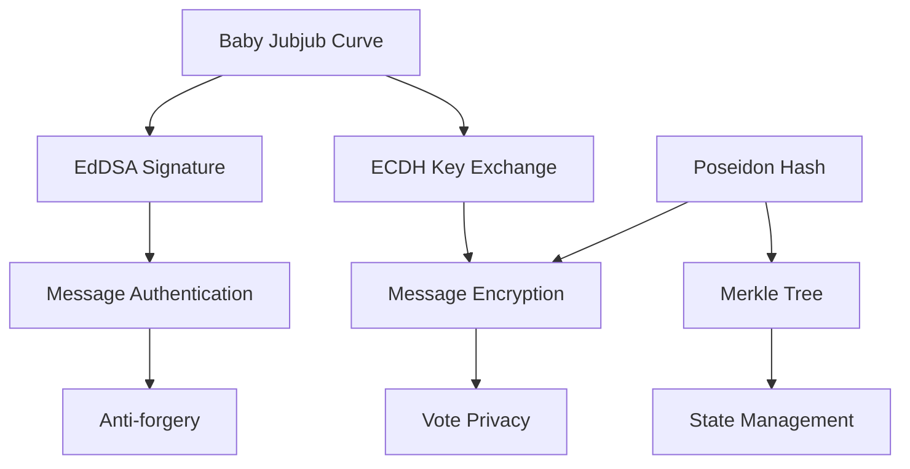
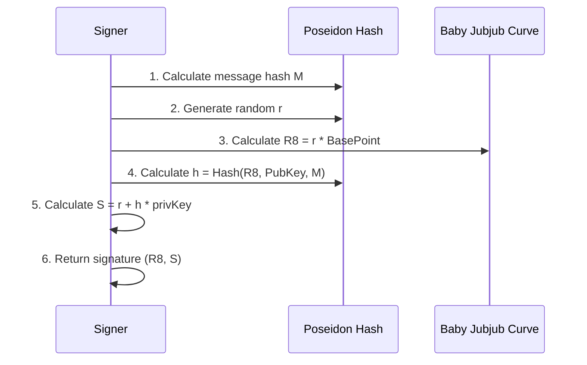
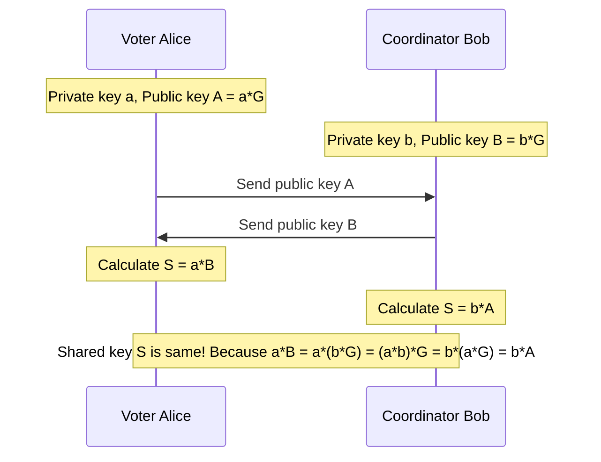
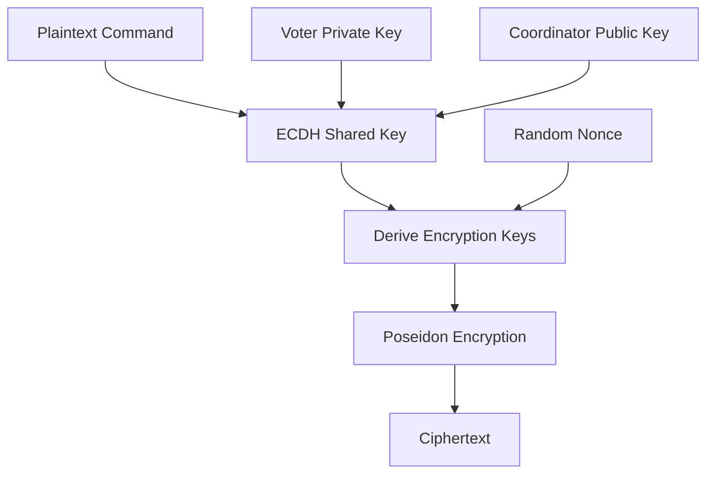

# Cryptography Mechanisms

MACI uses various cryptographic primitives to achieve privacy protection and security. This section introduces how these cryptographic mechanisms work.

## Cryptography Components Overview

MACI's cryptography stack:



## Baby Jubjub Elliptic Curve

Baby Jubjub is an elliptic curve optimized for zero-knowledge proofs.

### Curve Parameters

Baby Jubjub curve is defined as:

```
ax² + y² = 1 + dx²y²

where:
a = 168700
d = 168696
p = 21888242871839275222246405745257275088548364400416034343698204186575808495617
```

### Characteristics

- **ZK-Friendly**: Efficient computation in ZK circuits
- **High Security**: Based on mature cryptographic assumptions
- **Good Compatibility**: Compatible with Ethereum's BN254 curve
- **EIP-2494 Standard**: Follows Ethereum Improvement Proposal

### Point Operations

```typescript
// Point representation
type Point = [bigint, bigint];  // (x, y)

// Point addition
function pointAdd(P: Point, Q: Point): Point {
  // Implements point addition on curve
  // Efficient in ZK circuits
}

// Scalar multiplication
function scalarMult(k: bigint, P: Point): Point {
  // k * P
  // Used for public key generation and ECDH
}
```

### Public Key Generation

```typescript
// Generate public key from private key
function genPublicKey(privateKey: bigint): Point {
  const basePoint = getBasePoint();  // Baby Jubjub base point
  return scalarMult(privateKey, basePoint);
}

// Example
const privateKey = BigInt("12345678901234567890");
const publicKey = genPublicKey(privateKey);
// publicKey = [x, y] point on curve
```

## EdDSA Signature

EdDSA (Edwards-curve Digital Signature Algorithm) is the digital signature scheme used by MACI.

### Signature Structure

```typescript
interface Signature {
  R8: Point;      // Signature R point (point on curve)
  S: bigint;      // Signature S value (scalar)
}
```

### Signing Process



### Signature Implementation

```typescript
function sign(privateKey: bigint, message: bigint): Signature {
  // 1. Generate public key
  const publicKey = genPublicKey(privateKey);
  
  // 2. Generate random r (derived from private key)
  const r = deriveR(privateKey, message);
  
  // 3. Calculate R8 = r * BasePoint
  const R8 = scalarMult(r, getBasePoint());
  
  // 4. Calculate hash h = Poseidon(R8.x, R8.y, PubKey.x, PubKey.y, message)
  const h = poseidon([
    R8[0], R8[1],
    publicKey[0], publicKey[1],
    message
  ]);
  
  // 5. Calculate S = r + h * privateKey (mod order)
  const S = (r + h * privateKey) % CURVE_ORDER;
  
  return { R8, S };
}
```

### Verification Process

```typescript
function verifySignature(
  message: bigint,
  signature: Signature,
  publicKey: Point
): boolean {
  // 1. Calculate h = Poseidon(R8.x, R8.y, PubKey.x, PubKey.y, message)
  const h = poseidon([
    signature.R8[0], signature.R8[1],
    publicKey[0], publicKey[1],
    message
  ]);
  
  // 2. Verify S * BasePoint == R8 + h * PubKey
  const lhs = scalarMult(signature.S, getBasePoint());
  const rhs = pointAdd(
    signature.R8,
    scalarMult(h, publicKey)
  );
  
  return lhs[0] === rhs[0] && lhs[1] === rhs[1];
}
```

### Signature Example

```typescript
// Create keypair
const keypair = genKeypair();

// Message to sign
const message = BigInt("0x123456789abcdef");

// Generate signature
const signature = sign(keypair.privateKey, message);

console.log("R8:", signature.R8);
console.log("S:", signature.S);

// Verify signature
const isValid = verifySignature(
  message,
  signature,
  keypair.publicKey
);
console.log("Signature valid:", isValid);  // true
```

## Poseidon Hash

Poseidon is a hash function optimized for zero-knowledge proofs.

### Characteristics

- **ZK-Friendly**: Few constraints in ZK circuits
- **Efficient**: Hundreds of times faster than SHA-256 in ZK
- **Secure**: Based on Sponge construction
- **Flexible**: Supports variable input length

### Hash Function

```typescript
// Poseidon hash function
function poseidon(inputs: bigint[]): bigint {
  // Uses Poseidon permutation function
  // Returns single hash value
}

// Example
const hash = poseidon([
  BigInt(1),
  BigInt(2),
  BigInt(3)
]);
console.log("Hash:", hash);
```

### Applications in MACI

**1. Message Hashing**

```typescript
// Calculate command hash for signing
function hashCommand(command: Command): bigint {
  return poseidon([
    command.nonce,
    command.stateIndex,
    command.voteOptionIndex,
    command.newVoteWeight,
    command.newPubKey[0],
    command.newPubKey[1],
    command.salt
  ]);
}
```

**2. Merkle Tree**

```typescript
// Calculate Merkle Tree node hash
function hashLeaf(leaf: StateLeaf): bigint {
  return poseidon([
    leaf.pubKey[0],
    leaf.pubKey[1],
    leaf.voiceCreditBalance,
    leaf.voteOptionTreeRoot,
    leaf.nonce
  ]);
}

function hashNode(left: bigint, right: bigint): bigint {
  return poseidon([left, right]);
}
```

**3. Encryption**

```typescript
// Poseidon encryption (based on Sponge construction)
function poseidonEncrypt(
  plaintext: bigint[],
  key: bigint,
  nonce: bigint
): bigint[] {
  // Use Poseidon as stream cipher
  // Generate keystream and XOR plaintext
}
```

## ECDH Key Exchange

ECDH (Elliptic Curve Diffie-Hellman) is used to generate shared keys.

### How It Works



### Shared Key Generation

```typescript
// Generate ECDH shared key
function genEcdhSharedKey(
  privateKey: bigint,
  publicKey: Point
): bigint {
  // Calculate sharedPoint = privateKey * publicKey
  const sharedPoint = scalarMult(privateKey, publicKey);
  
  // Use x-coordinate as shared key
  return sharedPoint[0];
}

// Example: Voter and Coordinator generate same shared key

// Voter side
const voterPrivKey = BigInt("111");
const voterPubKey = genPublicKey(voterPrivKey);

// Coordinator side
const coordPrivKey = BigInt("222");
const coordPubKey = genPublicKey(coordPrivKey);

// Voter calculates shared key
const sharedKey1 = genEcdhSharedKey(voterPrivKey, coordPubKey);

// Coordinator calculates shared key
const sharedKey2 = genEcdhSharedKey(coordPrivKey, voterPubKey);

console.log(sharedKey1 === sharedKey2);  // true
```

### Key Derivation

Derive encryption keys from shared key:

```typescript
function deriveEncryptionKey(sharedKey: bigint, nonce: bigint): bigint[] {
  // Use Poseidon to derive multiple sub-keys
  const keys = [];
  for (let i = 0; i < 10; i++) {
    keys.push(poseidon([sharedKey, nonce, BigInt(i)]));
  }
  return keys;
}
```

## Message Encryption

MACI uses an encryption scheme based on ECDH and Poseidon.

### Encryption Process



### Encryption Implementation

```typescript
function encryptCommand(
  command: Command,
  voterPrivateKey: bigint,
  coordinatorPublicKey: Point
): bigint[] {
  // 1. Generate ECDH shared key
  const sharedKey = genEcdhSharedKey(voterPrivateKey, coordinatorPublicKey);
  
  // 2. Generate random nonce
  const nonce = genRandomNonce();
  
  // 3. Derive encryption keys
  const encKeys = deriveEncryptionKey(sharedKey, nonce);
  
  // 4. Pack command fields
  const plaintext = [
    packCommandFields(command),  // Pack multiple fields into one
    command.newPubKey[0],
    command.newPubKey[1],
    command.signature.R8[0],
    command.signature.R8[1],
    command.signature.S
  ];
  
  // 5. Encrypt
  const ciphertext = poseidonEncrypt(plaintext, encKeys);
  
  return ciphertext;
}
```

### Decryption Process

```typescript
function decryptMessage(
  ciphertext: bigint[],
  coordinatorPrivateKey: bigint,
  voterPublicKey: Point
): Command {
  // 1. Generate ECDH shared key (same as encryption)
  const sharedKey = genEcdhSharedKey(coordinatorPrivateKey, voterPublicKey);
  
  // 2. Extract nonce (contained in ciphertext)
  const nonce = extractNonce(ciphertext);
  
  // 3. Derive encryption keys (same as encryption)
  const encKeys = deriveEncryptionKey(sharedKey, nonce);
  
  // 4. Decrypt
  const plaintext = poseidonDecrypt(ciphertext, encKeys);
  
  // 5. Unpack command
  const command = unpackCommand(plaintext);
  
  return command;
}
```

### Message Packing

For efficiency, multiple fields are packed into one large integer:

```typescript
function packCommandFields(command: Command): bigint {
  // Pack multiple small fields into one large integer
  // nonce (8 bits) | stateIdx (24 bits) | voIdx (8 bits) | 
  // newVotes (24 bits) | salt (remaining bits)
  
  let packed = BigInt(0);
  packed |= (command.nonce & 0xFF);
  packed |= (command.stateIndex & 0xFFFFFF) << 8;
  packed |= (command.voteOptionIndex & 0xFF) << 32;
  packed |= (command.newVoteWeight & 0xFFFFFF) << 40;
  packed |= command.salt << 64;
  
  return packed;
}

function unpackCommandFields(packed: bigint): {
  nonce: bigint;
  stateIndex: bigint;
  voteOptionIndex: bigint;
  newVoteWeight: bigint;
  salt: bigint;
} {
  return {
    nonce: packed & BigInt(0xFF),
    stateIndex: (packed >> BigInt(8)) & BigInt(0xFFFFFF),
    voteOptionIndex: (packed >> BigInt(32)) & BigInt(0xFF),
    newVoteWeight: (packed >> BigInt(40)) & BigInt(0xFFFFFF),
    salt: packed >> BigInt(64)
  };
}
```

## Complete Vote Message Flow

Integrating all cryptographic components:

```typescript
// Voter side: Create and encrypt vote message
async function createVoteMessage(
  voterKeypair: Keypair,
  coordinatorPubKey: Point,
  voteOptions: { idx: number; weight: number }[]
): Promise<Message> {
  // 1. Create command
  const command: Command = {
    nonce: getCurrentNonce(),
    stateIndex: getStateIndex(),
    voteOptionIndex: voteOptions[0].idx,
    newVoteWeight: voteOptions[0].weight,
    newPubKey: voterKeypair.publicKey,
    salt: genRandomSalt()
  };
  
  // 2. Calculate command hash
  const commandHash = hashCommand(command);
  
  // 3. Sign
  const signature = sign(voterKeypair.privateKey, commandHash);
  command.signature = signature;
  
  // 4. Encrypt
  const encryptedData = encryptCommand(
    command,
    voterKeypair.privateKey,
    coordinatorPubKey
  );
  
  // 5. Construct message
  return {
    msgType: BigInt(1),  // Vote message
    data: encryptedData
  };
}

// Coordinator side: Decrypt and verify message
async function processMessage(
  message: Message,
  coordinatorPrivKey: bigint
): Promise<Command | null> {
  // 1. Extract voter public key from message (query from state tree)
  const voterPubKey = getVoterPublicKey(message);
  
  // 2. Decrypt
  const command = decryptMessage(
    message.data,
    coordinatorPrivKey,
    voterPubKey
  );
  
  // 3. Verify signature
  const commandHash = hashCommand(command);
  const isValid = verifySignature(commandHash, command.signature, voterPubKey);
  
  if (!isValid) {
    console.log("Signature verification failed");
    return null;
  }
  
  // 4. Verify Nonce
  const currentNonce = getCurrentNonce(command.stateIndex);
  if (command.nonce !== currentNonce) {
    console.log("Nonce mismatch");
    return null;
  }
  
  // 5. Return valid command
  return command;
}
```

## Security Analysis

### Signature Security

- **Anti-forgery**: EdDSA signatures based on discrete logarithm problem, computationally unforgeable
- **Anti-replay**: Nonce mechanism prevents replay attacks
- **Integrity**: Any message modification causes signature verification to fail

### Encryption Security

- **Confidentiality**: Only those with Coordinator private key can decrypt
- **Forward Security**: Each message uses different nonce
- **Side-channel Resistance**: Poseidon implemented in ZK circuits, avoids timing attacks

### ZK-Friendliness

All cryptographic primitives are efficient in ZK circuits:

```
Operation           Constraint Count (Approximate)
-------------------------------------------------
Poseidon Hash       ~150 constraints
EdDSA Verification  ~2500 constraints
ECDH                ~2500 constraints
Point Addition      ~8 constraints
```

## Next Steps

After understanding MACI's cryptography mechanisms, you can learn:

- [Message Flow](/docs/protocol/message-flow) - Understand how messages flow through the system
- [Privacy Protection](/docs/protocol/privacy-protection) - Explore privacy protection implementation details
- [Contract Design](/docs/contracts/architecture) - Learn how contracts use these cryptographic primitives
