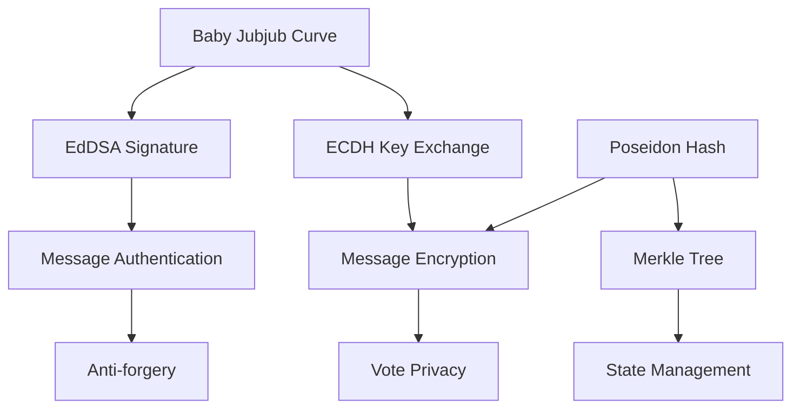
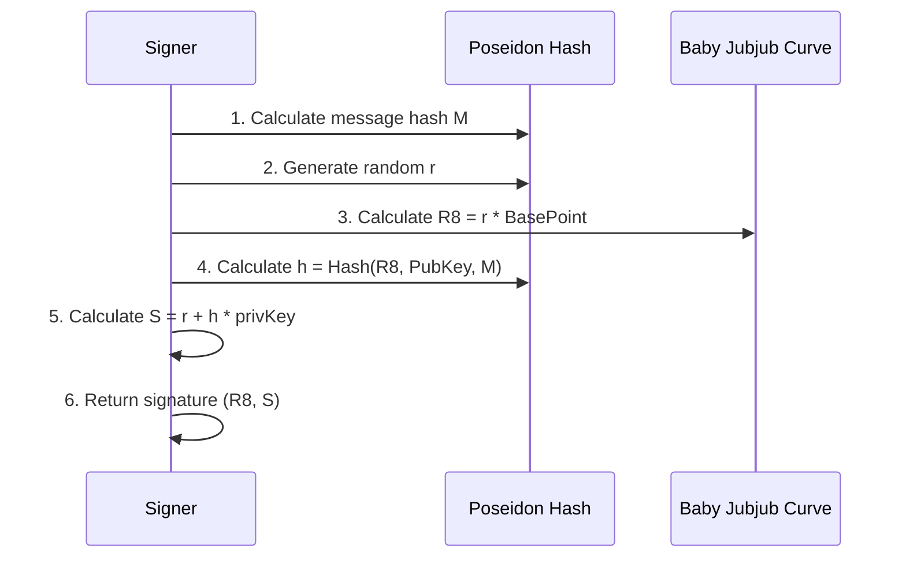
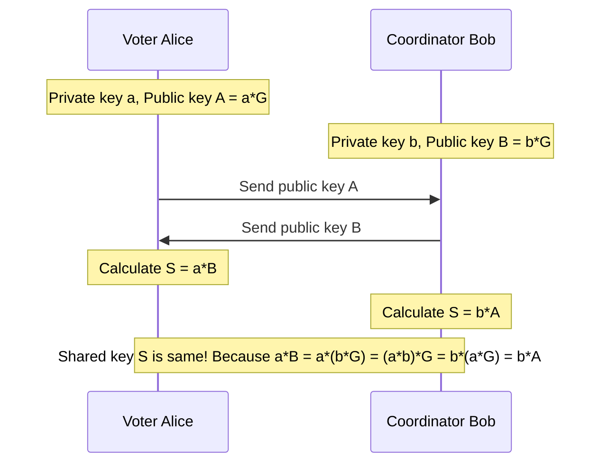
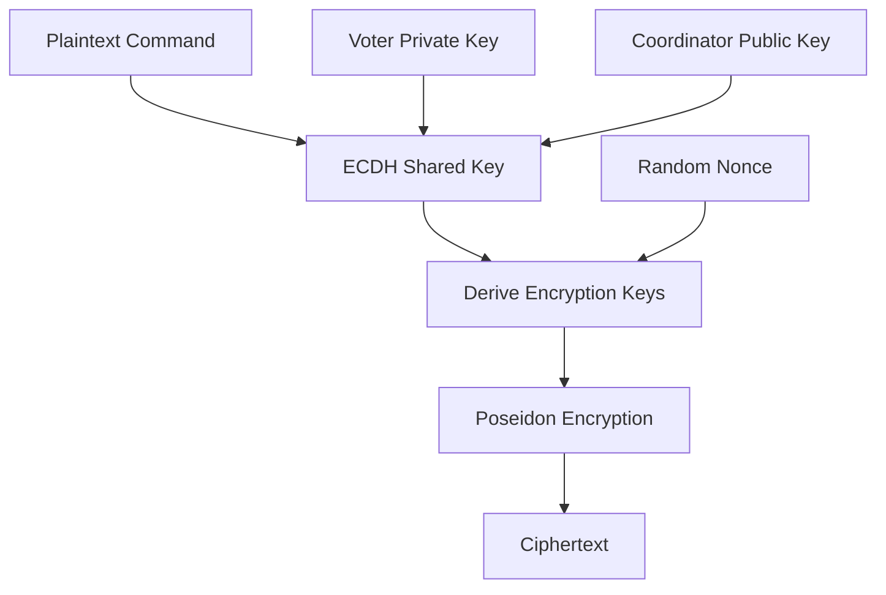

# Cryptography Mechanisms

MACI uses various cryptographic primitives to achieve privacy protection and security. This section introduces how these cryptographic mechanisms work.

## Cryptography Components Overview

MACI's cryptography stack:


```mermaid
graph TD
    A[Baby Jubjub Curve] --> B[EdDSA Signature]
    A --> C[ECDH Key Exchange]
    D[Poseidon Hash] --> E[Message Encryption]
    D --> F[Merkle Tree]
    B --> G[Message Authentication]
    C --> E
    E --> H[Vote Privacy]
    F --> I[State Management]
    G --> J[Anti-forgery]
```

## Baby Jubjub Elliptic Curve

Baby Jubjub is an elliptic curve optimized for zero-knowledge proofs.

### Curve Parameters

Baby Jubjub curve is defined as:

```
ax² + y² = 1 + dx²y²

where:
a = 168700
d = 168696
p = 21888242871839275222246405745257275088548364400416034343698204186575808495617
```

### Characteristics

- **ZK-Friendly**: Efficient computation in ZK circuits
- **High Security**: Based on mature cryptographic assumptions
- **Good Compatibility**: Compatible with Ethereum's BN254 curve
- **EIP-2494 Standard**: Follows Ethereum Improvement Proposal

### Point Operations

```typescript
// Point representation
type Point = [bigint, bigint];  // (x, y)

// Point addition
function pointAdd(P: Point, Q: Point): Point {
  // Implements point addition on curve
  // Efficient in ZK circuits
}

// Scalar multiplication
function scalarMult(k: bigint, P: Point): Point {
  // k * P
  // Used for public key generation and ECDH
}
```

### Public Key Generation

```typescript
// Generate public key from private key
function genPublicKey(privateKey: bigint): Point {
  const basePoint = getBasePoint();  // Baby Jubjub base point
  return scalarMult(privateKey, basePoint);
}

// Example
const privateKey = BigInt("12345678901234567890");
const publicKey = genPublicKey(privateKey);
// publicKey = [x, y] point on curve
```

## EdDSA Signature

EdDSA (Edwards-curve Digital Signature Algorithm) is the digital signature scheme used by MACI.

### Signature Structure

```typescript
interface Signature {
  R8: Point;      // Signature R point (point on curve)
  S: bigint;      // Signature S value (scalar)
}
```

### Signing Process


```mermaid
sequenceDiagram
    participant Signer as Signer
    participant Hash as Poseidon Hash
    participant Curve as Baby Jubjub Curve
    Signer->>Hash: 1. Calculate message hash M
    Signer->>Hash: 2. Generate random r
    Signer->>Curve: 3. Calculate R8 = r * BasePoint
    Signer->>Hash: 4. Calculate h = Hash(R8, PubKey, M)
    Signer->>Signer: 5. Calculate S = r + h * privKey
    Signer->>Signer: 6. Return signature (R8, S)
```

### Signature Implementation

```typescript
function sign(privateKey: bigint, message: bigint): Signature {
  // 1. Generate public key
  const publicKey = genPublicKey(privateKey);
  
  // 2. Generate random r (derived from private key)
  const r = deriveR(privateKey, message);
  
  // 3. Calculate R8 = r * BasePoint
  const R8 = scalarMult(r, getBasePoint());
  
  // 4. Calculate hash h = Poseidon(R8.x, R8.y, PubKey.x, PubKey.y, message)
  const h = poseidon([
    R8[0], R8[1],
    publicKey[0], publicKey[1],
    message
  ]);
  
  // 5. Calculate S = r + h * privateKey (mod order)
  const S = (r + h * privateKey) % CURVE_ORDER;
  
  return { R8, S };
}
```

### Verification Process

```typescript
function verifySignature(
  message: bigint,
  signature: Signature,
  publicKey: Point
): boolean {
  // 1. Calculate h = Poseidon(R8.x, R8.y, PubKey.x, PubKey.y, message)
  const h = poseidon([
    signature.R8[0], signature.R8[1],
    publicKey[0], publicKey[1],
    message
  ]);
  
  // 2. Verify S * BasePoint == R8 + h * PubKey
  const lhs = scalarMult(signature.S, getBasePoint());
  const rhs = pointAdd(
    signature.R8,
    scalarMult(h, publicKey)
  );
  
  return lhs[0] === rhs[0] && lhs[1] === rhs[1];
}
```

### Signature Example

```typescript
// Create keypair
const keypair = genKeypair();

// Message to sign
const message = BigInt("0x123456789abcdef");

// Generate signature
const signature = sign(keypair.privateKey, message);

console.log("R8:", signature.R8);
console.log("S:", signature.S);

// Verify signature
const isValid = verifySignature(
  message,
  signature,
  keypair.publicKey
);
console.log("Signature valid:", isValid);  // true
```

## Poseidon Hash

Poseidon is a hash function optimized for zero-knowledge proofs.

### Characteristics

- **ZK-Friendly**: Few constraints in ZK circuits
- **Efficient**: Hundreds of times faster than SHA-256 in ZK
- **Secure**: Based on Sponge construction
- **Flexible**: Supports variable input length

### Hash Function

```typescript
// Poseidon hash function
function poseidon(inputs: bigint[]): bigint {
  // Uses Poseidon permutation function
  // Returns single hash value
}

// Example
const hash = poseidon([
  BigInt(1),
  BigInt(2),
  BigInt(3)
]);
console.log("Hash:", hash);
```

### Applications in MACI

**1. Message Hashing**

```typescript
// Hash the packed command element together with the new public key
function hashCommand(packaged: bigint, newPubKey: Point): bigint {
  return poseidon([packaged, newPubKey[0], newPubKey[1]]);
}
```

**2. Merkle Tree**

```typescript
// Calculate Merkle Tree node hash
function hashLeaf(leaf: StateLeaf): bigint {
  return poseidon([
    leaf.pubKey[0],
    leaf.pubKey[1],
    leaf.voiceCreditBalance,
    leaf.voteOptionTreeRoot,
    leaf.nonce
  ]);
}

function hashNode(left: bigint, right: bigint): bigint {
  return poseidon([left, right]);
}
```

**3. Encryption**

```typescript
// Poseidon encryption (based on Sponge construction)
function poseidonEncrypt(
  plaintext: bigint[],
  key: bigint,
  nonce: bigint
): bigint[] {
  // Use Poseidon as stream cipher
  // Generate keystream and XOR plaintext
}
```

## ECDH Key Exchange

ECDH (Elliptic Curve Diffie-Hellman) is used to generate shared keys.

### How It Works


```mermaid
sequenceDiagram
    participant Alice as Voter Alice
    participant Bob as Coordinator Bob
    Note over Alice: Private key a, Public key A = a*G
    Note over Bob: Private key b, Public key B = b*G
    Alice->>Bob: Send public key A
    Bob->>Alice: Send public key B
    Note over Alice: Calculate S = a*B
    Note over Bob: Calculate S = b*A
    Note over Alice,Bob: Shared key S is same! Because a*B = a*(b*G) = (a*b)*G = b*(a*G) = b*A
```

### Shared Key Generation

```typescript
// Generate ECDH shared key
function genEcdhSharedKey(
  privateKey: bigint,
  publicKey: Point
): bigint {
  // Calculate sharedPoint = privateKey * publicKey
  const sharedPoint = scalarMult(privateKey, publicKey);
  
  // Use x-coordinate as shared key
  return sharedPoint[0];
}

// Example: Voter and Coordinator generate same shared key

// Voter side
const voterPrivKey = BigInt("111");
const voterPubKey = genPublicKey(voterPrivKey);

// Coordinator side
const coordPrivKey = BigInt("222");
const coordPubKey = genPublicKey(coordPrivKey);

// Voter calculates shared key
const sharedKey1 = genEcdhSharedKey(voterPrivKey, coordPubKey);

// Coordinator calculates shared key
const sharedKey2 = genEcdhSharedKey(coordPrivKey, voterPubKey);

console.log(sharedKey1 === sharedKey2);  // true
```

### Key Derivation

Derive encryption keys from shared key:

```typescript
function deriveEncryptionKey(sharedKey: bigint, nonce: bigint): bigint[] {
  // Use Poseidon to derive multiple sub-keys
  const keys = [];
  for (let i = 0; i < 10; i++) {
    keys.push(poseidon([sharedKey, nonce, BigInt(i)]));
  }
  return keys;
}
```

## Message Encryption

MACI uses an encryption scheme based on ECDH and Poseidon.

### Encryption Process


```mermaid
graph TD
    A[Plaintext Command] --> B[ECDH Shared Key]
    B --> C[Derive Encryption Keys]
    C --> D[Poseidon Encryption]
    D --> E[Ciphertext]
    F[Voter Private Key] --> B
    G[Coordinator Public Key] --> B
    H[Random Nonce] --> C
```

### Encryption Implementation

```typescript
function encryptCommand(
  command: Command,
  voterPrivateKey: bigint,
  coordinatorPublicKey: Point
): bigint[] {
  // 1. Generate ECDH shared key
  const sharedKey = genEcdhSharedKey(voterPrivateKey, coordinatorPublicKey);
  
  // 2. Generate random nonce
  const nonce = genRandomNonce();
  
  // 3. Derive encryption keys
  const encKeys = deriveEncryptionKey(sharedKey, nonce);
  
  // 4. Pack command fields
  const plaintext = [
    packCommandFields(command),  // Pack multiple fields into one
    command.newPubKey[0],
    command.newPubKey[1],
    command.signature.R8[0],
    command.signature.R8[1],
    command.signature.S
  ];
  
  // 5. Encrypt
  const ciphertext = poseidonEncrypt(plaintext, encKeys);
  
  return ciphertext;
}
```

### Decryption Process

```typescript
function decryptMessage(
  ciphertext: bigint[],
  coordinatorPrivateKey: bigint,
  voterPublicKey: Point
): Command {
  // 1. Generate ECDH shared key (same as encryption)
  const sharedKey = genEcdhSharedKey(coordinatorPrivateKey, voterPublicKey);
  
  // 2. Extract nonce (contained in ciphertext)
  const nonce = extractNonce(ciphertext);
  
  // 3. Derive encryption keys (same as encryption)
  const encKeys = deriveEncryptionKey(sharedKey, nonce);
  
  // 4. Decrypt
  const plaintext = poseidonDecrypt(ciphertext, encKeys);
  
  // 5. Unpack command
  const command = unpackCommand(plaintext);
  
  return command;
}
```

### Message Packing

For efficiency and ZK-circuit compatibility, multiple command fields are packed into a single
256-bit integer using fixed-width bit fields:

```typescript
/**
 * Pack command fields into a single bigint.
 * Bit layout (little-endian, 256 bits total):
 *
 *  bits   0 –  31 :  nonce      (32 bits)
 *  bits  32 –  63 :  stateIdx   (32 bits)
 *  bits  64 –  95 :  voIdx      (32 bits)
 *  bits  96 – 191 :  newVotes   (96 bits)
 *  bits 192 – 223 :  pollId     (32 bits)
 *  bits 224 – 255 :  (unused)
 */
function packElement({
  nonce, stateIdx, voIdx, newVotes, pollId
}: {
  nonce: number | bigint;
  stateIdx: number | bigint;
  voIdx: number | bigint;
  newVotes: number | bigint;
  pollId: number | bigint;
}): bigint {
  return (
    BigInt(nonce) +
    (BigInt(stateIdx) << 32n) +
    (BigInt(voIdx)   << 64n) +
    (BigInt(newVotes) << 96n) +
    (BigInt(pollId)  << 192n)
  );
}

function unpackElement(packaged: bigint): {
  nonce: bigint;
  stateIdx: bigint;
  voIdx: bigint;
  newVotes: bigint;
  pollId: bigint;
} {
  const UINT32 = (1n << 32n);
  const UINT96 = (1n << 96n);
  return {
    nonce:    packaged % UINT32,
    stateIdx: (packaged >> 32n) % UINT32,
    voIdx:    (packaged >> 64n) % UINT32,
    newVotes: (packaged >> 96n) % UINT96,
    pollId:   (packaged >> 192n) % UINT32,
  };
}
```

> **Note:** `salt` (a random 56-bit value) is part of the command but lives as a separate
> element at position [3] in the plaintext command array — it is **not** packed inside `packElement`.

## Complete Vote Message Flow

Integrating all cryptographic components. The SDK handles this end-to-end automatically:

```typescript
// Voter side: Create and encrypt vote message (simplified — SDK does this internally)
async function createVoteMessage(
  voterPrivKey: bigint,
  operatorPubKey: Point,
  contractAddress: string,
  stateIdx: number,
  nonce: number,
  voIdx: number,
  newVotes: number,
  newPubKey: Point,
): Promise<{ messageData: bigint[]; encPubKey: Point }> {
  // 1. Query pollId from the contract
  const pollId = await client.getPollId({ contractAddress });

  // 2. Pack all command fields
  const packaged = packElement({ nonce, stateIdx, voIdx, newVotes, pollId });

  // 3. Sign
  const hash = poseidon([packaged, newPubKey[0], newPubKey[1]]);
  const signature = eddsa.sign(voterPrivKey, hash);

  // 4. Build 7-element command array
  //    [packaged, newPubKey.x, newPubKey.y, salt, sig.R8.x, sig.R8.y, sig.S]
  const salt = genRandomSalt();
  const command = [packaged, newPubKey[0], newPubKey[1], salt, ...signature.R8, signature.S];

  // 5. Generate ephemeral key-pair for ECDH
  const encPrivKey = genRandomPrivKey();
  const encPubKey  = genPubKey(encPrivKey);

  // 6. Poseidon-encrypt the command
  const sharedKey    = genEcdhSharedKey(encPrivKey, operatorPubKey);
  const messageData  = poseidonEncrypt(command, sharedKey, 0n);

  return { messageData, encPubKey };
}

// Coordinator side: Decrypt and verify message
async function processVoteMessage(
  messageData: bigint[],
  encPubKey: Point,
  coordPrivKey: bigint
): Promise<{ voIdx: number; newVotes: number; pollId: number } | null> {
  // 1. Derive ECDH shared key
  const sharedKey = genEcdhSharedKey(coordPrivKey, encPubKey);

  // 2. Decrypt to recover the 7-element command array
  const command = poseidonDecrypt(messageData, sharedKey, 0n);
  const [packaged, pubKeyX, pubKeyY, salt, sigR8x, sigR8y, sigS] = command;

  // 3. Verify EdDSA signature
  const hash = poseidon([packaged, pubKeyX, pubKeyY]);
  const isValid = eddsa.verify(hash, { R8: [sigR8x, sigR8y], S: sigS }, [pubKeyX, pubKeyY]);
  if (!isValid) return null;

  // 4. Unpack command fields
  const { nonce, stateIdx, voIdx, newVotes, pollId } = unpackElement(packaged);
  return { voIdx: Number(voIdx), newVotes: Number(newVotes), pollId: Number(pollId) };
}
```

## Security Analysis

### Signature Security

- **Anti-forgery**: EdDSA signatures based on discrete logarithm problem, computationally unforgeable
- **Anti-replay**: Nonce mechanism prevents replay attacks
- **Integrity**: Any message modification causes signature verification to fail

### Encryption Security

- **Confidentiality**: Only those with Coordinator private key can decrypt
- **Forward Security**: Each message uses different nonce
- **Side-channel Resistance**: Poseidon implemented in ZK circuits, avoids timing attacks

### ZK-Friendliness

All cryptographic primitives are efficient in ZK circuits:

```
Operation           Constraint Count (Approximate)
-------------------------------------------------
Poseidon Hash       ~150 constraints
EdDSA Verification  ~2500 constraints
ECDH                ~2500 constraints
Point Addition      ~8 constraints
```

## Next Steps

After understanding MACI's cryptography mechanisms, you can learn:

- [Message Flow](/docs/protocol/message-flow) - Understand how messages flow through the system
- [Privacy Protection](/docs/protocol/privacy-protection) - Explore privacy protection implementation details
- [Contract Design](/docs/contracts/architecture) - Learn how contracts use these cryptographic primitives
