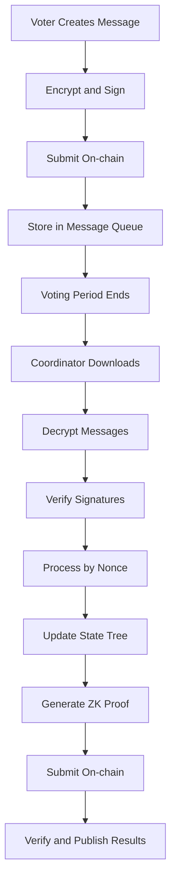

# Message Flow

The complete lifecycle of messages in MACI, from voter generating messages to Coordinator processing messages and generating proofs.

## Message Lifecycle Overview



## Voter Side: Message Generation

### Prepare Vote Data

Voters first need to prepare data to vote on:

```typescript
// Vote options
const selectedOptions = [
  { idx: 0, vc: 5 },  // 5 votes for option 0
  { idx: 1, vc: 3 },  // 3 votes for option 1
  { idx: 2, vc: 2 },  // 2 votes for option 2
];

// Verify voting weight
const totalCost = selectedOptions.reduce((sum, opt) => {
  return sum + (isQV ? opt.vc * opt.vc : opt.vc);
}, 0);

if (totalCost > voiceCredits) {
  throw new Error("Voting weight exceeds available credits");
}
```

### Construct Command

```typescript
function createVoteCommand(
  stateIndex: number,
  nonce: number,
  voteOption: { idx: number; vc: number },
  currentPubKey: Point,
  salt: bigint
): Command {
  return {
    nonce: BigInt(nonce),
    stateIndex: BigInt(stateIndex),
    voteOptionIndex: BigInt(voteOption.idx),
    newVoteWeight: BigInt(voteOption.vc),
    newPubKey: currentPubKey,  // Usually unchanged
    salt: salt
  };
}
```

### Pack and Hash

```typescript
// Pack command fields
function packCommand(command: Command): bigint {
  // Pack 5 fields into one bigint
  let packed = BigInt(0);
  
  // nonce (8 bits)
  packed |= (command.nonce & BigInt(0xFF));
  
  // stateIndex (24 bits)
  packed |= ((command.stateIndex & BigInt(0xFFFFFF)) << BigInt(8));
  
  // voteOptionIndex (8 bits)
  packed |= ((command.voteOptionIndex & BigInt(0xFF)) << BigInt(32));
  
  // newVoteWeight (24 bits)
  packed |= ((command.newVoteWeight & BigInt(0xFFFFFF)) << BigInt(40));
  
  // salt (remaining bits)
  packed |= (command.salt << BigInt(64));
  
  return packed;
}

// Calculate command hash
function hashCommand(command: Command): bigint {
  const packed = packCommand(command);
  return poseidon([
    packed,
    command.newPubKey[0],
    command.newPubKey[1]
  ]);
}
```

### Sign

```typescript
// Sign command hash with private key
const commandHash = hashCommand(command);
const signature = sign(voterPrivateKey, commandHash);

// Signature structure
// signature = {
//   R8: [x, y],  // Point on curve
//   S: bigint    // Scalar
// }
```

### Encrypt

```typescript
// Generate ECDH shared key
const sharedKey = genEcdhSharedKey(
  voterPrivateKey,
  coordinatorPublicKey
);

// Encrypt command
const encryptedData = encrypt(
  {
    packed: packCommand(command),
    newPubKeyX: command.newPubKey[0],
    newPubKeyY: command.newPubKey[1],
    signatureR8X: signature.R8[0],
    signatureR8Y: signature.R8[1],
    signatureS: signature.S
  },
  sharedKey
);
```

### Submit On-chain

```typescript
// Construct message
const message = {
  msgType: 1,  // 1 = vote message
  data: encryptedData  // 10 encrypted fields
};

// Submit to MACI contract
await maciContract.publishMessage(message);
```

## Complete Vote Message Generation Example

```typescript
async function generateAndSubmitVote(
  voterAccount: {
    privateKey: bigint;
    publicKey: Point;
    stateIndex: number;
    nonce: number;
  },
  coordinatorPubKey: Point,
  contractAddress: string,
  voteOptions: { idx: number; vc: number }[]
) {
  // Generate one message per vote option
  for (const option of voteOptions) {
    // 1. Generate random salt
    const salt = genRandomSalt();
    
    // 2. Create command
    const command = {
      nonce: BigInt(voterAccount.nonce),
      stateIndex: BigInt(voterAccount.stateIndex),
      voteOptionIndex: BigInt(option.idx),
      newVoteWeight: BigInt(option.vc),
      newPubKey: voterAccount.publicKey,
      salt: salt
    };
    
    // 3. Calculate hash
    const commandHash = hashCommand(command);
    
    // 4. Sign
    const signature = sign(voterAccount.privateKey, commandHash);
    
    // 5. ECDH shared key
    const sharedKey = genEcdhSharedKey(
      voterAccount.privateKey,
      coordinatorPubKey
    );
    
    // 6. Encrypt
    const encryptedData = encrypt(
      command,
      signature,
      sharedKey
    );
    
    // 7. Construct message
    const message = {
      msgType: 1,
      data: encryptedData
    };
    
    // 8. Submit on-chain
    const tx = await contract.publishMessage(message);
    await tx.wait();
    
    console.log(`Message ${voterAccount.nonce} submitted`);
    
    // 9. Increment local nonce (Note: on-chain nonce only updates during processing)
    voterAccount.nonce++;
  }
}
```

## Coordinator Side: Message Processing

### Download Messages

After voting period ends, Coordinator downloads all messages from chain:

```typescript
async function downloadMessages(
  contractAddress: string
): Promise<Message[]> {
  // Query contract for all messages
  const messages = await contract.getMessages();
  
  console.log(`Downloaded ${messages.length} messages`);
  
  return messages;
}
```

### Decrypt Messages

```typescript
function decryptMessage(
  message: Message,
  coordinatorPrivateKey: bigint,
  voterPublicKey: Point
): Command {
  // 1. Generate ECDH shared key
  const sharedKey = genEcdhSharedKey(
    coordinatorPrivateKey,
    voterPublicKey
  );
  
  // 2. Decrypt data
  const decrypted = decrypt(message.data, sharedKey);
  
  // 3. Unpack command
  const command = unpackCommand(decrypted);
  
  return command;
}
```

### Verify Signatures

```typescript
function validateCommand(
  command: Command,
  voterPublicKey: Point
): boolean {
  // 1. Recalculate command hash
  const commandHash = hashCommand(command);
  
  // 2. Verify EdDSA signature
  const isValid = verifySignature(
    commandHash,
    command.signature,
    voterPublicKey
  );
  
  if (!isValid) {
    console.log("Signature verification failed");
    return false;
  }
  
  return true;
}
```

### Process Messages in Order

```typescript
async function processMessages(
  messages: Message[],
  coordinatorPrivateKey: bigint,
  initialStateTree: MerkleTree
): Promise<ProcessingResult> {
  const stateTree = initialStateTree.clone();
  const processedCommands = [];
  
  for (let i = 0; i < messages.length; i++) {
    const message = messages[i];
    
    // 1. Get voter state
    const stateLeaf = stateTree.getLeaf(message.stateIndex);
    const voterPubKey = stateLeaf.pubKey;
    
    // 2. Decrypt
    const command = decryptMessage(
      message,
      coordinatorPrivateKey,
      voterPubKey
    );
    
    // 3. Verify signature
    if (!validateCommand(command, voterPubKey)) {
      console.log(`Message ${i}: Invalid signature, skip`);
      continue;
    }
    
    // 4. Verify Nonce
    if (command.nonce !== stateLeaf.nonce) {
      console.log(`Message ${i}: Nonce mismatch, skip`);
      continue;
    }
    
    // 5. Process command
    const newStateLeaf = applyCommand(stateLeaf, command);
    
    // 6. Update state tree
    stateTree.update(command.stateIndex, newStateLeaf);
    
    // 7. Record processed command
    processedCommands.push(command);
    
    console.log(`Message ${i}: Processed successfully`);
  }
  
  return {
    newStateRoot: stateTree.getRoot(),
    processedCommands: processedCommands,
    stateTree: stateTree
  };
}
```

### Update State

```typescript
function applyCommand(
  currentState: StateLeaf,
  command: Command
): StateLeaf {
  // 1. Update public key (if changed)
  const newPubKey = command.newPubKey;
  
  // 2. Calculate vote cost
  const cost = calculateVoteCost(
    command.newVoteWeight,
    isQuadraticVoting
  );
  
  // 3. Check balance
  if (cost > currentState.voiceCreditBalance) {
    throw new Error("Insufficient balance");
  }
  
  // 4. Update vote option tree
  const newVoTree = updateVoteOptionTree(
    currentState.voteOptionTreeRoot,
    command.voteOptionIndex,
    command.newVoteWeight
  );
  
  // 5. Return new state
  return {
    pubKey: newPubKey,
    voiceCreditBalance: currentState.voiceCreditBalance - cost,
    voteOptionTreeRoot: newVoTree.getRoot(),
    nonce: currentState.nonce + BigInt(1)  // Nonce +1
  };
}
```

## Zero-Knowledge Proof Generation

After processing all messages, Coordinator generates zero-knowledge proofs:

### ProcessMessages Proof

```typescript
async function generateProcessMessagesProof(
  messages: Message[],
  coordinatorPrivateKey: bigint,
  initialStateRoot: bigint,
  finalStateRoot: bigint
): Promise<Proof> {
  // Prepare circuit inputs
  const circuitInputs = {
    // Public inputs
    coordPubKey: genPublicKey(coordinatorPrivateKey),
    msgRoot: computeMessageRoot(messages),
    currentStateRoot: initialStateRoot,
    newStateRoot: finalStateRoot,
    
    // Private inputs
    coordPrivKey: coordinatorPrivateKey,
    messages: messages,
    currentStateLeavesPathElements: [...],
    newStateLeavesPathElements: [...],
    // ... more inputs
  };
  
  // Call snarkjs or other ZK proof library
  const proof = await generateProof(
    'ProcessMessages',
    circuitInputs
  );
  
  return proof;
}
```

### Tally Proof

```typescript
async function generateTallyProof(
  stateTree: MerkleTree,
  results: bigint[]
): Promise<Proof> {
  // Prepare circuit inputs
  const circuitInputs = {
    // Public inputs
    stateRoot: stateTree.getRoot(),
    tallyResult: results,
    
    // Private inputs
    stateLeaves: stateTree.getAllLeaves(),
    statePathElements: [...],
    // ... more inputs
  };
  
  // Generate proof
  const proof = await generateProof(
    'TallyVotes',
    circuitInputs
  );
  
  return proof;
}
```

## Timeline Example

Here's a timeline for a complete voting round:

```mermaid
gantt
    title MACI Voting Round Timeline
    dateFormat HH:mm
    section Preparation
    Create Round           :done, 00:00, 00:10
    Publish Coordinator Key :done, 00:10, 00:15
    section Registration
    User A Registers       :done, 00:15, 00:20
    User B Registers       :done, 00:20, 00:25
    User C Registers       :done, 00:25, 00:30
    section Voting
    User A Votes          :done, 00:30, 00:35
    User B Votes          :done, 00:35, 00:40
    User A Revotes        :done, 00:40, 00:45
    User C Votes          :done, 00:45, 00:50
    Voting Period Ends    :milestone, 01:00, 0d
    section Processing
    Download Messages     :active, 01:00, 01:10
    Decrypt and Process   :active, 01:10, 02:00
    Generate PM Proof     :active, 02:00, 02:30
    Submit PM Proof       :active, 02:30, 02:35
    Generate Tally Proof  :active, 02:35, 03:00
    Submit Tally Proof    :active, 03:00, 03:05
    section Results
    Verify Proof          :done, 03:05, 03:10
    Publish Results       :milestone, 03:10, 0d
```



## Detailed Message Processing Example

Let's understand the entire process through a specific example:

### Scenario Setup

```typescript
// 3 voters, 5 voting options
const voters = [
  { name: 'Alice', stateIdx: 0, voiceCredits: 100 },
  { name: 'Bob',   stateIdx: 1, voiceCredits: 100 },
  { name: 'Carol', stateIdx: 2, voiceCredits: 100 },
];

const options = ['Option 0', 'Option 1', 'Option 2', 'Option 3', 'Option 4'];
```

### Voting Phase

```typescript
// Alice votes (nonce=0)
Alice.vote([
  { idx: 0, vc: 5 },  // 5 votes for option 0 (costs 25 credits in QV)
  { idx: 1, vc: 3 },  // 3 votes for option 1 (costs 9 credits in QV)
]);
// Alice remaining: 100 - 25 - 9 = 66 credits

// Bob votes (nonce=0)
Bob.vote([
  { idx: 1, vc: 7 },  // 7 votes for option 1 (costs 49 credits in QV)
]);
// Bob remaining: 100 - 49 = 51 credits

// Alice changes mind (nonce=1)
Alice.vote([
  { idx: 2, vc: 8 },  // 8 votes for option 2 (costs 64 credits in QV)
]);
// Alice remaining: 100 - 64 = 36 credits (previous vote overwritten)

// Carol votes (nonce=0)
Carol.vote([
  { idx: 0, vc: 4 },  // 4 votes for option 0 (costs 16 credits in QV)
  { idx: 3, vc: 6 },  // 6 votes for option 3 (costs 36 credits in QV)
]);
// Carol remaining: 100 - 16 - 36 = 48 credits
```

### Processing Phase

```typescript
// Coordinator processes messages
const messages = await downloadMessages();

// Message 1: Alice vote (nonce=0)
processMessage(messages[0]);  // ✓ Valid
// State update: Alice nonce -> 1, option 0: +5, option 1: +3

// Message 2: Bob vote (nonce=0)
processMessage(messages[1]);  // ✓ Valid
// State update: Bob nonce -> 1, option 1: +7

// Message 3: Alice revote (nonce=1)
processMessage(messages[2]);  // ✓ Valid (nonce matches)
// State update: Alice nonce -> 2, option 0: 0, option 1: 0, option 2: +8
// Note: Alice's previous vote completely overwritten

// Message 4: Carol vote (nonce=0)
processMessage(messages[3]);  // ✓ Valid
// State update: Carol nonce -> 1, option 0: +4, option 3: +6
```

### Final Results

```typescript
const finalTally = {
  'Option 0': 4,    // Carol: 4
  'Option 1': 7,    // Bob: 7
  'Option 2': 8,    // Alice: 8
  'Option 3': 6,    // Carol: 6
  'Option 4': 0,    // No votes
};

console.log("Final vote results:", finalTally);
```

## Error Handling

### Common Error Scenarios

**1. Nonce Mismatch**

```typescript
// User submitted message with nonce=5, but current nonce=3
if (command.nonce !== currentState.nonce) {
  console.log(`Message rejected: nonce=${command.nonce}, expected=${currentState.nonce}`);
  continue;  // Skip this message
}
```

**2. Invalid Signature**

```typescript
if (!verifySignature(commandHash, signature, voterPubKey)) {
  console.log("Message rejected: Signature verification failed");
  continue;
}
```

**3. Insufficient Balance**

```typescript
const cost = calculateVoteCost(command.newVoteWeight);
if (cost > currentState.voiceCreditBalance) {
  console.log("Message rejected: Insufficient balance");
  continue;
}
```

**4. Public Key Mismatch**

```typescript
// Message signed with old public key, but state already updated to new key
if (voterPubKey !== currentState.pubKey) {
  console.log("Message rejected: Public key changed");
  continue;
}
```

## Next Steps

After understanding the complete message flow, you can learn:

- [Privacy Protection Mechanisms](/docs/protocol/privacy-protection) - Learn how voting privacy is protected
- [Contract Design](/docs/contracts/architecture) - Learn how contracts store and verify messages
- [SDK Usage Guide](/docs/sdk/installation) - Use SDK to create and submit messages
