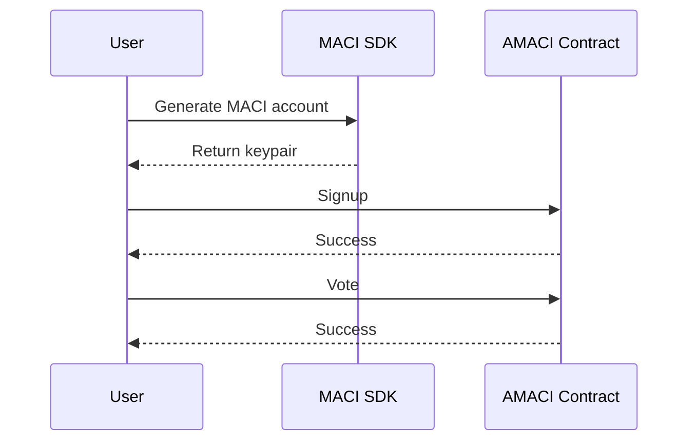
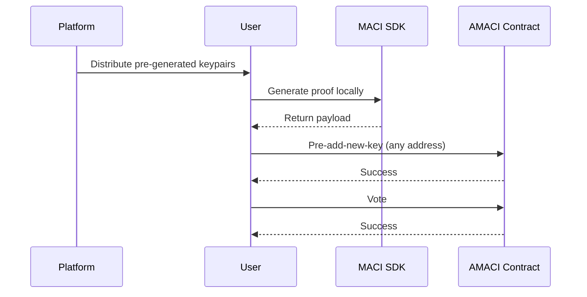

# Voting Operations Guide

MACI supports two voting methods: whitelist mode and Pre-add-new-key anonymous mode. Whitelist mode is simple and direct, suitable for public voting; anonymous mode provides strongest privacy protection, suitable for sensitive voting scenarios.

## Whitelist Mode

Suitable for users already in whitelist, simple and fast process.

### Process Overview



### Generate MACI Account

```typescript
import { MaciClient } from '@dorafactory/maci-sdk';

const client = new MaciClient({ network: 'testnet' });

const maciKeypair = await client.genKeypairFromSign({
  signer: wallet,
  address
});
```

### Signup (Whitelist Addresses Only)

```typescript
await client.signup({
  signer: wallet,
  address: userAddress,
  contractAddress: amaciContractAddress,
  maciKeypair: maciKeypair
});
```

### Vote

```typescript
const roundInfo = await client.getRoundInfo({ contractAddress });

const coordinatorPubKey = [
  BigInt(roundInfo.coordinatorPubkeyX),
  BigInt(roundInfo.coordinatorPubkeyY)
];

await client.vote({
  signer: wallet,
  address: userAddress,
  contractAddress: amaciContractAddress,
  selectedOptions: [
    { idx: 0, vc: 5 },
    { idx: 1, vc: 3 }
  ],
  operatorCoordPubKey: coordinatorPubKey,
  maciKeypair: maciKeypair
});
```

## Pre-add-new-key Anonymous Mode

Suitable for users who received platform-distributed keypairs, provides highest privacy level. Operator cannot determine voter identity.

### Process Overview



### Receive Platform-Distributed Keypair

Platform distributes through secure channel:

```json
{
  "privateKey": "0x1234567890abcdef...",
  "publicKey": {
    "x": "0xabcdef...",
    "y": "0x123456..."
  },
  "preDeactivateData": {
    "leaves": [ /* deactivate tree data */ ],
    "coordinatorPubkey": { "x": "...", "y": "..." }
  }
}
```

### Generate Proof and New Key Locally

```typescript
import { VoterClient, genKeypair } from '@dorafactory/maci-sdk';

const voterClient = new VoterClient({
  network: 'mainnet',
  secretKey: receivedPrivateKey
});

const myNewKeypair = genKeypair();

const payload = await voterClient.buildPreAddNewKeyPayload({
  stateTreeDepth: 10,
  coordinatorPubkey: preDeactivateData.coordinatorPubkey,
  deactivates: preDeactivateData.leaves,
  wasmFile: '/path/to/addNewKey.wasm',
  zkeyFile: '/path/to/addNewKey.zkey'
});
```

### Send Pre-add-new-key Transaction

```typescript
await client.rawPreAddNewKey({
  signer: anyWallet,
  contractAddress,
  d: payload.d,
  proof: payload.proof,
  nullifier: payload.nullifier,
  newPubkey: {
    x: myNewKeypair.publicKey[0].toString(16),
    y: myNewKeypair.publicKey[1].toString(16)
  }
});
```

### Vote

```typescript
const roundInfo = await client.getRoundInfo({ contractAddress });

await client.vote({
  signer: anyWallet,
  address: anyAddress,
  contractAddress,
  selectedOptions: [
    { idx: 0, vc: 8 },
    { idx: 1, vc: 6 }
  ],
  operatorCoordPubKey: [
    BigInt(roundInfo.coordinatorPubkeyX),
    BigInt(roundInfo.coordinatorPubkeyY)
  ],
  maciKeypair: myNewKeypair
});
```

## Voting Rules

### 1P1V Mode

Voice credits directly correspond to votes:

```typescript
// Assume user has 100 voice credits
selectedOptions: [
  { idx: 0, vc: 50 },  // 50 votes
  { idx: 1, vc: 30 },  // 30 votes
  { idx: 2, vc: 20 }   // 20 votes
]
// Total cost = 50 + 30 + 20 = 100
```

### QV (Quadratic Voting) Mode

Square of voice credits as consumption:

```typescript
// Assume user has 100 voice credits
selectedOptions: [
  { idx: 0, vc: 8 },  // 8 votes, costs 64 credits (8²)
  { idx: 1, vc: 6 }   // 6 votes, costs 36 credits (6²)
]
// Total cost = 64 + 36 = 100
```

## Revoting

Users can vote multiple times, later votes override earlier ones:

```typescript
// First vote
await client.vote({
  selectedOptions: [{ idx: 0, vc: 5 }],
  // ...
});

// Change mind, revote
await client.vote({
  selectedOptions: [{ idx: 1, vc: 5 }],
  // ...
});
// Only second vote (option 1) is valid in the end
```

## Complete Example Functions

### Whitelist Mode

```typescript
async function whitelistVoting(
  client: MaciClient,
  wallet: any,
  address: string,
  contractAddress: string,
  voteOptions: { idx: number; vc: number }[]
) {
  try {
    const maciKeypair = await client.genKeypairFromSign({ 
      signer: wallet, 
      address 
    });
    
    await client.signup({
      signer: wallet,
      address,
      contractAddress,
      maciKeypair
    });
    
    const roundInfo = await client.getRoundInfo({ contractAddress });
    
    await client.vote({
      signer: wallet,
      address,
      contractAddress,
      selectedOptions: voteOptions,
      operatorCoordPubKey: [
        BigInt(roundInfo.coordinatorPubkeyX),
        BigInt(roundInfo.coordinatorPubkeyY)
      ],
      maciKeypair
    });
    
    return true;
  } catch (error) {
    console.error('Voting failed:', error);
    return false;
  }
}
```

### Pre-add-new-key Anonymous Mode

```typescript
async function anonymousVoting(
  client: MaciClient,
  receivedPrivateKey: string,
  preDeactivateData: any,
  anyWallet: any,
  anyAddress: string,
  contractAddress: string,
  voteOptions: { idx: number; vc: number }[]
) {
  try {
    const voterClient = new VoterClient({
      network: 'mainnet',
      secretKey: receivedPrivateKey
    });
    
    const myNewKeypair = genKeypair();
    
    const payload = await voterClient.buildPreAddNewKeyPayload({
      stateTreeDepth: 10,
      coordinatorPubkey: preDeactivateData.coordinatorPubkey,
      deactivates: preDeactivateData.leaves,
      wasmFile,
      zkeyFile
    });
    
    await client.rawPreAddNewKey({
      signer: anyWallet,
      contractAddress,
      d: payload.d,
      proof: payload.proof,
      nullifier: payload.nullifier,
      newPubkey: {
        x: myNewKeypair.publicKey[0].toString(16),
        y: myNewKeypair.publicKey[1].toString(16)
      }
    });
    
    const roundInfo = await client.getRoundInfo({ contractAddress });
    
    await client.vote({
      signer: anyWallet,
      address: anyAddress,
      contractAddress,
      selectedOptions: voteOptions,
      operatorCoordPubKey: [
        BigInt(roundInfo.coordinatorPubkeyX),
        BigInt(roundInfo.coordinatorPubkeyY)
      ],
      maciKeypair: myNewKeypair
    });
    
    return true;
  } catch (error) {
    console.error('Anonymous voting failed:', error);
    return false;
  }
}
```

## FAQ

**How to calculate how many votes I can cast?**

Depends on voting mode and your voice credits:

```typescript
// 1P1V mode
const maxVotes = voiceCredits;  // 100 credits = 100 votes

// QV mode  
const maxVotes = Math.floor(Math.sqrt(voiceCredits));  // 100 credits = 10 votes
```

**How to choose between whitelist and anonymous mode?**

Based on privacy needs:
- **Whitelist Mode**: Simple and fast, but Operator knows your identity
- **Anonymous Mode**: Fully anonymous, Operator doesn't know who specifically, recommended for private voting

**What if voting fails?**

Check the following:
1. Is it during voting period
2. Whitelist mode: Is address in whitelist
3. Anonymous mode: Do you have platform-distributed key
4. Are voice credits sufficient

**Can I vote for multiple options simultaneously?**

Yes, add multiple options in the `selectedOptions` array:

```typescript
selectedOptions: [
  { idx: 0, vc: 5 },
  { idx: 1, vc: 3 },
  { idx: 2, vc: 2 }
]
```

**How to revoke vote?**

Revote and set all weights to 0, or vote for other options.

## Privacy Level Comparison

| Mode | Operator Knows Identity | On-chain Tracking Difficulty | Privacy Level | Use Cases |
|------|------------------------|------------------------------|---------------|-----------|
| Whitelist Signup | Yes | Easy | Low | Simple voting |
| Pre-add-new-key | No | Extremely Hard | Highest | Anonymous voting |

## Related Documentation

- [Query API](/docs/sdk/query-api) - Query voting information and results
- [Complete Examples](/docs/examples/basic-voting) - View practical application code
- [Advanced Features](/docs/sdk/advanced) - Explore more SDK features
