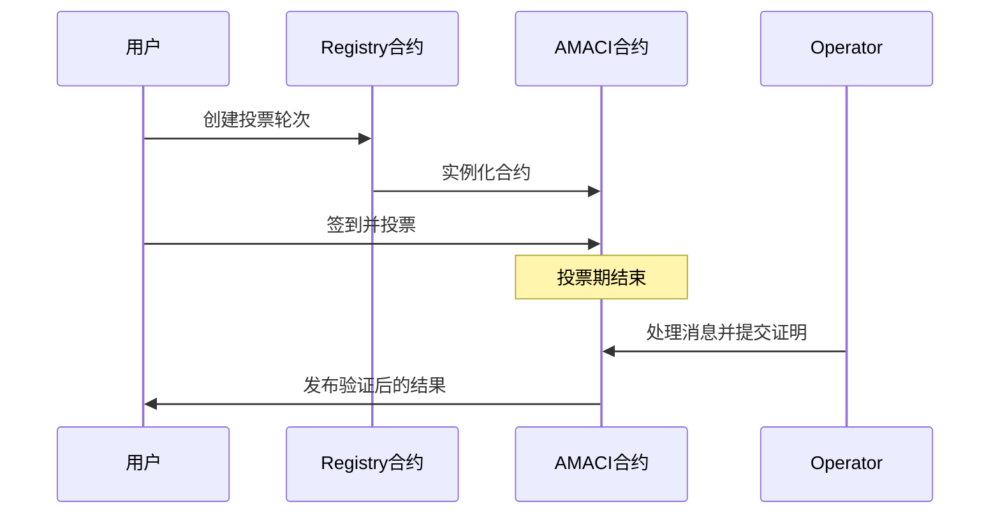

# MACI - 最小化抗串谋基础设施

欢迎来到 MACI（Minimal Anti-Collusion Infrastructure）文档！

## 什么是 MACI？

MACI 是一套智能合约、密码学库和零知识电路的集合，通过链上验证提供抗串谋的投票系统。它使用创新的密码学机制来防止贿选和强制，同时确保投票隐私和结果的可验证性。

## 核心价值

- **🔒 隐私保护**：通过加密和零知识证明确保投票者隐私
- **🛡️ 抗串谋**：通过创新的密码学机制防止贿赂和强制
- **✅ 可验证性**：所有投票结果都可以通过零知识证明进行验证
- **⚡ 灵活投票**：支持一人一票（1P1V）、二次方投票（QV）等多种投票机制
- **🌐 跨链支持**：集成 Cosmos Hub 生态系统和 Dora Vota 生态系统

## 主要组成部分

### 智能合约

MACI 包含部署在基于 Cosmos 链上的 CosmWasm 智能合约：

- **Registry 合约**：管理 Operator、投票轮次和电路配置的注册中心
- **AMACI 合约**：支持匿名投票、去活化检测和隐私增强的投票合约实例
- **API 合约**：提供 SaaS 服务管理和部署功能

### SDK 和库

**TypeScript:**
- `@dorafactory/maci-sdk` - 完整的 MACI 客户端 SDK，用于投票、轮次管理、查询等
- `@dorafactory/maci-operator` - 专用的 MACI/AMACI Operator 系统

**Rust:**
- `baby-jubjub` - Baby Jubjub 椭圆曲线实现（兼容 EIP-2494）
- `eddsa-poseidon` - 使用 Poseidon 哈希的 EdDSA 签名方案
- `maci-crypto` - MACI 核心密码学原语库
- `maci-utils` - MACI 合约的共享工具函数

### 零知识电路

使用 Circom 编写的零知识电路，实现隐私保护的投票处理和统计：
- 支持 Groth16 和 PLONK 证明系统
- 优化的约束系统，适用于链上验证
- ProcessMessages、Tally、StateTransition 等核心电路

## 应用场景

- **DAO 治理**：社区决策和提案投票
- **二次方投票**：公共物品资金分配
- **链上选举**：透明且防串谋的选举系统
- **代币投票**：基于代币权重的投票机制

## 快速开始

  <a href="/introduction/what-is-maci" style={{ padding: '1.5rem', border: '1px solid #e5e7eb', borderRadius: '0.5rem', textDecoration: 'none', color: 'inherit', transition: 'all 0.2s' }}>
    <strong>📚 入门指南</strong>
    
了解 MACI 是什么以及核心特性

  </a>
  <a href="/protocol/overview" style={{ padding: '1.5rem', border: '1px solid #e5e7eb', borderRadius: '0.5rem', textDecoration: 'none', color: 'inherit', transition: 'all 0.2s' }}>
    <strong>🔬 协议详解</strong>
    
深入理解 MACI 协议的工作原理

  </a>
  <a href="/contracts/architecture" style={{ padding: '1.5rem', border: '1px solid #e5e7eb', borderRadius: '0.5rem', textDecoration: 'none', color: 'inherit', transition: 'all 0.2s' }}>
    <strong>🏗️ 合约设计</strong>
    
了解 Registry 和 AMACI 合约

  </a>
  <a href="/sdk/installation" style={{ padding: '1.5rem', border: '1px solid #e5e7eb', borderRadius: '0.5rem', textDecoration: 'none', color: 'inherit', transition: 'all 0.2s' }}>
    <strong>💻 SDK 使用指南</strong>
    
开始使用 MACI SDK 构建应用

  </a>

## 工作原理

MACI 系统包含三个关键角色：

1. **投票者（Voter）**：生成加密的投票消息并提交到链上
2. **协调者（Operator/Coordinator）**：处理加密消息并生成零知识证明
3. **智能合约**：存储消息、验证证明并发布结果

## 技术资源

深入了解 MACI 的技术细节：

- [Minimal anti-collusion infrastructure](https://ethresear.ch/t/minimal-anti-collusion-infrastructure/5413)
- [MACI anonymization - using rerandomizable encryption](https://ethresear.ch/t/maci-anonymization-using-rerandomizable-encryption/7054)
- [MACI anonymization based on 2-of-2 MPC](https://research.dorahacks.io/2023/03/30/mpc-maci-anonymization/)

## 下一步

准备好开始了吗？选择您的路径：

- 📚 [了解 MACI 是什么](/introduction/what-is-maci) - 深入理解 MACI 的概念和目标
- 🚀 [快速开始](/introduction/quick-start) - 5 分钟创建您的第一个投票
- 🔧 [安装 SDK](/sdk/installation) - 开始使用 MACI SDK
- 💡 [查看示例](/examples/basic-voting) - 学习完整的投票流程
