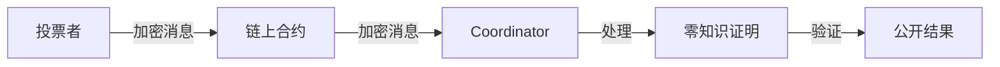
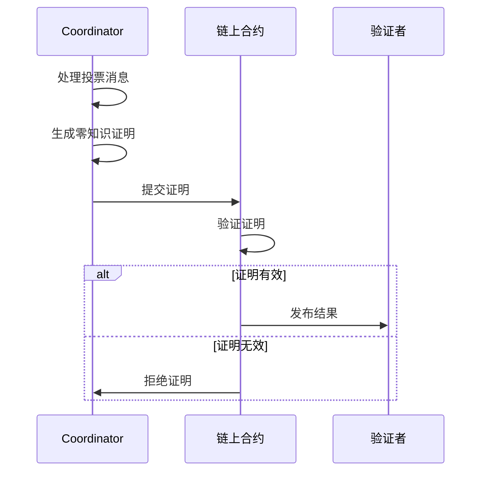
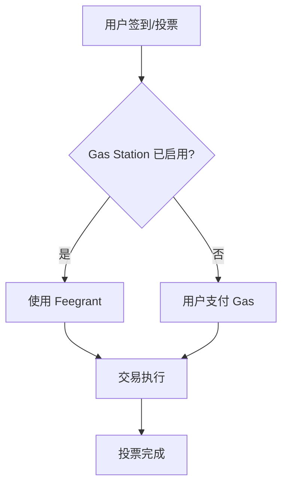

# 核心特性

MACI 提供了一系列创新的功能，使其成为一个强大的抗串谋投票系统。本节详细介绍 MACI 的核心特性。

## 🔒 隐私保护

### 端到端加密

MACI 使用端到端加密来保护投票内容：

- **加密算法**：使用 Poseidon 哈希和 ECDH 密钥交换
- **加密对象**：所有投票消息在链上都是加密的
- **解密权限**：只有 Coordinator 能够解密投票内容



### 隐私级别

MACI 提供了不同级别的隐私保护：

1. **投票内容隐私**：投票给哪个选项保持加密
2. **投票权重隐私**：投了多少票保持私密
3. **身份隐私**（AMACI）：使用匿名化技术保护投票者身份
4. **结果隐私**：只公布聚合结果，不公开个人投票

### 防止链接攻击

AMACI（Anonymous MACI）增加了额外的匿名化保护：

- **去活化检测**：防止通过去活化状态关联身份
- **Rerandomization**：重新随机化公钥来打破关联
- **预去活化根**：预先配置的去活化 Merkle 根

## 🛡️ 抗串谋

### 密钥更改机制

MACI 的核心反串谋机制是允许投票者随时更改密钥：

**工作原理：**

1. 投票者初始使用密钥 A 注册和投票
2. 投票者可以提交新密钥 B 来替换密钥 A
3. 使用密钥 A 的所有投票都会失效
4. 只有使用最新密钥的投票才有效

**防止贿选：**

```typescript
// 步骤 1: 投票者接受贿赂，承诺投给选项 A
await vote({ option: 'A', keypair: oldKeypair })
// 提供投票证明给贿赂者

// 步骤 2: 投票者秘密更改密钥
await changeKey({ newKeypair })

// 步骤 3: 投票者用新密钥投给真正想投的选项 B
await vote({ option: 'B', keypair: newKeypair })

// 结果：只有选项 B 的投票有效，贿赂者无法知道
```

### 可重复投票

投票者可以多次投票，后面的投票会覆盖前面的：

- **防止强制投票**：在强制下投票后，可以之后重新投票
- **纠正错误**：可以更正投票错误
- **改变主意**：投票期间可以随时改变投票

### 无法证明投票

由于密钥可以更改，投票者无法向第三方证明其最终投票：

- 即使提供了投票交易哈希，密钥可能已被更改
- 即使提供了密钥，可能不是最终使用的密钥
- 这使得贿选和强制投票变得不可行

## ✅ 可验证性

### 零知识证明

MACI 使用零知识证明来确保投票处理的正确性：

**证明类型：**

1. **ProcessMessages 证明**：证明所有投票消息被正确处理
2. **Tally 证明**：证明投票结果被正确统计

**验证过程：**



### 公开可验证

任何人都可以验证投票结果的正确性：

- **链上证明**：所有证明都存储在链上
- **公开验证**：任何人都可以下载并验证证明
- **确定性结果**：给定相同的输入，总是产生相同的输出

### Coordinator 约束

虽然 Coordinator 可以看到投票内容，但受到零知识证明的约束：

- **不能伪造投票**：必须处理链上的真实消息
- **不能修改投票**：任何修改都会导致证明验证失败
- **不能隐藏投票**：必须处理所有消息

## ⚡ 灵活投票机制

### 多种投票模式

MACI 支持多种投票模式：

#### 1. 一人一票（1P1V）

每个投票者有相同的投票权重：

```typescript
// 每个投票者有 100 点投票权
// 直接分配给选项
selectedOptions: [
  { idx: 0, vc: 50 },  // 给选项 0 投 50 票
  { idx: 1, vc: 30 },  // 给选项 1 投 30 票
  { idx: 2, vc: 20 },  // 给选项 2 投 20 票
]
// 总共使用 100 点投票权
```

#### 2. 二次方投票（QV）

投票权重的平方作为成本：

```typescript
// 每个投票者有 100 点投票权（voice credits）
// 投票权重的平方作为成本
selectedOptions: [
  { idx: 0, vc: 8 },  // 消耗 64 点投票权（8²）
  { idx: 1, vc: 5 },  // 消耗 25 点投票权（5²）
  { idx: 2, vc: 3 },  // 消耗 9 点投票权（3²）
]
// 总共消耗 98 点投票权
```

#### 3. 自定义权重

支持基于代币持有量的自定义权重分配：

- **Slope 模式**：投票权 = 代币数量 / slope
- **Threshold 模式**：达到阈值即可获得固定投票权

### 白名单支持

MACI 支持多种白名单机制：

#### Token 白名单

基于代币持有量：

```typescript
whitelist: {
  ecosystem: 'cosmoshub',  // 或 'doravota'
  snapshotHeight: '23342001',  // 快照区块高度
  votingPowerArgs: {
    mode: 'slope',
    slope: '1000000',  // 每 1 ATOM 获得 1 点投票权
  }
}
```

#### Oracle 白名单

使用 Oracle 签名验证：

- Oracle 服务器验证用户资格
- 签发证书（包含投票权重）
- 用户使用证书注册

### 投票选项灵活性

- **动态选项数量**：支持任意数量的投票选项
- **选项元数据**：可以为每个选项添加描述
- **多选投票**：可以同时投给多个选项

## 🌐 跨链支持

### Cosmos 生态集成

MACI 深度集成 Cosmos 生态系统：

**支持的链：**
- Cosmos Hub
- Dora Vota
- 其他兼容的 Cosmos 链

**跨链功能：**
- 跨链白名单查询
- 跨链代币权重计算
- IBC 消息传递（未来）

### 快照投票

支持基于历史快照的投票：

- **快照高度**：指定特定区块高度
- **历史权重**：使用历史代币持有量
- **防止操纵**：投票前无法通过转移代币来改变权重

### 实时权重

也支持实时权重计算：

- **动态查询**：注册时实时查询代币余额
- **灵活性**：适合不需要快照的场景
- **Gas 优化**：减少存储成本

## 🔧 Gas 优化

### Gas Station 支持

MACI 集成了 Gas Station 来降低用户的 Gas 成本：

**工作原理：**



**优势：**
- 用户无需持有原生代币
- 降低参与门槛
- 提升用户体验

### 批量处理

Coordinator 支持批量处理消息：

- **批量解密**：一次处理多条消息
- **批量验证**：一次验证多个签名
- **批量证明**：一次生成覆盖多条消息的证明

### 存储优化

- **消息压缩**：使用高效的消息打包
- **状态树优化**：使用 N-ary Merkle Tree
- **证明压缩**：使用 Groth16 生成小尺寸证明

## 🏗️ 系统架构优势

### Registry 模式

使用 Registry 合约统一管理：

- **Operator 管理**：注册和管理多个 Operator
- **一键创建**：简化 Round 创建流程
- **标准化**：统一的合约接口和配置

### 模块化设计

- **独立组件**：合约、SDK、Operator 系统独立开发
- **可扩展性**：易于添加新功能
- **可维护性**：清晰的代码结构

### 多语言支持

- **Rust**：合约和密码学库
- **TypeScript**：SDK 和前端工具
- **Circom**：零知识电路

## 📊 实用功能

### 实时查询

SDK 提供丰富的查询功能：

```typescript
// 查询轮次信息
const round = await client.getRoundById(contractAddress)

// 查询 Operator 列表
const operators = await client.getOperators()

// 查询投票状态
const proof = await client.getProofByContractAddress(contractAddress)
```

### 交易监控

- **交易状态跟踪**：实时监控交易状态
- **错误处理**：详细的错误信息和重试机制
- **事件监听**：监听合约事件

### 开发者友好

- **完整文档**：详细的 API 文档和示例
- **TypeScript 支持**：完整的类型定义
- **示例代码**：丰富的示例代码库

## 安全特性

### 密码学安全

- **经过审计**：密码学原语经过安全审计
- **标准兼容**：兼容 EIP-2494 和其他标准
- **测试覆盖**：全面的测试用例

### 智能合约安全

- **代码审计**：合约代码经过专业审计
- **形式化验证**：关键逻辑经过形式化验证
- **漏洞赏金**：持续的安全奖励计划

### 运行时安全

- **输入验证**：严格的输入验证
- **溢出保护**：防止数值溢出
- **访问控制**：细粒度的权限管理

## 下一步

了解了 MACI 的核心特性后，您可以：

- 🚀 [快速开始](/introduction/quick-start) - 动手体验 MACI
- 🔬 [协议详解](/protocol/overview) - 深入了解技术实现
- 💻 [SDK 使用](/sdk/installation) - 开始集成 MACI
