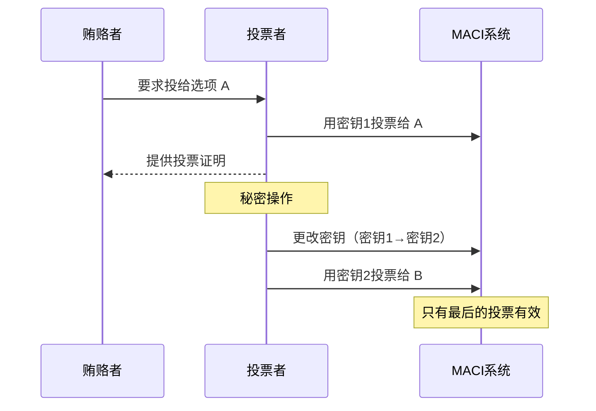

# MACI 是什么

MACI（Minimal Anti-Collusion Infrastructure，最小化抗串谋基础设施）是一个基于密码学的链上投票系统，旨在解决传统电子投票中的串谋、贿选和隐私泄露问题。

## 定义和目标

MACI 是一套完整的技术栈，包括：

- **智能合约**：部署在区块链上的投票逻辑
- **密码学库**：实现加密、签名和密钥管理
- **零知识电路**：生成和验证投票处理的证明
- **客户端 SDK**：方便开发者集成 MACI 功能

### 核心目标

MACI 的设计目标是创建一个：

1. **隐私保护**的投票系统 - 投票内容在处理前保持加密
2. **抗串谋**的投票机制 - 防止贿选和强制投票
3. **可验证**的投票结果 - 任何人都可以验证结果的正确性
4. **去中心化**的投票流程 - 不依赖可信第三方

## 解决的核心问题

### 1. 贿选问题

**传统投票系统的问题：**

在传统的链上投票中，所有投票都是公开的。这意味着贿赂者可以要求被贿赂者提供投票证明，从而完成贿选交易。

**MACI 的解决方案：**

MACI 允许投票者在投票期间的任何时候更改他们的密钥。一旦密钥更改，之前用旧密钥投的票就会失效。这意味着：

- 投票者可以先接受贿赂，用旧密钥投票
- 然后更改密钥，用新密钥重新投票
- 贿赂者无法验证最终投票是否有效

### 2. 强制投票问题

**传统投票系统的问题：**

攻击者可能通过暴力手段强制投票者投给特定选项，并要求投票者提供投票证明。

**MACI 的解决方案：**

由于投票者可以随时更改密钥，即使在强制下投票，投票者也可以在之后安全地更改投票，而强制者无法知道最终投票是否有效。

### 3. 隐私泄露问题

**传统投票系统的问题：**

链上投票通常是完全公开的，任何人都可以看到谁投了什么票，这会导致：

- 社交压力
- 报复风险
- 隐私侵犯

**MACI 的解决方案：**

MACI 使用端到端加密：

- 投票者的投票内容使用 Coordinator（协调者）的公钥加密
- 加密后的消息发送到链上
- 只有 Coordinator 能解密查看投票内容
- Coordinator 通过零知识证明来证明正确处理了所有投票
- 最终只公布聚合结果，不公开个人投票

## 与传统投票系统的对比

| 特性 | 传统链上投票 | MACI |
|------|-------------|------|
| 投票隐私 | ❌ 完全公开 | ✅ 端到端加密 |
| 抗贿选 | ❌ 可提供投票证明 | ✅ 密钥更改机制 |
| 抗强制 | ❌ 投票不可更改 | ✅ 可随时更改投票 |
| 结果可验证 | ✅ 链上可见 | ✅ 零知识证明 |
| Gas 成本 | 低 | 中等（有优化） |
| 用户体验 | 简单 | 需要额外步骤 |

## 工作原理概述

MACI 系统的工作流程分为几个阶段：

### 1. 准备阶段

- Coordinator 生成密钥对并公布公钥
- 创建投票轮次，设置投票选项和参数

### 2. 注册阶段

- 投票者生成自己的密钥对
- 投票者使用 Coordinator 公钥注册（Signup）
- 投票者获得投票权（Voice Credits）

### 3. 投票阶段

- 投票者使用自己的私钥和 Coordinator 的公钥生成加密投票消息
- 投票消息通过 ECDH 和 Poseidon 加密
- 加密消息发送到链上合约
- 投票者可以多次投票（后面的投票会覆盖前面的）
- 投票者可以随时更改密钥

### 4. 处理阶段

- 投票期结束
- Coordinator 下载所有加密消息
- Coordinator 在链下解密并处理所有消息
- Coordinator 生成零知识证明，证明处理的正确性
- Coordinator 将证明提交到链上

### 5. 验证阶段

- 智能合约验证零知识证明
- 验证通过后，发布最终投票结果
- 任何人都可以验证证明的有效性

## 技术栈简介

MACI 使用了多种先进的密码学和区块链技术：

### CosmWasm 智能合约

- 部署在基于 Cosmos 的区块链上
- 使用 Rust 编写，安全高效
- 支持复杂的投票逻辑和证明验证

### 密码学原语

- **Baby Jubjub 椭圆曲线**：高效的椭圆曲线，适合 ZK 电路
- **EdDSA 签名**：基于 Baby Jubjub 的数字签名方案
- **Poseidon 哈希**：ZK 友好的哈希函数
- **ECDH 密钥交换**：用于加密投票消息

### 零知识证明

- **Circom 电路**：定义投票处理的约束系统
- **Groth16/PLONK**：证明系统，用于生成和验证证明
- **链上验证器**：智能合约中的证明验证逻辑

### 开发工具

- **TypeScript SDK**：方便的客户端库
- **Rust Crates**：密码学库和工具函数
- **Operator 系统**：自动化的消息处理和证明生成

## MACI 的优势

### 安全性

- 基于成熟的密码学原语
- 零知识证明确保处理正确性
- 智能合约代码经过审计和测试

### 灵活性

- 支持多种投票模式（1P1V、QV）
- 可配置的投票参数
- 支持白名单和权重分配

### 隐私性

- 端到端加密保护投票内容
- 不泄露个人投票信息
- 只公布聚合结果

### 抗串谋性

- 密钥更改机制防止贿选
- 可重复投票防止强制
- 无法提供有效的投票证明

## 使用场景

MACI 适用于需要高度隐私保护和抗串谋的投票场景：

### DAO 治理

- 社区提案投票
- 协议参数调整
- 资金分配决策

### 二次方融资

- 公共物品资金分配
- 社区项目支持
- Gitcoin Grants 类型的资助

### 选举系统

- 组织内部选举
- 社区代表选举
- 委员会成员选举

### 代币持有者投票

- 基于代币权重的投票
- 跨链投票支持
- 快照投票

## 权衡和限制

虽然 MACI 提供了强大的隐私和抗串谋保护，但也有一些权衡：

### 依赖 Coordinator

- Coordinator 需要诚实地处理投票
- 虽然有零知识证明约束，但 Coordinator 可能拒绝处理
- 未来可能通过多方计算（MPC）来去中心化

### Gas 成本

- 零知识证明验证需要链上计算
- 比传统投票系统消耗更多 Gas
- 已通过优化和 Gas Station 来降低成本

### 用户体验

- 需要生成和管理密钥对
- 投票流程比传统投票复杂
- 需要等待 Coordinator 处理结果

### 实时性

- 结果不是实时的
- 需要等待投票期结束和处理阶段
- 处理大量投票需要时间

## 下一步

现在您已经了解了 MACI 是什么，接下来可以：

- 📋 [探索核心特性](/introduction/key-features) - 深入了解 MACI 的各项功能
- 🚀 [快速开始](/introduction/quick-start) - 动手创建第一个投票
- 🔬 [协议详解](/protocol/overview) - 学习 MACI 的技术细节
