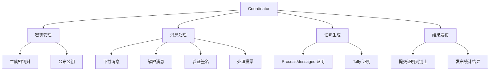
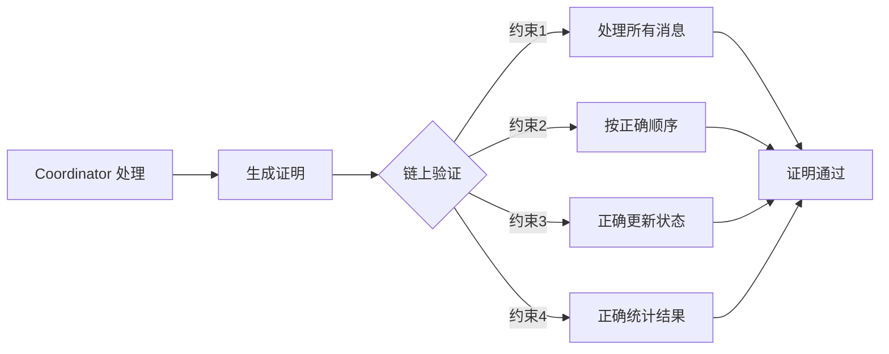
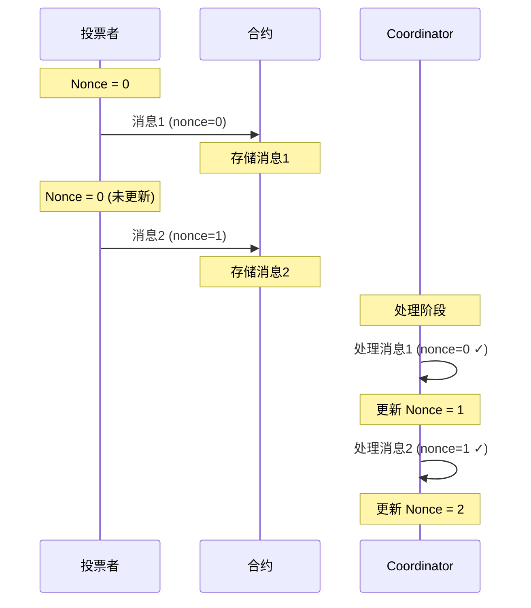
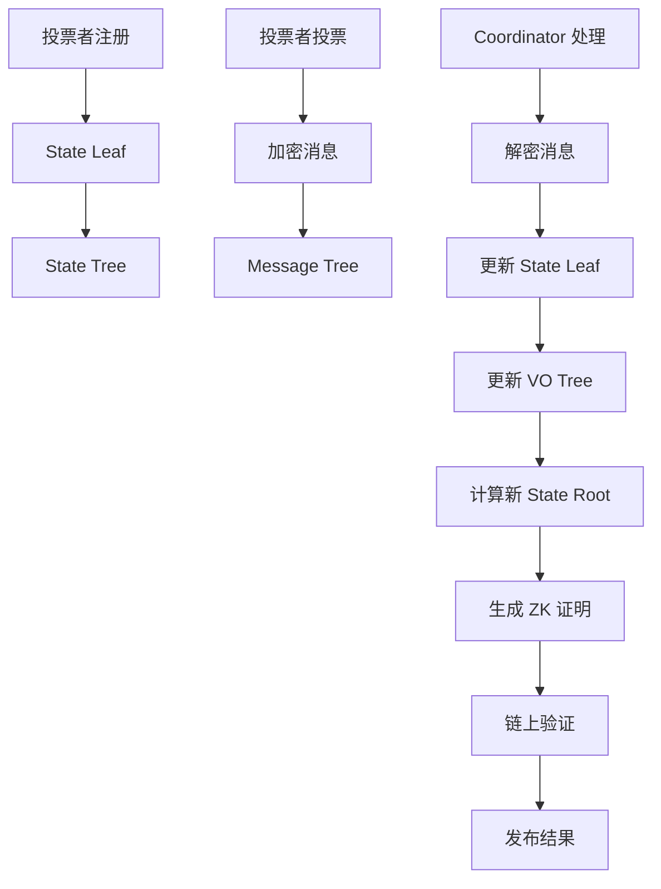

# 核心概念

本节深入介绍 MACI 系统的核心概念，包括参与角色、状态管理和数据结构。

## 三个关键角色

MACI 系统由三个关键角色组成，每个角色在系统中扮演不同的职责。

### 1. 投票者（Voter）

投票者是参与投票的用户，拥有自己的密钥对并提交加密的投票消息。

#### 密钥对

每个投票者都有一个 EdDSA 密钥对：

```typescript
// 密钥对结构
interface Keypair {
  privateKey: bigint;     // 私钥（保密）
  publicKey: [bigint, bigint];  // 公钥（Baby Jubjub 曲线上的点）
}

// 生成密钥对
const keypair = genKeypair();
```

**公钥（Public Key）：**
- Baby Jubjub 曲线上的一个点 (x, y)
- 公开给系统，用于验证签名
- 存储在状态树中

**私钥（Private Key）：**
- 一个大整数
- 必须保密，用于签名消息
- 可以更改（生成新密钥对）

#### 投票者的操作

**注册（Signup）：**

```typescript
// 1. 生成密钥对
const maciAccount = await client.circom.genKeypairFromSign(wallet, address);

// 2. 获取白名单证书（如果需要）
const certificate = await client.maci.requestOracleCertificate({
  ecosystem: 'cosmoshub',
  address,
  contractAddress,
});

// 3. 注册到 MACI 合约
await client.maci.signup({
  address,
  maciAccount,
  oracleCertificate: certificate,
});
```

**投票（Vote）：**

```typescript
// 创建并提交加密投票消息
await client.maci.vote({
  address,
  contractAddress,
  selectedOptions: [
    { idx: 0, vc: 5 },  // 选项索引和投票权重
    { idx: 1, vc: 3 },
  ],
  operatorCoordPubKey: coordinatorPubkey,
  maciAccount,
});
```

**更改密钥：**

```typescript
// 生成新密钥对
const newMaciAccount = genKeypair();

// 提交密钥更改消息
await client.maci.changeKey({
  address,
  contractAddress,
  oldMaciAccount,
  newMaciAccount,
});
```

### 2. Coordinator（协调者/Operator）

Coordinator 负责处理加密消息、生成证明并发布结果。

#### Coordinator 的职责



#### Coordinator 密钥对

Coordinator 也有自己的 EdDSA 密钥对：

```typescript
// Coordinator 密钥对
interface CoordinatorKeypair {
  privateKey: bigint;            // 用于解密投票消息
  publicKey: [bigint, bigint];   // 公开，用于投票者加密
}
```

**公钥用途：**
- 投票者使用 Coordinator 公钥加密投票消息
- 公布在投票轮次信息中

**私钥用途：**
- Coordinator 使用私钥解密投票消息
- 严格保密，不能泄露

#### 处理流程

**1. 下载消息**

```typescript
// 从链上查询所有投票消息
const messages = await contract.getMessages();

// 消息结构
interface Message {
  msgType: bigint;      // 消息类型
  data: bigint[];       // 加密的消息数据（10个字段）
}
```

**2. 解密消息**

```typescript
// 使用 ECDH 共享密钥解密
const sharedKey = genEcdhSharedKey(
  coordinatorPrivKey,
  voterPubKey
);

const command = decrypt(message.data, sharedKey);

// 解密后的命令结构
interface Command {
  nonce: bigint;          // 消息序号
  stateIndex: bigint;     // 投票者状态索引
  voteOptionIndex: bigint; // 投票选项索引
  newVoteWeight: bigint;   // 新的投票权重
  newPubKey: [bigint, bigint]; // 新公钥（可能不变）
  salt: bigint;           // 随机盐值
  signature: Signature;   // EdDSA 签名
}
```

**3. 验证和处理**

```typescript
// 验证签名
const isValid = verifySignature(
  command,
  command.signature,
  voterPubKey
);

if (isValid && command.nonce === currentNonce) {
  // 更新状态树
  updateStateTree(command);
  
  // 更新投票选项树
  updateVoteOptionTree(command);
}
```

#### 零知识证明约束

Coordinator 虽然可以看到投票内容，但受到零知识证明的约束：



**约束包括：**
- 必须处理所有链上消息
- 必须按 Nonce 顺序处理
- 必须正确验证签名
- 必须正确更新状态树
- 必须正确统计投票结果
- 不能伪造或修改投票

### 3. 智能合约

智能合约充当可信的中介，存储数据并验证证明。

#### 合约的职责

**存储管理：**
- 存储投票者公钥
- 存储加密的投票消息
- 存储状态树根
- 存储投票结果

**验证功能：**
- 验证投票者签名
- 验证白名单资格
- 验证零知识证明
- 验证投票规则

**状态管理：**
- 管理投票轮次状态（Created → Voting → Processing → Tallied）
- 管理投票者状态
- 管理消息队列

#### 合约状态

```rust
// 轮次状态
pub enum RoundStatus {
    Created,      // 已创建，等待开始
    Voting,       // 投票进行中
    Processing,   // 正在处理消息
    Tallied,      // 已统计完成
}

// 合约存储的数据
pub struct MaciState {
    coordinator_pubkey: PubKey,           // Coordinator 公钥
    state_tree_root: Uint256,             // 状态树根
    message_tree_root: Uint256,           // 消息树根
    num_signups: u64,                     // 注册人数
    messages: Vec<Message>,               // 消息队列
    status: RoundStatus,                  // 轮次状态
    results: Option<Vec<Uint256>>,        // 投票结果
}
```

## 状态管理

MACI 使用 Merkle Tree 来高效管理大量数据。

### 状态树（State Tree）

状态树存储所有投票者的状态。

#### State Leaf 结构

每个投票者在状态树中占据一个 Leaf：

```typescript
interface StateLeaf {
  pubKey: [bigint, bigint];    // 投票者公钥
  voiceCreditBalance: bigint;  // 剩余投票权重
  voteOptionTreeRoot: bigint;  // 投票选项树根
  nonce: bigint;               // 当前 Nonce
}
```

**字段说明：**

- **pubKey**：投票者的当前公钥（可能因密钥更改而变化）
- **voiceCreditBalance**：剩余的投票权重
  - 1P1V 模式：直接扣除投票权重
  - QV 模式：扣除投票权重的平方
- **voteOptionTreeRoot**：该投票者投票选项树的 Merkle 根
- **nonce**：下一条有效消息的序号

#### 状态树结构

```
              State Tree Root
              /             \
            /                 \
          /                     \
    [State 0]              [State 1]
    User A                 User B
    
    pubKey: [x0, y0]       pubKey: [x1, y1]
    balance: 100           balance: 75
    voTree: root0          voTree: root1
    nonce: 2               nonce: 1
```

**特点：**
- 使用 N-ary Merkle Tree（如 5-ary）
- 树的深度取决于最大投票者数量
- 每次处理消息后更新对应的 Leaf
- 树根存储在链上合约中

#### 状态更新示例

```typescript
// 初始状态
const initialLeaf = {
  pubKey: [x, y],
  voiceCreditBalance: 100,
  voteOptionTreeRoot: emptyRoot,
  nonce: 0,
};

// 处理投票消息后
const updatedLeaf = {
  pubKey: [x, y],              // 公钥不变
  voiceCreditBalance: 91,      // 100 - 9 (3²)
  voteOptionTreeRoot: newRoot, // 更新后的投票树根
  nonce: 1,                    // nonce +1
};

// 计算新的 Leaf 哈希
const newLeafHash = hash(updatedLeaf);

// 更新状态树
updateStateTree(stateIndex, newLeafHash);
```

### 投票选项树（Vote Option Tree）

每个投票者有一个投票选项树，记录对各选项的投票。

#### 投票选项树结构

```
              VO Tree Root
              /          \
            /              \
          /                  \
    [Option 0]          [Option 1]
    weight: 5           weight: 3
    
        |                   |
    [Option 2]          [Option 3]
    weight: 0           weight: 2
```

**特点：**
- Leaf 数量 = 投票选项数量
- 每个 Leaf 存储对该选项的投票权重
- 投票时只更新相关的 Leaf
- 树根存储在 State Leaf 中

#### 投票更新示例

```typescript
// 初始投票（所有选项权重为 0）
const initialVotes = [0, 0, 0, 0, 0];

// 第一次投票：给选项 0 投 5 票，选项 2 投 3 票
const vote1 = [
  { idx: 0, weight: 5 },
  { idx: 2, weight: 3 },
];
// 结果：[5, 0, 3, 0, 0]

// 第二次投票：修改投票，给选项 1 投 4 票
const vote2 = [
  { idx: 0, weight: 5 },  // 保持
  { idx: 1, weight: 4 },  // 新增
  { idx: 2, weight: 0 },  // 取消
];
// 结果：[5, 4, 0, 0, 0]
```

### 消息树（Message Tree）

所有投票消息按提交顺序组成消息树。

#### 消息树结构

```
              Message Tree Root
              /               \
            /                   \
          /                       \
    [Message 0]              [Message 1]
    (User A, t=100)          (User B, t=101)
    
    msgType: 1               msgType: 1
    data: [encrypted]        data: [encrypted]
```

**特点：**
- 按时间顺序添加消息
- 不可修改或删除
- 树根用于证明所有消息被处理
- 存储在链上合约中

#### 消息结构

```typescript
interface Message {
  msgType: bigint;      // 消息类型（1=投票，2=密钥更改）
  data: bigint[];       // 加密数据（10个字段）
}

// data 包含加密的 Command：
// [0]: packaged (nonce + stateIdx + voIdx + newVotes + salt)
// [1]: newPubKey.x
// [2]: newPubKey.y
// [3]: signature.R8.x
// [4]: signature.R8.y
// [5]: signature.S
// [6-9]: 加密 IV 和其他数据
```

## Nonce 机制

Nonce 是 MACI 中的关键机制，确保消息按正确顺序处理。

### Nonce 工作原理



### Nonce 验证规则

```typescript
// 处理消息时验证 Nonce
function processMessage(command: Command, currentState: StateLeaf): boolean {
  // 规则 1: Nonce 必须等于当前 Nonce
  if (command.nonce !== currentState.nonce) {
    return false; // 拒绝消息
  }
  
  // 规则 2: 验证签名
  if (!verifySignature(command, currentState.pubKey)) {
    return false; // 拒绝消息
  }
  
  // 规则 3: 检查余额
  const cost = calculateCost(command.newVoteWeight);
  if (cost > currentState.voiceCreditBalance) {
    return false; // 余额不足
  }
  
  // 接受消息并更新 Nonce
  currentState.nonce += 1;
  return true;
}
```

### Nonce 与重新投票

```typescript
// 场景：用户想要重新投票

// 第一次投票（Nonce = 0）
await vote({ nonce: 0, option: 0, weight: 5 });
// 链上 Nonce 仍然是 0（还未处理）

// 第二次投票（Nonce = 1）
await vote({ nonce: 1, option: 1, weight: 5 });
// 链上 Nonce 仍然是 0

// Coordinator 处理：
// - 处理消息1：nonce=0 ✓，更新状态，新 nonce=1
// - 处理消息2：nonce=1 ✓，更新状态，新 nonce=2
// 两次投票都有效，第二次覆盖第一次
```

### Nonce 与密钥更改

```typescript
// 场景：用户更改密钥使之前的投票失效

// 使用密钥 K1 投票（Nonce = 0）
await vote({ 
  keypair: K1,
  nonce: 0, 
  option: 0, 
  weight: 5 
});

// 更改密钥（Nonce = 1）
await changeKey({ 
  keypair: K1,
  nonce: 1, 
  newKeypair: K2 
});

// 使用密钥 K2 重新投票（Nonce = 2）
await vote({ 
  keypair: K2,
  nonce: 2, 
  option: 1, 
  weight: 5 
});

// Coordinator 处理：
// - 消息1：nonce=0, signed by K1 ✓
// - 消息2：nonce=1, signed by K1 ✓，更新公钥为 K2
// - 消息3：nonce=2, signed by K2 ✓
// 最终只有选项 1 的投票有效
```

## 消息类型

MACI 支持不同类型的消息。

### 1. 投票消息（Vote Message）

```typescript
interface VoteCommand {
  msgType: 1;
  nonce: bigint;
  stateIndex: bigint;
  voteOptionIndex: bigint;  // 投票的选项
  newVoteWeight: bigint;    // 新的投票权重
  newPubKey: [bigint, bigint];  // 通常与当前公钥相同
  salt: bigint;
}
```

### 2. 密钥更改消息（Key Change Message）

```typescript
interface KeyChangeCommand {
  msgType: 2;
  nonce: bigint;
  stateIndex: bigint;
  voteOptionIndex: 0;       // 不使用
  newVoteWeight: 0;         // 不使用
  newPubKey: [bigint, bigint];  // 新的公钥
  salt: bigint;
}
```

## 数据流

完整的数据流示意图：



## 下一步

现在您已经理解了 MACI 的核心概念，接下来可以学习：

- 🔐 [密码学机制](/protocol/cryptography) - 了解加密和签名的实现细节
- 📨 [消息流程](/protocol/message-flow) - 深入理解消息的生成和处理
- 🛡️ [隐私保护](/protocol/privacy-protection) - 探索隐私保护的各种机制
