# 消息流程

本节详细介绍 MACI 中消息的完整生命周期，从投票者生成消息到 Coordinator 处理消息并生成证明的全过程。

## 消息生命周期概览

```mermaid
graph TD
    A[投票者创建消息] --> B[加密和签名]
    B --> C[提交到链上]
    C --> D[存储在消息队列]
    D --> E[投票期结束]
    E --> F[Coordinator 下载]
    F --> G[解密消息]
    G --> H[验证签名]
    H --> I[按 Nonce 处理]
    I --> J[更新状态树]
    J --> K[生成 ZK 证明]
    K --> L[提交到链上]
    L --> M[验证并发布结果]
```



## 投票者端：消息生成

### 步骤 1: 准备投票数据

投票者首先需要准备要投票的数据：

```typescript
// 投票选项
const selectedOptions = [
  { idx: 0, vc: 5 },  // 给选项 0 投 5 票
  { idx: 1, vc: 3 },  // 给选项 1 投 3 票
  { idx: 2, vc: 2 },  // 给选项 2 投 2 票
];

// 验证投票权重
const totalCost = selectedOptions.reduce((sum, opt) => {
  return sum + (isQV ? opt.vc * opt.vc : opt.vc);
}, 0);

if (totalCost > voiceCredits) {
  throw new Error("投票权重超过可用额度");
}
```

### 步骤 2: 构造命令

```typescript
function createVoteCommand(
  stateIndex: number,
  nonce: number,
  voteOption: { idx: number; vc: number },
  currentPubKey: Point,
  salt: bigint
): Command {
  return {
    nonce: BigInt(nonce),
    stateIndex: BigInt(stateIndex),
    voteOptionIndex: BigInt(voteOption.idx),
    newVoteWeight: BigInt(voteOption.vc),
    newPubKey: currentPubKey,  // 通常保持不变
    salt: salt
  };
}
```

### 步骤 3: 打包和哈希

```typescript
// 打包命令字段
function packCommand(command: Command): bigint {
  // 将 5 个字段打包成一个 bigint
  let packed = BigInt(0);
  
  // nonce (8 bits)
  packed |= (command.nonce & BigInt(0xFF));
  
  // stateIndex (24 bits)
  packed |= ((command.stateIndex & BigInt(0xFFFFFF)) << BigInt(8));
  
  // voteOptionIndex (8 bits)
  packed |= ((command.voteOptionIndex & BigInt(0xFF)) << BigInt(32));
  
  // newVoteWeight (24 bits)
  packed |= ((command.newVoteWeight & BigInt(0xFFFFFF)) << BigInt(40));
  
  // salt (remaining bits)
  packed |= (command.salt << BigInt(64));
  
  return packed;
}

// 计算命令哈希
function hashCommand(command: Command): bigint {
  const packed = packCommand(command);
  return poseidon([
    packed,
    command.newPubKey[0],
    command.newPubKey[1]
  ]);
}
```

### 步骤 4: 签名

```typescript
// 使用私钥对命令哈希签名
const commandHash = hashCommand(command);
const signature = sign(voterPrivateKey, commandHash);

// 签名结构
// signature = {
//   R8: [x, y],  // 曲线上的点
//   S: bigint    // 标量
// }
```

### 步骤 5: 加密

```typescript
// 生成 ECDH 共享密钥
const sharedKey = genEcdhSharedKey(
  voterPrivateKey,
  coordinatorPublicKey
);

// 加密命令
const encryptedData = encrypt(
  {
    packed: packCommand(command),
    newPubKeyX: command.newPubKey[0],
    newPubKeyY: command.newPubKey[1],
    signatureR8X: signature.R8[0],
    signatureR8Y: signature.R8[1],
    signatureS: signature.S
  },
  sharedKey
);
```

### 步骤 6: 提交到链上

```typescript
// 构造消息
const message = {
  msgType: 1,  // 1 = 投票消息
  data: encryptedData  // 10 个加密的字段
};

// 提交到 MACI 合约
await maciContract.publishMessage(message);
```

## 完整的投票消息生成示例

```typescript
async function generateAndSubmitVote(
  voterAccount: {
    privateKey: bigint;
    publicKey: Point;
    stateIndex: number;
    nonce: number;
  },
  coordinatorPubKey: Point,
  contractAddress: string,
  voteOptions: { idx: number; vc: number }[]
) {
  // 对每个投票选项生成一条消息
  for (const option of voteOptions) {
    // 1. 生成随机盐值
    const salt = genRandomSalt();
    
    // 2. 创建命令
    const command = {
      nonce: BigInt(voterAccount.nonce),
      stateIndex: BigInt(voterAccount.stateIndex),
      voteOptionIndex: BigInt(option.idx),
      newVoteWeight: BigInt(option.vc),
      newPubKey: voterAccount.publicKey,
      salt: salt
    };
    
    // 3. 计算哈希
    const commandHash = hashCommand(command);
    
    // 4. 签名
    const signature = sign(voterAccount.privateKey, commandHash);
    
    // 5. ECDH 共享密钥
    const sharedKey = genEcdhSharedKey(
      voterAccount.privateKey,
      coordinatorPubKey
    );
    
    // 6. 加密
    const encryptedData = encrypt(
      command,
      signature,
      sharedKey
    );
    
    // 7. 构造消息
    const message = {
      msgType: 1,
      data: encryptedData
    };
    
    // 8. 提交到链上
    const tx = await contract.publishMessage(message);
    await tx.wait();
    
    console.log(`消息 ${voterAccount.nonce} 已提交`);
    
    // 9. 增加本地 nonce（注意：链上 nonce 只在处理时更新）
    voterAccount.nonce++;
  }
}
```

## Coordinator 端：消息处理

### 步骤 1: 下载消息

投票期结束后，Coordinator 从链上下载所有消息：

```typescript
async function downloadMessages(
  contractAddress: string
): Promise<Message[]> {
  // 查询合约获取所有消息
  const messages = await contract.getMessages();
  
  console.log(`下载了 ${messages.length} 条消息`);
  
  return messages;
}
```

### 步骤 2: 解密消息

```typescript
function decryptMessage(
  message: Message,
  coordinatorPrivateKey: bigint,
  voterPublicKey: Point
): Command {
  // 1. 生成 ECDH 共享密钥
  const sharedKey = genEcdhSharedKey(
    coordinatorPrivateKey,
    voterPublicKey
  );
  
  // 2. 解密数据
  const decrypted = decrypt(message.data, sharedKey);
  
  // 3. 解包命令
  const command = unpackCommand(decrypted);
  
  return command;
}
```

### 步骤 3: 验证签名

```typescript
function validateCommand(
  command: Command,
  voterPublicKey: Point
): boolean {
  // 1. 重新计算命令哈希
  const commandHash = hashCommand(command);
  
  // 2. 验证 EdDSA 签名
  const isValid = verifySignature(
    commandHash,
    command.signature,
    voterPublicKey
  );
  
  if (!isValid) {
    console.log("签名验证失败");
    return false;
  }
  
  return true;
}
```

### 步骤 4: 按序处理消息

```typescript
async function processMessages(
  messages: Message[],
  coordinatorPrivateKey: bigint,
  initialStateTree: MerkleTree
): Promise<ProcessingResult> {
  const stateTree = initialStateTree.clone();
  const processedCommands = [];
  
  for (let i = 0; i < messages.length; i++) {
    const message = messages[i];
    
    // 1. 获取投票者状态
    const stateLeaf = stateTree.getLeaf(message.stateIndex);
    const voterPubKey = stateLeaf.pubKey;
    
    // 2. 解密
    const command = decryptMessage(
      message,
      coordinatorPrivateKey,
      voterPubKey
    );
    
    // 3. 验证签名
    if (!validateCommand(command, voterPubKey)) {
      console.log(`消息 ${i}: 签名无效，跳过`);
      continue;
    }
    
    // 4. 验证 Nonce
    if (command.nonce !== stateLeaf.nonce) {
      console.log(`消息 ${i}: Nonce 不匹配，跳过`);
      continue;
    }
    
    // 5. 处理命令
    const newStateLeaf = applyCommand(stateLeaf, command);
    
    // 6. 更新状态树
    stateTree.update(command.stateIndex, newStateLeaf);
    
    // 7. 记录已处理的命令
    processedCommands.push(command);
    
    console.log(`消息 ${i}: 处理成功`);
  }
  
  return {
    newStateRoot: stateTree.getRoot(),
    processedCommands: processedCommands,
    stateTree: stateTree
  };
}
```

### 步骤 5: 更新状态

```typescript
function applyCommand(
  currentState: StateLeaf,
  command: Command
): StateLeaf {
  // 1. 更新公钥（如果有变化）
  const newPubKey = command.newPubKey;
  
  // 2. 计算投票成本
  const cost = calculateVoteCost(
    command.newVoteWeight,
    isQuadraticVoting
  );
  
  // 3. 检查余额
  if (cost > currentState.voiceCreditBalance) {
    throw new Error("余额不足");
  }
  
  // 4. 更新投票选项树
  const newVoTree = updateVoteOptionTree(
    currentState.voteOptionTreeRoot,
    command.voteOptionIndex,
    command.newVoteWeight
  );
  
  // 5. 返回新状态
  return {
    pubKey: newPubKey,
    voiceCreditBalance: currentState.voiceCreditBalance - cost,
    voteOptionTreeRoot: newVoTree.getRoot(),
    nonce: currentState.nonce + BigInt(1)  // Nonce +1
  };
}
```

## 零知识证明生成

处理完所有消息后，Coordinator 生成零知识证明：

### ProcessMessages 证明

```typescript
async function generateProcessMessagesProof(
  messages: Message[],
  coordinatorPrivateKey: bigint,
  initialStateRoot: bigint,
  finalStateRoot: bigint
): Promise<Proof> {
  // 准备电路输入
  const circuitInputs = {
    // 公开输入
    coordPubKey: genPublicKey(coordinatorPrivateKey),
    msgRoot: computeMessageRoot(messages),
    currentStateRoot: initialStateRoot,
    newStateRoot: finalStateRoot,
    
    // 私有输入
    coordPrivKey: coordinatorPrivateKey,
    messages: messages,
    currentStateLeavesPathElements: [...],
    newStateLeavesPathElements: [...],
    // ... 更多输入
  };
  
  // 调用 snarkjs 或其他 ZK 证明库
  const proof = await generateProof(
    'ProcessMessages',
    circuitInputs
  );
  
  return proof;
}
```

### Tally 证明

```typescript
async function generateTallyProof(
  stateTree: MerkleTree,
  results: bigint[]
): Promise<Proof> {
  // 准备电路输入
  const circuitInputs = {
    // 公开输入
    stateRoot: stateTree.getRoot(),
    tallyResult: results,
    
    // 私有输入
    stateLeaves: stateTree.getAllLeaves(),
    statePathElements: [...],
    // ... 更多输入
  };
  
  // 生成证明
  const proof = await generateProof(
    'TallyVotes',
    circuitInputs
  );
  
  return proof;
}
```

## 时间线示例

以下是一个完整投票轮次的时间线：

```mermaid
gantt
    title MACI 投票轮次时间线
    dateFormat HH:mm
    section 准备阶段
    创建轮次           :done, 00:00, 00:10
    发布 Coordinator 公钥 :done, 00:10, 00:15
    section 注册阶段
    用户 A 注册        :done, 00:15, 00:20
    用户 B 注册        :done, 00:20, 00:25
    用户 C 注册        :done, 00:25, 00:30
    section 投票阶段
    用户 A 投票        :done, 00:30, 00:35
    用户 B 投票        :done, 00:35, 00:40
    用户 A 改投        :done, 00:40, 00:45
    用户 C 投票        :done, 00:45, 00:50
    投票期结束         :milestone, 01:00, 0d
    section 处理阶段
    下载消息           :active, 01:00, 01:10
    解密和处理         :active, 01:10, 02:00
    生成 PM 证明       :active, 02:00, 02:30
    提交 PM 证明       :active, 02:30, 02:35
    生成 Tally 证明    :active, 02:35, 03:00
    提交 Tally 证明    :active, 03:00, 03:05
    section 结果阶段
    验证证明           :done, 03:05, 03:10
    发布结果           :milestone, 03:10, 0d
```



## 消息处理的详细示例

让我们通过一个具体例子来理解整个流程：

### 场景设置

```typescript
// 3 个投票者，5 个投票选项
const voters = [
  { name: 'Alice', stateIdx: 0, voiceCredits: 100 },
  { name: 'Bob',   stateIdx: 1, voiceCredits: 100 },
  { name: 'Carol', stateIdx: 2, voiceCredits: 100 },
];

const options = ['Option 0', 'Option 1', 'Option 2', 'Option 3', 'Option 4'];
```

### 投票阶段

```typescript
// Alice 投票（nonce=0）
Alice.vote([
  { idx: 0, vc: 5 },  // 给选项 0 投 5 票（消耗 25 credits in QV）
  { idx: 1, vc: 3 },  // 给选项 1 投 3 票（消耗 9 credits in QV）
]);
// Alice 剩余: 100 - 25 - 9 = 66 credits

// Bob 投票（nonce=0）
Bob.vote([
  { idx: 1, vc: 7 },  // 给选项 1 投 7 票（消耗 49 credits in QV）
]);
// Bob 剩余: 100 - 49 = 51 credits

// Alice 改变主意（nonce=1）
Alice.vote([
  { idx: 2, vc: 8 },  // 给选项 2 投 8 票（消耗 64 credits in QV）
]);
// Alice 剩余: 100 - 64 = 36 credits (之前的投票被覆盖)

// Carol 投票（nonce=0）
Carol.vote([
  { idx: 0, vc: 4 },  // 给选项 0 投 4 票（消耗 16 credits in QV）
  { idx: 3, vc: 6 },  // 给选项 3 投 6 票（消耗 36 credits in QV）
]);
// Carol 剩余: 100 - 16 - 36 = 48 credits
```

### 处理阶段

```typescript
// Coordinator 处理消息
const messages = await downloadMessages();

// 消息 1: Alice vote (nonce=0)
processMessage(messages[0]);  // ✓ 有效
// 状态更新: Alice nonce -> 1, 选项 0: +5, 选项 1: +3

// 消息 2: Bob vote (nonce=0)
processMessage(messages[1]);  // ✓ 有效
// 状态更新: Bob nonce -> 1, 选项 1: +7

// 消息 3: Alice revote (nonce=1)
processMessage(messages[2]);  // ✓ 有效 (nonce 匹配)
// 状态更新: Alice nonce -> 2, 选项 0: 0, 选项 1: 0, 选项 2: +8
// 注意: Alice 之前的投票被完全覆盖

// 消息 4: Carol vote (nonce=0)
processMessage(messages[3]);  // ✓ 有效
// 状态更新: Carol nonce -> 1, 选项 0: +4, 选项 3: +6
```

### 最终结果

```typescript
const finalTally = {
  'Option 0': 4,    // Carol: 4
  'Option 1': 7,    // Bob: 7
  'Option 2': 8,    // Alice: 8
  'Option 3': 6,    // Carol: 6
  'Option 4': 0,    // 无人投票
};

console.log("最终投票结果:", finalTally);
```

## 错误处理

### 常见错误场景

**1. Nonce 不匹配**

```typescript
// 用户提交了 nonce=5 的消息，但当前 nonce=3
if (command.nonce !== currentState.nonce) {
  console.log(`消息被拒绝: nonce=${command.nonce}, 期望=${currentState.nonce}`);
  continue;  // 跳过此消息
}
```

**2. 签名无效**

```typescript
if (!verifySignature(commandHash, signature, voterPubKey)) {
  console.log("消息被拒绝: 签名验证失败");
  continue;
}
```

**3. 余额不足**

```typescript
const cost = calculateVoteCost(command.newVoteWeight);
if (cost > currentState.voiceCreditBalance) {
  console.log("消息被拒绝: 余额不足");
  continue;
}
```

**4. 公钥不匹配**

```typescript
// 消息用旧公钥签名，但状态中已更新为新公钥
if (voterPubKey !== currentState.pubKey) {
  console.log("消息被拒绝: 公钥已更改");
  continue;
}
```

## 下一步

现在您已经理解了消息的完整流程，接下来可以学习：

- 🛡️ [隐私保护机制](/protocol/privacy-protection) - 了解如何保护投票隐私
- 🏗️ [合约设计](/contracts/architecture) - 学习合约如何存储和验证消息
- 💻 [SDK 使用指南](/sdk/installation) - 使用 SDK 创建和提交消息
