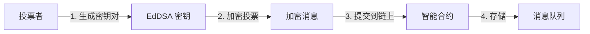
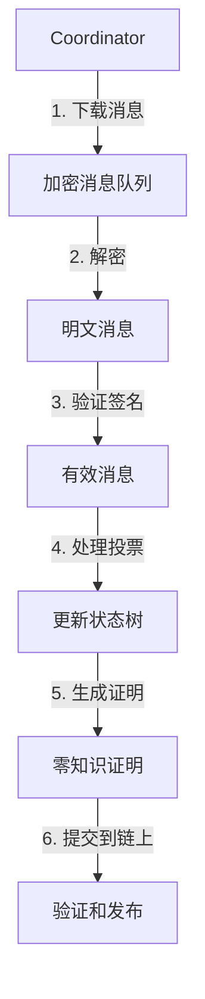
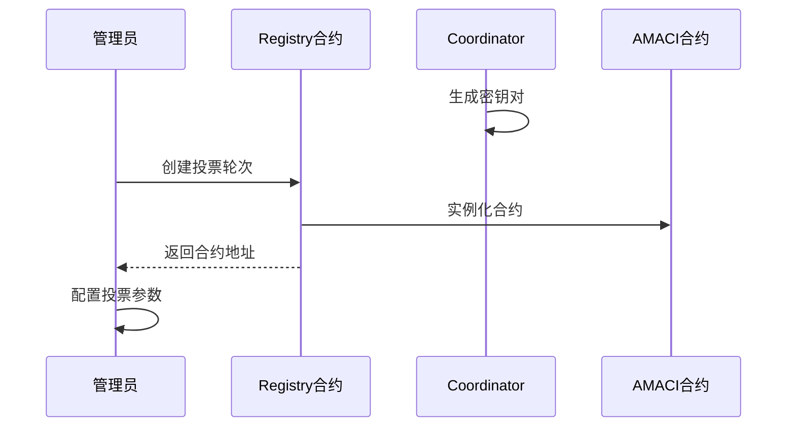
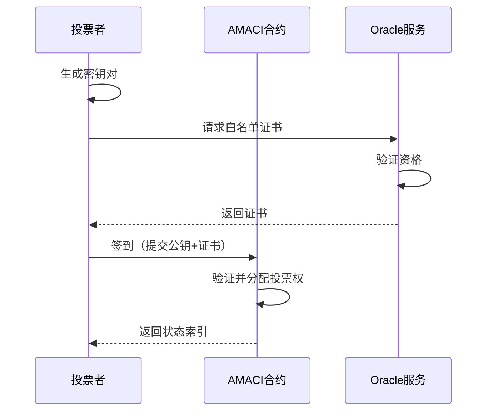
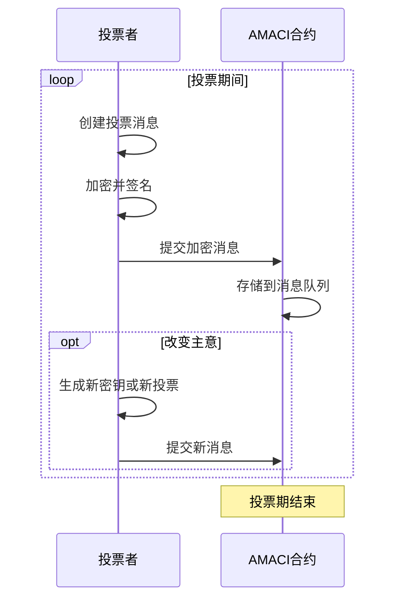
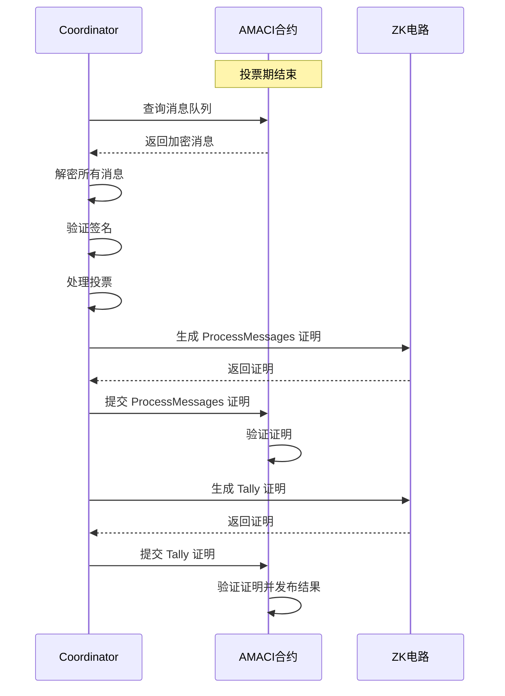
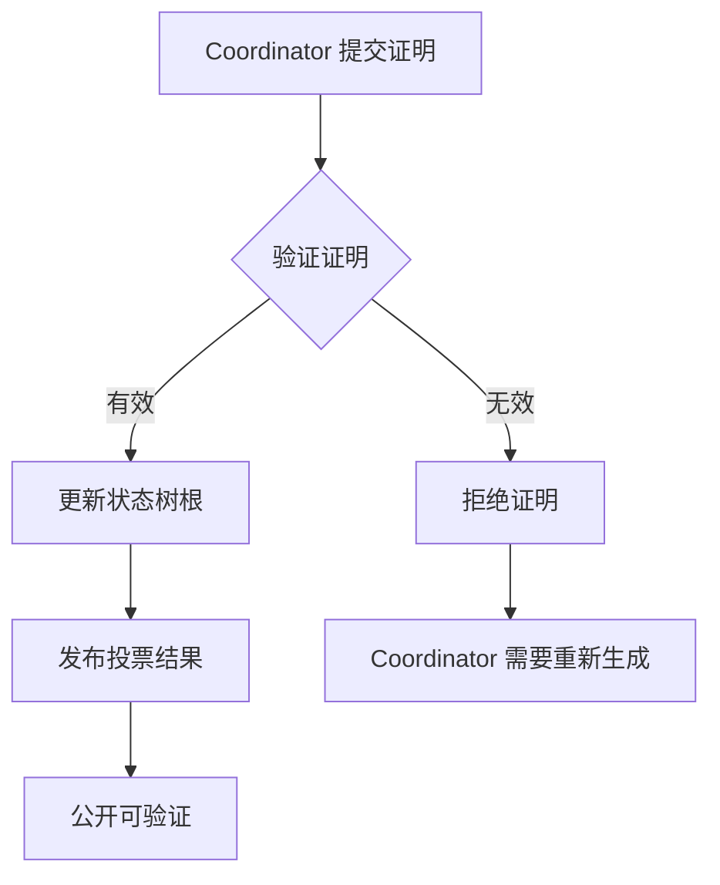

# 协议概览

MACI（Minimal Anti-Collusion Infrastructure）协议是一个复杂但精心设计的系统，通过密码学和零知识证明实现隐私保护和抗串谋的投票机制。

## 工作原理

MACI 的核心思想是将投票过程分为两个阶段：**链上阶段**和**链下阶段**。

### 链上阶段：加密和存储

在链上阶段，所有投票消息都是加密的：



**特点：**
- 所有投票内容都是加密的
- 只有 Coordinator 能解密
- 消息不可篡改（存储在区块链上）
- 任何人都可以验证消息的完整性

### 链下阶段：处理和证明

在链下阶段，Coordinator 处理消息并生成证明：



**特点：**
- Coordinator 在链下处理所有消息
- 生成零知识证明来证明处理正确性
- 证明提交到链上验证
- 验证通过后发布结果

## MACI 生命周期

一个完整的 MACI 投票轮次包含以下阶段：

### 1. 准备阶段

**目标：**设置投票环境和参数

**操作：**
- Coordinator 生成密钥对并公布公钥
- 创建投票轮次（通过 Registry 合约）
- 配置投票参数（选项、时间、白名单等）
- 部署 AMACI 合约实例



### 2. 注册阶段

**目标：**投票者注册并获得投票权

**操作：**
- 投票者生成自己的密钥对
- 投票者提交公钥到合约（Signup）
- 合约验证白名单资格
- 合约分配投票权（Voice Credits）
- 投票者获得状态索引（State Index）



### 3. 投票阶段

**目标：**投票者提交加密的投票消息

**操作：**
- 投票者创建投票消息
- 使用 Coordinator 公钥加密消息
- 使用自己的私钥签名
- 提交加密消息到链上
- 可以多次投票覆盖之前的投票
- 可以更改密钥使之前的投票失效



### 4. 处理阶段

**目标：**Coordinator 处理消息并生成证明

**操作：**
- 投票期结束
- Coordinator 下载所有加密消息
- Coordinator 解密消息
- Coordinator 验证签名
- Coordinator 按 Nonce 顺序处理消息
- Coordinator 更新状态树
- Coordinator 生成 ProcessMessages 证明
- Coordinator 统计投票结果
- Coordinator 生成 Tally 证明



### 5. 验证和结果阶段

**目标：**验证证明并公布结果

**操作：**
- 智能合约验证零知识证明
- 验证通过后更新状态树根
- 发布最终投票结果
- 任何人都可以验证证明的有效性



## 参与角色

MACI 系统中有三个关键角色，每个角色都有特定的职责和能力：

### 投票者（Voter）

**职责：**
- 生成和管理自己的密钥对
- 注册参与投票
- 创建和提交加密的投票消息
- 可选：更改密钥或重新投票

**能力：**
- 可以查看自己的公钥和状态索引
- 可以多次投票
- 可以更改密钥使之前的投票失效
- 可以验证自己的投票是否被包含在消息队列中

**限制：**
- 不能看到其他人的投票内容
- 不能证明自己最终投给了谁
- 不能修改已提交的消息

### Coordinator（协调者/Operator）

**职责：**
- 生成密钥对并公布公钥
- 下载和解密所有投票消息
- 处理消息并更新状态树
- 生成零知识证明
- 提交证明到链上

**能力：**
- 可以解密所有投票消息
- 可以看到所有投票内容
- 可以处理和统计投票

**限制（通过 ZK 证明约束）：**
- 不能伪造投票消息
- 不能修改投票内容
- 不能忽略或隐藏投票
- 不能改变投票处理顺序（必须按 Nonce）
- 必须正确统计投票结果

**信任假设：**
- Coordinator 可以看到投票内容（隐私依赖）
- Coordinator 必须诚实地处理投票（通过 ZK 证明约束）
- Coordinator 可能拒绝处理（活性依赖）

### 智能合约

**职责：**
- 存储加密的投票消息
- 管理投票者状态
- 验证零知识证明
- 发布投票结果

**能力：**
- 验证投票者的签名
- 验证白名单资格
- 验证零知识证明
- 强制执行投票规则

**限制：**
- 不能解密投票消息
- 不能直接统计投票结果
- 依赖 Coordinator 提交证明

## 状态管理

MACI 使用 Merkle Tree 来管理投票者状态：

### 状态树（State Tree）

状态树是一个存储所有投票者状态的 Merkle Tree：

```
                   Root
                  /    \
                /        \
              /            \
         [Leaf 0]       [Leaf 1]
         (User A)       (User B)
         
每个 Leaf 包含：
- 公钥（Public Key）
- 余额（Voice Credits Balance）
- 投票树根（Vote Option Tree Root）
- Nonce（消息序号）
- 投票状态（Voted）
```

**特点：**
- 每个投票者占据一个 Leaf
- Leaf 的位置就是状态索引（State Index）
- 状态树根（State Root）代表整个系统状态
- 状态树在处理每条消息后更新

### 投票选项树（Vote Option Tree）

每个投票者有一个投票选项树，记录对每个选项的投票：

```
       VO Root
        /    \
      /        \
   [Option 0] [Option 1]
   (5 votes)  (3 votes)
```

**特点：**
- 记录每个选项的投票权重
- 更新投票时只修改相关选项
- 树根存储在状态树的 Leaf 中

### 消息树（Message Tree）

所有投票消息组成一个 Merkle Tree：

```
                Message Root
                  /      \
                /          \
         [Message 0]    [Message 1]
         (User A Vote)  (User B Vote)
```

**特点：**
- 按提交顺序组织消息
- 消息树根用于验证所有消息被处理
- 保证消息的完整性和顺序

## 关键机制

### Nonce 机制

Nonce 是每个投票者的消息序号：

- 初始 Nonce = 0
- 每处理一条有效消息，Nonce +1
- 只有 Nonce 正确的消息才会被处理
- Nonce 确保消息按正确顺序处理

**示例：**

```
用户 A 提交了 3 条消息：
- 消息 1: nonce=0 (处理, 新 nonce=1)
- 消息 2: nonce=1 (处理, 新 nonce=2)
- 消息 3: nonce=1 (无效, nonce 已过期)
```

### 密钥更改机制

投票者可以更改密钥来使之前的投票失效：

1. 投票者用旧密钥 K1 投票
2. 投票者提交消息更改密钥为 K2
3. 状态 Leaf 中的公钥更新为 K2
4. 后续消息必须用 K2 签名
5. 用 K1 签名的消息变为无效

**防止贿选：**
- 贿赂者要求用 K1 投票给选项 A
- 投票者提供用 K1 投的票的证明
- 投票者秘密更改密钥为 K2
- 投票者用 K2 重新投给选项 B
- 最终只有选项 B 的投票有效

### 消息加密

投票消息使用 ECDH 和 Poseidon 加密：

1. **ECDH 密钥交换**：
   - 投票者私钥 × Coordinator 公钥 = 共享密钥
   - Coordinator 私钥 × 投票者公钥 = 相同共享密钥

2. **Poseidon 加密**：
   - 使用共享密钥派生加密密钥
   - 使用 Poseidon 加密消息字段

3. **EdDSA 签名**：
   - 对消息哈希签名
   - 证明消息来自投票者

## 安全保证

MACI 提供以下安全保证：

### 隐私保证

✅ **投票内容隐私**：只有 Coordinator 能看到投票内容  
✅ **投票者匿名性**：可以使用 AMACI 增强匿名性  
✅ **不可关联性**：密钥更改打破投票关联  

### 完整性保证

✅ **不可伪造**：所有消息必须有有效的 EdDSA 签名  
✅ **不可篡改**：消息存储在区块链上  
✅ **正确处理**：零知识证明确保 Coordinator 正确处理  

### 抗串谋保证

✅ **防止贿选**：密钥更改使投票证明无效  
✅ **防止强制**：可以重新投票  
✅ **无法证明投票**：投票者无法向第三方证明最终投票  

## 下一步

现在您已经了解了 MACI 协议的整体架构，接下来可以深入学习：

- 🔑 [核心概念](/protocol/core-concepts) - 详细了解角色和状态管理
- 🔐 [密码学机制](/protocol/cryptography) - 学习加密和签名方案
- 📨 [消息流程](/protocol/message-flow) - 理解消息的生成和处理
- 🛡️ [隐私保护](/protocol/privacy-protection) - 探索隐私保护机制
