# 隐私保护机制

MACI 通过多层密码学机制和创新的协议设计来保护投票隐私和防止串谋。本节详细介绍这些隐私保护机制。

## 隐私威胁模型

在分析隐私保护机制之前，让我们先了解传统投票系统面临的隐私威胁：

### 传统链上投票的问题

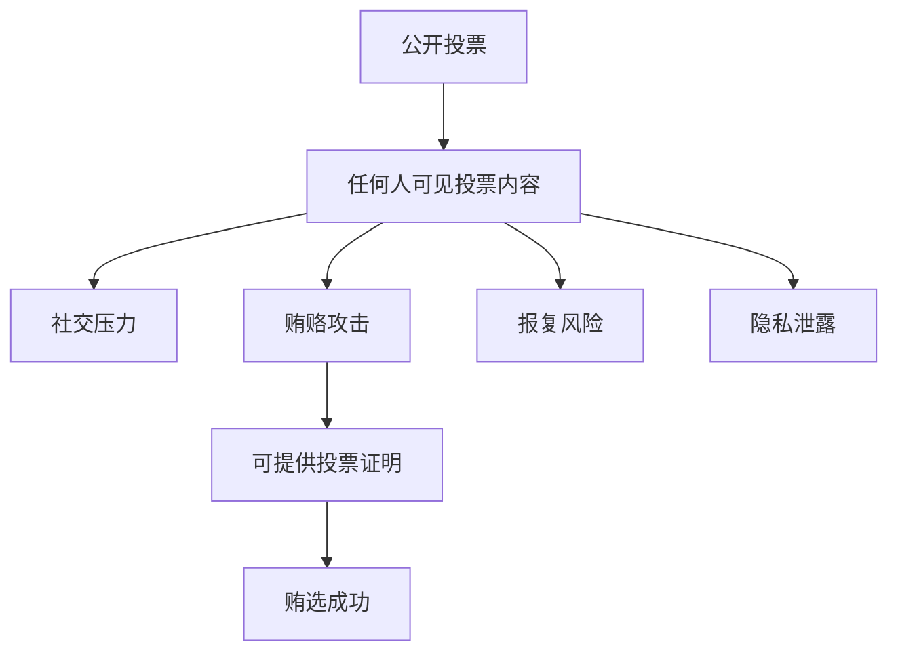

**具体威胁：**

1. **投票内容公开**：所有人都能看到谁投给了谁
2. **可证明投票**：投票者可以向第三方证明自己的投票
3. **强制投票**：攻击者可以强制投票者投特定选项
4. **贿选交易**：投票者可以出售投票权
5. **社交压力**：投票可能受到同伴压力影响

## MACI 的隐私保护层次

MACI 提供多层隐私保护：

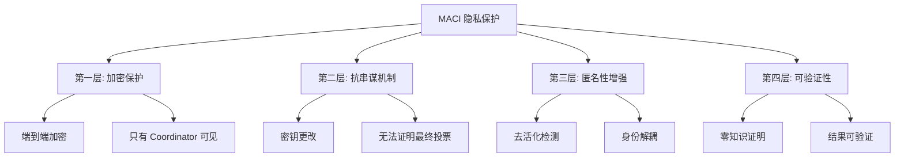

## 第一层：加密保护

### 端到端加密

投票消息从投票者到 Coordinator 是端到端加密的：

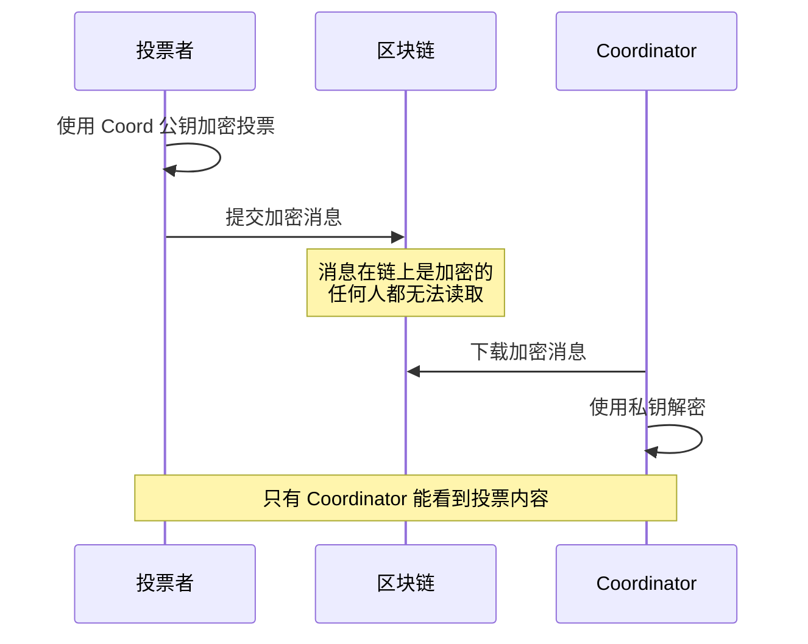

**实现细节：**

```typescript
// 投票者端加密
function encryptVote(
  vote: Vote,
  voterPrivateKey: bigint,
  coordinatorPublicKey: Point
): EncryptedMessage {
  // 1. ECDH 密钥交换
  const sharedSecret = ecdh(voterPrivateKey, coordinatorPublicKey);
  
  // 2. 使用 Poseidon 加密
  const encrypted = poseidonEncrypt(vote, sharedSecret);
  
  return encrypted;
}

// Coordinator 端解密
function decryptVote(
  encrypted: EncryptedMessage,
  coordinatorPrivateKey: bigint,
  voterPublicKey: Point
): Vote {
  // 1. ECDH 密钥交换（生成相同的共享密钥）
  const sharedSecret = ecdh(coordinatorPrivateKey, voterPublicKey);
  
  // 2. 使用 Poseidon 解密
  const vote = poseidonDecrypt(encrypted, sharedSecret);
  
  return vote;
}
```

### 投票内容隐私

加密确保了以下隐私保护：

**✓ 投票选项隐私**
- 投票给哪个选项保持加密
- 链上观察者无法得知

**✓ 投票权重隐私**
- 投了多少票保持加密
- 只有 Coordinator 知道

**✓ 投票历史隐私**
- 更改投票的历史保持加密
- 无法关联多次投票

### 加密的局限性

需要注意的是，加密只能保护投票内容不被**除 Coordinator 外的人**看到：

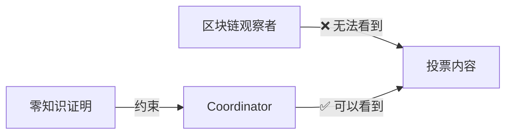

**信任假设：**
- Coordinator 可以看到所有投票内容
- Coordinator 不会泄露个人投票信息
- Coordinator 受零知识证明约束，不能篡改投票

## 第二层：抗串谋机制

### 密钥更改机制

MACI 的核心抗串谋功能是允许投票者随时更改密钥：

#### 工作原理

```typescript
// 初始状态
const state = {
  pubKey: oldPubKey,
  nonce: 0
};

// 用户用旧密钥投票
submitVote({
  keypair: oldKeypair,
  nonce: 0,
  option: 'A'
});
// 状态: nonce = 1

// 用户更改密钥
submitKeyChange({
  keypair: oldKeypair,
  nonce: 1,
  newPubKey: newPubKey
});
// 状态: pubKey = newPubKey, nonce = 2

// 用新密钥重新投票
submitVote({
  keypair: newKeypair,
  nonce: 2,
  option: 'B'
});
// 状态: nonce = 3

// 处理时，只有最后用 newKeypair 签名的投票有效
```

#### 防止贿选

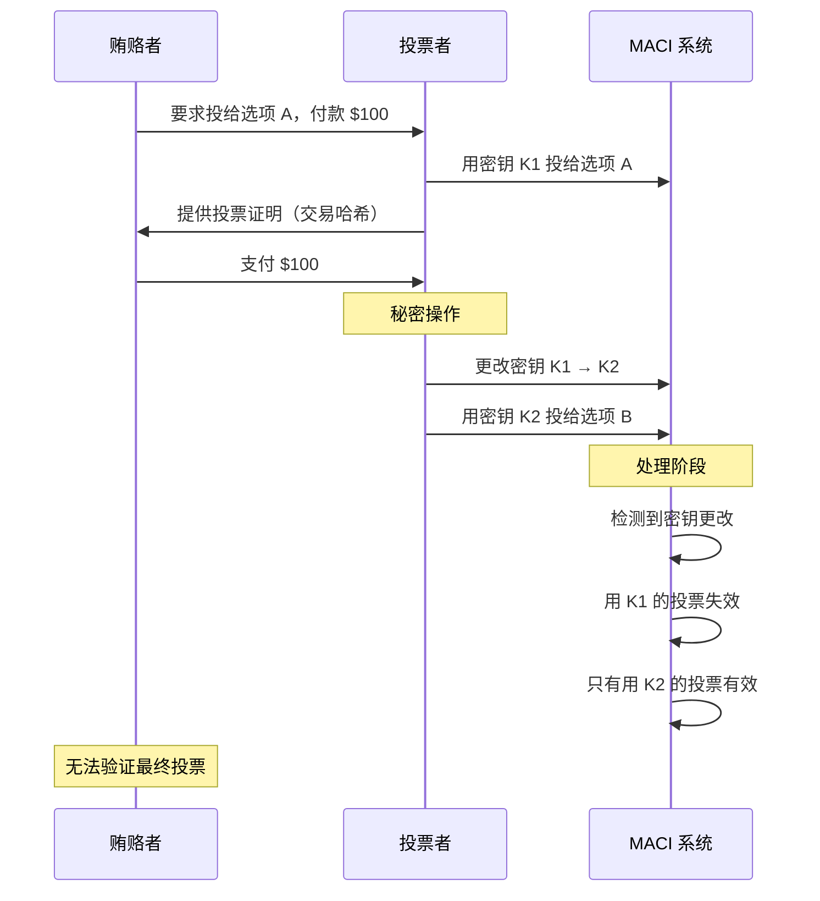

#### 防止强制投票

类似地，如果有人强制投票者投特定选项：

```typescript
// 在强制下投票
await vote({ 
  option: 'A',  // 强制者要求的选项
  keypair: keypair1 
});

// 之后安全地更改投票
await changeKey({ 
  oldKeypair: keypair1,
  newKeypair: keypair2 
});

await vote({ 
  option: 'B',  // 真正想投的选项
  keypair: keypair2 
});

// 强制者无法知道最终投票是否有效
```

### 无法证明投票

由于密钥可以更改，投票者**无法向第三方证明**其最终投票：

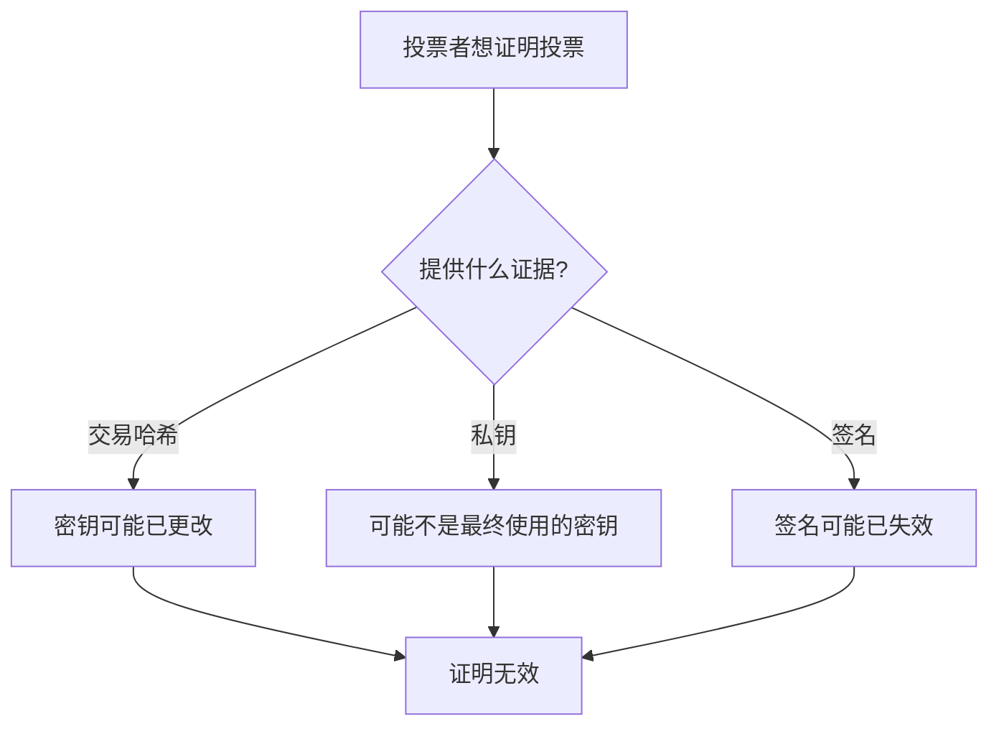

**示例对话：**

```
贿赂者: "证明你投给了选项 A"
投票者: "这是交易哈希: 0x123..."
贿赂者: "如何证明你没有之后更改密钥？"
投票者: "..." (无法证明)

贿赂者: "给我看你的私钥"
投票者: "这是私钥: 0xabc..."
贿赂者: "如何证明这是最终使用的私钥？"
投票者: "..." (无法证明，可能已生成新私钥)
```

### 可重复投票

投票者可以多次投票，后面的投票覆盖前面的：

```typescript
// 第一次投票
await vote({ option: 0, weight: 5, nonce: 0 });

// 改变主意
await vote({ option: 1, weight: 5, nonce: 1 });

// 再次改变主意
await vote({ option: 2, weight: 5, nonce: 2 });

// 处理时，只有最后一次投票（选项 2）有效
```

这提供了额外的抗串谋保护：
- 在压力下投票后可以重新投票
- 可以纠正错误
- 可以改变主意

## 第三层：匿名性增强（AMACI）

AMACI（Anonymous MACI）提供额外的匿名性保护。

### 问题：身份关联

在基本 MACI 中，虽然投票内容是加密的，但可能通过以下方式关联身份：

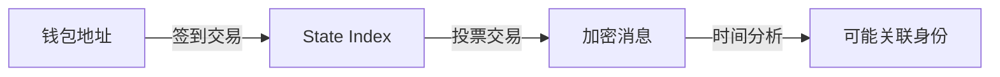

### 解决方案：去活化检测

AMACI 使用去活化（Deactivation）机制来增强匿名性：

#### 去活化根（Deactivate Root）

```typescript
// 预先配置的去活化 Merkle Root
// 包含所有应该被标记为"去活化"的公钥
const deactivateRoot = calculateDeactivateMerkleRoot([
  deactivatedPubKey1,
  deactivatedPubKey2,
  // ...
]);
```

#### 去活化检测电路

```typescript
// 在零知识证明中检测去活化状态
circuit DeactivateDetection() {
  // 输入
  signal input pubKey[2];
  signal input deactivateRoot;
  signal input deactivateMerkleProof[...];
  
  // 检查公钥是否在去活化树中
  signal isDeactivated = verifyMerkleProof(
    pubKey,
    deactivateRoot,
    deactivateMerkleProof
  );
  
  // 如果去活化，标记用户
  signal output deactivatedFlag = isDeactivated;
}
```

#### 效果

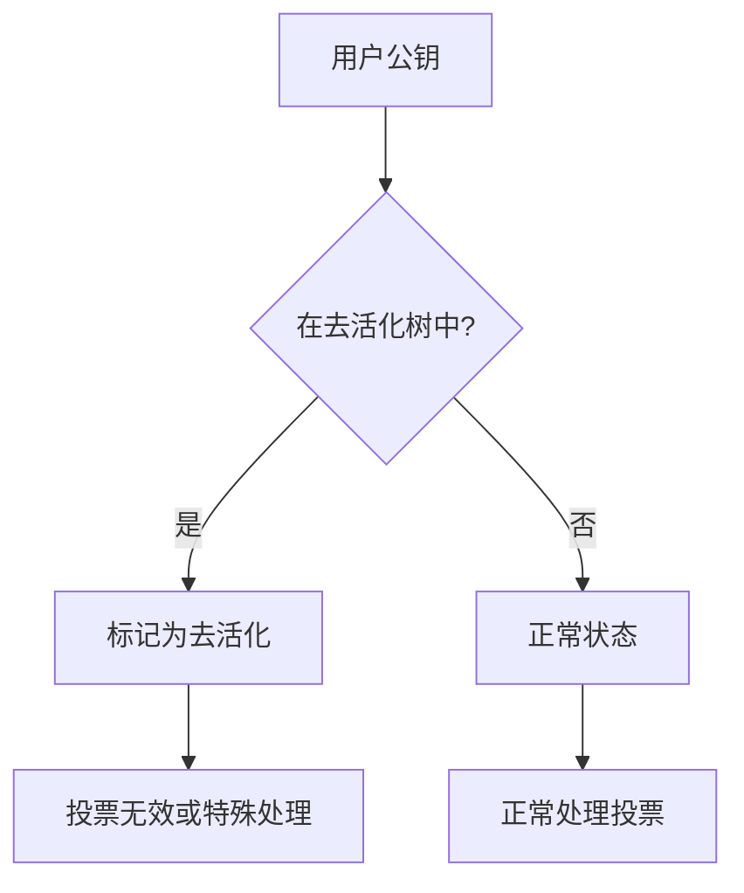

### Rerandomization（重新随机化）

AMACI 还可以使用重新随机化来打破公钥关联：

```typescript
// 原始公钥
const originalPubKey = genPublicKey(privateKey);

// 重新随机化
const randomFactor = genRandomScalar();
const rerandomizedPubKey = addPoints(
  originalPubKey,
  scalarMult(randomFactor, getBasePoint())
);

// rerandomizedPubKey 看起来与 originalPubKey 完全无关
// 但在零知识证明中可以证明它们的关系
```

## 第四层：可验证隐私

### 零知识证明的作用

零知识证明确保 Coordinator 正确处理投票，同时不泄露个人投票：

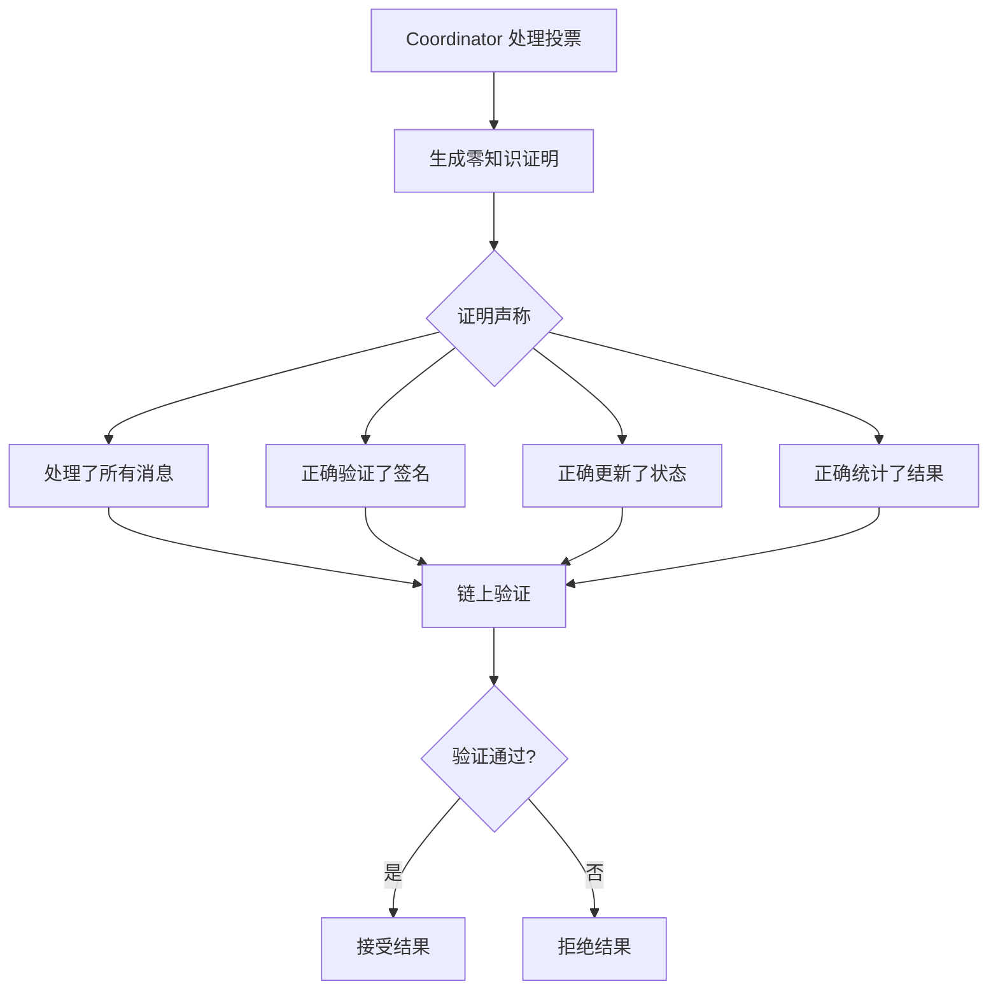

### 隐私与可验证性的平衡

```typescript
// 零知识证明公开的信息
const publicInputs = {
  coordinatorPubKey: [...],    // Coordinator 的公钥
  messageRoot: "0x...",        // 消息 Merkle 根
  oldStateRoot: "0x...",       // 处理前的状态根
  newStateRoot: "0x...",       // 处理后的状态根
  tallyResults: [10, 25, 15],  // 聚合的投票结果
};

// 零知识证明隐藏的信息
const privateInputs = {
  coordinatorPrivKey: "...",   // Coordinator 私钥
  individualVotes: [...],      // 每个人的投票
  signatures: [...],           // 所有签名
  decryptedMessages: [...],    // 解密后的消息
};

// 证明声称：
// "我知道 privateInputs，使得当使用它们处理时，
//  可以从 oldStateRoot 得到 newStateRoot，
//  并且最终结果是 tallyResults"
```

### 可公开验证

任何人都可以验证零知识证明：

```typescript
// 链上验证函数
function verifyProof(
  proof: Proof,
  publicInputs: PublicInputs
): boolean {
  // 使用验证密钥验证证明
  return groth16Verify(
    proof,
    publicInputs,
    verificationKey
  );
}

// 任何人都可以调用
const isValid = await contract.verifyProcessMessagesProof(proof);
console.log("证明有效:", isValid);
```

## 隐私保护的权衡

### 信任假设

MACI 的隐私保护依赖于以下信任假设：

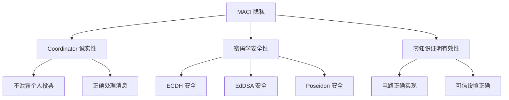

**关键信任点：**

1. **Coordinator 可见性**：Coordinator 能看到所有投票内容
2. **活性依赖**：Coordinator 可能拒绝处理消息
3. **密码学假设**：依赖 ECDH、EdDSA 等的安全性

### 与完全隐私的对比

| 特性 | MACI | 完全隐私系统 | 传统投票 |
|------|------|-------------|---------|
| 投票内容隐私 | ✅ 对公众隐私 | ✅ 对所有人 | ❌ 完全公开 |
| Coordinator 可见 | ⚠️ 可见 | ✅ 不可见 | N/A |
| 抗串谋 | ✅ 是 | ⚠️ 可能不够 | ❌ 否 |
| 结果可验证 | ✅ 是 | ✅ 是 | ✅ 是 |
| 效率 | ✅ 高 | ⚠️ 低 | ✅ 高 |

MACI 做出了务实的权衡：
- **牺牲**：Coordinator 可以看到投票（但受约束）
- **获得**：强抗串谋性和实用性

### 未来改进方向

可以通过以下方式减少对 Coordinator 的信任：

**1. 多方计算（MPC）**

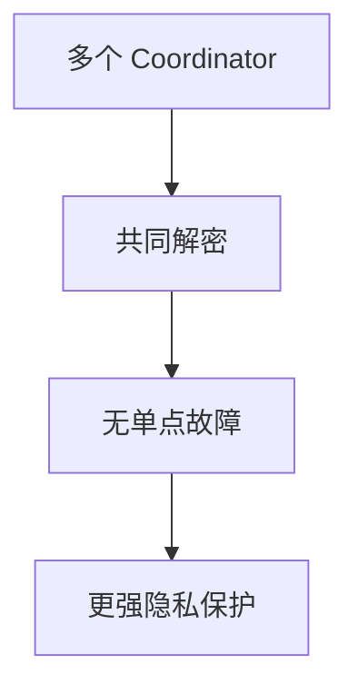

**2. 阈值加密**

```typescript
// 需要 t-of-n 个 Coordinator 才能解密
const encryptedVote = thresholdEncrypt(
  vote,
  coordinatorPubKeys,  // n 个公钥
  threshold  // t
);

// 至少 t 个 Coordinator 合作才能解密
```

**3. 可验证延迟函数（VDF）**

- 在投票期间无法解密
- 投票结束后自动可解密
- 减少实时串谋风险

## 实际隐私保护建议

### 对于投票者

**✓ 使用密钥更改**
```typescript
// 如果担心被强制或贿赂
await changeKey();
await revote();
```

**✓ 不要分享私钥**
```typescript
// 永远不要给任何人看私钥
// 即使有人要求
```

**✓ 使用新钱包**
```typescript
// 使用专门的投票钱包
// 避免与主钱包关联
```

### 对于 Coordinator

**✓ 保护私钥**
```typescript
// 使用硬件安全模块（HSM）
// 或多方计算（MPC）
```

**✓ 不泄露个人投票**
```typescript
// 只公布聚合结果
// 不讨论个人投票
```

**✓ 遵循零知识证明约束**
```typescript
// 诚实处理所有消息
// 不篡改投票
```

## 隐私保护评估

### 隐私级别

MACI 提供以下级别的隐私：

```
级别 1: 投票内容加密
  → 公众无法看到投票

级别 2: 密钥更改机制
  → 无法证明最终投票

级别 3: 去活化检测（AMACI）
  → 身份解耦

级别 4: 零知识证明
  → 可验证的隐私保护
```

### 隐私威胁抵抗

| 威胁 | MACI 防护 | 效果 |
|------|----------|------|
| 贿选 | ✅ 密钥更改 | 无法可靠贿选 |
| 强制投票 | ✅ 可重新投票 | 无法验证服从 |
| 隐私窥探 | ✅ 加密 | 公众无法看到 |
| Coordinator 作恶 | ✅ ZK 约束 | 无法篡改 |
| 身份关联 | ⚠️ AMACI 增强 | 部分保护 |
| Coordinator 泄密 | ⚠️ 信任假设 | 依赖 Coordinator |

## 下一步

现在您已经了解了 MACI 的隐私保护机制，接下来可以：

- 🏗️ [合约设计](/contracts/architecture) - 了解合约如何实现这些机制
- 💻 [SDK 使用](/sdk/installation) - 使用 SDK 创建隐私保护的投票
- 💡 [示例代码](/examples/basic-voting) - 查看完整的投票示例
