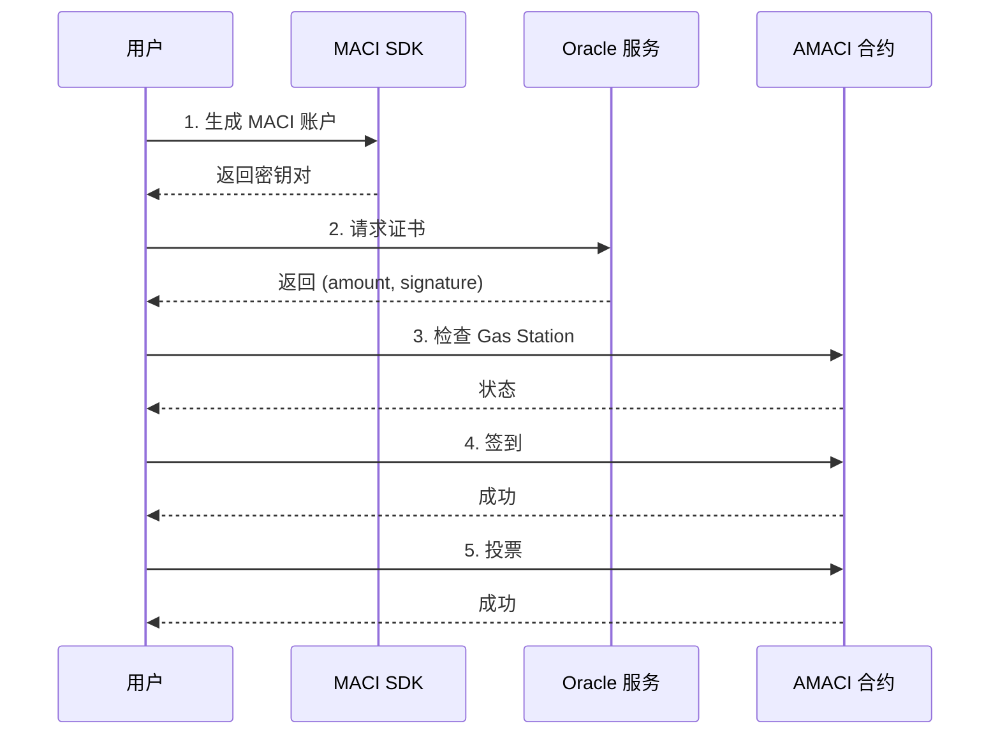

# 投票操作指南

完整的投票流程包括 5 个步骤：生成账户、获取证书、等待 Gas Station、签到和投票。

## 完整投票流程



## 步骤 1: 生成 MACI 账户

```typescript
import { MaciClient } from '@dorafactory/maci-sdk';

const client = new MaciClient({ network: 'testnet' });

// 从钱包生成 MACI 密钥对
const maciAccount = await client.circom.genKeypairFromSign(
  wallet,
  address
);

console.log('MACI 账户生成成功');
// maciAccount 包含 privateKey 和 publicKey
```

## 步骤 2: 获取 Oracle 证书

仅 Oracle 白名单模式需要此步骤：

```typescript
const certificate = await client.maci.requestOracleCertificate({
  signer: wallet,
  ecosystem: 'cosmoshub',  // 或 'doravota'
  address: userAddress,
  contractAddress: amaciContractAddress
});

console.log('证书获取成功');
console.log('投票权重:', certificate.amount);
console.log('签名:', certificate.signature);
```

## 步骤 3: 等待 Gas Station

检查并等待 Gas Station 启用：

```typescript
async function waitForGasStation(
  client: MaciClient,
  address: string,
  contractAddress: string
): Promise<boolean> {
  let hasFeegrant = false;
  let attempts = 0;
  const maxAttempts = 30;  // 最多等待 1 分钟

  while (!hasFeegrant && attempts < maxAttempts) {
    hasFeegrant = await client.maci.hasFeegrant({
      address,
      contractAddress
    });

    if (!hasFeegrant) {
      console.log(`等待 Gas Station (${attempts + 1}/${maxAttempts})...`);
      await new Promise(resolve => setTimeout(resolve, 2000));
      attempts++;
    }
  }

  return hasFeegrant;
}

// 使用
const hasGasStation = await waitForGasStation(client, address, contractAddress);

if (hasGasStation) {
  console.log('✅ Gas Station 已启用');
} else {
  console.log('⚠️  Gas Station 未启用，将使用自己的 Gas');
}
```

## 步骤 4: 签到

```typescript
await client.maci.signup({
  signer: wallet,
  address: userAddress,
  contractAddress: amaciContractAddress,
  maciAccount: maciAccount,
  oracleCertificate: {
    amount: certificate.amount,
    signature: certificate.signature
  },
  gasStation: hasGasStation  // 是否使用 Gas Station
});

console.log('✅ 签到成功');
```

## 步骤 5: 投票

### 获取 Coordinator 公钥

```typescript
const roundInfo = await client.getRoundById(contractAddress);

const coordinatorPubKey = [
  BigInt(roundInfo.coordinatorPubkeyX),
  BigInt(roundInfo.coordinatorPubkeyY)
];
```

### 提交投票

```typescript
await client.maci.vote({
  signer: wallet,
  address: userAddress,
  contractAddress: amaciContractAddress,
  selectedOptions: [
    { idx: 0, vc: 5 },  // 给选项 0 投 5 票
    { idx: 1, vc: 3 },  // 给选项 1 投 3 票
    { idx: 2, vc: 2 },  // 给选项 2 投 2 票
  ],
  operatorCoordPubKey: coordinatorPubKey,
  maciAccount: maciAccount,
  gasStation: hasGasStation
});

console.log('✅ 投票成功');
```

## 投票规则

### 1P1V 模式

voice credit 直接作为票数：

```typescript
// 假设用户有 100 voice credits
selectedOptions: [
  { idx: 0, vc: 50 },  // 50 票
  { idx: 1, vc: 30 },  // 30 票
  { idx: 2, vc: 20 },  // 20 票
]
// 总消耗 = 50 + 30 + 20 = 100 voice credits
```

### QV 模式

voice credit 的平方作为消耗：

```typescript
// 假设用户有 100 voice credits
selectedOptions: [
  { idx: 0, vc: 8 },  // 8 票，消耗 64 credits (8²)
  { idx: 1, vc: 6 },  // 6 票，消耗 36 credits (6²)
]
// 总消耗 = 64 + 36 = 100 voice credits
```

## 重新投票

用户可以多次投票，后面的投票会覆盖前面的：

```typescript
// 第一次投票
await client.maci.vote({
  selectedOptions: [{ idx: 0, vc: 5 }],
  // ... 其他参数
});

console.log('第一次投票完成');

// 改变主意，重新投票
await client.maci.vote({
  selectedOptions: [{ idx: 1, vc: 5 }],  // 改投选项 1
  // ... 其他参数
});

console.log('重新投票完成');
// 最终只有第二次投票（选项 1）有效
```

## 完整示例函数

```typescript
async function completeVotingProcess(
  client: MaciClient,
  wallet: any,
  address: string,
  contractAddress: string,
  voteOptions: { idx: number; vc: number }[]
) {
  try {
    // 步骤 1: 生成账户
    console.log('1/5 生成 MACI 账户...');
    const maciAccount = await client.circom.genKeypairFromSign(wallet, address);
    
    // 步骤 2: 获取证书
    console.log('2/5 获取 Oracle 证书...');
    const certificate = await client.maci.requestOracleCertificate({
      signer: wallet,
      ecosystem: 'cosmoshub',
      address,
      contractAddress
    });
    console.log(`   投票权重: ${certificate.amount}`);
    
    // 步骤 3: 等待 Gas Station
    console.log('3/5 等待 Gas Station...');
    const hasGasStation = await waitForGasStation(client, address, contractAddress);
    
    // 步骤 4: 签到
    console.log('4/5 签到中...');
    await client.maci.signup({
      signer: wallet,
      address,
      contractAddress,
      maciAccount,
      oracleCertificate: certificate,
      gasStation: hasGasStation
    });
    
    // 步骤 5: 投票
    console.log('5/5 投票中...');
    const roundInfo = await client.getRoundById(contractAddress);
    
    await client.maci.vote({
      signer: wallet,
      address,
      contractAddress,
      selectedOptions: voteOptions,
      operatorCoordPubKey: [
        BigInt(roundInfo.coordinatorPubkeyX),
        BigInt(roundInfo.coordinatorPubkeyY)
      ],
      maciAccount,
      gasStation: hasGasStation
    });
    
    console.log('✅ 投票流程完成！');
    return true;
  } catch (error) {
    console.error('❌ 投票失败:', error);
    return false;
  }
}

// 使用示例
await completeVotingProcess(
  client,
  wallet,
  address,
  'dora1contractaddress...',
  [
    { idx: 0, vc: 8 },
    { idx: 2, vc: 6 }
  ]
);
```

## 常见问题

### Q: 如何计算我能投多少票？

**A:** 取决于投票模式和您的 voice credits：

```typescript
// 1P1V 模式
const maxVotes = voiceCredits;  // 100 credits = 100 票

// QV 模式  
const maxVotes = Math.floor(Math.sqrt(voiceCredits));  // 100 credits = 10 票
```

### Q: 投票失败了怎么办？

**A:** 检查以下几点：
1. 是否在投票期内
2. 是否已完成签到
3. voice credits 是否足够
4. Gas Station 是否已启用（如果使用）

### Q: 可以同时投给多个选项吗？

**A:** 可以！在 `selectedOptions` 数组中添加多个选项：

```typescript
selectedOptions: [
  { idx: 0, vc: 5 },
  { idx: 1, vc: 3 },
  { idx: 2, vc: 2 }
]
```

### Q: 如何撤销投票？

**A:** 重新投票并将所有权重设为 0，或投给其他选项。

## 下一步

完成投票后，您可以：

- 🔍 [查询 API](/sdk/query-api) - 查询投票信息和结果
- 💡 [查看示例](/examples/basic-voting) - 完整的投票示例
- 🚀 [了解高级功能](/sdk/advanced) - 探索更多功能
