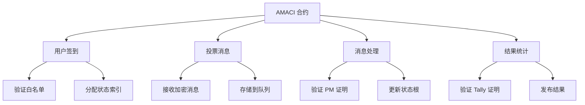
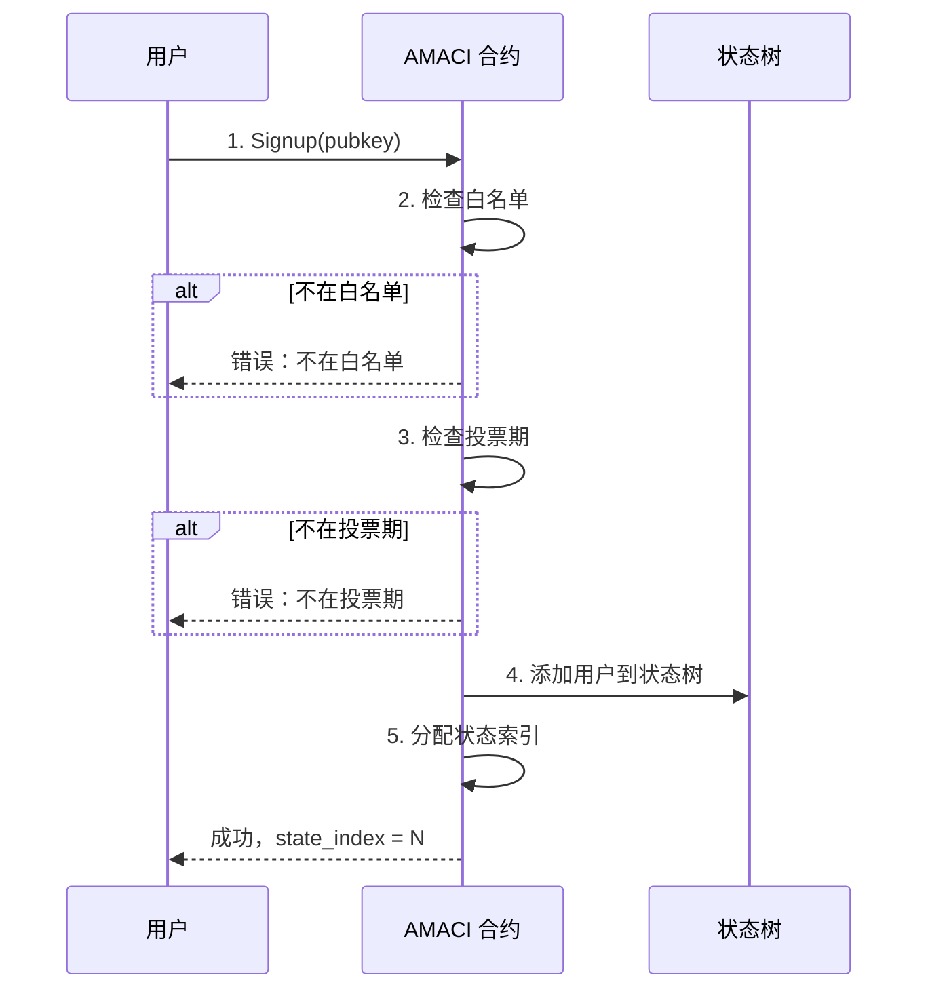
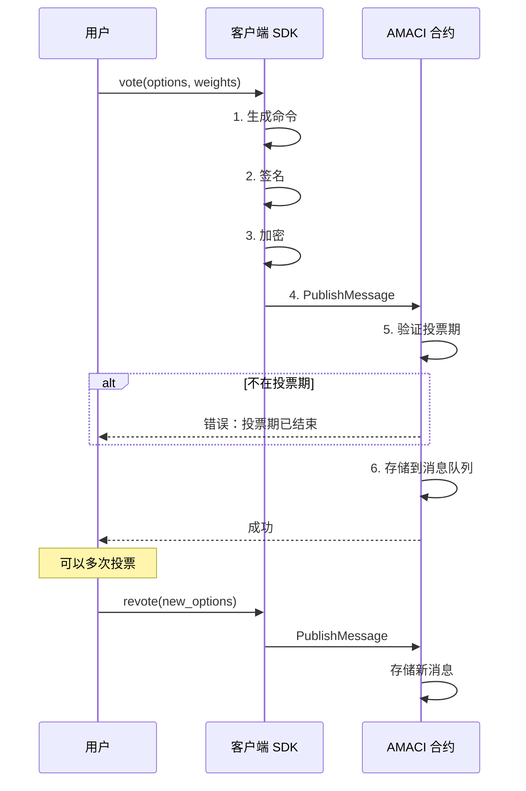
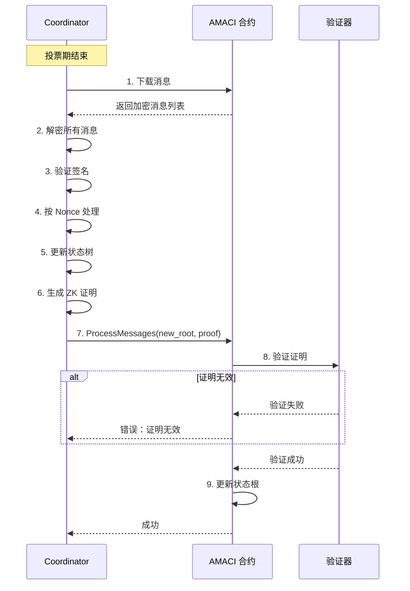
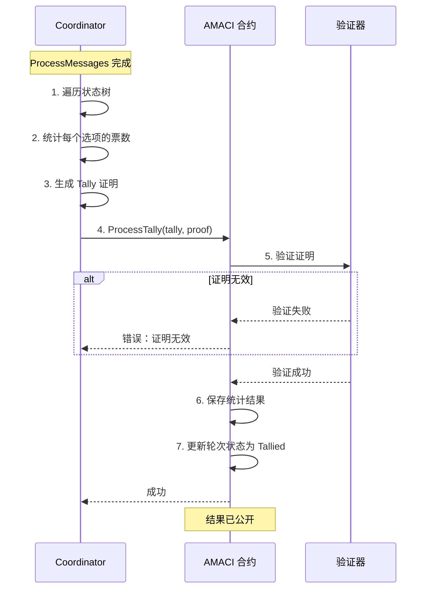
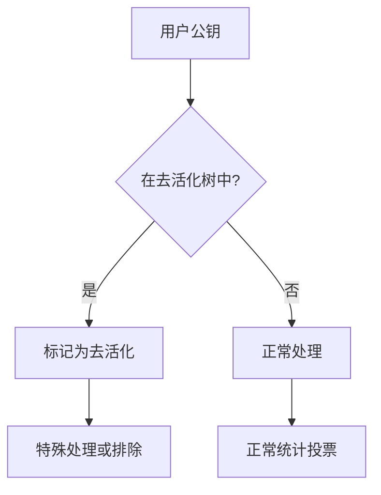
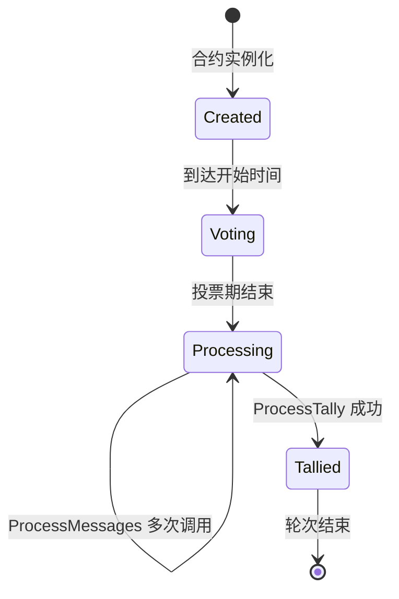

# AMACI 合约

AMACI（Anonymous MACI）合约是每个投票轮次的核心，处理用户签到、投票消息存储、证明验证和结果发布。

## 核心功能

AMACI 合约提供四个主要功能：



## 用户注册方式

AMACI 支持三种注册方式，用户可根据隐私需求选择。

## 1. Signup（标准注册）

最简单快捷的注册方式，适合不关心 Operator 知道身份的场景。

### Signup 消息

```rust
ExecuteMsg::Signup {
    pubkey: PubKey,                    // 用户公钥
    data: Option<SignupDataDora>,      // 额外数据
}
```

### 签到流程



### Signup 代码示例

```typescript
// 1. 生成 MACI 密钥对
// 使用 dora 地址衍生 EdDSA-Poseidon 密钥对
const maciKeypair = await client.genKeypairFromSign({
  signer: wallet,
  address
});

// 2. Signup（仅白名单地址可用）
await client.signup({
  signer: wallet,
  address: userAddress,
  contractAddress: amaciAddress,
  maciKeypair
});
```

**白名单验证：**

合约会验证发送者地址是否在白名单中：
- 创建 Round 时配置白名单地址列表
- 只有白名单地址可以 signup
- 所有白名单用户获得相同投票权重

```typescript
// 创建 Round 时配置白名单
await client.createAMaciRound({
  // ...
  whitelist: {
    addresses: [
      'dora1abc...',
      'dora1def...',
      'dora1ghi...'
    ]
  },
  voiceCreditAmount: '100'  // 每个用户的投票额度
});
```

### Signup 隐私级别

**隐私级别：** （低）

**Operator 可以看到：**
- 钱包地址（通过链上 signup 交易）
- MACI 公钥
- State Index
- 投票内容（解密后）

**风险：**
- Operator 可以完整关联：钱包地址 → 公钥 → State Index → 投票内容
- 可能进行针对性的贿赂或报复

**适用场景：**
- 不关心 Operator 知道身份
- 快速简单的投票
- 可信的 Operator

---

## 2. Add-new-key（动态换 key）

使用零知识证明创建匿名身份，Operator 无法关联到原始用户。

### Add-new-key 消息

```rust
ExecuteMsg::AddNewKey {
    pubkey: PubKey,              // 新的用户公钥
    nullifier: Uint256,          // 防重放标识
    d: [Uint256; 4],            // [d1[0], d1[1], d2[0], d2[1]]
    groth16_proof: Groth16ProofType,  // ZK 证明
}
```

### 完整流程

**老用户 Deactivate**

```typescript
// 老用户提交 deactivate 消息
await client.deactivate({
  signer: oldWallet,
  address: oldAddress,
  contractAddress,
  maciKeypair: oldKeypair
});

// 这会生成一个特殊的投票消息：
// - voIdx = 0
// - newVotes = 0
// - newPubKey = [0, 0]（表示最后一条消息）
```

**Operator 处理 Deactivate**

```typescript
// Operator 处理所有 deactivate 消息
// 生成 deactivate tree

// 每个 deactivate leaf 包含：
// [c1[0], c1[1], c2[0], c2[1], sharedKeyHash]

// Operator 提交 ProcessDeactivate
await contract.execute({
  process_deactivate: {
    size: deactivateMessages.length,
    new_deactivate_commitment: deactivateCommitment,
    new_deactivate_root: deactivateRoot,
    groth16_proof: processDeactivateProof
  }
});
```

**新用户生成 ZK 证明**

```typescript
// 使用 VoterClient 生成 payload
import { VoterClient } from '@dorafactory/maci-sdk';

const voterClient = new VoterClient({
  network: 'testnet',
  secretKey: oldPrivateKeyHex  // 老用户的私钥
});

// 获取 deactivate 数据
const deactivates = await client.fetchAllDeactivateLogs(contractAddress);

// 生成 add-new-key payload
const payload = await voterClient.buildAddNewKeyPayload({
  stateTreeDepth: 10,
  operatorPubkey: operatorPubkey,
  deactivates: deactivates,
  wasmFile,  // addNewKey.wasm
  zkeyFile   // addNewKey.zkey
});

// payload 包含：
// {
//   proof: { a, b, c },          // Groth16 证明
//   d: [d1_0, d1_1, d2_0, d2_1], // 重新随机化的值
//   nullifier: "0x..."            // 防重放
// }
```

**提交 Add-new-key**

```typescript
// 使用新钱包提交（重要！）
const newKeypair = genKeypair();

await client.addNewKey({
  signer: newWallet,      // 新钱包
  contractAddress,
  d: payload.d,
  proof: payload.proof,
  nullifier: payload.nullifier,
  newMaciKeypair: newKeypair,  // 新的 MACI 密钥对
  fee: 'auto'
});
```

### 合约验证流程

```rust
pub fn execute_add_new_key(
    deps: DepsMut,
    env: Env,
    pubkey: PubKey,
    nullifier: Uint256,
    d: [Uint256; 4],
    groth16_proof: Groth16ProofType,
) -> Result<Response, ContractError> {
    // 1. 检查投票期
    check_voting_time(env, voting_time)?;
    
    // 2. 检查 nullifier 是否已使用
    if NULLIFIERS.has(deps.storage, nullifier.to_be_bytes()) {
        return Err(ContractError::NewKeyExist {});
    }
    NULLIFIERS.save(deps.storage, nullifier.to_be_bytes(), &true)?;
    
    // 3. 构建公开输入
    let input = [
        DNODES.load(...)?,        // deactivate root
        COORDINATORHASH.load(...)?,  // operator pubkey hash
        nullifier,
        d[0], d[1], d[2], d[3]
    ];
    let input_hash = hash_256(input) % SNARK_SCALAR_FIELD;
    
    // 4. 验证 ZK 证明
    let is_valid = groth16_verify(&proof, &[input_hash])?;
    if !is_valid {
        return Err(ContractError::InvalidProof {
            step: "AddNewKey".to_string()
        });
    }
    
    // 5. 创建新 State Leaf（包含 d1, d2）
    let state_leaf = StateLeaf {
        pub_key: pubkey,
        voice_credit_balance: voice_credit_amount,
        vote_option_tree_root: Uint256::zero(),
        nonce: Uint256::zero(),
    }.hash_new_key_state_leaf(d);
    
    // 6. 分配 State Index
    let state_index = num_sign_ups;
    state_enqueue(&mut deps, state_leaf)?;
    num_sign_ups += 1;
    
    // 7. 保存映射（公钥 → state index）
    SIGNUPED.save(deps.storage, &pubkey_bytes, &state_index)?;
    
    Ok(Response::new()
        .add_attribute("action", "add_new_key")
        .add_attribute("state_idx", state_index.to_string()))
}
```

### ZK 电路说明

Add-new-key 使用专门的 ZK 电路验证用户身份：

```circom
template AddNewKey(stateTreeDepth) {
    // 公开输入
    signal input deactivateRoot;      // Deactivate 树根
    signal input coordPubKey[2];      // Operator 公钥
    signal input nullifier;           // 防重放
    signal input d1[2];               // 重新随机化的值
    signal input d2[2];
    
    // 私有输入（关键！不公开）
    signal input oldPrivateKey;       // 老用户私钥
    signal input deactivateIndex;     // 在树中的位置
    signal input deactivateLeaf;      // Leaf 值
    signal input c1[2];               // 原始加密值
    signal input c2[2];
    signal input randomVal;           // 随机化用的随机数
    signal input deactivateLeafPathElements[...];  // Merkle 路径
    
    // 验证步骤：
    // 1. 验证 nullifier = hash(oldPrivateKey, constant)
    // 2. 计算 sharedKeyHash = hash(ecdh(oldPrivKey, coordPubKey))
    // 3. 验证 deactivateLeaf = hash(c1, c2, sharedKeyHash)
    // 4. 验证 leaf 在 deactivateRoot 树中（使用 deactivateIndex 和路径）
    // 5. 验证 d1, d2 = rerandomize(c1, c2, randomVal, coordPubKey)
}
```

### Add-new-key 隐私级别

**隐私级别：** （最高）

**Operator 只能看到：**
- 新钱包地址（可能是全新的）
- 新 MACI 公钥
- nullifier（只是个哈希）
- d1, d2（重新随机化的值）
- ZK 证明（已验证通过）

**Operator 无法确定：**
- 新用户是 deactivate 树中的第几个
- 对应哪个钱包地址
- 与哪个老身份关联
- oldPrivateKey 是什么

**匿名集：**
- 匿名集大小 = deactivate 树中的条目数
- 例如：100 个 deactivate → Operator 知道是"100人之一"

---

## 3. Pre-add-new-key（预配置换 key）

使用预先配置的 deactivate root，立即创建匿名身份。

### Pre-add-new-key 消息

```rust
ExecuteMsg::PreAddNewKey {
    pubkey: PubKey,              // 新的用户公钥
    nullifier: Uint256,          // 防重放标识
    d: [Uint256; 4],            // [d1[0], d1[1], d2[0], d2[1]]
    groth16_proof: Groth16ProofType,  // ZK 证明
}
```

### 与 Add-new-key 的区别

| 特性 | Add-new-key | Pre-add-new-key |
|------|-------------|-----------------|
| Deactivate 来源 | 投票期间动态生成 | Round 创建时预配置 |
| Coordinator | 当前 Operator | 预配置的 Coordinator |
| 等待时间 | 需等待 ProcessDeactivate | 立即可用 |
| 灵活性 | 高（实时） | 中（需预配置） |

### 合约验证差异

```rust
// add-new-key 使用动态生成的 root
input[0] = DNODES.load(deps.storage, ...)?;  // 动态
input[1] = COORDINATORHASH.load(deps.storage)?;  // 当前 operator

// pre-add-new-key 使用预配置的 root
input[0] = PRE_DEACTIVATE_ROOT.load(deps.storage)?;  // 预配置
input[1] = PRE_DEACTIVATE_COORDINATOR_HASH.load(...)?;  // 可能不同
```

### 使用场景

**适合场景：**
- Round 创建时已知需要匿名投票
- 预先准备好一组 deactivate 数据
- 希望用户立即可以匿名参与

**Round 配置示例：**

```typescript
// 创建 Round 时配置
await client.createAMaciRound({
  // ... 其他参数
  
  // 配置 pre-deactivate
  preDeactivateRoot: preDeactivateData.root,
  preDeactivateCoordinator: {
    x: preCoordPubkey[0],
    y: preCoordPubkey[1]
  }
});
```

### Pre-add-new-key 隐私级别

**隐私级别：** （最高）

与 add-new-key 相同的隐私保护，但无需等待。

---

## 4. Process Deactivate（AMACI 独有）

Operator 处理 deactivate 消息，为 add-new-key 生成 deactivate 树。

### Process Deactivate 消息

```rust
ExecuteMsg::ProcessDeactivate {
    size: u64,                          // 处理的消息数量
    new_deactivate_commitment: Uint256, // 新的 deactivate commitment
    new_deactivate_root: Uint256,       // 新的 deactivate 树根
    groth16_proof: Groth16ProofType,    // ZK 证明
}
```

### 工作流程

**1. 收集 Deactivate 消息**

```typescript
// 用户提交 deactivate
await client.deactivate({
  signer: wallet,
  contractAddress,
  maciKeypair
});

// 生成的是特殊的投票消息：
// {
//   nonce: current_nonce,
//   stateIdx: user_state_idx,
//   voIdx: 0,          // 特殊标记
//   newVotes: 0,       // 特殊标记
//   newPubKey: [0, 0], // 表示最后一条消息
//   signature: ...
// }
```

**2. Operator 处理 Deactivate**

```typescript
// Operator 解密 deactivate 消息
const deactivateCommands = deactivateMessages.map(msg => {
  const sharedKey = ecdh(operatorPrivKey, msg.encPubKey);
  const command = poseidonDecrypt(msg.data, sharedKey);
  return command;
});

// 生成 deactivate tree
const deactivateLeaves = [];
for (const cmd of deactivateCommands) {
  const stateIdx = cmd.stateIdx;
  const userPubKey = stateTree.getLeaf(stateIdx).pubKey;
  
  // 生成加密的去活化标志
  const sharedKey = ecdh(operatorPrivKey, userPubKey);
  const sharedKeyHash = poseidon(sharedKey);
  
  const randomVal = deterministicRandom(operatorPrivKey, stateIdx);
  const { c1, c2 } = encryptDeactivateFlag(
    true,  // 标记为已去活化
    operatorPubKey,
    randomVal
  );
  
  // 构建 leaf
  const leaf = [c1[0], c1[1], c2[0], c2[1], sharedKeyHash];
  deactivateLeaves.push(leaf);
}

// 构建 Merkle 树
const deactivateTree = new Tree(5, stateTreeDepth + 2, 0n);
deactivateTree.initLeaves(deactivateLeaves.map(l => poseidon(l)));

const deactivateRoot = deactivateTree.root;
```

**3. 生成并提交证明**

```typescript
// 生成 ProcessDeactivate 证明
const { proof } = await groth16.fullProve(
  processDeactivateInput,
  wasmFile,
  zkeyFile
);

// 提交到合约
await contract.execute({
  process_deactivate: {
    size: deactivateMessages.length,
    new_deactivate_commitment: deactivateCommitment,
    new_deactivate_root: deactivateRoot,
    groth16_proof: proof
  }
});
```

### Process Deactivate 电路

```circom
template ProcessDeactivateMessages(stateTreeDepth, batchSize) {
    // 公开输入
    signal input newDeactivateRoot;
    signal input coordPubKey[2];
    signal input batchStartHash;
    signal input batchEndHash;
    signal input currentDeactivateCommitment;
    signal input newDeactivateCommitment;
    
    // 私有输入
    signal input coordPrivKey;               // Operator 私钥
    signal input msgs[batchSize][7];         // 加密消息
    signal input encPubKeys[batchSize][2];   // 加密公钥
    signal input currentStateLeaves[batchSize][10];  // 当前状态
    signal input c1[batchSize][2];           // 生成的加密值
    signal input c2[batchSize][2];
    
    // 验证步骤：
    // 1. 解密所有 deactivate 消息
    // 2. 验证每个消息的签名
    // 3. 为每个用户生成 deactivate entry (c1, c2, hash)
    // 4. 构建新的 deactivate tree
    // 5. 验证 newDeactivateRoot 正确
}
```

### 合约验证

```rust
pub fn execute_process_deactivate(
    deps: DepsMut,
    size: u64,
    new_deactivate_commitment: Uint256,
    new_deactivate_root: Uint256,
    groth16_proof: Groth16ProofType,
) -> Result<Response, ContractError> {
    // 1. 检查状态
    // 2. 构建公开输入
    let input = [
        new_deactivate_root,
        coord_pubkey_hash,
        batch_start_hash,
        batch_end_hash,
        current_deactivate_commitment,
        new_deactivate_commitment,
        current_state_root
    ];
    
    // 3. 验证 ZK 证明
    let is_valid = groth16_verify(&proof, &[input_hash])?;
    if !is_valid {
        return Err(ContractError::InvalidProof {
            step: "ProcessDeactivate".to_string()
        });
    }
    
    // 4. 更新 deactivate root
    DNODES.save(deps.storage, key, &new_deactivate_root)?;
    CURRENT_DEACTIVATE_COMMITMENT.save(..., &new_deactivate_commitment)?;
    
    // 5. 更新处理计数
    PROCESSED_DMSG_COUNT.save(deps.storage, &new_count)?;
    
    Ok(Response::new())
}
```

### Process Deactivate 的作用

**为 Add-new-key 提供匿名集：**

```
没有 ProcessDeactivate:
→ 无法使用 add-new-key
→ 只能用 signup（低隐私）

有 ProcessDeactivate:
→ 生成 deactivate tree
→ 用户可以使用 add-new-key
→ 匿名集大小 = deactivate 消息数量
```

**时机：**
- 可以在投票期间随时处理
- 通常在有足够多 deactivate 消息后处理
- 建议：至少 50-100 个 deactivate 再处理（更大的匿名集）

---

## 投票消息（PublishMessage）

用户注册后（无论使用哪种方式），都可以提交加密的投票消息。

### PublishMessage 消息

```rust
ExecuteMsg::PublishMessage {
    message: MessageData,
}

pub struct MessageData {
    pub data: Vec<Uint256>,  // 10 个加密字段
}
```

### 消息格式

加密消息包含 10 个字段：

```typescript
interface EncryptedMessage {
  data: [
    bigint,  // [0] packaged (nonce + stateIdx + voIdx + newVotes + salt)
    bigint,  // [1] newPubKey.x
    bigint,  // [2] newPubKey.y
    bigint,  // [3] signature.R8.x
    bigint,  // [4] signature.R8.y
    bigint,  // [5] signature.S
    bigint,  // [6] encryption IV
    bigint,  // [7-9] 保留/填充
  ];
}
```

### 投票流程



### 投票示例

```typescript
// 获取 Operator 公钥
const roundInfo = await client.getRoundInfo({ contractAddress: amaciAddress });

// 投票
await client.vote({
  signer: wallet,
  address: userAddress,
  contractAddress: amaciAddress,
  selectedOptions: [
    { idx: 0, vc: 5 },  // 给选项 0 投 5 票
    { idx: 1, vc: 3 },  // 给选项 1 投 3 票
  ],
  operatorCoordPubKey: [
    BigInt(roundInfo.coordinatorPubkeyX),
    BigInt(roundInfo.coordinatorPubkeyY)
  ],
  maciKeypair: keypair
});
```

### 消息存储

消息按顺序存储在合约中：

```rust
// 消息队列
pub const MESSAGES: Item<Vec<Message>> = Item::new("messages");

// 添加消息
fn publish_message(
    deps: DepsMut,
    message: MessageData
) -> Result<Response, ContractError> {
    let mut messages = MESSAGES.load(deps.storage)?;
    
    messages.push(Message {
        msg_type: Uint256::from(1u128),  // 1 = 投票消息
        data: message.data,
    });
    
    MESSAGES.save(deps.storage, &messages)?;
    
    Ok(Response::new()
        .add_attribute("action", "publish_message")
        .add_attribute("message_id", messages.len().to_string()))
}
```

### 多次投票

用户可以多次调用 PublishMessage，后面的消息会覆盖前面的：

```typescript
// 第一次投票
await vote({ options: [{ idx: 0, vc: 5 }], nonce: 0 });

// 改变主意，重新投票
await vote({ options: [{ idx: 1, vc: 5 }], nonce: 1 });

// 再次改变主意
await vote({ options: [{ idx: 2, vc: 5 }], nonce: 2 });

// 处理时，只有最后一次投票（选项 2）有效
```

---

## 消息处理（ProcessMessages）

Operator 提交零知识证明来处理投票消息。

### ProcessMessages 消息

```rust
ExecuteMsg::ProcessMessages {
    new_state_commitment: Uint256,     // 新状态根
    groth16_proof: Groth16ProofType,   // Groth16 证明
}
```

### 处理流程



### 证明验证

```rust
fn process_messages(
    deps: DepsMut,
    new_state_commitment: Uint256,
    proof: Groth16ProofType
) -> Result<Response, ContractError> {
    // 1. 检查状态
    let round_info = ROUND_INFO.load(deps.storage)?;
    if round_info.status != RoundStatus::Processing {
        return Err(ContractError::InvalidRoundStatus {});
    }
    
    // 2. 构造公开输入
    let public_inputs = vec![
        coordinator_pub_key_x,
        coordinator_pub_key_y,
        message_root,
        current_state_root,
        new_state_commitment,
        // ... 其他公开输入
    ];
    
    // 3. 验证 Groth16 证明
    let is_valid = verify_groth16_proof(
        proof,
        public_inputs,
        verification_key
    )?;
    
    if !is_valid {
        return Err(ContractError::ProofVerificationFailed {});
    }
    
    // 4. 更新状态根
    STATE_COMMITMENT.save(deps.storage, &new_state_commitment)?;
    
    Ok(Response::new()
        .add_attribute("action", "process_messages")
        .add_attribute("new_state_root", new_state_commitment.to_string()))
}
```

---

## 结果统计（ProcessTally）

Operator 提交统计证明来发布结果。

### ProcessTally 消息

```rust
ExecuteMsg::ProcessTally {
    new_tally_commitment: Uint256,     // 统计结果承诺
    groth16_proof: Groth16ProofType,   // Groth16 证明
}
```

### 统计流程



### 结果发布

```rust
fn process_tally(
    deps: DepsMut,
    new_tally_commitment: Uint256,
    proof: Groth16ProofType
) -> Result<Response, ContractError> {
    // 1. 验证证明
    let is_valid = verify_groth16_proof(
        proof,
        public_inputs,
        tally_verification_key
    )?;
    
    if !is_valid {
        return Err(ContractError::ProofVerificationFailed {});
    }
    
    // 2. 保存统计结果
    TALLY_COMMITMENT.save(deps.storage, &new_tally_commitment)?;
    
    // 3. 更新状态
    let mut round_info = ROUND_INFO.load(deps.storage)?;
    round_info.status = RoundStatus::Tallied;
    ROUND_INFO.save(deps.storage, &round_info)?;
    
    Ok(Response::new()
        .add_attribute("action", "process_tally")
        .add_attribute("tally_commitment", new_tally_commitment.to_string()))
}
```

## 查询功能

### 轮次信息

```rust
QueryMsg::GetRoundInfo {}
```

返回：

```rust
pub struct RoundInfoResponse {
    pub round_info: RoundInfo,
    pub status: RoundStatus,
    pub coordinator_pubkey: PubKey,
    pub num_signups: u64,
    pub max_voters: Uint256,
    // ... 其他信息
}
```

### 消息查询

```rust
// 获取单条消息
QueryMsg::GetMessage { index: u64 }

// 获取所有消息
QueryMsg::GetMessages {}

// 获取消息数量
QueryMsg::GetNumMessages {}
```

### 状态查询

```rust
// 获取状态根
QueryMsg::GetStateRoot {}

// 获取统计结果
QueryMsg::GetTallyResult {}

// 获取签到数量
QueryMsg::GetNumSignups {}
```

## 匿名性增强

### 去活化检测

AMACI 支持去活化检测来增强匿名性：

```rust
// 初始化时配置
pre_deactivate_root: Uint256,  // 去活化 Merkle 根
pre_deactivate_coordinator: Option<PubKey>,  // 去活化协调者
```

### 工作原理



## 轮次状态

AMACI 合约有以下状态：

```rust
pub enum RoundStatus {
    Created = 0,      // 已创建
    Voting = 1,       // 投票中
    Processing = 2,   // 处理中
    Tallied = 3,      // 已统计
}
```

### 状态转换



## 安全特性

### 时间验证

```rust
fn ensure_voting_period(
    env: &Env,
    voting_time: &VotingTime
) -> Result<(), ContractError> {
    let current_time = env.block.time.seconds();
    
    if current_time < voting_time.start_time {
        return Err(ContractError::VotingNotStarted {});
    }
    
    if current_time > voting_time.end_time {
        return Err(ContractError::VotingEnded {});
    }
    
    Ok(())
}
```

### 权限控制

```rust
// 只有 Coordinator 可以处理消息
fn ensure_coordinator(
    sender: &Addr,
    coordinator: &Addr
) -> Result<(), ContractError> {
    if sender != coordinator {
        return Err(ContractError::Unauthorized {});
    }
    Ok(())
}
```

### 重入保护

```rust
// 使用状态锁防止重入
fn process_messages_with_lock(
    deps: DepsMut,
    // ... 参数
) -> Result<Response, ContractError> {
    // 检查锁
    let is_locked = PROCESSING_LOCK.may_load(deps.storage)?.unwrap_or(false);
    if is_locked {
        return Err(ContractError::AlreadyProcessing {});
    }
    
    // 设置锁
    PROCESSING_LOCK.save(deps.storage, &true)?;
    
    // 处理逻辑
    let result = process_messages_internal(deps, ...);
    
    // 释放锁
    PROCESSING_LOCK.save(deps.storage, &false)?;
    
    result
}
```

## 注册方式选择建议

根据你的隐私需求选择合适的注册方式：

### 低隐私场景

**使用 Signup：**
- 社区内部投票
- 非敏感决策
- 可信的 Operator

### 高隐私场景

**使用 Add-new-key：**
- 大额资金分配
- 敏感话题投票
- 可能引起争议的决策
- 不完全信任 Operator

**使用 Pre-add-new-key：**
- 需要快速匿名
- Round 已预配置
- 紧急投票场景

### 混合使用

在同一个 Round 中，不同用户可以使用不同的注册方式：

```typescript
// 用户 A: 使用 signup（快速）
await userA.signup({...});

// 用户 B: 使用 add-new-key（匿名）
await userB.addNewKey({...});

// 用户 C: 使用 pre-add-new-key（快速匿名）
await userC.rawPreAddNewKey({...});

// 都可以正常投票
await userA.vote({...});
await userB.vote({...});
await userC.vote({...});
```

## 下一步

完成后，您可以了解了 AMACI 合约的所有注册方式，接下来可以：

- [AMACI 隐私机制](/docs/protocol/amaci-privacy) - 深入理解身份匿名化原理
- [完整工作流程](/docs/contracts/workflow) - 理解从创建到结果的全流程
- [SDK 使用指南](/docs/sdk/voting-guide) - 使用 SDK 与 AMACI 交互
- [示例代码](/docs/examples/basic-voting) - 查看完整的投票示例
