# 架构总览

MACI 的合约系统采用模块化设计，通过 Registry 合约统一管理多个 AMACI 投票合约实例。本节介绍整体架构和设计理念。

## 系统架构

### 架构图

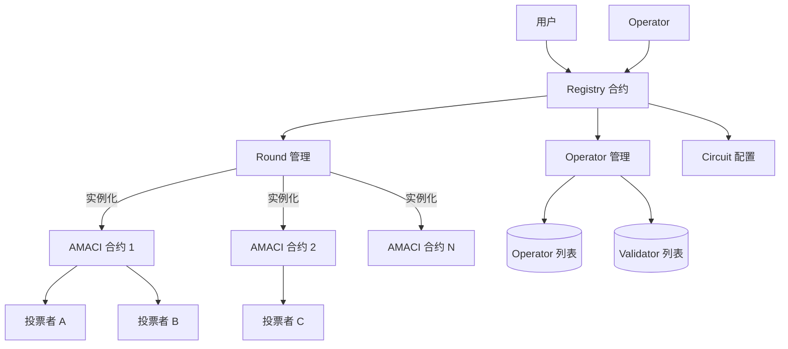

### 组件说明

**Registry 合约（注册中心）**
- 管理 Operator 注册和配置
- 管理 Validator 列表
- 创建和配置 AMACI 合约实例
- 配置 ZK 电路参数
- 管理费用配置

**AMACI 合约（投票实例）**
- 处理用户签到（Signup）
- 接收和存储加密投票消息
- 验证零知识证明
- 发布投票结果
- 每个投票轮次对应一个独立的 AMACI 合约实例

## 设计理念

### 1. 关注点分离

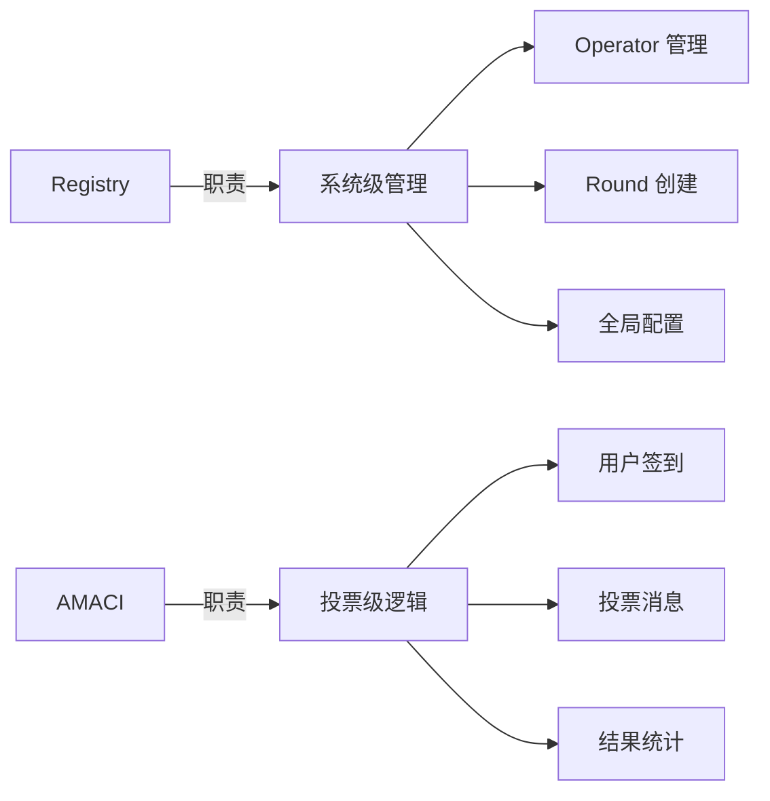

**Registry 关注：**
- 谁可以运行 Operator
- 如何创建投票轮次
- 系统级参数配置

**AMACI 关注：**
- 用户如何参与投票
- 消息如何存储和处理
- 结果如何验证和发布

### 2. 一键创建

用户无需手动部署 AMACI 合约：

```rust
// 用户只需调用 Registry 的一个函数
ExecuteMsg::CreateRound {
    operator,
    max_voter,
    voice_credit_amount,
    vote_option_map,
    // ... 其他参数
}

// Registry 自动：
// 1. 验证 Operator 是否注册
// 2. 实例化 AMACI 合约
// 3. 配置初始参数
// 4. 返回合约地址
```

### 3. 标准化接口

所有 AMACI 合约实例共享相同的接口：

```rust
// 统一的消息类型
pub enum ExecuteMsg {
    Signup { ... },
    PublishMessage { ... },
    ProcessMessages { ... },
    ProcessTally { ... },
}

// 统一的查询接口
pub enum QueryMsg {
    GetRoundInfo {},
    GetNumSignups {},
    GetMessage { index },
}
```

### 4. 灵活配置

支持多种配置选项：

```rust
// 投票类型
pub enum CircuitType {
    IP1V = 0,  // 一人一票
    QV = 1,    // 二次方投票
}

// 白名单配置
// 白名单地址在创建 Round 时配置，只有白名单地址可以参与投票
```

## 合约关系

### 创建流程

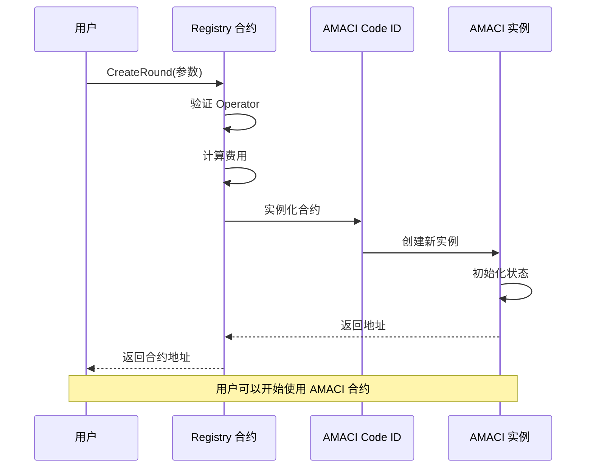

### 交互模式

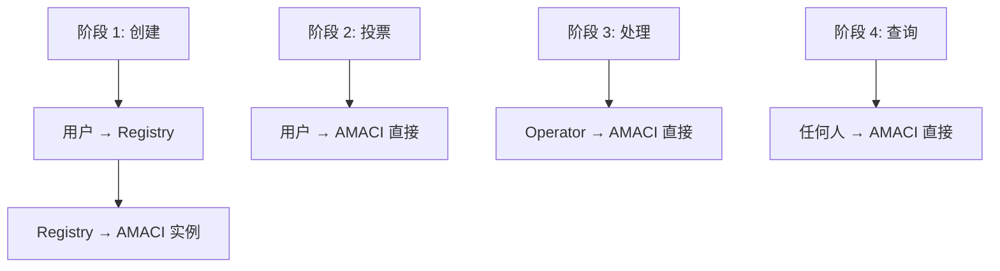

**注意：**
- Registry 只在创建时参与
- 创建后，用户直接与 AMACI 合约交互
- Registry 不参与投票过程

## 投票生命周期

### 轮次状态机

AMACI 合约的每个投票轮次都遵循严格的状态转换规则：

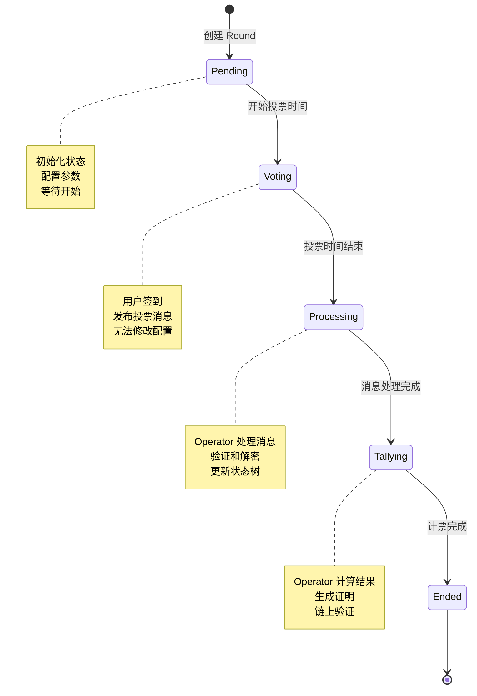

### 状态转换条件

每个状态转换都有明确的触发条件和验证规则：

```rust
// 1. Pending → Voting
// 条件：当前时间 >= voting_start_time
pub fn check_voting_start(voting_time: &VotingTime, current_time: u64) -> bool {
    current_time >= voting_time.start_time
}

// 2. Voting → Processing
// 条件：当前时间 >= voting_end_time
pub fn check_voting_end(voting_time: &VotingTime, current_time: u64) -> bool {
    current_time >= voting_time.end_time
}

// 3. Processing → Tallying
// 条件：所有消息批次都已处理完成
pub fn check_all_messages_processed(
    num_messages: u64,
    num_processed: u64,
) -> bool {
    num_messages == num_processed
}

// 4. Tallying → Ended
// 条件：计票证明已验证通过
pub fn check_tally_completed(tally_result: &TallyResult) -> bool {
    tally_result.is_verified
}
```

## 数据流

### 完整数据流图

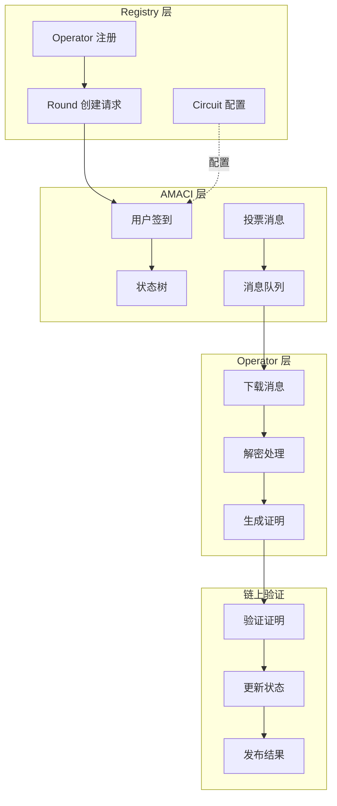

### 消息处理详解

AMACI 的核心是链上链下协作的消息处理机制：

#### 1. 链上存储

```rust
// 用户发布加密投票消息到链上
pub struct Message {
    // 加密的投票数据
    data: [Uint256; 7],
    // 加密密钥（使用 Coordinator 公钥加密）
    enc_pub_key: PubKey,
}

// 链上只存储加密数据，保护隐私
messages.push(Message {
    data: encrypted_vote_data,
    enc_pub_key: ephemeral_public_key,
});
```

#### 2. 链下处理

Operator 在本地执行以下步骤：

```
1. 下载所有加密消息
   messages = query_all_messages(amaci_contract)

2. 使用私钥解密消息
   for msg in messages:
       decrypted = decrypt(msg, coordinator_private_key)
       
3. 验证消息有效性
   - 检查签名
   - 验证发送者资格
   - 检查投票选项合法性
   
4. 更新状态树
   - 根据解密的消息更新用户状态
   - 计算新的状态树根
   
5. 生成零知识证明
   - 证明状态转换的正确性
   - 无需透露具体投票内容
```

#### 3. 链上验证

```rust
// Operator 提交处理结果和证明
pub fn process_messages(
    deps: DepsMut,
    info: MessageInfo,
    // 新的状态树根
    new_state_root: Uint256,
    // 零知识证明
    groth16_proof: Groth16ProofType,
) -> Result<Response, ContractError> {
    // 验证调用者是 Operator
    ensure_operator(&deps, &info.sender)?;
    
    // 验证零知识证明
    let public_inputs = prepare_public_inputs(
        old_state_root,
        new_state_root,
        message_batch,
    );
    
    verify_groth16_proof(
        deps.api,
        &groth16_proof,
        &public_inputs,
    )?;
    
    // 验证通过，更新状态
    STATE_ROOT.save(deps.storage, &new_state_root)?;
    
    Ok(Response::new()
        .add_attribute("action", "process_messages")
        .add_attribute("new_state_root", new_state_root.to_string()))
}
```

### 零知识证明系统

MACI 使用 Groth16 零知识证明保证计算正确性：

#### 证明内容

```
公开输入（Public Inputs）：
- 旧状态树根（Old State Root）
- 新状态树根（New State Root）
- 消息批次哈希（Message Batch Hash）
- Coordinator 公钥哈希

私有输入（Private Witness）：
- 所有投票消息的明文
- 用户状态
- 状态树的 Merkle 路径
- Coordinator 私钥
```

#### 证明验证流程

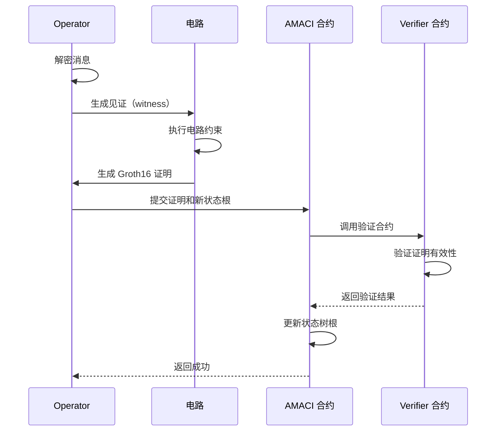

#### 电路约束

电路确保以下约束条件：

```
1. 消息解密正确性
   - ECDH 解密使用正确的私钥
   - 明文消息格式正确

2. 状态树更新正确性
   - 每条消息都正确更新了对应的用户状态
   - 新状态树根由正确的 Merkle 树计算得出

3. 投票规则遵守
   - 用户没有超支 voice credits
   - 投票选项在允许范围内
   - 二次方投票规则正确应用

4. 签名验证
   - 每条消息的签名有效
   - 签名者与声称的身份一致
```

## 状态管理

### Registry 状态

```rust
// Registry 存储的状态
pub struct RegistryState {
    // 管理员
    admin: Addr,
    operator: Addr,
    
    // AMACI 合约 Code ID
    amaci_code_id: u64,
    
    // Operator 集合
    operator_set: Map<Addr, bool>,
    operator_pubkey: Map<Addr, PubKey>,
    operator_identity: Map<Addr, String>,
    
    // Validator 集合
    validator_list: Vec<Addr>,
    validator_operator: Map<Addr, Addr>,
    
    // 费用配置
    circuit_charge_config: CircuitChargeConfig,
}
```

### AMACI 状态

```rust
// AMACI 合约存储的状态
pub struct AMACIState {
    // 轮次信息
    round_info: RoundInfo,
    voting_time: VotingTime,
    
    // Coordinator 公钥
    coordinator_pub_key: PubKey,
    
    // 用户数据
    num_sign_ups: u64,
    voice_credit_amount: Uint256,
    
    // 消息队列
    messages: Vec<Message>,
    
    // 状态树
    state_tree_depth: u8,
    state_tree_root: Uint256,
    
    // 投票配置
    max_vote_options: Uint256,
    vote_option_map: Vec<String>,
    
    // 电路配置
    circuit_type: Uint256,
    certification_system: Uint256,
    
    // 白名单
    whitelist: Option<WhitelistBase>,
}
```

### 状态树机制

AMACI 使用 Merkle 树管理用户状态，实现高效的状态验证：

#### 树结构

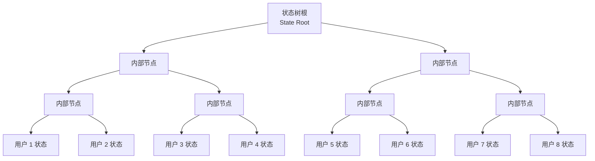

#### 用户状态叶子节点

```rust
// 每个用户在状态树中的数据
pub struct UserState {
    // 用户公钥
    pub_key: PubKey,
    // 剩余语音积分
    voice_credit_balance: Uint256,
    // 用户索引
    user_index: u64,
    // 每个选项的投票数
    vote_option_tree_root: Uint256,
}

// 叶子节点哈希计算
leaf_hash = hash(
    pub_key.x,
    pub_key.y,
    voice_credit_balance,
    vote_option_tree_root,
)
```

#### 状态更新流程

当用户发布投票消息时，状态树如何更新：

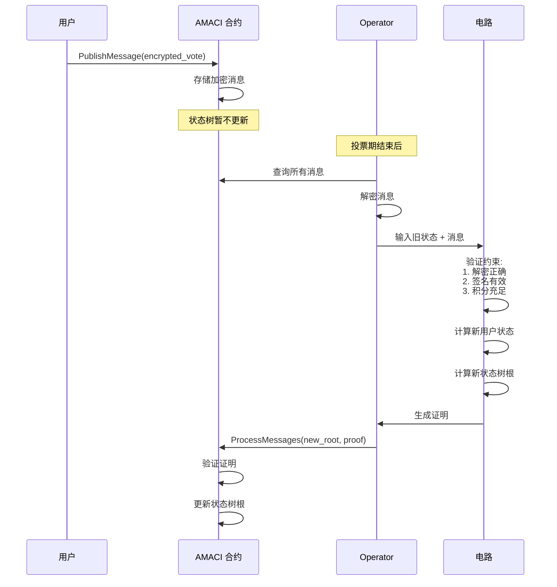

#### 状态一致性保证

```rust
// 链上只存储状态树根，保证存储效率
pub struct StateTreeInfo {
    // 当前状态树根
    current_root: Uint256,
    // 树的深度（决定最大用户数 = 2^depth）
    depth: u8,
    // 已处理的消息数量
    num_processed_messages: u64,
}

// 验证状态更新的正确性
pub fn verify_state_transition(
    old_root: Uint256,
    new_root: Uint256,
    messages: &[Message],
    proof: &Groth16ProofType,
) -> Result<bool, ContractError> {
    // 准备公开输入
    let public_inputs = vec![
        old_root,
        new_root,
        hash_messages(messages),
        coordinator_pubkey_hash,
    ];
    
    // 使用 Groth16 验证
    verify_groth16_proof(proof, &public_inputs)
}
```

## 权限管理

### Registry 权限

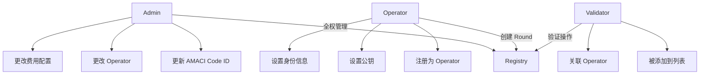

### AMACI 权限

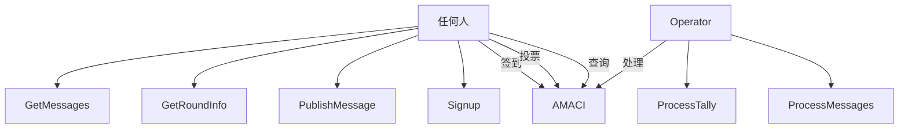

## 安全设计

### 1. 合约验证

```rust
// Registry 创建 AMACI 时的验证
fn create_round(
    deps: DepsMut,
    info: MessageInfo,
    operator: Addr,
    // ... 其他参数
) -> Result<Response, ContractError> {
    // 验证 1: Operator 必须已注册
    if !is_maci_operator(deps.storage, &operator)? {
        return Err(ContractError::OperatorNotRegistered {});
    }
    
    // 验证 2: 参数合法性
    if max_voter == Uint256::zero() {
        return Err(ContractError::InvalidMaxVoter {});
    }
    
    // 验证 3: 费用检查
    let required_fee = calculate_fee(&circuit_charge_config);
    if info.funds.amount < required_fee {
        return Err(ContractError::InsufficientFee {});
    }
    
    // 通过验证，创建合约
    instantiate_amaci_contract(deps, operator, ...)
}
```

### 2. 状态隔离

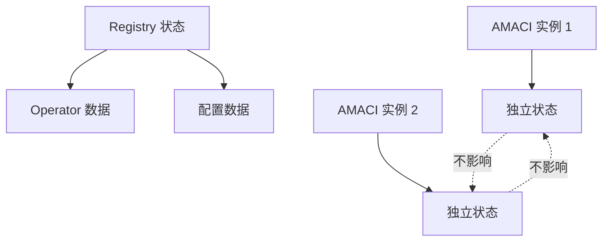

**特点：**
- 每个 AMACI 实例有独立的状态
- 一个实例的问题不影响其他实例
- Registry 只存储全局配置

### 3. 升级机制

```rust
// Registry 支持更新 AMACI Code ID
ExecuteMsg::UpdateAmaciCodeId {
    amaci_code_id: u64,
}

// 新创建的 AMACI 实例使用新 Code ID
// 已存在的实例不受影响
```

### 4. 错误处理机制

MACI 合约实现了完善的错误处理，确保系统的健壮性：

#### Registry 合约错误

```rust
pub enum RegistryError {
    // 权限相关错误
    Unauthorized {},
    OperatorNotRegistered {},
    
    // 参数验证错误
    InvalidMaxVoter {},
    InvalidVotingTime {},
    InvalidCircuitType {},
    
    // 资源错误
    InsufficientFee { required: Uint128, provided: Uint128 },
    CodeIdNotFound {},
    
    // 状态错误
    OperatorAlreadyRegistered {},
    ValidatorAlreadyExists {},
}

// 错误处理示例
pub fn create_round(
    deps: DepsMut,
    info: MessageInfo,
    params: CreateRoundParams,
) -> Result<Response, RegistryError> {
    // 验证时间参数
    if params.voting_start >= params.voting_end {
        return Err(RegistryError::InvalidVotingTime {});
    }
    
    // 验证费用
    let required_fee = calculate_circuit_fee(&params);
    let provided_fee = info.funds.get(0).map(|c| c.amount).unwrap_or_default();
    
    if provided_fee < required_fee {
        return Err(RegistryError::InsufficientFee {
            required: required_fee,
            provided: provided_fee,
        });
    }
    
    // 继续处理...
}
```

#### AMACI 合约错误

```rust
pub enum AMACIError {
    // 状态错误
    InvalidPeriod { expected: String, current: String },
    VotingNotStarted {},
    VotingEnded {},
    AlreadyProcessed {},
    
    // 用户操作错误
    AlreadySignedUp {},
    NotSignedUp {},
    InsufficientVoiceCredits {},
    InvalidVoteOption {},
    
    // 证明验证错误
    InvalidProof {},
    ProofVerificationFailed { reason: String },
    StateRootMismatch {},
    
    // 权限错误
    NotCoordinator {},
    NotWhitelisted {},
}

// 状态检查示例
pub fn publish_message(
    deps: DepsMut,
    env: Env,
    info: MessageInfo,
    message: Message,
) -> Result<Response, AMACIError> {
    let state = STATE.load(deps.storage)?;
    
    // 检查投票期
    let current_time = env.block.time.seconds();
    if current_time < state.voting_time.start_time {
        return Err(AMACIError::VotingNotStarted {});
    }
    if current_time >= state.voting_time.end_time {
        return Err(AMACIError::VotingEnded {});
    }
    
    // 检查白名单
    if let Some(whitelist) = &state.whitelist {
        if !whitelist.is_whitelisted(&info.sender) {
            return Err(AMACIError::NotWhitelisted {});
        }
    }
    
    // 存储消息
    MESSAGES.push(deps.storage, &message)?;
    Ok(Response::new())
}
```

#### 证明验证错误处理

```rust
pub fn process_messages(
    deps: DepsMut,
    info: MessageInfo,
    new_state_root: Uint256,
    proof: Groth16ProofType,
) -> Result<Response, AMACIError> {
    // 验证 Operator 身份
    ensure_coordinator(&deps, &info.sender)?;
    
    let state = STATE.load(deps.storage)?;
    
    // 准备公开输入
    let public_inputs = vec![
        state.state_tree_root,  // 旧状态根
        new_state_root,          // 新状态根
        get_message_batch_hash(deps.storage)?,
    ];
    
    // 验证零知识证明
    match verify_groth16_proof(deps.api, &proof, &public_inputs) {
        Ok(true) => {
            // 验证通过，更新状态
            STATE.update(deps.storage, |mut s| -> StdResult<_> {
                s.state_tree_root = new_state_root;
                s.num_processed_messages += proof.batch_size;
                Ok(s)
            })?;
            
            Ok(Response::new()
                .add_attribute("action", "process_messages")
                .add_attribute("new_root", new_state_root.to_string()))
        }
        Ok(false) => {
            Err(AMACIError::InvalidProof {})
        }
        Err(e) => {
            Err(AMACIError::ProofVerificationFailed {
                reason: e.to_string(),
            })
        }
    }
}
```

### 5. 安全边界

系统设计了多层安全边界，防止各类攻击：

#### 时间边界

```rust
// 严格的时间窗口控制
pub struct VotingTime {
    // 投票开始时间（Unix 时间戳）
    start_time: u64,
    // 投票结束时间
    end_time: u64,
}

// 只能在投票期内发布消息
if !(start_time <= current_time && current_time < end_time) {
    return Err(AMACIError::InvalidPeriod {});
}

// 只能在投票期结束后处理消息
if current_time < end_time {
    return Err(AMACIError::VotingNotEnded {});
}
```

#### 数量边界

```rust
// 限制参与人数（由状态树深度决定）
pub fn signup(
    deps: DepsMut,
    info: MessageInfo,
) -> Result<Response, AMACIError> {
    let state = STATE.load(deps.storage)?;
    let max_users = 2u64.pow(state.state_tree_depth as u32);
    
    if state.num_sign_ups >= max_users {
        return Err(AMACIError::MaxSignupsReached {});
    }
    
    // 继续处理...
}

// 限制投票选项数量
if vote_option_index >= state.max_vote_options {
    return Err(AMACIError::InvalidVoteOption {});
}

// 限制消息批次大小（防止 gas 耗尽）
const MAX_BATCH_SIZE: usize = 100;
if messages.len() > MAX_BATCH_SIZE {
    return Err(AMACIError::BatchTooLarge {});
}
```

#### 加密边界

```rust
// 所有投票消息必须加密
pub struct Message {
    // 7 个字段的加密数据
    // [nonce, pub_key_x, pub_key_y, vote_option, vote_weight, ...]
    data: [Uint256; 7],
    // 临时公钥（ECDH 加密）
    enc_pub_key: PubKey,
}

// 只有 Coordinator 可以解密
// 链上永远不存储明文投票数据
// 保证投票隐私和防审查性
```

#### 权限边界

```rust
// Registry 合约权限分级
pub enum Permission {
    Admin,      // 可以更新 Code ID、费用配置
    Operator,   // 可以创建 Round、设置公钥
    Validator,  // 可以验证操作
    User,       // 可以使用系统
}

// AMACI 合约权限分级
pub fn check_permission(
    action: &str,
    caller: &Addr,
    state: &AMACIState,
) -> Result<(), AMACIError> {
    match action {
        "process_messages" | "process_tally" => {
            if caller != &state.coordinator {
                return Err(AMACIError::NotCoordinator {});
            }
        }
        "signup" | "publish_message" => {
            if let Some(whitelist) = &state.whitelist {
                if !whitelist.contains(caller) {
                    return Err(AMACIError::NotWhitelisted {});
                }
            }
        }
        _ => {}
    }
    Ok(())
}
```

## 优势

### 1. 简化部署

**传统方式：**
```
用户 → 编译合约 → 上传代码 → 实例化合约 → 配置参数
```

**Registry 方式：**
```
用户 → 调用 CreateRound → 完成
```

### 2. 统一管理

- 所有 Operator 在一个地方注册
- 统一的费用配置
- 统一的 Code ID 管理

### 3. 安全性

- Registry 验证 Operator 资格
- 标准化的合约创建流程
- 减少人为错误

### 4. 可升级性

- 更新 Code ID 后新实例使用新代码
- 旧实例继续运行不受影响
- 平滑升级路径

## 下一步

完成后，您可以了解了整体架构，接下来可以深入学习：

- [Registry 合约](/docs/contracts/registry) - 详细了解 Registry 的功能
- [AMACI 合约](/docs/contracts/amaci) - 学习 AMACI 的投票逻辑
- [完整工作流程](/docs/contracts/workflow) - 理解从创建到结果的全流程
