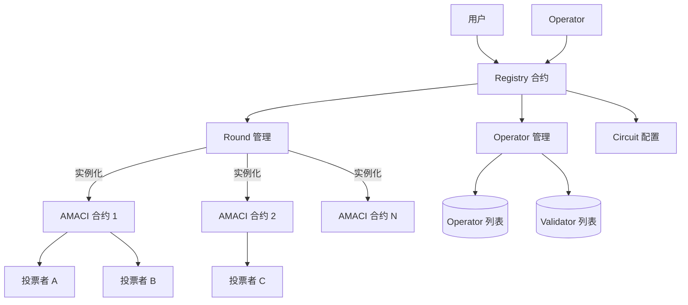
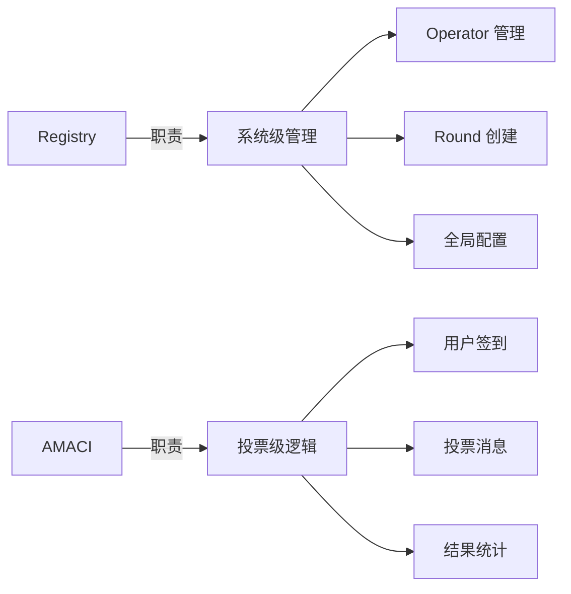
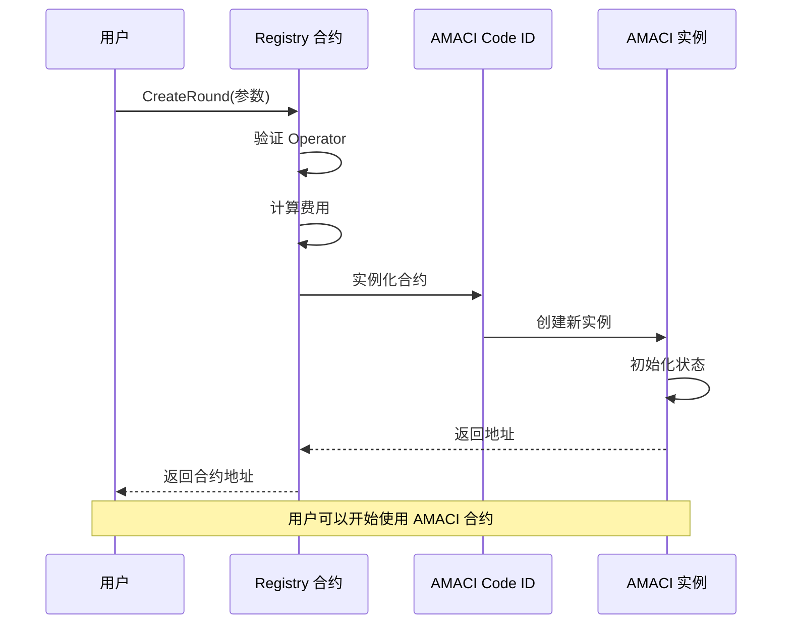
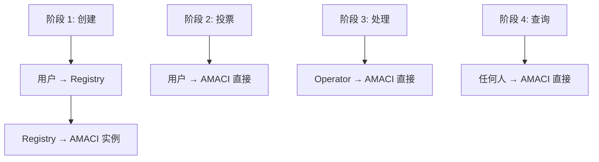
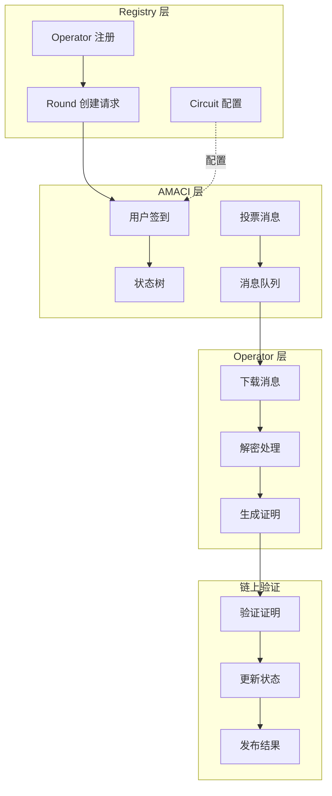
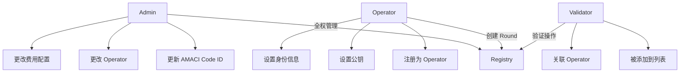
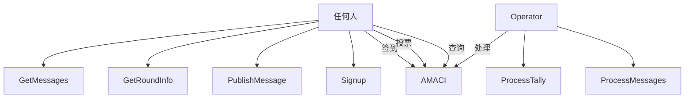
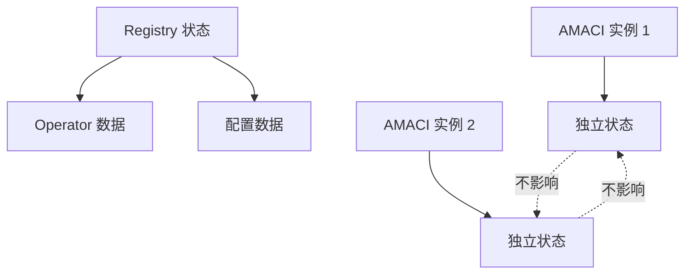

# 架构总览

MACI 的合约系统采用模块化设计，通过 Registry 合约统一管理多个 AMACI 投票合约实例。本节介绍整体架构和设计理念。

## 系统架构

### 架构图



### 组件说明

**Registry 合约（注册中心）**
- 管理 Operator 注册和配置
- 管理 Validator 列表
- 创建和配置 AMACI 合约实例
- 配置 ZK 电路参数
- 管理费用配置

**AMACI 合约（投票实例）**
- 处理用户签到（Signup）
- 接收和存储加密投票消息
- 验证零知识证明
- 发布投票结果
- 每个投票轮次对应一个独立的 AMACI 合约实例

## 设计理念

### 1. 关注点分离



**Registry 关注：**
- 谁可以运行 Operator
- 如何创建投票轮次
- 系统级参数配置

**AMACI 关注：**
- 用户如何参与投票
- 消息如何存储和处理
- 结果如何验证和发布

### 2. 一键创建

用户无需手动部署 AMACI 合约：

```rust
// 用户只需调用 Registry 的一个函数
ExecuteMsg::CreateRound {
    operator,
    max_voter,
    voice_credit_amount,
    vote_option_map,
    // ... 其他参数
}

// Registry 自动：
// 1. 验证 Operator 是否注册
// 2. 实例化 AMACI 合约
// 3. 配置初始参数
// 4. 返回合约地址
```

### 3. 标准化接口

所有 AMACI 合约实例共享相同的接口：

```rust
// 统一的消息类型
pub enum ExecuteMsg {
    Signup { ... },
    PublishMessage { ... },
    ProcessMessages { ... },
    ProcessTally { ... },
}

// 统一的查询接口
pub enum QueryMsg {
    GetRoundInfo {},
    GetNumSignups {},
    GetMessage { index },
}
```

### 4. 灵活配置

支持多种配置选项：

```rust
// 投票类型
pub enum CircuitType {
    IP1V = 0,  // 一人一票
    QV = 1,    // 二次方投票
}

// 认证系统
pub enum CertificationSystem {
    Oracle = 0,     // Oracle 白名单
    OnChain = 1,    // 链上白名单
}

// 白名单配置
pub struct WhitelistBase {
    ecosystem: String,        // cosmoshub / doravota
    snapshot_height: String,  // 快照高度
    voting_power_args: VotingPowerArgs,
}
```

## 合约关系

### 创建流程



### 交互模式



**注意：**
- Registry 只在创建时参与
- 创建后，用户直接与 AMACI 合约交互
- Registry 不参与投票过程

## 数据流

### 完整数据流图



## 状态管理

### Registry 状态

```rust
// Registry 存储的状态
pub struct RegistryState {
    // 管理员
    admin: Addr,
    operator: Addr,
    
    // AMACI 合约 Code ID
    amaci_code_id: u64,
    
    // Operator 集合
    operator_set: Map<Addr, bool>,
    operator_pubkey: Map<Addr, PubKey>,
    operator_identity: Map<Addr, String>,
    
    // Validator 集合
    validator_list: Vec<Addr>,
    validator_operator: Map<Addr, Addr>,
    
    // 费用配置
    circuit_charge_config: CircuitChargeConfig,
}
```

### AMACI 状态

```rust
// AMACI 合约存储的状态
pub struct AMACIState {
    // 轮次信息
    round_info: RoundInfo,
    voting_time: VotingTime,
    
    // Coordinator 公钥
    coordinator_pub_key: PubKey,
    
    // 用户数据
    num_sign_ups: u64,
    voice_credit_amount: Uint256,
    
    // 消息队列
    messages: Vec<Message>,
    
    // 状态树
    state_tree_depth: u8,
    state_tree_root: Uint256,
    
    // 投票配置
    max_vote_options: Uint256,
    vote_option_map: Vec<String>,
    
    // 电路配置
    circuit_type: Uint256,
    certification_system: Uint256,
    
    // 白名单
    whitelist: Option<WhitelistBase>,
}
```

## 权限管理

### Registry 权限



### AMACI 权限



## 安全设计

### 1. 合约验证

```rust
// Registry 创建 AMACI 时的验证
fn create_round(
    deps: DepsMut,
    info: MessageInfo,
    operator: Addr,
    // ... 其他参数
) -> Result<Response, ContractError> {
    // 验证 1: Operator 必须已注册
    if !is_maci_operator(deps.storage, &operator)? {
        return Err(ContractError::OperatorNotRegistered {});
    }
    
    // 验证 2: 参数合法性
    if max_voter == Uint256::zero() {
        return Err(ContractError::InvalidMaxVoter {});
    }
    
    // 验证 3: 费用检查
    let required_fee = calculate_fee(&circuit_charge_config);
    if info.funds.amount < required_fee {
        return Err(ContractError::InsufficientFee {});
    }
    
    // 通过验证，创建合约
    instantiate_amaci_contract(deps, operator, ...)
}
```

### 2. 状态隔离



**特点：**
- 每个 AMACI 实例有独立的状态
- 一个实例的问题不影响其他实例
- Registry 只存储全局配置

### 3. 升级机制

```rust
// Registry 支持更新 AMACI Code ID
ExecuteMsg::UpdateAmaciCodeId {
    amaci_code_id: u64,
}

// 新创建的 AMACI 实例使用新 Code ID
// 已存在的实例不受影响
```

## 部署流程

### 部署 AMACI 合约代码

```bash
# 编译 AMACI 合约
cd contracts/amaci
cargo wasm

# 优化 wasm
docker run --rm -v "$(pwd)":/code \
  cosmwasm/rust-optimizer:0.12.11

# 上传到链上
dorad tx wasm store artifacts/amaci.wasm \
  --from deployer \
  --gas auto

# 获得 Code ID（例如：123）
```

### 部署 Registry 合约

```bash
# 实例化 Registry
dorad tx wasm instantiate 123 \
  '{
    "admin": "dora1...",
    "operator": "dora1...",
    "amaci_code_id": 123
  }' \
  --from deployer \
  --label "MACI Registry" \
  --gas auto

# 获得 Registry 地址（例如：dora1registry...）
```

### 注册 Operator

```bash
# Operator 注册
dorad tx wasm execute dora1registry... \
  '{
    "set_maci_operator": {
      "operator": "dora1operator..."
    }
  }' \
  --from operator \
  --gas auto

# 设置 Operator 公钥
dorad tx wasm execute dora1registry... \
  '{
    "set_maci_operator_pubkey": {
      "pubkey": {
        "x": "0x...",
        "y": "0x..."
      }
    }
  }' \
  --from operator \
  --gas auto
```

### 创建投票轮次

现在用户可以通过 Registry 创建 AMACI 实例：

```typescript
// 使用 SDK
const round = await client.createOracleMaciRound({
  signer: wallet,
  operatorPubkey: '0x...',
  // ... 其他参数
});

console.log('AMACI 合约地址:', round.contractAddress);
```

## 优势

### 1. 简化部署

**传统方式：**
```
用户 → 编译合约 → 上传代码 → 实例化合约 → 配置参数
```

**Registry 方式：**
```
用户 → 调用 CreateRound → 完成
```

### 2. 统一管理

- 所有 Operator 在一个地方注册
- 统一的费用配置
- 统一的 Code ID 管理

### 3. 安全性

- Registry 验证 Operator 资格
- 标准化的合约创建流程
- 减少人为错误

### 4. 可升级性

- 更新 Code ID 后新实例使用新代码
- 旧实例继续运行不受影响
- 平滑升级路径

## 下一步

完成后，您可以了解了整体架构，接下来可以深入学习：

- [Registry 合约](/docs/contracts/registry) - 详细了解 Registry 的功能
- 🗳️ [AMACI 合约](/docs/contracts/amaci) - 学习 AMACI 的投票逻辑
- 🔄 [完整工作流程](/docs/contracts/workflow) - 理解从创建到结果的全流程
