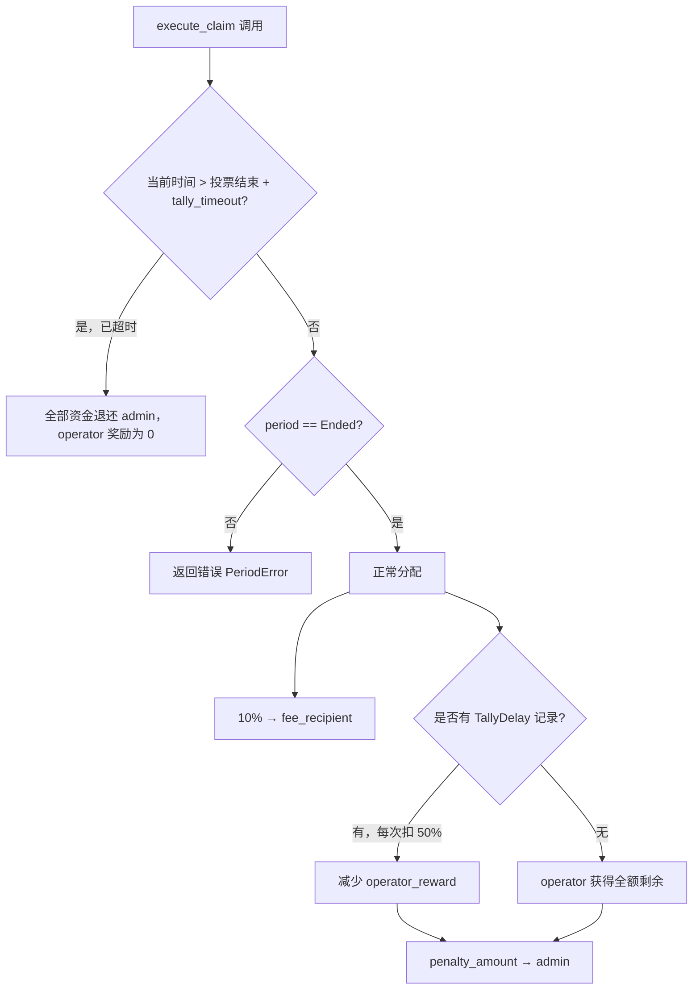

# 延迟结构

MACI 协议通过动态延迟机制为 Operator 提供合理的处理时间，并对超时行为进行惩罚。延迟限制根据电路规模和实际投票消息数量动态计算，而非使用固定值。

---

## 核心公式

```
delay_allowed = (BASE_DELAY + msg_count × PER_VOTE_DELAY) × 3
tally_timeout = delay_allowed + 2 天
```

| 变量 | 含义 |
|------|------|
| `BASE_DELAY` | 每种电路的基础处理时间（秒），取自 benchmark |
| `msg_count` | 实际发布的投票消息数量（`msg_chain_length`） |
| `PER_VOTE_DELAY` | 每票处理时间（统一 1 秒/票） |
| `×3` | 适应时间倍数，给 Operator 额外缓冲 |
| `+2 天` | 在 delay_allowed 基础上额外增加 2 天作为硬性 timeout |

---

## 参数表

### Base Delay（按电路分级）

| 电路规格 | 最大投票人数 | Benchmark 基准时间 | Base Delay |
|----------|------------|------------------|-----------|
| **2-1-1-5** | ≤ 25 | ~0.48 min (0.2267 + 0.2516 min) | **60s** |
| **4-2-2-25** | ≤ 625 | ~2.88 min (2.5346 + 0.3404 min) | **180s** |
| **6-3-3-125** | ≤ 15,625 | ~22.26 min (21.9313 + 0.3308 min) | **1380s** |
| **9-4-3-125** | ≤ 1,953,125 | *(benchmark 进行中)* | **14400s（TODO）** |

### Per-Vote Delay（统一）

| 参数 | 值 | 依据 |
|------|---|------|
| `PER_VOTE_DELAY` | **1 秒/票** | 参考 4-2-2-25（0.2531s）和 6-3-3-125（0.2289s），取较大值保守向上取整 |

---

## 示例计算

### 2-1-1-5，10 票

```
delay_allowed = (60 + 10 × 1) × 3 = 210s = 3.5 min
tally_timeout = 210 + 172800 = 173010s ≈ 2 天 2 分
```

### 4-2-2-25，500 票

```
delay_allowed = (180 + 500 × 1) × 3 = 2040s = 34 min
tally_timeout = 2040 + 172800 = 174840s ≈ 2 天 34 分
```

### 6-3-3-125，10000 票

```
delay_allowed = (1380 + 10000 × 1) × 3 = 34140s ≈ 9.5 小时
tally_timeout = 34140 + 172800 = 206940s ≈ 2.4 天
```

---

## 延迟判断时机

### Tally Delay（投票统计延迟）

在 `stop_tallying_period` 调用时判断：

```
触发条件：当前时间 - 投票结束时间 > delay_allowed
```

一旦触发，链上记录一条 `TallyDelay` 类型的延迟记录，并向 indexer 发出以下事件属性：

| 属性名 | 说明 |
|--------|------|
| `delay_timestamp` | 投票结束时间（延迟起点） |
| `delay_duration` | 实际已用时间（秒） |
| `delay_reason` | 超时描述字符串 |
| `delay_type` | `"tally_delay"` |

### Deactivate Delay（注销消息延迟）

在 `process_deactivate_message` 调用时判断（固定 10 分钟窗口，不受本次变更影响）。

---

## 超时处罚（execute_claim）

在 `claim` 调用时：



| 情形 | operator 获得 | admin 获得 |
|------|-------------|----------|
| 无延迟，正常完成 | 90% 合约余额 | 10%（fee_recipient） |
| 1 次 TallyDelay | 45%（-50%） | 55% |
| 超过 tally_timeout | 0% | 100% |

---

## 与 Fee 结构的关系

`delay_allowed` 和 `tally_timeout` 均基于**实际 msg_chain_length**（投票消息数）动态计算，与创建轮次时按 max_voter 计费的 Base Fee 独立，两者对应关系如下：

| 维度 | 收费 | 延迟限制 |
|------|-----|---------|
| 依据 | max_voter（最大规模） | msg_chain_length（实际消息数） |
| 时机 | 创建轮次时一次性收取 | 统计期结束时动态计算 |
| 电路差异 | Base Fee 按电路不同 | Base Delay 按电路不同 |
| 统一部分 | Vote Fee = 0.06 DORA/票（统一） | Per-Vote Delay = 1s/票（统一） |
