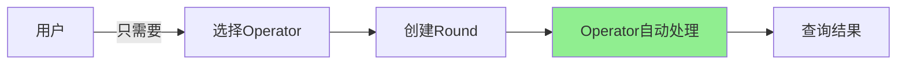
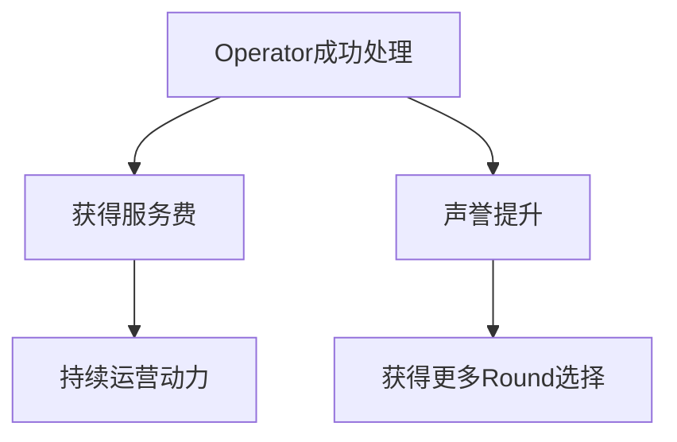
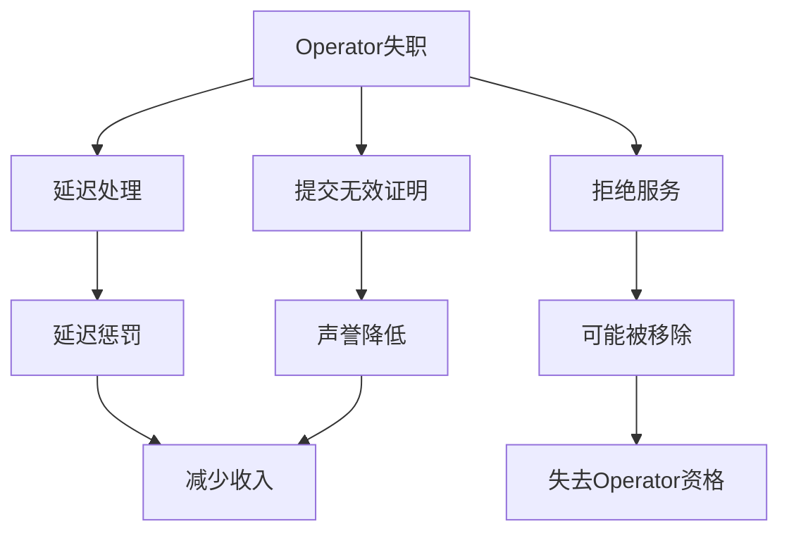
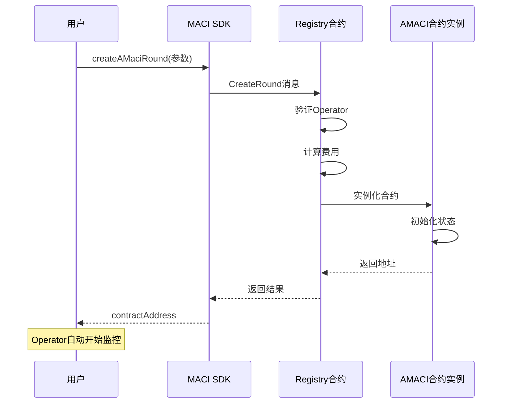
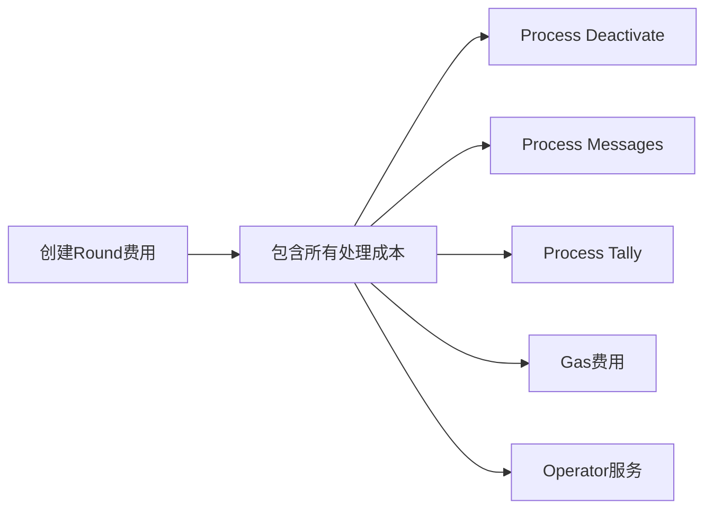
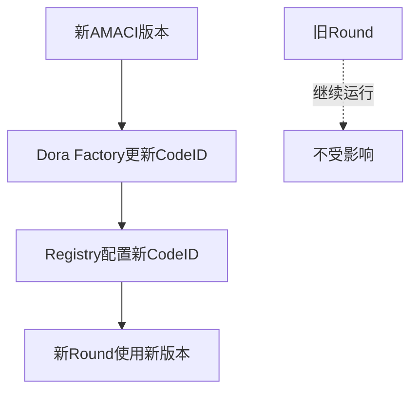

# Registry 合约

Registry 合约是 AMACI 系统的注册中心，**由 Dora Factory 维护和管理**。用户通过 Registry 一键创建投票轮次，无需关心底层部署细节。

## 专业 Operator 网络

### 什么是 Operator

Operator（也称 Coordinator）是专业的投票处理服务提供商，负责：

**核心职责：**
- **处理投票消息**：下载并解密所有加密的投票消息
- **验证签名**：验证每条消息的有效性
- **维护状态树**：更新投票者状态和投票结果
- **生成零知识证明**：证明处理的正确性
- **发布结果**：将证明和结果提交到链上

**对用户的意义：**



用户**不需要**：
- 自己运行 Operator 软件
- 学习复杂的 ZK 电路
- 维护服务器
- 监控处理进度

用户**只需要**：
- 从列表中选择一个 Operator
- 创建 Round 并支付服务费
- 等待 Operator 自动处理
- 查询最终结果

### 许可制 Operator 网络

**当前状态：**

AMACI 采用**许可制（Permissioned）** Operator 网络：

- **管理方**：由 Dora Factory 官方维护 Operator 列表
- **准入制**：只有经过验证的专业节点可以成为 Operator
- **目的**：确保服务质量、可靠性和及时性

**主网 Operator 列表：**

https://vota.dorafactory.org/operators

### 如何选择 Operator

**方式 1: 通过 SDK 查询**

```typescript
import { MaciClient } from '@dorafactory/maci-sdk';

const client = new MaciClient({ network: 'mainnet' });

// 获取 Operator 列表
const operators = await client.indexer.getOperators('first', 50);

// 查看每个 Operator 的信息
operators.forEach(op => {
  console.log(`
    名称: ${op.identity || '未命名'}
    地址: ${op.address}
    公钥: ${op.pubkey}
    状态: ${op.isActive ? '活跃' : '不活跃'}
  `);
});

// 获取特定 Operator 的详细信息
const operator = await client.indexer.getOperatorByAddress('dora1operator...');
console.log('Operator 信息:', operator);
```

**方式 2: 访问网页查看**

访问 https://vota.dorafactory.org/operators 查看：
- Operator 名称和身份
- 历史运行记录
- 成功处理的 Round 数量
- 当前运行中的 Round
- 服务状态

**选择考虑因素：**

| 因素 | 说明 | 如何查看 |
|------|------|---------|
| 成功率 | 历史处理成功率 | Operator 列表页面 |
| 响应时间 | 平均处理时间 | 查看历史 Round |
| 活跃度 | 当前运行的 Round 数 | Operating 列 |
| 声誉 | 社区评价 | 社区讨论 |
| 稳定性 | 长期运行记录 | Past (success/total) |

**查询 Operator 表现：**

```typescript
// 查询 Operator 的错过率（miss rate）
const performance = await client.indexer.queryMissRate(
  operatorAddress,
  30  // 最近 30 天
);

console.log('成功率:', performance.successRate);
console.log('失败次数:', performance.missCount);

// 查询 Operator 运行的 Rounds
const rounds = await client.indexer.getRoundsByOperator(
  operatorAddress,
  'first',
  20
);

console.log(`该 Operator 运行了 ${rounds.length} 个 Round`);
```

### Operator 奖罚机制

**奖励机制：**



- **服务费收入**：每成功处理一个 Round 获得相应费用
- **声誉奖励**：及时准确处理提升声誉值
- **优先选择**：高声誉 Operator 更容易被用户选择
- **长期收益**：稳定运行获得持续收入

**惩罚机制：**



- **延迟惩罚**：超时未处理会扣除部分费用
- **声誉降低**：失败或错误会降低声誉值
- **用户流失**：低声誉导致用户不选择
- **可能移除**：重复失职可能被移除出 Operator 列表

**监控和透明度：**

所有 Operator 的表现都是公开可查的：

```typescript
// 查询 Operator 历史表现
const missRate = await client.indexer.queryMissRate(
  operatorAddress,
  30  // 最近30天
);

console.log('成功处理:', missRate.successCount);
console.log('失败次数:', missRate.missCount);
console.log('成功率:', missRate.successRate);

// 查询 Operator 处理的所有 Rounds
const rounds = await client.indexer.getRoundsByOperator(
  operatorAddress,
  'first',
  100
);

console.log('总 Round 数:', rounds.length);
console.log('最近处理:', rounds[0].title);
```

---

## 创建投票轮次（用户视角）

### 一键创建流程

用户通过 Registry 创建 AMACI Round，整个过程高度自动化：



### SDK 创建示例

```typescript
import { MaciClient, MaciCircuitType } from '@dorafactory/maci-sdk';

const client = new MaciClient({ network: 'mainnet' });

// 方式 1: 白名单列表模式
const roundWithWhitelist = await client.createMaciRound({
  signer: wallet,
  
  // 1. 选择 Operator
  operatorPubkey: '0e752c8f4c4c9f5c...',
  
  // 2. 配置投票时间
  startVoting: new Date('2024-03-01T00:00:00Z'),
  endVoting: new Date('2024-03-07T23:59:59Z'),
  
  // 3. 设置 Round 信息
  title: '社区提案投票',
  description: '投票决定下一步发展方向',
  link: 'https://forum.example.com/proposal',
  
  // 4. 配置投票选项
  voteOptionMap: [
    '提案 A: 增加社区资金',
    '提案 B: 改进技术基础设施',
    '提案 C: 扩大市场推广'
  ],
  
  // 5. 选择投票类型
  circuitType: MaciCircuitType.QV,
  
  // 6. 配置白名单列表
  whitelist: [
    'dora1abc...',
    'dora1def...',
    'dora1ghi...'
    // ... 更多白名单地址
  ],
  voiceCreditsPerUser: 100  // 每人100投票权重
});

// 方式 2: Pre-add-new-key 预生成模式
const roundWithPreKeys = await client.createMaciRound({
  signer: wallet,
  operatorPubkey: '0e752c8f4c4c9f5c...',
  
  // ... 其他参数同上
  
  // 配置 pre-deactivate（平台预先生成）
  preDeactivateRoot: preGeneratedRoot,
  preDeactivateCoordinator: {
    x: platformCoordPubkey[0],
    y: platformCoordPubkey[1]
  }
});

console.log('Round 创建成功！');
console.log('合约地址:', round.contractAddress);
console.log('交易哈希:', round.transactionHash);
console.log('');
console.log('后续流程：');
console.log('1. 白名单用户可以 signup 注册');
console.log('   或用户使用 pre-add-new-key 匿名注册');
console.log('2. Operator 自动监控此 Round');
console.log('3. 投票期结束后 Operator 自动处理');
console.log('4. 处理完成后可查询结果');
```

### 从 Operator 列表选择

**查询并选择 Operator：**

```typescript
// 1. 获取所有活跃的 Operator
const operators = await client.indexer.getOperators('first', 50);

// 2. 过滤活跃的 Operator
const activeOperators = operators.filter(op => op.isActive);

console.log(`找到 ${activeOperators.length} 个活跃 Operator`);

// 3. 查看每个 Operator 的详细信息
for (const op of activeOperators) {
  console.log(`\n${op.identity || op.address}`);
  console.log(`- 地址: ${op.address}`);
  console.log(`- 公钥: ${op.pubkey.slice(0, 20)}...`);
  
  // 查询历史表现
  const rounds = await client.indexer.getRoundsByOperator(
    op.address,
    'first',
    100
  );
  console.log(`- 处理过的 Round: ${rounds.length}`);
  
  // 查询成功率
  const perf = await client.indexer.queryMissRate(op.address, 30);
  console.log(`- 30天成功率: ${perf.successRate}%`);
}

// 4. 选择一个 Operator
const selectedOperator = activeOperators[0];
console.log(`\n选择 Operator: ${selectedOperator.identity}`);

// 5. 使用该 Operator 创建 Round（白名单模式）
const round = await client.createMaciRound({
  signer: wallet,
  operatorPubkey: selectedOperator.pubkey,
  // ...
  whitelist: ['dora1...', 'dora1...'],
  voiceCreditsPerUser: 100
});
```

---

## Operator 服务费用

### 费用构成

创建 Round 时需要支付 Operator 服务费：

```rust
// 费用计算公式（示例）
total_fee = base_fee + (max_voter × per_voter_fee) × circuit_complexity_factor

具体金额取决于：
- 最大投票人数（max_voter）
- 投票选项数量
- 电路类型（1P1V / QV）
- Registry 配置的费率
```

**费用说明：**



**一次性支付：**
- 创建 Round 时一次性支付全部费用
- 包含整个 Round 的处理成本
- Operator 承担所有处理和 Gas 成本

### 费用查询

```typescript
// 查询创建 Round 需要的费用
const fee = await client.queryAMaciChargeFee({
  maxVoter: 1000,
  maxOption: 10
});

console.log('创建 Round 费用:', fee);
console.log('包含:');
console.log('- Operator 服务费');
console.log('- 整个 Round 的处理成本');
```

### 费用支付

```typescript
// SDK 会自动处理费用支付
const round = await client.createMaciRound({
  signer: wallet,  // 钱包会支付所需费用
  // ... 其他参数
  whitelist: whitelistAddresses,
  voiceCreditsPerUser: 100
});

// 用户只需确保钱包有足够余额
// Registry 会自动：
// 1. 计算所需费用
// 2. 从交易中扣除
// 3. 转给 Operator
```

---

## 用户使用流程

### 完整用户体验

```typescript
// ========== 选择 Operator ==========
const operators = await client.indexer.getOperators('first', 10);
const selectedOp = operators[0];  // 选择表现最好的

console.log('选择 Operator:', selectedOp.identity);

// ========== 创建 Round ==========
const round = await client.createMaciRound({
  signer: wallet,
  operatorPubkey: selectedOp.pubkey,
  startVoting: new Date(),
  endVoting: new Date(Date.now() + 7 * 24 * 60 * 60 * 1000),
  title: '社区投票',
  voteOptionMap: ['选项 A', '选项 B', '选项 C'],
  circuitType: MaciCircuitType.QV,
  
  // 白名单列表模式
  whitelist: [
    'dora1user1...',
    'dora1user2...',
    'dora1user3...'
  ],
  voiceCreditsPerUser: 100
});

console.log('Round 创建成功');
console.log('合约地址:', round.contractAddress);

// ========== 用户参与投票 ==========
// 用户可以开始注册和投票
// （Operator 自动监控）

// ========== 等待结果 ==========
// 投票期结束后，Operator 自动处理
// 用户无需任何操作

// 定期查询状态
const checkStatus = setInterval(async () => {
  const info = await client.getRoundInfo({ contractAddress: round.contractAddress });
  console.log('当前状态:', info.status);
  
  if (info.status === 'Tallied') {
    console.log('投票已完成！');
    console.log('结果:', info.results);
    clearInterval(checkStatus);
  }
}, 60000);  // 每分钟查询一次
```

### 用户体验优势

**传统方式 vs Registry 方式：**

| 操作 | 传统方式 | Registry 方式 |
|------|---------|---------------|
| 学习成本 | 需要理解合约部署 | 只需调用一个函数 |
| 技术门槛 | 需要懂 CosmWasm | 使用 SDK 即可 |
| 时间成本 | 几小时（部署+配置） | 几分钟 |
| Operator 配置 | 需要自己运行 | 选择现成的 |
| 后续维护 | 需要监控和处理 | Operator 自动处理 |
| 失败风险 | 配置错误风险高 | Registry 验证，风险低 |

---

## Registry 系统说明

### Registry 的角色

Registry 合约充当系统的"入口"和"管理中心"：

**对用户：**
- 提供一键创建 Round 的接口
- 简化部署流程
- 自动验证和配置

**对 Operator：**
- 提供注册和管理接口
- 记录 Operator 信息和公钥
- 分配 Round 到 Operator

**对系统：**
- 统一管理 AMACI Code ID
- 配置费用和参数
- 维护 Operator 网络

### Registry 维护

**由谁维护：**

Registry 合约由 **Dora Factory 官方** 维护和管理。

**用户无需关心：**
- 如何部署 Registry
- 如何更新 Code ID
- 如何管理 Operator 列表
- 如何配置系统参数

**用户只需：**
- 使用 SDK 创建 Round
- 选择合适的 Operator
- 支付服务费用

### 系统升级

当有新版本的 AMACI 合约时：



- Dora Factory 负责更新
- 用户创建的新 Round 自动使用新版本
- 已存在的 Round 继续运行，不受影响
- 平滑升级，无需用户操作

## 常见问题

### Q: 我可以成为 Operator 吗？

**A:** Operator 采用许可制，需要联系 Dora Factory 申请。要求：
- 专业的运维团队
- 稳定的服务器资源
- 生成 ZK 证明的能力
- 良好的运营记录

### Q: 如何知道 Operator 是否可靠？

**A:** 可以查看 Operator 的历史记录：
```typescript
// 查询成功率
const perf = await client.indexer.queryMissRate(operatorAddress, 30);

// 查询处理过的 Rounds
const rounds = await client.indexer.getRoundsByOperator(
  operatorAddress,
  'first',
  100
);
```

### Q: Operator 不处理怎么办？

**A:** Operator 网络有保障机制：
- 有延迟惩罚机制
- 声誉会降低
- 用户下次不会选择
- 重复失职会被移除

### Q: 费用如何确定？

**A:** 费用由以下因素决定：
- 投票人数（max_voter）
- 电路复杂度
- Registry 配置的费率
- 可以通过 `queryAMaciChargeFee` 查询

### Q: Registry 会升级吗？

**A:** Registry 由 Dora Factory 维护：
- 定期升级以支持新功能
- 升级对用户透明
- 已创建的 Round 不受影响

## 下一步

完成后，您可以了解了 Registry 和 Operator 网络，接下来可以：

- [AMACI 合约](/docs/contracts/amaci) - 了解投票合约和三种注册方式
- [完整工作流程](/docs/contracts/workflow) - 理解从创建到结果的全流程
- [SDK 使用指南](/docs/sdk/create-round) - 使用 SDK 创建投票轮次
- [快速开始](/docs/introduction/quick-start) - 动手创建第一个投票
