# AMACI 完整工作流程

本节通过一个完整的示例，展示从创建投票轮次到发布结果的整个 AMACI 流程，包括如何使用 add-new-key 实现匿名投票。

## 流程总览

```mermaid
timeline
    title AMACI 完整工作流程
    section 准备阶段
        Operator注册 : 许可制注册 : 由DoraFactory管理
    section 创建阶段
        用户创建Round : 选择Operator : AMACI合约实例化
    section 注册阶段
        方式1Signup : 快速注册 : Operator知道身份
        方式2Add-new-key : 匿名注册 : Operator不知身份
    section 投票阶段
        提交投票 : 加密消息 : 存储到链上
    section 处理阶段
        ProcessDeactivate : 生成匿名集 : 为add-new-key准备
        ProcessMessages : 处理投票 : 生成证明
        ProcessTally : 统计结果 : 发布结果
```



## 阶段 1: 准备阶段

### Operator 网络

Operator 网络由 Dora Factory 官方维护，采用许可制。

**用户视角：**
- 无需关心 Operator 如何注册
- 直接从现成的列表中选择
- 查看地址：https://vota.dorafactory.org/operators

**查询可用 Operator：**

```typescript
import { MaciClient } from '@dorafactory/maci-sdk';

const client = new MaciClient({ network: 'mainnet' });

// 获取所有 Operator
const operators = await client.indexer.getOperators('first', 50);

console.log(`共有 ${operators.length} 个 Operator`);

// 选择一个表现好的 Operator
const bestOperator = operators
  .filter(op => op.isActive)
  .sort((a, b) => b.successRate - a.successRate)[0];

console.log('选择 Operator:', bestOperator.identity);
console.log('公钥:', bestOperator.pubkey);
```

## 阶段 2: 创建投票轮次

### 2.1 准备参数

```typescript
const roundParams = {
  // Operator 公钥（用于加密）
  operatorPubkey: operatorKeypair.publicKey,
  
  // 投票时间
  startVoting: new Date('2024-02-01T00:00:00Z'),
  endVoting: new Date('2024-02-07T23:59:59Z'),
  
  // 轮次信息
  title: '社区资金分配投票',
  description: '投票决定如何分配 100,000 DORA 社区资金',
  link: 'https://forum.example.com/proposal',
  
  // 投票选项
  voteOptionMap: [
    '项目 A: DeFi 开发工具',
    '项目 B: 开发者教育计划',
    '项目 C: 市场推广活动',
    '项目 D: 社区基础设施',
  ],
  
  // 投票类型（二次方投票）
  circuitType: MaciCircuitType.QV,
  
  // 白名单配置
  whitelistEcosystem: 'cosmoshub',
  whitelistSnapshotHeight: '23342001',
  whitelistVotingPowerArgs: {
    mode: 'slope',
    slope: '1000000',  // 每 1 ATOM = 1 voice credit
    threshold: '0',
  },
};
```

### 2.2 创建 Round

```typescript
import { MaciClient, MaciCircuitType } from '@dorafactory/maci-sdk';

const client = new MaciClient({ network: 'mainnet' });

const round = await client.createOracleMaciRound({
  signer: creatorWallet,
  operatorPubkey: bestOperator.pubkey,  // 使用选择的 Operator
  
  startVoting: new Date('2024-03-01T00:00:00Z'),
  endVoting: new Date('2024-03-07T23:59:59Z'),
  
  title: '社区资金分配投票',
  description: '投票决定如何分配社区资金',
  link: 'https://forum.example.com/proposal',
  
  voteOptionMap: [
    '项目 A: DeFi 开发工具',
    '项目 B: 开发者教育',
    '项目 C: 市场推广',
    '项目 D: 社区基础设施'
  ],
  
  circuitType: MaciCircuitType.QV,
  
  whitelistEcosystem: 'cosmoshub',
  whitelistSnapshotHeight: '0',
  whitelistVotingPowerArgs: {
    mode: 'slope',
    slope: '1000000',
    threshold: '1000000'
  }
});

console.log('Round 创建成功！');
console.log('AMACI 合约地址:', round.contractAddress);
console.log('交易哈希:', round.transactionHash);
console.log('Operator 将自动监控此 Round');
```

### 2.3 验证创建

```typescript
// 查询 Round 信息
const roundInfo = await client.getRoundInfo({ contractAddress: round.contractAddress });

console.log('Round 信息:', {
  title: roundInfo.title,
  status: roundInfo.status,
  coordinatorPubkey: roundInfo.coordinatorPubkey,
  numSignups: roundInfo.numSignups
});
```

## 阶段 3: 用户注册和投票

### 3.1 用户 A：使用 Signup（快速模式）

```typescript
console.log('=== 用户 A: 使用 Signup（快速但Operator知道身份）===\n');

// 生成 MACI 账户
const userAKeypair = await client.genKeypairFromSign({
  signer: walletA,
  address: addressA
});

// 等待 Gas Station
let hasFeegrant = false;
while (!hasFeegrant) {
  hasFeegrant = await client.hasFeegrant({
    address: addressA,
    contractAddress: round.contractAddress
  });
  if (!hasFeegrant) {
    await new Promise(resolve => setTimeout(resolve, 2000));
  }
}

// Signup（仅白名单地址可用）
await client.signup({
  signer: walletA,
  address: addressA,
  contractAddress: round.contractAddress,
  maciKeypair: userAKeypair,
  gasStation: true
});

console.log('用户 A 签到成功');
console.log('⚠️  注意：用户 A 的地址必须在白名单中');

// 投票
const roundInfo = await client.getRoundInfo({ contractAddress: round.contractAddress });

await client.vote({
  signer: walletA,
  address: addressA,
  contractAddress: round.contractAddress,
  selectedOptions: [
    { idx: 0, vc: 8 },  // 项目 A: 8 票（消耗 64 credits）
    { idx: 2, vc: 6 }   // 项目 C: 6 票（消耗 36 credits）
  ],
  operatorCoordPubKey: [
    BigInt(roundInfo.coordinatorPubkeyX),
    BigInt(roundInfo.coordinatorPubkeyY)
  ],
  maciKeypair: userAKeypair,
  gasStation: true
});

console.log('用户 A 投票成功');
console.log('⚠️  注意：Operator 可以通过链上交易知道用户 A 的身份');
```

### 3.2 用户 B：使用 Add-new-key（匿名模式）

```typescript
console.log('\n=== 用户 B: 使用 Add-new-key（完全匿名）===\n');

// 前提：用户 B 已经有一个老账户并已 deactivate
// 或者等待其他人 deactivate

// 等待 Operator 处理 deactivate
console.log('等待 Operator 处理 deactivate 消息...');
// （这个由 Operator 自动完成）

// 获取 deactivate 数据
const deactivates = await client.fetchAllDeactivateLogs(round.contractAddress);
console.log(`Deactivate 数据获取成功，匿名集大小: ${deactivates.length}`);

// 生成 add-new-key payload
import { VoterClient } from '@dorafactory/maci-sdk';

const voterClient = new VoterClient({
  network: 'mainnet',
  secretKey: oldUserPrivateKey  // 老用户的私钥
});

const addKeyPayload = await voterClient.buildAddNewKeyPayload({
  stateTreeDepth: 10,
  operatorPubkey: roundInfo.coordinatorPubkey,
  deactivates,
  wasmFile,  // 需要 addNewKey circuit
  zkeyFile
});

console.log('ZK 证明生成成功');

// 使用新钱包提交 add-new-key
const newKeypair = genKeypair();

await client.addNewKey({
  signer: newWalletB,  // 全新的钱包！
  contractAddress: round.contractAddress,
  d: addKeyPayload.d,
  proof: addKeyPayload.proof,
  nullifier: addKeyPayload.nullifier,
  newMaciKeypair: newKeypair,
  fee: 'auto'
});

console.log('用户 B 匿名注册成功');
console.log('Operator 无法确定用户 B 的真实身份');

// 投票
await client.vote({
  signer: newWalletB,
  address: newAddressB,
  contractAddress: round.contractAddress,
  selectedOptions: [
    { idx: 1, vc: 9 },  // 项目 B: 9 票
    { idx: 3, vc: 4 }   // 项目 D: 4 票
  ],
  operatorCoordPubKey: [
    BigInt(roundInfo.coordinatorPubkeyX),
    BigInt(roundInfo.coordinatorPubkeyY)
  ],
  maciKeypair: newKeypair,
  gasStation: true
});

console.log('用户 B 投票成功（完全匿名）');
```

### 3.3 投票期间的查询

```typescript
// 查询当前状态
const currentInfo = await client.getRoundInfo({ contractAddress: round.contractAddress });

console.log('Round 当前状态:');
console.log('- 签到人数:', currentInfo.numSignups);
console.log('- 状态:', currentInfo.status);

// 查询消息数量
// （需要直接查询合约或通过 indexer）
```

## 阶段 4: Operator 自动处理（用户无需操作）

投票期结束后，Operator 自动完成所有处理工作。

### 4.1 Process Deactivate（如果有）

如果有用户提交了 deactivate 消息，Operator 首先处理：

```typescript
console.log('=== Operator 自动处理流程 ===\n');

// 下载 deactivate 消息
const deactivateMessages = await contract.query({
  get_deactivate_messages: {}
});

if (deactivateMessages.length > 0) {
  console.log(`发现 ${deactivateMessages.length} 条 deactivate 消息`);
  
  // 处理并生成 deactivate tree
  // （Operator 使用专业工具自动完成）
  
  // 提交 ProcessDeactivate 证明
  console.log('ProcessDeactivate 完成');
  console.log(`生成匿名集，大小: ${deactivateMessages.length}`);
}
```

### 4.2 Process Messages

```typescript
// Operator 处理投票消息
console.log('\nOperator: 处理投票消息...');

// 1. 下载所有投票消息
// 2. 使用 Operator 私钥解密
// 3. 验证签名和有效性
// 4. 按 nonce 顺序处理
// 5. 更新状态树
// 6. 生成 ProcessMessages ZK 证明
// 7. 提交到链上验证

// （这些都由 Operator 自动完成，用户无需操作）

console.log('ProcessMessages 完成');
```

### 4.3 Process Tally

```typescript
// Operator 统计结果
console.log('\nOperator: 统计投票结果...');

// 1. 遍历最终状态树
// 2. 统计每个选项的票数
// 3. 生成 ProcessTally ZK 证明
// 4. 提交到链上
// 5. 发布结果

console.log('ProcessTally 完成');
console.log('投票结果已发布！');
```

### Operator 处理时间

**典型处理时间：**

```
投票规模        Process Deactivate   Process Messages   Process Tally   总计
100 人          5-10 分钟            30-60 分钟         10-20 分钟      ~1.5小时
500 人          10-20 分钟           1-2 小时           20-40 分钟      ~3小时
1000 人         20-30 分钟           2-4 小时           30-60 分钟      ~5小时
```

**用户体验：**
- 用户无需等待，可以离开
- Operator 自动在后台处理
- 可以设置通知（如果支持）
- 定期查询状态即可

## 阶段 5: 结果查询和验证

### 5.1 查询最终结果

```typescript
// 任何人都可以查询结果
const finalRound = await client.getRoundInfo({ contractAddress: round.contractAddress });

console.log('\n=== 最终投票结果 ===');
console.log('Round:', finalRound.title);
console.log('状态:', finalRound.status);  // 'Tallied'
console.log('参与人数:', finalRound.numSignups);

console.log('\n投票结果:');
finalRound.results?.forEach((votes, idx) => {
  console.log(`  ${finalRound.voteOptionMap[idx]}: ${votes} 票`);
});

// 计算获胜选项
const maxVotes = Math.max(...(finalRound.results || []));
const winnerIdx = finalRound.results?.indexOf(maxVotes);
console.log(`\n获胜项目: ${finalRound.voteOptionMap[winnerIdx]}`);
```

### 5.2 隐私分析

**用户 A（使用 Signup）：**
```
公开信息：
- 钱包地址: dora1aaa...
- Signup 交易哈希: 0xabc...
- State Index: 可查询

Operator 知道：
- dora1aaa... 投了票
- 投给了哪个选项
- 投了多少票

隐私级别：
```

**用户 B（使用 Add-new-key）：**
```
公开信息：
- 新钱包地址: dora1xyz...（可能是新的）
- Add-new-key 交易哈希: 0xdef...
- State Index: 新分配的

Operator 知道：
- 有人投了票
- 投给了哪个选项
- 投了多少票

Operator 不知道：
- 是 deactivate 树中哪个用户
- 对应哪个钱包地址
- 真实身份是谁

隐私级别：
```

## 完整时间线

```mermaid
gantt
    title AMACI 完整投票时间线示例
    dateFormat YYYY-MM-DD HH:mm
    section 准备
    选择Operator           :done, 2024-01-15 10:00, 10m
    section 创建
    创建Round             :done, 2024-01-15 11:00, 5m
    验证创建               :done, 2024-01-15 11:05, 2m
    section 投票
    用户A Signup投票       :done, 2024-02-01 09:00, 10m
    用户B Add-new-key      :done, 2024-02-01 10:00, 15m
    用户B 投票             :done, 2024-02-01 10:15, 5m
    更多用户投票           :done, 2024-02-02 00:00, 144h
    投票期结束             :milestone, 2024-02-07 23:59, 0d
    section Operator自动处理
    ProcessDeactivate      :active, 2024-02-08 00:10, 30m
    ProcessMessages        :active, 2024-02-08 00:40, 2h
    ProcessTally           :active, 2024-02-08 02:40, 1h
    section 结果
    结果发布               :milestone, 2024-02-08 03:40, 0d
```



## 完整代码示例

以下是一个完整的端到端示例脚本：

```typescript
import { MaciClient, MaciCircuitType } from '@dorafactory/maci-sdk';
import { DirectSecp256k1Wallet } from '@cosmjs/proto-signing';

async function completeVotingRound() {
  const client = new MaciClient({ network: 'testnet' });
  
  // === 阶段 1: 创建 Round ===
  console.log('\n=== 阶段 1: 创建投票轮次 ===');
  const round = await client.createOracleMaciRound({
    signer: creatorWallet,
    operatorPubkey: operatorPubkey,
    startVoting: new Date(),
    endVoting: new Date(Date.now() + 7 * 24 * 60 * 60 * 1000),
    title: '社区资金分配',
    description: '投票决定资金用途',
    link: 'https://forum.example.com',
    voteOptionMap: ['项目 A', '项目 B', '项目 C', '项目 D'],
    circuitType: MaciCircuitType.QV,
    whitelistEcosystem: 'cosmoshub',
    whitelistSnapshotHeight: '0',
    whitelistVotingPowerArgs: {
      mode: 'slope',
      slope: '1000000',
      threshold: '0',
    },
  });
  
  console.log('Round 创建成功:', round.contractAddress);
  
  // === 阶段 2: 用户投票 ===
  console.log('\n=== 阶段 2: 用户投票 ===');
  
  // 用户 A 投票
  await voteAsUser(client, walletA, addressA, round.contractAddress, [
    { idx: 0, vc: 8 },
    { idx: 2, vc: 6 },
  ]);
  
  // 用户 B 投票
  await voteAsUser(client, walletB, addressB, round.contractAddress, [
    { idx: 1, vc: 10 },
  ]);
  
  // === 阶段 3: 等待投票期结束 ===
  console.log('\n=== 阶段 3: 等待投票期结束 ===');
  // ... 等待逻辑
  
  // === 阶段 4: Operator 处理 ===
  console.log('\n=== 阶段 4: 处理和统计 ===');
  const operator = new OperatorClient({
    privateKey: operatorPrivateKey,
    contractAddress: round.contractAddress,
  });
  
  await operator.processAndTally();
  
  // === 阶段 5: 查询结果 ===
  console.log('\n=== 阶段 5: 查询结果 ===');
  const results = await client.getRoundById(round.contractAddress);
  console.log('最终结果:', results);
}

// 辅助函数：Signup 方式投票
async function voteWithSignup(
  client: MaciClient,
  wallet: any,
  address: string,
  contractAddress: string,
  options: { idx: number; vc: number }[]
) {
  // 生成账户
  const maciKeypair = await client.genKeypairFromSign({
    signer: wallet,
    address
  });
  
  // 获取证书
  const certificate = await client.requestOracleCertificate({
    signer: wallet,
    ecosystem: 'cosmoshub',
    address,
    contractAddress
  });
  
  // 等待 Gas Station
  await waitForGasStation(client, address, contractAddress);
  
  // Signup
  await client.signup({
    signer: wallet,
    address,
    contractAddress,
    maciKeypair,
    oracleCertificate: certificate,
    gasStation: true
  });
  
  // 投票
  const roundInfo = await client.getRoundInfo({ contractAddress });
  
  await client.vote({
    signer: wallet,
    address,
    contractAddress,
    selectedOptions: options,
    operatorCoordPubKey: [
      BigInt(roundInfo.coordinatorPubkeyX),
      BigInt(roundInfo.coordinatorPubkeyY)
    ],
    maciKeypair,
    gasStation: true
  });
  
  console.log(`用户 ${address} 投票成功（Signup模式）`);
}

// 辅助函数：Add-new-key 方式投票
async function voteWithAddNewKey(
  client: MaciClient,
  oldPrivateKey: string,
  newWallet: any,
  newAddress: string,
  contractAddress: string,
  options: { idx: number; vc: number }[]
) {
  // 获取 deactivate 数据
  const deactivates = await client.fetchAllDeactivateLogs(contractAddress);
  
  // 生成 add-new-key payload
  const voterClient = new VoterClient({
    network: client.network,
    secretKey: oldPrivateKey
  });
  
  const roundInfo = await client.getRoundInfo({ contractAddress });
  
  const payload = await voterClient.buildAddNewKeyPayload({
    stateTreeDepth: 10,
    operatorPubkey: roundInfo.coordinatorPubkey,
    deactivates,
    wasmFile,
    zkeyFile
  });
  
  // Add-new-key
  const newKeypair = genKeypair();
  
  await client.addNewKey({
    signer: newWallet,
    contractAddress,
    d: payload.d,
    proof: payload.proof,
    nullifier: payload.nullifier,
    newMaciKeypair: newKeypair,
    fee: 'auto'
  });
  
  // 投票
  await client.vote({
    signer: newWallet,
    address: newAddress,
    contractAddress,
    selectedOptions: options,
    operatorCoordPubKey: [
      BigInt(roundInfo.coordinatorPubkeyX),
      BigInt(roundInfo.coordinatorPubkeyY)
    ],
    maciKeypair: newKeypair,
    gasStation: true
  });
  
  console.log(`用户 ${newAddress} 投票成功（匿名模式）`);
}

// 运行
completeVotingRound().catch(console.error);
```

## 流程总结

### 用户需要做的

1. **创建阶段：** 选择 Operator，配置参数，创建 Round
2. **投票阶段：** 选择注册方式（signup / add-new-key），投票
3. **等待阶段：** 等待 Operator 处理（无需操作）
4. **查询阶段：** 查询结果

### Operator 自动完成的

1. **监控：** 自动监控 Round 状态
2. **处理 Deactivate：** 如果有 deactivate 消息，自动处理
3. **处理投票：** 下载、解密、验证、更新状态
4. **生成证明：** 生成 ProcessMessages 和 ProcessTally 证明
5. **提交链上：** 将证明提交到合约验证
6. **发布结果：** 结果自动发布

### 关键优势

**用户体验：**
- 无需运行 Operator 软件
- 无需学习 ZK 电路
- 无需监控处理进度
- 只需等待结果

**隐私保护：**
- 可选择隐私级别（signup / add-new-key）
- Operator 专业处理
- 零知识证明保证正确性

**系统可靠性：**
- 专业 Operator 网络
- 奖罚机制约束
- 透明的历史记录

## 下一步

完成后，您可以理解了 AMACI 的完整工作流程，接下来可以：

- 💻 [SDK 使用指南](/docs/sdk/installation) - 详细学习 SDK 的使用
- [AMACI 隐私机制](/docs/protocol/amaci-privacy) - 深入理解身份匿名化
- [示例代码](/docs/examples/basic-voting) - 查看更多示例
- [快速开始](/docs/introduction/quick-start) - 快速上手 AMACI
