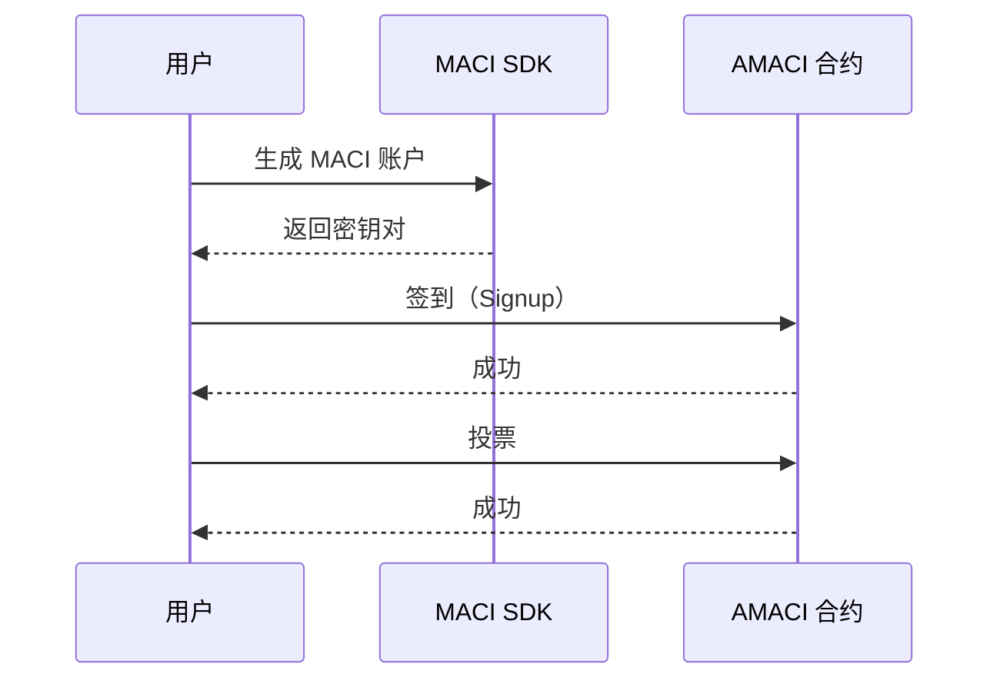
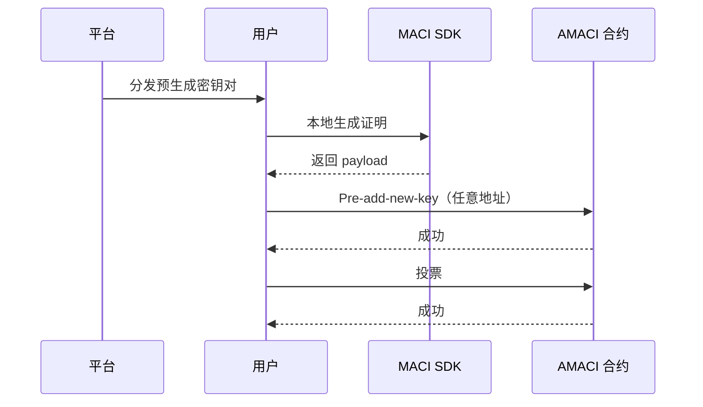

# 投票操作指南

MACI 支持两种投票方式：白名单模式和 Pre-add-new-key 匿名模式。白名单模式简单直接，适合公开投票；匿名模式提供最强隐私保护，适合敏感投票场景。

## 白名单模式

适用于已在白名单中的用户，流程简单快速。

### 流程概览



### 生成 MACI 账户

```typescript
import { MaciClient } from '@dorafactory/maci-sdk';

const client = new MaciClient({ network: 'testnet' });

const maciKeypair = await client.genKeypairFromSign({
  signer: wallet,
  address
});
```

### 签到（仅白名单地址可用）

```typescript
await client.signup({
  signer: wallet,
  address: userAddress,
  contractAddress: amaciContractAddress,
  maciKeypair: maciKeypair
});
```

### 投票

```typescript
const roundInfo = await client.getRoundInfo({ contractAddress });

const coordinatorPubKey = [
  BigInt(roundInfo.coordinatorPubkeyX),
  BigInt(roundInfo.coordinatorPubkeyY)
];

await client.vote({
  signer: wallet,
  address: userAddress,
  contractAddress: amaciContractAddress,
  selectedOptions: [
    { idx: 0, vc: 5 },
    { idx: 1, vc: 3 }
  ],
  operatorCoordPubKey: coordinatorPubKey,
  maciKeypair: maciKeypair
});
```

## Pre-add-new-key 匿名模式

适用于获得平台分发密钥对的用户，提供最高隐私级别。Operator 无法确定投票者身份。

### 流程概览



### 获取平台分发的密钥对

平台通过安全渠道分发：

```json
{
  "privateKey": "0x1234567890abcdef...",
  "publicKey": {
    "x": "0xabcdef...",
    "y": "0x123456..."
  },
  "preDeactivateData": {
    "leaves": [ /* deactivate tree 数据 */ ],
    "coordinatorPubkey": { "x": "...", "y": "..." }
  }
}
```

### 本地生成证明和新密钥

```typescript
import { VoterClient, genKeypair } from '@dorafactory/maci-sdk';

const voterClient = new VoterClient({
  network: 'mainnet',
  secretKey: receivedPrivateKey
});

const myNewKeypair = genKeypair();

const payload = await voterClient.buildPreAddNewKeyPayload({
  stateTreeDepth: 10,
  coordinatorPubkey: preDeactivateData.coordinatorPubkey,
  deactivates: preDeactivateData.leaves,
  wasmFile: '/path/to/addNewKey.wasm',
  zkeyFile: '/path/to/addNewKey.zkey'
});
```

### 发送 Pre-add-new-key 交易

```typescript
await client.rawPreAddNewKey({
  signer: anyWallet,
  contractAddress,
  d: payload.d,
  proof: payload.proof,
  nullifier: payload.nullifier,
  newPubkey: {
    x: myNewKeypair.publicKey[0].toString(16),
    y: myNewKeypair.publicKey[1].toString(16)
  }
});
```

### 投票

```typescript
const roundInfo = await client.getRoundInfo({ contractAddress });

await client.vote({
  signer: anyWallet,
  address: anyAddress,
  contractAddress,
  selectedOptions: [
    { idx: 0, vc: 8 },
    { idx: 1, vc: 6 }
  ],
  operatorCoordPubKey: [
    BigInt(roundInfo.coordinatorPubkeyX),
    BigInt(roundInfo.coordinatorPubkeyY)
  ],
  maciKeypair: myNewKeypair
});
```

## 投票规则

### 1P1V 模式

voice credit 直接对应票数：

```typescript
// 假设用户有 100 voice credits
selectedOptions: [
  { idx: 0, vc: 50 },  // 50 票
  { idx: 1, vc: 30 },  // 30 票
  { idx: 2, vc: 20 }   // 20 票
]
// 总消耗 = 50 + 30 + 20 = 100
```

### QV（二次方投票）模式

voice credit 的平方作为消耗：

```typescript
// 假设用户有 100 voice credits
selectedOptions: [
  { idx: 0, vc: 8 },  // 8 票，消耗 64 credits (8²)
  { idx: 1, vc: 6 }   // 6 票，消耗 36 credits (6²)
]
// 总消耗 = 64 + 36 = 100
```

## 重新投票

用户可以多次投票，后面的投票会覆盖前面的：

```typescript
// 第一次投票
await client.vote({
  selectedOptions: [{ idx: 0, vc: 5 }],
  // ...
});

// 改变主意，重新投票
await client.vote({
  selectedOptions: [{ idx: 1, vc: 5 }],
  // ...
});
// 最终只有第二次投票（选项 1）有效
```

## 完整示例函数

### 白名单模式

```typescript
async function whitelistVoting(
  client: MaciClient,
  wallet: any,
  address: string,
  contractAddress: string,
  voteOptions: { idx: number; vc: number }[]
) {
  try {
    const maciKeypair = await client.genKeypairFromSign({ 
      signer: wallet, 
      address 
    });
    
    await client.signup({
      signer: wallet,
      address,
      contractAddress,
      maciKeypair
    });
    
    const roundInfo = await client.getRoundInfo({ contractAddress });
    
    await client.vote({
      signer: wallet,
      address,
      contractAddress,
      selectedOptions: voteOptions,
      operatorCoordPubKey: [
        BigInt(roundInfo.coordinatorPubkeyX),
        BigInt(roundInfo.coordinatorPubkeyY)
      ],
      maciKeypair
    });
    
    return true;
  } catch (error) {
    console.error('Voting failed:', error);
    return false;
  }
}
```

### Pre-add-new-key 匿名模式

```typescript
async function anonymousVoting(
  client: MaciClient,
  receivedPrivateKey: string,
  preDeactivateData: any,
  anyWallet: any,
  anyAddress: string,
  contractAddress: string,
  voteOptions: { idx: number; vc: number }[]
) {
  try {
    const voterClient = new VoterClient({
      network: 'mainnet',
      secretKey: receivedPrivateKey
    });
    
    const myNewKeypair = genKeypair();
    
    const payload = await voterClient.buildPreAddNewKeyPayload({
      stateTreeDepth: 10,
      coordinatorPubkey: preDeactivateData.coordinatorPubkey,
      deactivates: preDeactivateData.leaves,
      wasmFile,
      zkeyFile
    });
    
    await client.rawPreAddNewKey({
      signer: anyWallet,
      contractAddress,
      d: payload.d,
      proof: payload.proof,
      nullifier: payload.nullifier,
      newPubkey: {
        x: myNewKeypair.publicKey[0].toString(16),
        y: myNewKeypair.publicKey[1].toString(16)
      }
    });
    
    const roundInfo = await client.getRoundInfo({ contractAddress });
    
    await client.vote({
      signer: anyWallet,
      address: anyAddress,
      contractAddress,
      selectedOptions: voteOptions,
      operatorCoordPubKey: [
        BigInt(roundInfo.coordinatorPubkeyX),
        BigInt(roundInfo.coordinatorPubkeyY)
      ],
      maciKeypair: myNewKeypair
    });
    
    return true;
  } catch (error) {
    console.error('Anonymous voting failed:', error);
    return false;
  }
}
```

## 常见问题

**如何计算我能投多少票？**

取决于投票模式和您的 voice credits：

```typescript
// 1P1V 模式
const maxVotes = voiceCredits;  // 100 credits = 100 票

// QV 模式  
const maxVotes = Math.floor(Math.sqrt(voiceCredits));  // 100 credits = 10 票
```

**白名单模式和匿名模式如何选择？**

根据隐私需求：
- **白名单模式**：简单快速，但 Operator 知道你的身份
- **匿名模式**：完全匿名，Operator 不知道具体是谁，推荐用于隐私投票

**投票失败了怎么办？**

检查以下几点：
1. 是否在投票期内
2. 白名单模式：地址是否在白名单中
3. 匿名模式：是否有平台分发的密钥
4. voice credits 是否足够

**可以同时投给多个选项吗？**

可以，在 `selectedOptions` 数组中添加多个选项：

```typescript
selectedOptions: [
  { idx: 0, vc: 5 },
  { idx: 1, vc: 3 },
  { idx: 2, vc: 2 }
]
```

**如何撤销投票？**

重新投票并将所有权重设为 0，或投给其他选项。

## 隐私级别对比

| 模式 | Operator 知道身份 | 链上追踪难度 | 隐私级别 | 适用场景 |
|------|----------------|------------|---------|---------|
| 白名单 Signup | 是 | 容易 | 低 | 简单投票 |
| Pre-add-new-key | 否 | 极难 | 最高 | 匿名投票 |

## 相关文档

- [查询 API](/docs/sdk/query-api) - 查询投票信息和结果
- [完整示例](/docs/examples/basic-voting) - 查看实际应用代码
- [高级功能](/docs/sdk/advanced) - 探索更多 SDK 功能
