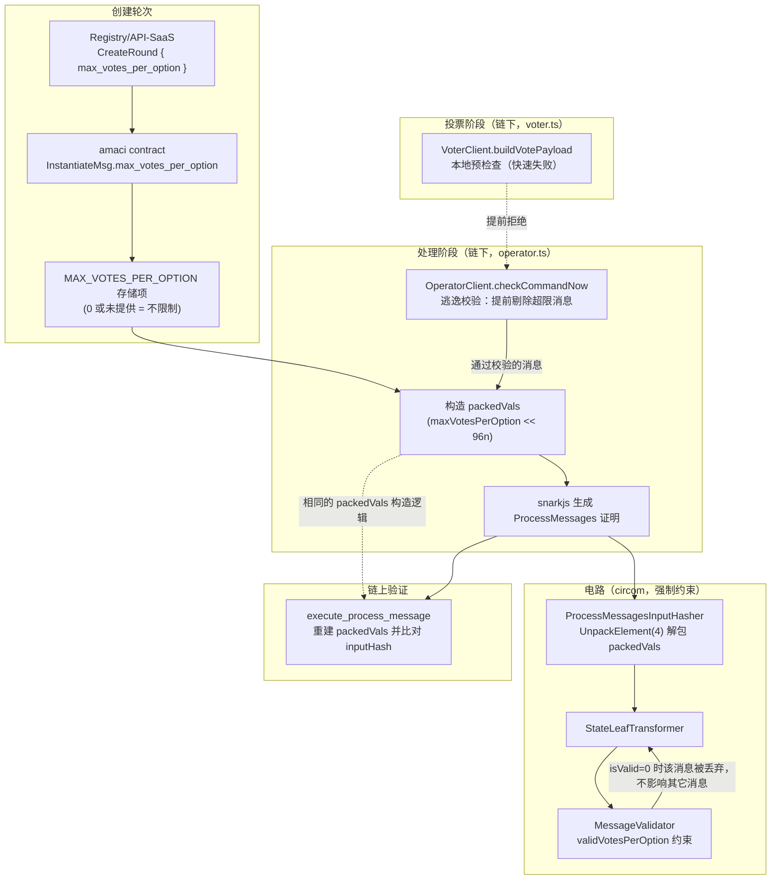

# AMACI max_votes_per_option 完整技术解析

## 目录

1. [概述](#1-概述)
2. [设计动机：为什么需要单选项投票上限](#2-设计动机为什么需要单选项投票上限)
3. [整体架构：电路 / SDK / 合约三层协同](#3-整体架构电路--sdk--合约三层协同)
4. [packedVals 打包原理](#4-packedvals-打包原理)
5. [电路层实现详解](#5-电路层实现详解)
6. [合约层实现详解](#6-合约层实现详解)
7. [SDK 层实现详解](#7-sdk-层实现详解)
8. [端到端流程示例](#8-端到端流程示例)
9. [边界场景与测试覆盖](#9-边界场景与测试覆盖)
10. [安全性分析](#10-安全性分析)
11. [已知限制与后续工作](#11-已知限制与后续工作)
12. [相关资源](#12-相关资源)

---

## 1. 概述

`max_votes_per_option` 是 AMACI（Anonymous MACI）协议的一项新增约束：**允许一轮投票在创建时设定一个"单个选项最多能投多少票权重"的硬上限**，并由零知识电路强制保证——不管协调者（operator）诚实与否，任何超过这个上限的投票都无法生成一个能通过链上验证的合法证明。

一句话概括它的作用：

> 在同一轮投票里，任何一个用户对**单个选项**的投票权重（`voteWeight` / 二次投票下是"票数"，线性投票下是"信用消耗"）都不能超过轮次配置的 `max_votes_per_option`。设为 `0` 表示不限制（向后兼容旧行为）。

这个约束是在 `messageValidator` 电路（AMACI/power 版本）里新增的一条验证项，覆盖了 amaci 电路家族里所有和消息处理相关的模板：`messageValidator.circom`、`stateLeafTransformer.circom`、`processMessages.circom`，并沿着 **合约 → SDK → 电路** 的链路把这个参数一路传递、打包、解包、比对。

---

## 2. 设计动机：为什么需要单选项投票上限

MACI/AMACI 默认支持两种成本模型：

- **线性成本（1P1V 变体）**：`cost = voteWeight`，用户的语音信用（voice credit）消耗与投票权重 1:1。
- **二次成本（Quadratic Voting）**：`cost = voteWeight²`，边际成本递增，理论上能抑制"把全部信用堵在一个选项上"的行为，但依然存在两个现实问题：

1. **线性模式下完全没有天然的分散约束**——单个大户可以把全部语音信用一次性砸在一个选项上，对多选项场景（比如同时对 5 个提案投票）会造成结果被少数人的极端权重主导。
2. **二次成本只是"惩罚"而不是"禁止"**——只要信用额度给得足够高，仍然可以把权重集中到一个选项，只是成本更高，不能从协议层面**硬性**杜绝。

`max_votes_per_option` 提供的是一种**协议层硬约束**（hard cap），而不是经济博弈层面的软性抑制：轮次发起方可以直接规定"每个选项最多 N 票"，无论用户信用有多少、无论线性还是二次成本，超过 N 的投票在电路层就是无效消息，会被电路悄悄丢弃（不会导致整批证明失败，只是这一条消息不生效，与 nonce 错误、签名错误的处理方式完全一致）。

典型应用场景：

- 多提案资金分配投票，防止单个提案被少数巨鲸的权重"买断"。
- 排名类投票，希望投票权重更均匀地分布在多个选项上。
- 需要在线性成本模式下也具备"反集中"能力的场景（二次成本机制在这类场景不适用或不够用）。

---

## 3. 整体架构：电路 / SDK / 合约三层协同

`max_votes_per_option` 贯穿三层，每一层各自负责不同的职责：



**关键设计原则：链下（SDK）的检查只是"体验优化"，链上（电路+合约）的检查才是"安全边界"。**

- SDK 里的 `checkCommandNow`（operator 侧）和 `buildVotePayload`（voter 侧）校验，只是为了让无效投票**尽早**被发现、给出清晰的错误提示，避免浪费一次链上交易或者让用户误以为投票生效。
- 真正防止恶意/被入侵的 operator 生成"超限但通过验证"的证明的，是电路里的 `validVotesPerOption` 约束——这是 zk-SNARK 电路的算术约束，数学上无法被绕过（除非能破解 Groth16 或者拿到旧 vkey 对应的 toxic waste，这属于完全不同级别的攻击）。

---

## 4. packedVals 打包原理

AMACI 的 `ProcessMessages` 电路只有一个公共输入 `inputHash`，其余所有真正的参数都作为**私有输入**传入，然后在电路内部重新计算 SHA256 哈希并与 `inputHash` 做等式约束（`hasher.hash === inputHash`）。这样做是为了省 gas：链上只需要传一个哈希值，而不是把 4~8 个字段都当作独立的公共输入（每个公共输入都会显著增加链上验证成本）。

其中，4 个 32 位整数字段（`maxVoteOptions`、`numSignUps`、`isQuadraticCost`、`maxVotesPerOption`）被压缩进**一个** 253 位的域元素 `packedVals`，节省了 3 个哈希输入槽位。这次改动前，`packedVals` 只打包 3 个字段（`maxVoteOptions`、`numSignUps`、`isQuadraticCost`），这次把 `maxVotesPerOption` 加成了第 4 个 32 位槽。

### 4.1 位布局（低位到高位）

```
                     bit 127          bit 96 bit 95         bit 64 bit 63          bit 32 bit 31            bit 0
                        │                │      │               │      │               │      │               │
                        ▼                ▼      ▼               ▼      ▼               ▼      ▼               ▼
packedVals = ┌──────────────────────────────┬──────────────────────────┬──────────────────────────┬──────────────────────────┐
             │      maxVotesPerOption       │      isQuadraticCost     │        numSignUps        │      maxVoteOptions      │
             │          (32 bits)           │         (32 bits)        │         (32 bits)         │         (32 bits)        │
             └──────────────────────────────┴──────────────────────────┴──────────────────────────┴──────────────────────────┘
                    第 4 槽（新增）              第 3 槽                     第 2 槽                     第 1 槽
```

数值上等价于：

```
packedVals = maxVoteOptions
            + (numSignUps        << 32)
            + (isQuadraticCost   << 64)
            + (maxVotesPerOption << 96)
```

选择"第 4 个槽（bits 96-127）"而不是插在中间，是为了让**旧的三槎打包逻辑保持字节级兼容**：当 `maxVotesPerOption = 0`（哨兵值，代表"不限制"）时，`0 << 96 = 0`，`packedVals` 的数值与改动前完全一样。这意味着：

- 所有历史生成的、`maxVotesPerOption` 不存在概念的轮次，其 `packedVals` 数值不受影响。
- `0` 被选作"无限制"的哨兵值也是安全的——因为 `maxVotesPerOption = 0` 如果被按字面意义理解为"上限是 0 票"，会导致所有非零投票都失败，这在实际场景中毫无意义，因此可以安全地复用 `0` 来表示"关闭这项约束"。

> 需要特别注意：**这只是数值层面兼容，不是电路层面兼容**。哪怕 `maxVotesPerOption` 恒为 `0`，新旧两版 `messageValidator.circom`/`processMessages.circom` 编译出的 R1CS 约束系统（电路"形状"）依然不同（多了 `IsZero`/`LessEqThan`/`Mux1` 相关的约束），因此新旧电路各自对应的 zkey/vkey **不能混用**。这一点在下文[第 11 节](#11-已知限制与后续工作)会详细说明。

---

## 5. 电路层实现详解

改动集中在 amaci power 版本的三个模板文件：

```
packages/circuits/circom/amaci/power/messageValidator.circom      -- 核心约束
packages/circuits/circom/amaci/power/stateLeafTransformer.circom  -- 信号传递
packages/circuits/circom/amaci/power/processMessages.circom       -- 解包 + 批量转发
```

### 5.1 MessageValidator：核心约束 `validVotesPerOption`

`MessageValidator` 电路本来就有 7 项验证（状态索引、选项索引、nonce、pollId、签名、投票权重范围、语音信用余额），这次新增了**第 8 项**：

```circom
// packages/circuits/circom/amaci/power/messageValidator.circom
// g) Per-option vote weight cap. 0 is a sentinel meaning "no limit"
// (a cap of 0 would forbid all votes, so 0 is safe to repurpose).
signal input maxVotesPerOption;

// Per-option cap check: valid when maxVotesPerOption == 0 (unlimited)
// or voteWeight <= maxVotesPerOption. Bit width 252 matches
// validVoteWeight above, since voteWeight may be up to ~2^127.
component capUnlimited = IsZero();
capUnlimited.in <== maxVotesPerOption;

component withinCap = LessEqThan(252);
withinCap.in[0] <== voteWeight;
withinCap.in[1] <== maxVotesPerOption;

// OR(capUnlimited, withinCap); both signals are boolean
signal validVotesPerOption;
validVotesPerOption <== capUnlimited.out + withinCap.out - capUnlimited.out * withinCap.out;
```

这段逻辑本质上是一个布尔"或"运算：

```
validVotesPerOption = capUnlimited.out OR withinCap.out
                     = capUnlimited.out + withinCap.out - capUnlimited.out * withinCap.out
```

之所以不能直接写 `a + b`（在算术电路里 0/1 相加可能得到 2，不是合法的布尔值），而要用 `a + b - a*b`，是因为这是布尔代数里标准的"OR 门"算术展开式，能保证：

| `capUnlimited.out` | `withinCap.out` | `a + b - a*b` |
|---|---|---|
| 0 | 0 | 0 |
| 0 | 1 | 1 |
| 1 | 0 | 1 |
| 1 | 1 | 1 |

即只要"没有设上限"或者"权重没有超过上限"任一条件成立，`validVotesPerOption` 就是 1。

最终，`validUpdate` 的判定条件从"7 项之和 == 7"变成了"8 项之和 == 8"：

```circom
component validUpdate = IsEqual();
validUpdate.in[0] <== 8;
validUpdate.in[1] <== validSignature.valid +
                      sufficientVoiceCredits.out +
                      validVoteWeight.out +
                      validNonce.out +
                      validStateLeafIndex.out +
                      validVoteOptionIndex.out +
                      validPollId.out +
                      validVotesPerOption;
signal output isValid;
isValid <== validUpdate.out;
```

任何一项失败（包括新增的 `validVotesPerOption`），`isValid` 就会变成 0，这条消息在 `StateLeafTransformer`/`ProcessOne` 里会被当成"无效消息"处理——**状态树不会更新，票也不会被计入**，但不会导致整批证明失败（这是 MACI/AMACI 一贯的容错设计：无效消息静默失效，而不是让整个批次报错）。

#### 为什么用 `voteWeight <= maxVotesPerOption` 而不是"消耗后的成本"？

这里比较的是 `voteWeight`（投票权重本身），**不是**语音信用成本（二次模式下是 `voteWeight²`）。也就是说：

- 线性模式：`voteWeight` 直接就是这次投的"票数"，与上限直接比较，语义清晰。
- 二次模式：上限依然作用在 `voteWeight` 上，而不是 `voteWeight²` 上——因为"最多投 N 票"这个语义在两种成本模式下应该是一致的，用户理解的"上限"是票数/权重本身，不应该因为成本模型不同而改变含义。

### 5.2 StateLeafTransformer：把参数一路传下去

`StateLeafTransformer` 本身不做任何新的判断，只是新增一个输入信号 `maxVotesPerOption`，转发给内部的 `MessageValidator` 子组件：

```circom
// packages/circuits/circom/amaci/power/stateLeafTransformer.circom
signal input numSignUps;
signal input maxVoteOptions;
signal input maxVotesPerOption;
...
component messageValidator = MessageValidator();
messageValidator.stateTreeIndex <== cmdStateIndex;
messageValidator.numSignUps <== numSignUps;
messageValidator.voteOptionIndex <== cmdVoteOptionIndex;
messageValidator.maxVoteOptions <== maxVoteOptions;
messageValidator.maxVotesPerOption <== maxVotesPerOption;
```

需要留意的是，`StateLeafTransformer` 里还有一段**跟 `max_votes_per_option` 无关但共用同一个 `isValid` 判定**的逻辑——ElGamal 停用状态检测：

```circom
component valid = IsEqual();
valid.in[0] <== 3;
valid.in[1] <== 1 - decryptIsActive.isOdd +
                activate.out +
                messageValidator.isValid;
```

也就是说，一条消息要真正生效，必须同时满足：**用户当前处于激活状态**（未被 deactivate）**且** `messageValidator.isValid == 1`（这里面已经包含了新的投票上限约束）。这两套约束是完全独立、正交的——`max_votes_per_option` 不会影响停用检测的逻辑，反之亦然。

### 5.3 ProcessMessages：解包与批量转发

`ProcessMessages` 是整个批处理电路的顶层模板，改动主要是把 `packedVals` 解包槎位从 3 个扩展到 4 个：

```circom
// packages/circuits/circom/amaci/power/processMessages.circom
// Verify "public" inputs and assign unpacked values
component inputHasher = ProcessMessagesInputHasher();
inputHasher.packedVals <== packedVals;
...
// The unpacked values from packedVals
inputHasher.isQuadraticCost ==> isQuadraticCost;
inputHasher.maxVoteOptions  ==> maxVoteOptions;
inputHasher.numSignUps      ==> numSignUps;
inputHasher.maxVotesPerOption ==> maxVotesPerOption;

inputHasher.hash === inputHash;
```

真正做解包工作的是 `ProcessMessagesInputHasher` 子模板，它调用了通用工具组件 `UnpackElement(4)`：

```circom
// 1. Unpack packedVals and ensure that it is valid.
// Layout (32-bit slots, low to high):
//   bits 0-31: maxVoteOptions, bits 32-63: numSignUps,
//   bits 64-95: isQuadraticCost, bits 96-127: maxVotesPerOption
component unpack = UnpackElement(4);
unpack.in <== packedVals;

maxVoteOptions    <== unpack.out[3];   // 最低 32 位（bits 0-31）
numSignUps        <== unpack.out[2];   // bits 32-63
isQuadraticCost   <== unpack.out[1];   // bits 64-95
maxVotesPerOption <== unpack.out[0];   // 最高 32 位（bits 96-127）
```

`UnpackElement(n)`（定义在 `packages/circuits/circom/utils/unpackElement.circom`）的工作原理很直接：先用 `Num2Bits_strict()` 把输入域元素转换成 253 个比特位，再按 32 位一组切片、用 `Bits2Num(32)` 转回整数。它的输出索引顺序是"**从高位槎到低位槎**"（`out[0]` 对应最高的 32 位槎），这也是为什么代码里 `maxVotesPerOption`（第 4 槎，最高位）对应 `unpack.out[0]`，而 `maxVoteOptions`（第 1 槎，最低位）对应 `unpack.out[3]`。

之前电路用的是 `UnpackElement(3)`（三槎），这次改成 `UnpackElement(4)`——这正是为什么"哪怕 `maxVotesPerOption=0`"新旧电路的 R1CS 也不同：`UnpackElement(3)` 和 `UnpackElement(4)` 是两个不同的子电路实例，各自的约束数量、乘法门数量都不一样。

解包之后，`maxVotesPerOption` 这个信号会被**原样转发**给每一条消息对应的 `ProcessOne` 子电路实例，再由 `ProcessOne` 转发给 `StateLeafTransformer`：

```circom
component processors[batchSize];
for (var i = batchSize - 1; i >= 0; i--) {
    processors[i] = ProcessOne(stateTreeDepth, voteOptionTreeDepth);
    ...
    processors[i].maxVotesPerOption <== maxVotesPerOption;
    ...
}
```

也就是说，**同一批次内的所有消息共享同一个 `maxVotesPerOption` 值**——这符合预期，因为这是"整轮投票"级别的配置，不是逐条消息可以自定义的参数。

---

## 6. 合约层实现详解

合约层的改动分布在三个 CosmWasm 合约：`amaci`（核心投票合约）、`registry`（轮次注册/路由）、`api-saas`（面向 SaaS 客户的封装层）。三者的改动模式一致：**在消息结构里新增一个可选字段，逐层透传，最终落到 `amaci` 合约的存储和电路输入构造里**。

### 6.1 消息结构与向后兼容

```rust
// contracts/amaci/src/msg.rs
pub struct InstantiateMsg {
    ...
    // Per-option vote weight cap enforced by the process circuit.
    // None or 0 = no limit (legacy behavior). Must fit in 32 bits
    // (packedVals slot width). serde(default) keeps old JSON payloads valid.
    #[serde(default)]
    pub max_votes_per_option: Option<Uint256>,
    ...
}
```

`registry`/`api-saas` 的 `CreateRound`/`CreateAmaciRound` 消息也用同样的模式声明了这个字段（同样带 `#[serde(default)]`），并在各自的 `execute_create_round`/`execute_create_amaci_round` 里原样转发给下一层，最终传到 `amaci` 合约的 `InstantiateMsg`。

`#[serde(default)]` 在这里不是可选的装饰——serde 反序列化 struct 时，默认要求**每个字段的 key 都必须出现在输入 JSON 里**，哪怕字段类型是 `Option<T>` 也一样；缺了这个属性，任何不携带 `max_votes_per_option` 字段的旧版调用（老版本 SDK/CLI/前端）都会直接反序列化失败。加上它之后，缺省的字段会被 `Default::default()`（对 `Option<Uint256>` 就是 `None`）填充，从而保证旧客户端依然可用。

### 6.2 存储与初始化校验

```rust
// contracts/amaci/src/state.rs
pub const MAX_VOTES_PER_OPTION: Item<Uint256> = Item::new("max_votes_per_option");
```

```rust
// contracts/amaci/src/contract.rs — instantiate()
// Per-option vote weight cap (0 = no limit). Must fit in the 32-bit
// packedVals slot consumed by the process circuit.
let max_votes_per_option = msg.max_votes_per_option.unwrap_or(Uint256::zero());
if max_votes_per_option >= Uint256::from_u128(1u128 << 32) {
    return Err(ContractError::MaxVotesPerOptionExceeded {
        current: max_votes_per_option,
    });
}
MAX_VOTES_PER_OPTION.save(deps.storage, &max_votes_per_option)?;
```

这里的边界校验（`>= 2^32` 就拒绝）是**必须的**——因为 `packedVals` 里给 `maxVotesPerOption` 分配的槎位只有 32 位宽，如果轮次创建时允许写入一个超过 32 位的值，链上构造 `packedVals` 时就会跟其它槎位的数据"溢出重叠"，破坏整个打包结构，进而导致 `inputHash` 永远无法与电路里重新计算出的哈希匹配（电路会拒绝所有证明，等价于这一轮彻底瘫痕）。所以必须在**创建轮次时**就拒绝非法配置，而不是等到处理消息阶段才发现问题。

对应的错误类型：

```rust
// contracts/amaci/src/error.rs
#[error("max_votes_per_option must fit in 32 bits, current value is {current}.")]
MaxVotesPerOptionExceeded { current: Uint256 },
```

### 6.3 packedVals 的链上构造

在处理消息阶段（`execute_process_message`），合约需要重新构造与电路里完全一致的 `packedVals`，作为公共输入的一部分传给链上 Groth16 验证器：

```rust
// contracts/amaci/src/contract.rs
let max_votes_per_option = MAX_VOTES_PER_OPTION
    .may_load(deps.storage)?
    .unwrap_or(Uint256::zero());

let circuit_type = CIRCUITTYPE.load(deps.storage)?;
// packedVals layout (32-bit slots, low to high):
//   bits 0-31: maxVoteOptions, bits 32-63: numSignUps,
//   bits 64-95: isQuadraticCost, bits 96-127: maxVotesPerOption
// circuit_type is 0 (1p1v) or 1 (qv), so shifting it directly is safe.
input[0] = (max_votes_per_option << 96)
    + (circuit_type << 64)
    + (num_sign_ups << 32)
    + max_vote_options;
```

这段代码和电路里 `ProcessMessagesInputHasher` 解包时假设的位布局必须**逐比特对应**——任何一边的槎位顺序或位宽写错，都会导致链上重算出的 `packedVals`（进而是 `inputHash`）与 operator 生成证明时用的值不一致，验证直接失败。这也是为什么本次改动特意选在"最高位新增一个槎"而不是打乱已有布局：只需要在现有打包公式上加一项 `(max_votes_per_option << 96)`，其余三项完全不用动。

### 6.4 查询接口

新增了一个只读查询，方便前端/SDK 在提交投票前先拿到当前轮次的上限配置：

```rust
// contracts/amaci/src/msg.rs
#[returns(Uint256)]
MaxVotesPerOption {},
```

```rust
// contracts/amaci/src/contract.rs — query()
QueryMsg::MaxVotesPerOption {} => to_json_binary::<Uint256>(
    &MAX_VOTES_PER_OPTION
        .may_load(deps.storage)?
        .unwrap_or_default(),
),
```

---

## 7. SDK 层实现详解

SDK（`@dorafactory/maci-sdk`）分两个角色使用这个字段：`OperatorClient`（协调者，负责生成证明）和 `VoterClient`（投票人，负责构造和加密投票消息）。

### 7.1 Operator：初始化配置与"提交阶段"双重校验

轮次初始化时传入 `maxVotesPerOption`，SDK 会做和电路一致的边界检查、以及"是否只在 AMACI 模式下生效"的检查：

```typescript
// packages/sdk/src/operator.ts
initRound({
    stateTreeDepth,
    intStateTreeDepth,
    voteOptionTreeDepth,
    batchSize,
    maxVoteOptions,
    maxVotesPerOption = 0n,
    pollId,
    isQuadraticCost = false,
    isAmaci = false,
    derivePathParams
}: {
    ...
    maxVotesPerOption?: bigint | number; // Per-option cap, 0 = no limit
    ...
}) {
    ...
    this.maxVotesPerOption = BigInt(maxVotesPerOption);
    if (this.maxVotesPerOption < 0n || this.maxVotesPerOption >= 1n << 32n) {
        throw new Error('maxVotesPerOption must fit in 32 bits (0 = no limit)');
    }
    if (!isAmaci && this.maxVotesPerOption > 0n) {
        // Only the AMACI process circuit enforces the per-option cap
        throw new Error('maxVotesPerOption is only supported in AMACI mode');
    }
    ...
}
```

> 注意最后一个检查：`max_votes_per_option` 目前**只在 AMACI（匿名 MACI）电路家族里实现**，普通 MACI（`maci/power` 目录下的电路）没有做这个改动，因此如果 `isAmaci = false` 却传了非零的上限，SDK 会直接抛错，避免用户以为设置生效了，实际却完全没有约束力。

在真正生成 `ProcessMessages` 证明前，SDK 会用 `checkCommandNow` 对每一条消息做本地校验——这一步跟电路的判断逻辑必须保持镜像一致：

```typescript
// packages/sdk/src/operator.ts
// Per-option cap (0n = no limit). Must mirror the circuit's
// validVotesPerOption constraint exactly.
if (this.maxVotesPerOption > 0n && cmd.newVotes > this.maxVotesPerOption) {
    return 'votes per option overflow';
}
```

被判定为无效的消息，会走跟"nonce 错误"、"签名错误"完全一样的路径——**不会导致整批证明生成失败**，而是被当成空消息处理（不更新状态、不消耗信用、但仍然占用批次里的一个消息槎位）。这跟电路里 `messageValidator.isValid = 0` 时的静默失效行为是完全对齐的，保证了 SDK 生成的证明输入和电路的判定结果永远一致（否则会出现"SDK 认为有效但电路认为无效"的不一致，导致 witness 计算失败）。

最后，`packedVals` 的构造方式和合约里的 Rust 代码一一对应：

```typescript
// packages/sdk/src/operator.ts
const packedVals =
    BigInt(this.maxVoteOptions!) +
    (BigInt(this.numSignUps!) << 32n) +
    (this.isQuadraticCost ? 1n << 64n : 0n) +
    (this.maxVotesPerOption << 96n);
```

### 7.2 Voter：客户端预检查（快速失败）

投票人一侧，`VoterClient.buildVotePayload` 支持传入当前轮次的 `maxVotesPerOption`（一般是先用 `MaxVotesPerOption {}` 查询接口拿到再传进来），在**签名之前**就做检查，避免用户在钱包里签了一笔注定会被电路悄悄丢弃的无效投票：

```typescript
// packages/sdk/src/voter.ts
buildVotePayload({
    stateIdx,
    operatorPubkey,
    selectedOptions,
    pollId,
    maxVotesPerOption,
    derivePathParams
}: {
    ...
    /**
     * Optional per-option vote weight cap (round's max_votes_per_option).
     * When provided (> 0), votes exceeding the cap fail fast here instead of
     * being silently invalidated by the circuit during processing.
     */
    maxVotesPerOption?: bigint | number;
    ...
}) {
    if (maxVotesPerOption !== undefined && BigInt(maxVotesPerOption) > 0n) {
        const cap = BigInt(maxVotesPerOption);
        for (const option of selectedOptions) {
            if (BigInt(option.vc) > cap) {
                throw new Error(
                    `Vote weight ${option.vc} for option ${option.idx} exceeds max votes per option (${cap})`
                );
            }
        }
    }
    ...
}
```

这个参数是**可选**的：不传就完全不做检查，投票消息照常被构造、签名、加密、提交；如果超限，最终会在 operator 处理消息时被 `checkCommandNow` 拦截（本地）或者被电路拒绝（链上强制），只是用户体验上"晚一步才发现"。

---

## 8. 端到端流程示例

假设某轮投票配置为：`maxVoteOptions = 5`（5 个选项）、`isQuadraticCost = false`（线性成本）、`maxVotesPerOption = 100`（每个选项最多投 100 票权重）。

### 8.1 轮次创建

```typescript
// 创建轮次时（Registry / API-SaaS 层）
await registryClient.createRound({
  // ...其它参数
  maxVotesPerOption: 100
});
```

Registry 合约把 `max_votes_per_option: Some(Uint256::from(100u128))` 转发给 `amaci` 合约的 `InstantiateMsg`；`amaci` 合约的 `instantiate()` 校验通过（`100 < 2^32`），把 `100` 存进 `MAX_VOTES_PER_OPTION`。

### 8.2 Operator 初始化本地状态机

```typescript
operator.initRound({
  stateTreeDepth: 2,
  intStateTreeDepth: 1,
  voteOptionTreeDepth: 1,
  batchSize: 5,
  maxVoteOptions: 5,
  maxVotesPerOption: 100n,
  pollId: 1,
  isQuadraticCost: false,
  isAmaci: true
});
```

### 8.3 三个用户的投票消息

| 用户 | 选项 | 投票权重 | 结果 |
|---|---|---|---|
| Alice | 选项 2 | 60 | ✅ 有效（60 ≤ 100） |
| Bob | 选项 2 | 100 | ✅ 有效（恰好等于上限） |
| Charlie | 选项 2 | 101 | ❌ 无效（101 > 100，超出 1） |

Charlie 的投票消息在链上依然会被提交（信息公开的消息本身不会被拒绝，这是 MACI 匿名性设计的一部分——协调者不能提前"筛掉"某条消息，否则会泄露谁投了不合规的票），但在 operator 处理这批消息生成证明时：

```typescript
// operator.ts 内部（checkCommandNow）
if (this.maxVotesPerOption > 0n && cmd.newVotes > this.maxVotesPerOption) {
  return 'votes per option overflow'; // Charlie 的消息被标记为无效
}
```

对应到电路侧，`MessageValidator` 里：

```
capUnlimited.out = IsZero(100) = 0        // 上限不是 0，即"有限制"
withinCap.out    = LessEqThan(101, 100) = 0  // 101 > 100，不满足
validVotesPerOption = 0 + 0 - 0*0 = 0     // 无效
```

`validUpdate.in[1]` 的 8 项之和里少了 1（`validVotesPerOption = 0`），总和 = 7 ≠ 8，`isValid = 0`——Charlie 这条消息**不会更新状态树、不会消耗语音信用、也不会计入选项 2 的最终票数**，但同一批次里 Alice、Bob 的消息完全不受影响，各自正常生效。

### 8.4 最终 tally 结果

选项 2 的最终票数 = Alice(60) + Bob(100) = **160**，Charlie 的 101 票权重被电路静默拒绝，不计入总数。

---

## 9. 边界场景与测试覆盖

这些场景均已在电路单测里覆盖并通过验证（详见 `packages/circuits/ts/__tests__/`）：

| 场景 | 覆盖文件 | 预期结果 |
|---|---|---|
| `maxVotesPerOption = 0`（哨兵值，不限制） | `MessageValidatorAmaci.test.ts` / `StateLeafTransformerAmaci.test.ts` | 任意权重的合法投票都通过 |
| 投票权重恰好等于上限 | 同上 | 通过（`<=` 而非 `<`） |
| 投票权重超出上限 1 | 同上 | `isValid = 0`，静默失效 |
| 二次成本模式下，权重超限但信用余额充足 | 同上 | 依然被拒绝——上限约束独立于余额是否充足 |
| 二次成本模式下，权重恰好等于上限 | 同上 | 通过 |
| 权重为 0（撤票），上限非零 | `MessageValidatorAmaci.test.ts` | 通过（0 总是 ≤ 任意正数上限） |
| 上限取 32 位最大值 `2^32 - 1` | 同上 | 通过，验证边界不溢出 |
| 上限约束与 nonce 错误同时失败 | 同上 | 两项都记为失败，`isValid` 依然是 0（不会"抵消"） |
| ElGamal 停用状态 + 上限约束组合 | `StateLeafTransformerAmaci.test.ts` | 两套独立约束正确地同时生效（AND 关系） |
| 批次内多条消息各自独立判定 | `ProcessMessagesAmaciMaxVotesPerOption.test.ts` | 超限消息不影响同批次其它合法消息的状态更新 |
| 合约侧：创建轮次时上限超过 32 位 | `contracts/amaci/src/multitest/tests.rs::test_max_votes_per_option_rejects_over_32_bits` | `InstantiateMsg` 被拒绝，返回 `MaxVotesPerOptionExceeded` |
| 合约侧：不传该字段（旧版调用） | `test_max_votes_per_option_defaults_to_zero` | 默认值为 `0`（不限制），JSON 反序列化不报错 |
| 合约侧：查询接口 | `test_max_votes_per_option_instantiate_and_query` | `QueryMsg::MaxVotesPerOption {}` 返回配置值 |
| 合约侧：完整一轮真实 proof 端到端验证 | `test_amaci_full_round_verifies_real_proofs_from_generated_logs` | 用 `generate-logs.ts` 生成的真实证明，走完签到→处理→计票全流程 |

---

## 10. 安全性分析

**1. 为什么这个约束必须做在电路层，而不能只做在合约或 SDK 层？**

MACI/AMACI 的核心安全假设是：协调者（operator）拥有解密所有投票消息的私钥，理论上有能力篡改计票结果——协议通过**要求 operator 必须提交一个 zk-SNARK 证明**来防止这种篡改：证明本身在数学上保证了"新状态是从旧状态按照电路里编码的规则、正确处理了每一条消息得来的"，链上验证器只信任证明，不信任 operator 的自述。

如果 `max_votes_per_option` 只在 SDK（`checkCommandNow`）或合约层（execute 阶段的额外校验）实现，一个恶意或被攻破的 operator 完全可以跳过 SDK 检查、直接手写一个"超限但被标记为有效"的证明输入喂给 `snarkjs`——只要 witness 满足电路约束，链上验证就会通过。**只有把约束写进电路本身，才能让"超限投票生效"这件事在数学上变得不可能，而不仅仅是"默认客户端不这么做"。**

**2. 为什么选 `0` 作为"无限制"的哨兵值，而不是用 `Option`/单独一个 flag？**

电路信号（circom signal）不能表达 `Option<T>` 这种类型，只能是域元素本身。`0` 是唯一一个"作为真实上限值毫无意义"的数字（上限为 0 等价于禁止一切非零投票），所以复用它作哨兵值是零成本、零歧义的选择，并且天然保证了向后兼容——所有历史轮次的 `maxVotesPerOption` 字段留空时默认解释为 `0`，语义上正好是"没有这个功能之前的行为"。

**3. 这个约束会不会破坏匿名性？**

不会。约束本身只作用于"投票权重数值与一个公开的轮次参数之间的比较"，不涉及任何用户身份信息，也不需要暴露"哪个用户/哪条消息触发了拒绝"——违规消息在链上依然以密文形式存在，第三方无法区分一条消息是因为"超出上限"还是"nonce 错误"还是"签名错误"而失效，静默失效机制本身保护了这一点。

**4. `packedVals` 打包方式会不会引入新的可篡改点？**

不会。`packedVals` 本身是私有输入（不是公共输入），电路内部会重新计算它的 SHA256 哈希（连同其它字段一起）并与唯一的公共输入 `inputHash` 做等式约束；链上合约在验证时也会用完全相同的位运算重新构造 `packedVals`。任何一方篡改 `packedVals` 里的任意一个比特（包括新增的 `maxVotesPerOption` 槎位），都会导致重算出的哈希与 `inputHash` 不匹配，证明直接失效。

---

## 11. 已知限制与后续工作

1. **生产规模电路（9-4-3-125）尚未完成新的可信设置**。本次改动的三个 `.circom` 模板是所有电路规模共用的，9-4-3-125（唯一被生产合约接受的规模）重新编译后 R1CS 结构也会变化，而链上硬编码的 `vkeys_9_4_3_125()`（`contracts/amaci/src/circuit_params.rs`）仍然是**旧电路**的可信设置产物。在正式走完一次新的多方可信设置仪式（trusted setup ceremony）、更新这份 vkey 并重新发布 zkey 之前，`max_votes_per_option` **不能**用于生产轮次——目前只在测试规模（2-1-1-5）下完整可用。
2. **仅支持 AMACI，不支持普通 MACI**。`maci/power` 目录下的电路没有做对应改动，`OperatorClient.initRound` 里也显式拒绝了"非 AMACI 模式下传非零上限"的组合。
3. **上限是轮次级别的全局配置，不支持按选项单独设置不同上限**。所有选项共享同一个 `maxVotesPerOption`，如果未来需要"选项 A 最多 100 票、选项 B 最多 50 票"这种细粒度配置，需要重新设计打包格式（当前 32 位槎位已经用满，需要额外的公共输入或不同的打包方案）。

---

## 12. 相关资源

- 电路实现：
  - `packages/circuits/circom/amaci/power/messageValidator.circom`
  - `packages/circuits/circom/amaci/power/stateLeafTransformer.circom`
  - `packages/circuits/circom/amaci/power/processMessages.circom`
  - `packages/circuits/circom/utils/unpackElement.circom`
- 电路单测：
  - `packages/circuits/ts/__tests__/MessageValidatorAmaci.test.ts`
  - `packages/circuits/ts/__tests__/StateLeafTransformerAmaci.test.ts`
  - `packages/circuits/ts/__tests__/ProcessMessagesAmaciMaxVotesPerOption.test.ts`
- SDK 实现：
  - `packages/sdk/src/operator.ts`（`initRound`、`checkCommandNow`、`processMessages` 中的 `packedVals` 构造）
  - `packages/sdk/src/voter.ts`（`buildVotePayload`）
  - `packages/sdk/src/libs/contract/contract.ts`（`createAMaciRound`）
- 合约实现：
  - `contracts/amaci/src/msg.rs` / `state.rs` / `contract.rs` / `error.rs`
  - `contracts/registry/src/msg.rs` / `contract.rs`
  - `contracts/api-saas/src/msg.rs` / `contract.rs`
- 合约测试：
  - `contracts/amaci/src/multitest/tests.rs`（`test_max_votes_per_option_*`、`test_amaci_full_round_verifies_real_proofs_from_generated_logs`）
- 关联文档：
  - [MessageValidator 电路文档](./MessageValidator.md)——本次改动是在这个电路已有的 7 项验证基础上新增第 8 项
  - [AMACI ProcessMessages 深度技术解析](./AMACI-ProcessMessages-Deep-Dive.md)——理解 `packedVals`/`inputHash` 整体机制的背景资料
